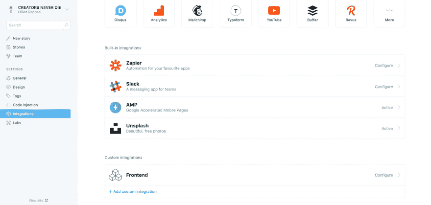
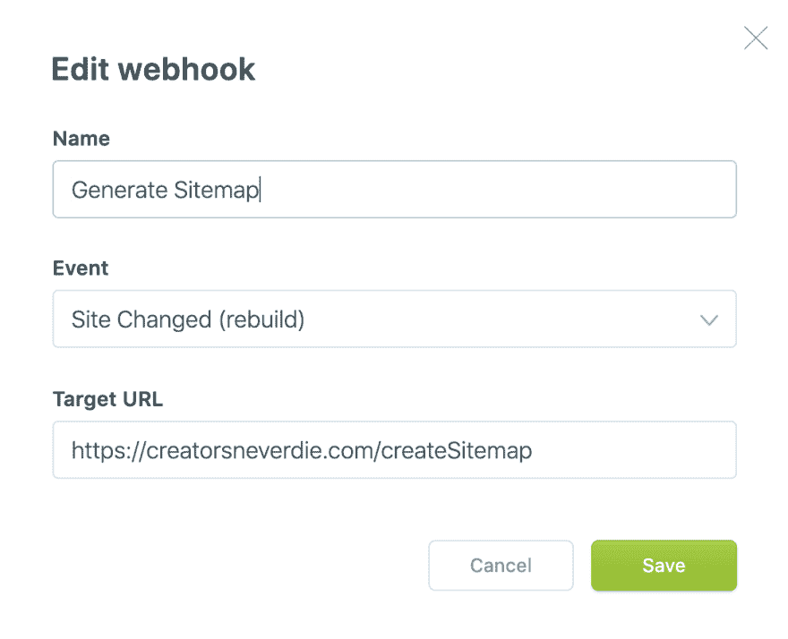
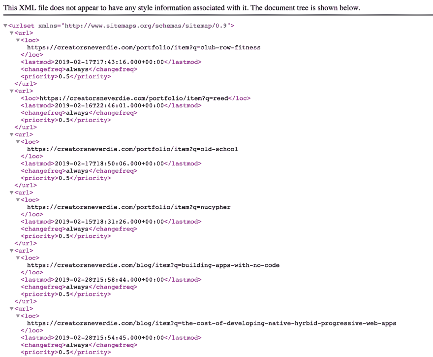

# 使用 Ghost & Next.js 创建动态站点地图，获得终极 SEO 优势

> 原文：<https://dev.to/dillonraphael/creating-a-dynamic-sitemap-with-ghost--nextjs-for-ultimate-seo-benefits-4f7k>

博客平台世界有两大巨头。Wordpress 拥有大部分市场，但是 Ghost([https://ghost.org/](https://ghost.org/))只是漂亮而已。传统上，大多数使用他们的内部渲染引擎为这些平台创建主题，但是我们走了一条不同的路。

我们在 Creators Never Die 上对所有东西都使用 React，并希望在我们自己的网站上延续这种模式。显然，经营一个博客需要很好的 SEO 实践——开箱即用，React 做得不好。大多数搜索引擎机器人只是抓取 HTML，尽管我听说谷歌能够正确地呈现 React 站点。有一个名为 Next.js 的伟大框架没有抓住这个机会，在没有解释这个奇妙框架带来的细微差别的情况下，他们的主要卖点是他们在服务器上处理渲染反应。

完成我们的网站后，出现了一个问题。我们需要一个动态的网站地图！大多数博客平台都提供这种解决方案，但前提是我们使用他们的模板语言。因为我们使用的是 Next.js，所以我们必须自己创建站点地图。我将向你们展示我们是如何做到的。

Next.js 提供了使用您喜欢的任何节点后端框架定制服务器路由的能力。对于这个例子，我们将使用 express，但是您可以使用您喜欢的任何东西。

我们将假设您已经安装了 Next.js。安装 express &官方 Ghost Javascript SDK:

```
npm install --save express @tryghost/content-api 
```

Enter fullscreen mode Exit fullscreen mode

接下来，创建一个 generateSitemap.js 文件。每当点击/sitemap.xml 路径时，我们都将运行该脚本。我们将在这篇文章的后面谈到路线。

在文件中，我们首先要启动 Ghost SDK。为此，我们需要提供 Ghost 博客的 URL &您将从管理面板获得的 API 令牌。转到 Integrations 选项卡，并创建一个新的自定义集成。这是您可以找到 API 密钥的地方。

[](https://res.cloudinary.com/practicaldev/image/fetch/s--3OpTivAq--/c_limit%2Cf_auto%2Cfl_progressive%2Cq_auto%2Cw_880/https://i.imgur.com/Bjm6ryB.png)

复制内容 API 键，并将其添加到新的 generateSitemap.js 文件中(建议使用. env 文件):

```
 const GhostContentAPI = require('@tryghost/content-api')
    const api = new GhostContentAPI({
      host: http://ghostblogurl.com,
      key: abcdefghijklmnopqrstuvwxyz,
      version: 'v2'
    }); 
```

Enter fullscreen mode Exit fullscreen mode

现在我们要创建一个函数，返回 Ghost 后端中所有帖子的承诺:

```
 const getPosts = () => new Promise((resolve, reject) => {
      api.posts.browse().then((data) => {
        resolve(data)
      })
    }) 
```

Enter fullscreen mode Exit fullscreen mode

最后，一个异步函数将实际创建 XML 结构。注意提供 URL 的那一行:

```
 const createSitemap = async() => {

      let xml = ''
      xml += '<?xml version="1.0" encoding="UTF-8"?>'
      xml += '<urlset >'

      await getPosts().then((_newData) => {
        _newData.map((_post) => {
          xml += '<url>'
          xml += `<loc>${SITE_ROOT}/blog/item?q=${_post.slug}</loc>`
          xml += `<lastmod>${_post.updated_at}</lastmod>`
          xml += `<changefreq>always</changefreq>`
          xml += `<priority>0.5</priority>`
          xml += '</url>'
        })
      })

      xml += '</urlset>'

      console.log(`Wrote Sitemap`);
      return xml;

    }

    module.exports = createSitemap 
```

Enter fullscreen mode Exit fullscreen mode

确保 url 遵循 Next.js 的设置方式。在我们的例子中，页面目录中有 blog 文件夹。`pages > blog > item.js`

```
 xml += `<loc>${SITE_ROOT}/blog/item?q=${_post.slug}</loc>` 
```

Enter fullscreen mode Exit fullscreen mode

在这篇文章中不会涉及细节，但是我们基本上在上面的 getPosts()函数中使用了相同的概念，但是提供了从 url 解析的 slug。这里有一个例子:

```
 const posts = await api.posts.read({slug: `${query.q}`}, {include: 'tags,authors'}, {formats: ['html']}); 
```

Enter fullscreen mode Exit fullscreen mode

完整的 generateSitemap.js 文件应该是这样的(我添加了 dotenv 包来处理解析。env 文件):

```
 require('dotenv').config()

    const GhostContentAPI = require('@tryghost/content-api')
    const api = new GhostContentAPI({
      host: process.env.GHOST_API,
      key: process.env.GHOST_TOKEN,
      version: 'v2'
    });

    const SITE_ROOT = process.env.SITE_ROOT || 'https://creatorsneverdie.com'

    const getPosts = () => new Promise((resolve, reject) => {
      api.posts.browse().then((data) => {
        resolve(data)
      })
    })

    const createSitemap = async() => {

      let xml = ''
      xml += '<?xml version="1.0" encoding="UTF-8"?>'
      xml += '<urlset >'

      await getPosts().then((_newData) => {
        _newData.map((_post) => {
          xml += '<url>'
          xml += `<loc>${SITE_ROOT}/blog/item?q=${_post.slug}</loc>`
          xml += `<lastmod>${_post.updated_at}</lastmod>`
          xml += `<changefreq>always</changefreq>`
          xml += `<priority>0.5</priority>`
          xml += '</url>'
        })
      })

      xml += '</urlset>'

      console.log(`Wrote Sitemap`);
      return xml;

    }

    module.exports = createSitemap 
```

Enter fullscreen mode Exit fullscreen mode

剩下的工作就是创建自定义路线。在目录的根目录下创建一个 server.js 文件。我们将需要所有必需的包，并创建一个 SITEMAP 变量来存储会话中的 XML 内容:

```
 const express = require('express');
    const next = require('next');
    const port = parseInt(process.env.PORT, 10) || 3000;
    const dev = process.env.NODE_ENV !== 'production';
    const app = next({ dev });
    const handle = app.getRequestHandler();

    const genSitemap = require('./lib/generateSitemap')
    let SITEMAP = null 
```

Enter fullscreen mode Exit fullscreen mode

那么准备 Next.js，启动快递服务器:

```
 app.prepare()
      .then(() => {
        const server = express();

        server.get('*', (req, res) => handle(req, res));

        server.listen(port, (err) => {
          if (err) throw err;
          console.log(`> Ready on http://localhost:${port}`);
        });
      }); 
```

Enter fullscreen mode Exit fullscreen mode

我们需要两条路线。一个用于查看站点地图，另一个用于在发布、编辑或删除新帖子时生成站点地图。为此，Ghost 允许您创建一个 Webhook。首先让我们在 Ghost 后端创建 Webhook。导航到您找到内容 API 密钥的相同位置，按“添加 Webhook”并提供以下值(用您的域替换我们的域):

[](https://res.cloudinary.com/practicaldev/image/fetch/s--eVtuEj8v--/c_limit%2Cf_auto%2Cfl_progressive%2Cq_auto%2Cw_880/https://i.imgur.com/5NcZ79c.png)

现在回到 server.js 文件，我们将添加两条路由。获取路线和发布路线:

```
 server.get('/sitemap.xml', async (req,res) => {
         if(!SITEMAP) {
             SITEMAP = await genSitemap();
       } 

       res.set('Content-Type', 'text/xml');
       res.send(SITEMAP);
    })

    server.post('/createSitemap', async (req, res, next) => {
      SITEMAP = await genSitemap()
        res.status(200).send(SITEMAP)
    }) 
```

Enter fullscreen mode Exit fullscreen mode

在 GET 请求中，我们检查 SITEMAP 变量是否为空。如果它是空的，我们调用在 generateSitemap.js 文件中创建的 genSitemap()函数。这将返回 XML 文件并存储在 SITEMAP 变量中。同样的概念也适用于 post 请求，每当创建或修改 POST 时都会调用它。您的 server.js 文件应该如下所示:

```
 const express = require('express');
    const next = require('next');
    const port = parseInt(process.env.PORT, 10) || 3000;
    const dev = process.env.NODE_ENV !== 'production';
    const app = next({ dev });
    const handle = app.getRequestHandler();

    const genSitemap = require('./lib/generateSitemap')
    let SITEMAP = null

    app.prepare()
      .then(() => {
        const server = express();

        server.get('/sitemap.xml', async (req,res) => {
          if(!SITEMAP) {
            SITEMAP = await genSitemap();
          } 

          res.set('Content-Type', 'text/xml');
          res.send(SITEMAP);
        })

        server.post('/createSitemap', async (req, res, next) => {
          SITEMAP = await genSitemap()
          res.status(200).send(SITEMAP)
        })

        server.get('*', (req, res) => handle(req, res));

        server.listen(port, (err) => {
          if (err) throw err;
          console.log(`> Ready on http://localhost:${port}`);
        });
      }); 
```

Enter fullscreen mode Exit fullscreen mode

现在，如果您转到/sitemap.xml，您会看到以下内容:

[](https://res.cloudinary.com/practicaldev/image/fetch/s--MBEeTA7w--/c_limit%2Cf_auto%2Cfl_progressive%2Cq_auto%2Cw_880/https://i.imgur.com/eD8rLph.png)

尝试创建一个新帖子，然后观察/sitemap.xml 自动更新！

如果你能好心帮我在 twitter 上建立影响力的话。随时问我问题。