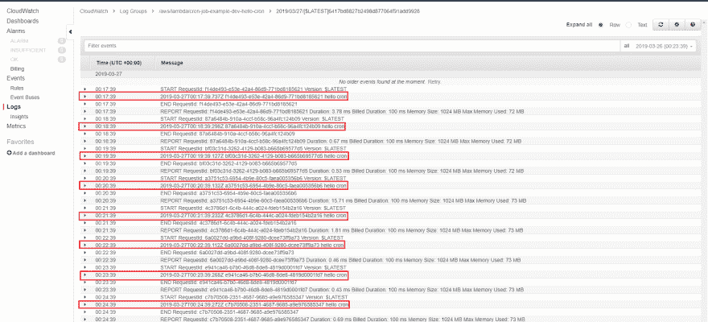
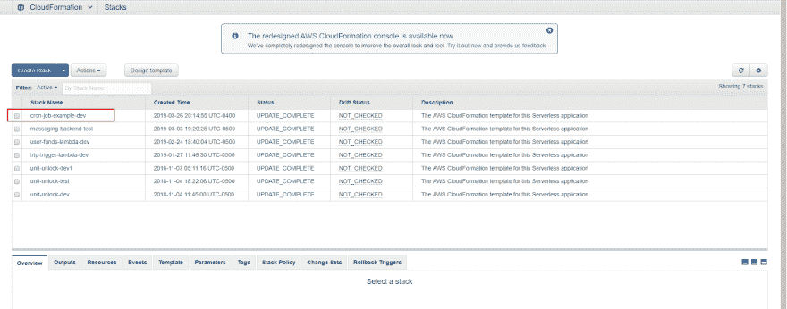
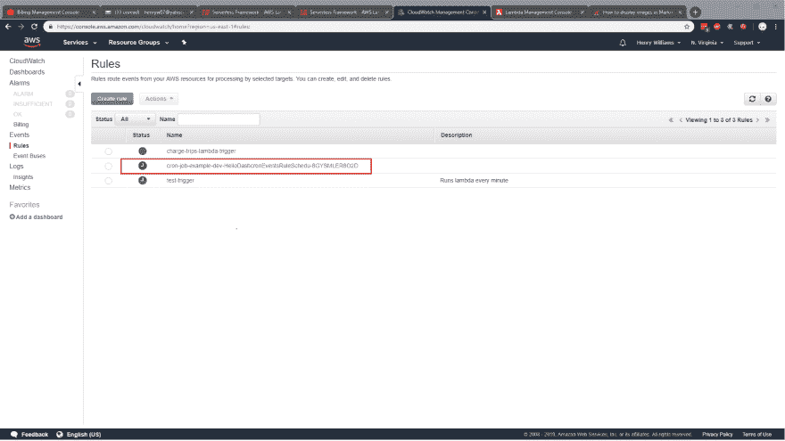

# 在 AWS 中创建无服务器 Cron 作业

> 原文：<https://dev.to/henryjw/creating-a-serverless-cron-job-in-aws-344h>

使用[无服务器框架](https://serverless.com/)，在 AWS 中设置 cron 作业很容易。对于那些不熟悉 cron 作业的人来说，它们本质上是计划作业。例如，您可能有一个每 3 天删除旧日志的 cron 作业。
对于这个快速教程，我假设你至少对无服务器和 AWS lambdas 有所了解。如果你不是，请继续关注关于这些的帖子:)

**完整示例请参考本[回购](https://github.com/henryjw/aws-serverless-cron-job-example)。**

## 无服务器配置

您的`serverless.yml`配置文件应该如下所示。

```
service: cron-job-example

provider:
  name: aws
  runtime: nodejs8.10
  stage: dev

  region: us-east-1
  profile: serverless

functions:
  hello-cron:
    description: Example lambda function
    handler: hello-cron.handler
    events:
      - schedule: rate(1 minute) 
```

Enter fullscreen mode Exit fullscreen mode

神奇的事情发生在`events`的定义下。在那里，我们定义了一个每分钟运行的任务。您可以根据需要对此进行更改。

您还可以选择设置一个 [cron 表达式](https://en.wikipedia.org/wiki/Cron#CRON_expression)来进行更复杂的调度；例如，设置一个在每周二凌晨 4:03 运行的作业。如果你想探索这些类型的 cron 表达式，请查阅[这份 AWS 文档](https://docs.aws.amazon.com/AmazonCloudWatch/latest/events/ScheduledEvents.html)。请注意，它们与传统的 cron 表达式略有不同。

## 设置您的环境

环境设置很简单。您所需要的只是 AWS 配置文件中的一组有效的 AWS 凭证(在*nix 中为`~/.aws/credentials`)。应该如下图所示

```
[serverless]
aws_access_key_id = <access key>
aws_secret_access_key = <secret access key> 
```

Enter fullscreen mode Exit fullscreen mode

在`serverless.yml`中配置`serverless`配置文件(括号中的名称)。这可以是任何东西，但是它必须与您的`serverless.yml`配置中的`provider.profile`中指定的名称相匹配。对于这个例子，我称之为`serverless`。此外，您选择的概要文件应该在您的 AWS 帐户上有足够的访问权限来部署这个堆栈。

在配置了用于部署的概要文件之后，您需要通过运行`npm install`来安装依赖项。

## 正在部署作业

这是最简单的部分。一旦你设置好了一切，只需运行`npm run sls:deploy`就可以了，剩下的就交给无服务器了。

部署之后，您应该能够转到 CloudWatch 日志，查看 Lambda 函数生成的日志条目。
[T3】](https://res.cloudinary.com/practicaldev/image/fetch/s--WTHgWgJN--/c_limit%2Cf_auto%2Cfl_progressive%2Cq_auto%2Cw_880/https://github.com/henryjw/aws-serverless-cron-job-example/blob/master/doimg/log-entries.png%3Fraw%3Dtrue)

如果你看一下[示例 repo](https://github.com/henryjw/aws-serverless-cron-job-example) 中 Lambda 函数的代码，你会注意到作业本身并没有做多少事情。每当执行时，它只记录“hello cron”。我会让你让它做一些更有用的事情:)

```
module.exports.handler = () => {
    console.log('hello cron')
} 
```

Enter fullscreen mode Exit fullscreen mode

## 等等，什么？

这一切的运作没有魔法。尽管如此，Serverless 确实在幕后创建了一些 AWS 资源来支持这一功能。

1.  云形成堆栈
2.  λ函数
3.  触发 Lambda 函数的 CloudWatch 事件
4.  云观察日志

## 结论

这就是了。通过简单的无服务器设置，您可以立即在 AWS 中运行计划的作业！