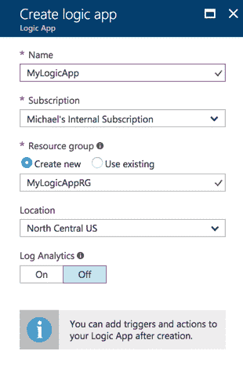
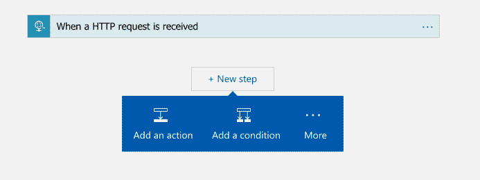
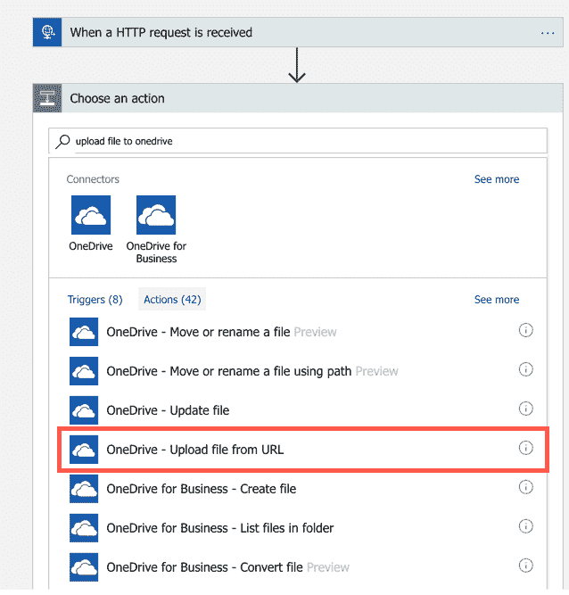
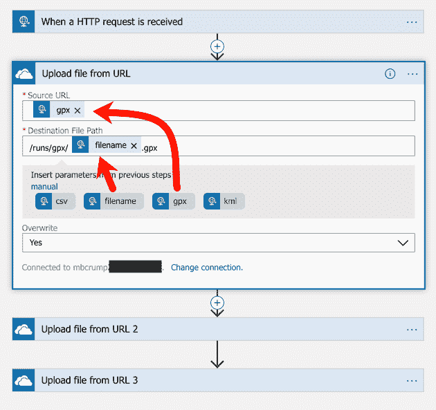

# 在 Azure Logic 应用程序中创建 HTTP 请求触发器

> 原文：<https://dev.to/azure/creating-an-http-request-trigger-in-azure-logic-apps-5h3o>

*感谢[迈克尔·克伦普](https://twitter.com/mbcrump)创造了这个内容！*

**没有天蓝色？** [抢免费订阅](https://azure.microsoft.com/en-us/free?&WT.mc_id=azureapril_devto-blog-cxa)。

* * *

逻辑应用是 Azure 中的一项服务，它允许你连接 Azure 内外的各种 SaaS 服务来自动完成任务。任何业务流程或工作流都可以被设计和执行。

查看塞西尔·菲利普的视频教程和迈克尔·克伦普的视频教程来设置一个逻辑应用程序。

[https://www.youtube.com/embed/oIwDgJPmVCg](https://www.youtube.com/embed/oIwDgJPmVCg)

# 设置逻辑 App

转到 [Azure 门户](https://azure.microsoft.com/en-us/features/azure-portal/?&WT.mc_id=azureapril_devto-blog-cxa)并创建一个新的逻辑应用。

[](https://res.cloudinary.com/practicaldev/image/fetch/s--q6mWBmRQ--/c_limit%2Cf_auto%2Cfl_progressive%2Cq_auto%2Cw_880/https://d33wubrfki0l68.cloudfront.net/6782239348324f7520457dedd2b0b665222ba084/2f037/files/logicappblog1.png)

资源准备好之后，我们需要在 HTTP 请求进来时触发一个动作。

幸运的是，这是一个常见的触发器，我们可以选择它开始。

[](https://res.cloudinary.com/practicaldev/image/fetch/s--baBotHpt--/c_limit%2Cf_auto%2Cfl_progressive%2Cq_auto%2Cw_880/https://d33wubrfki0l68.cloudfront.net/3fa183a604baef5fe34ff9e234d49a107adcda51/2b6cf/files/logicappblog2.png)

> 在我们提供参数之前，不会生成 URL。

[](https://res.cloudinary.com/practicaldev/image/fetch/s--MLXKw5yG--/c_limit%2Cf_auto%2Cfl_progressive%2Cq_auto%2Cw_880/https://d33wubrfki0l68.cloudfront.net/cd0167fb8d44e18b730ce3caff64c1deff35b85a/144bf/files/logicappblog3.png)

继续按`Edit`并粘贴请求应该期望的 JSON 模式。这里有一个例子。

```
{
  "$schema": "http://json-schema.org/draft-06/schema#", 
  "definitions": {}, 
  "id": "http://example.com/example.json", 
  "properties": {
    "csv": {
      "id": "/properties/csv", 
      "type": "string"
    }, 
    "filename": {
      "id": "/properties/filename", 
      "type": "string"
    }, 
    "gpx": {
      "id": "/properties/gpx", 
      "type": "string"
    }, 
    "kml": {
      "id": "/properties/kml", 
      "type": "string"
    }
  }, 
  "type": "object"
} 
```

> 您可以使用`Use sample payload to generate schema`选项，但是我更喜欢 JSON Schema 可以提供的额外元数据。

# 上传文件

我们已经设置了一个 Azure Logic 应用程序来接收包含 JSON 有效负载的 HTTP 请求。

现在让我们集成 OneDrive 来自动上传文件。

[](https://res.cloudinary.com/practicaldev/image/fetch/s--oppmQ7Jm--/c_limit%2Cf_auto%2Cfl_progressive%2Cq_auto%2Cw_880/https://d33wubrfki0l68.cloudfront.net/8f13001b19adce434c017eb452330a0441b9b5f6/12359/files/onedriveblog1.png)

通常，一旦 HTTP 请求完成，您将添加一个`Action`或`Condition`来触发。

我们将选择一个`Action`，因为我们希望它每次都运行。在 HTTP 请求进来之后，`Condition`将使用`If...then`逻辑。

选择`Action`并搜索`upload file to onedrive`，您将看到以下内容可供使用。

[](https://res.cloudinary.com/practicaldev/image/fetch/s--4s47haCX--/c_limit%2Cf_auto%2Cfl_progressive%2Cq_auto%2Cw_880/https://d33wubrfki0l68.cloudfront.net/332c654679d3a13dade6015abb5ff09deb250caa/68938/files/onedriveblog2.png)

您必须登录您的 OneDrive 帐户。

现在，您可以提取我们捕获的字段，并将它们用作动态内容。

例如，一个 GPX 文件包含一个完整的 URL，所以我们可以只使用那个动态字段。对于目标 URL，我们将构建我们希望它在 OneDrive 帐户中的位置。

[](https://res.cloudinary.com/practicaldev/image/fetch/s--pBCUZwkF--/c_limit%2Cf_auto%2Cfl_progressive%2Cq_auto%2Cw_880/https://d33wubrfki0l68.cloudfront.net/ad4de42a4a9bd0e9cb68a2dff93a16130204350b/7c73a/files/onedriveblog3.png)

这只是你可以用[Azure Logic Apps]将几十个日常工具集成在一起的一个想法。

**准备好设置您的逻辑应用程序了吗？** [查看我们的恒星文档。](https://azure.microsoft.com/en-us/services/logic-apps/?&WT.mc_id=azureapril_devto-blog-cxa)

* * *

我们将在四月份每天发布文章，敬请关注！或者跳到前面，查看更多提示和技巧[现在](http://azuredev.tips)。