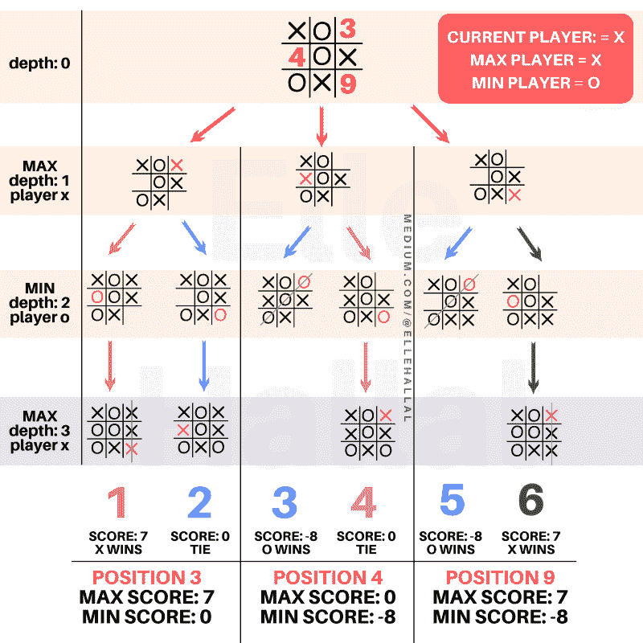
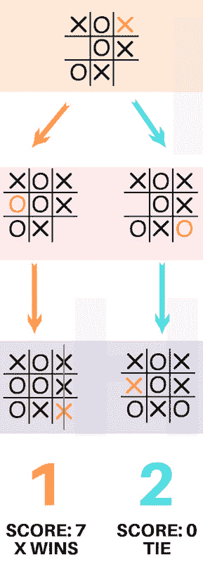
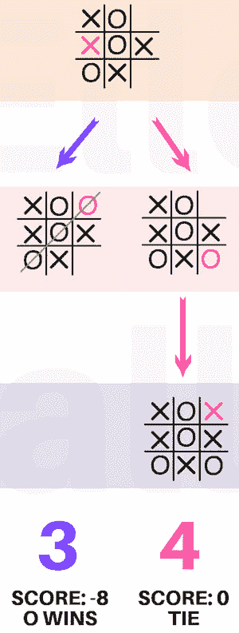
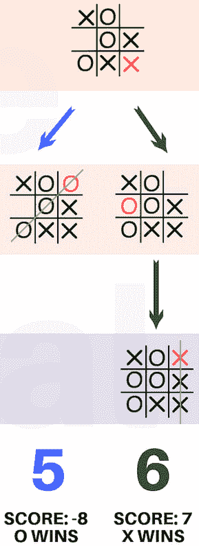

# 使用 Minimax 创建一个无与伦比的计算机播放器

> 原文：<https://dev.to/ellehallal/creating-an-unbeatable-computer-player-using-minimax-14e1>

<center>

### 最初发布于 [ellehallal.dev](https://ellehallal.dev) 👩🏽‍💻

</center>

* * *

本周，我一直致力于为我的 [Ruby Tic Tac Toe 游戏](https://github.com/ellehallal/ruby-tic-tac-toe)添加一个无与伦比的电脑(UC)播放器。

在这个博客中，我将分享我对递归和极小极大的理解，以及我第一次尝试用它来创建一个无与伦比的计算机播放器。为了实现 UC 播放器，我需要实现 MiniMax 算法，这也意味着我需要使用递归。

* * *

## 电脑玩家

### 可打败的电脑玩家

在努力使它变得不可战胜之前，电脑玩家选择了一个没有策略的移动。它只是在井字游戏棋盘上随机选择一个可用的空间。

### 无敌的计算机(UC)玩家

UC 玩家应该知道棋盘上可用的方格，评估所有可能的结果，并因此选择最佳移动。

什么被认为是最好的行动？

UC 玩家的目标是赢。如果这是不可能的，UC 的下一个最好的结果是比赛成为平局。对手赢得比赛不是一个选项。应该选择一个移动来阻止对手获胜，随后导致 UC 玩家获胜或平局。

* * *

## 递归函数和极大极小

### 什么是递归函数？

我对递归函数的理解是一个函数调用自己，直到满足某个条件。它由一个基础案例和一个递归案例组成。

*   基本情况:当被触发时，这将停止递归函数。

*   递归情况:递归函数再次调用自身，与之前的函数调用略有不同。当基本情况没有被触发时，递归情况发生。

### 什么是极大极小算法？

我的理解是:

*   这是一种使用递归的算法

*   目标是最大化活跃玩家的结果，相反最小化其他玩家的结果

*   它用于在游戏中获得玩家的最佳移动

*   它使用当前玩家和对手的标记来显示所有可能的结果

*   游戏的每个结果都有一个分数，取决于当前玩家赢了，对手赢了，还是游戏平局。

*   选择的移动应该最小化对手能得到的分数。

**在井字游戏中:**

*   最大化玩家是 UC 玩家，最小化玩家是对手。

*   当任一玩家有一条赢线或棋盘已满(平局)时，触发基本情况。

*   如果基本情况没有被触发，递归函数将继续，UC 玩家的标记和对手的标记将继续被添加到棋盘上的可用方格中

*   当一个标记被添加到板上时，这意味着递归函数被再次调用。

*   当一个玩家赢了，或者游戏是平局时，开始玩的方块被给予一个分数。

*   UC 玩家选择对手得分最小的最佳移动。

* * *

## 一个结果是如何得分的？

如果比赛是平局，结果得分为 0。获胜的玩家最多可以获得 10 分(如果是对手，则为-10 分)。

如上所述，当一个标记被添加到板上时，递归函数被再次调用。我的理解是通过跟踪深度(递归函数被调用了多少次)，这有助于评估游戏的结果。目标是以最少的动作取胜。因此，一步棋赢的分数应该比三步棋赢的分数高

随着一个标记被添加到棋盘上(另一个递归函数调用，深度增加 1)，该深度从玩家的最高分数中减去。

例如，这里有一个场景:

*   UC 玩家正在寻找最佳移动，并尝试位置 3

*   在递归函数被调用 3 次(`depth = 3`)后，UC 获得了一条优胜线

```
 maximum_score = 10
  depth = 3
  score = maximum_score - depth
  #score = 7 
```

Enter fullscreen mode Exit fullscreen mode

* * *

## UC 播放器使用 Minimax 的可视化例子

在上面的基础上，下面的例子展示了一个场景，其中 UC 播放器有三个可用的方块可以选择(3、4 和 9)。它展示了所有可能的结果。

UC 玩家(x)是最大化玩家，对手(o)是最小化玩家。我将在下面更详细地解释所有可能的结果。

[](https://res.cloudinary.com/practicaldev/image/fetch/s--7QYdot-u--/c_limit%2Cf_auto%2Cfl_progressive%2Cq_auto%2Cw_880/https://i.imgur.com/LL3kSXe.png)

### UC 播放位置 3

[](https://res.cloudinary.com/practicaldev/image/fetch/s--BqaL1u3D--/c_limit%2Cf_auto%2Cfl_progressive%2Cq_auto%2Cw_880/https://i.imgur.com/ddpfdSw.png)

上图展示了以下内容:

1.  UC 播放位置 3(深度 1)

2.  对手打位置 4(深度 2)

3.  UC 打位置 9(深度 3)

在总共玩了 3 个位置之后，结果是 UC 的**获胜线**。

UC 赢了，所以**最高分是 7** 。记住 UC 能得到的最大点数是 10，深度是从中减去的。

在图像的右侧:

1.  UC 播放位置 3(深度 1)

2.  对手打位置 9(深度 2)

3.  UC 打位置 4(深度 3)

结果是平局，UC 和对手都没有获胜线。**最低分数为 0** 。

总之，对于位置 3:

*   **最高分= 7(10–3)**

*   **最低分= 0(平手)**

### UC 播放位置 4

[](https://res.cloudinary.com/practicaldev/image/fetch/s--zJYSKpGv--/c_limit%2Cf_auto%2Cfl_progressive%2Cq_auto%2Cw_880/https://i.imgur.com/thNxHjJ.png)

在上图中，UC 打 4 号位。这样做的时候，两种结果都是 UC 不赢，对手赢一个。

总之，对于位置 4:

*   **最高分= 0(平手)**

*   **最低分数=-8(-(10–2))**

### UC 播放位置 9

[](https://res.cloudinary.com/practicaldev/image/fetch/s--9Axoh9xy--/c_limit%2Cf_auto%2Cfl_progressive%2Cq_auto%2Cw_880/https://i.imgur.com/sUm9qwQ.png)

**最高分是 7** ，因为 UC 可以在深度 3 的一个结果中获胜。

然而，**的最低分数是-8** ，因为对手在深度 2 的另一个结果中获胜。

虽然 UC 可以通过选择位置 9 获胜，但对手可以在下一步棋中获胜。

总之，对于位置 9:

*   **最高分= 7(10–3)**

*   **最低分数=-8(-(10–2))**

* * *

## 利用分数来选择最佳棋步

我的理解是 UC 玩家的目标是确保对手获得尽可能少的分数。对手的积分越高，其获胜的几率就越高。

因此，**最好的棋是方块 3🎉**对手最高分为 0(最小化玩家)。这个位置会导致 UC 玩家获胜或平局。对手没有获胜的机会。

* * *

## 使一个可击败的电脑玩家变得不可战胜

理论上，以上听起来很棒，但是如何实现它来创造一个无与伦比的计算机播放器呢？老实说，我发现将上述内容翻译成代码极其困难。

有许多例子、博客和视频展示了使用 minimax 创建无与伦比的计算机播放器的许多方法。你可以在这篇博文的底部找到我认为有用的资源。在这个解释中，我将尝试解释函数的每个部分。

在我开始之前，[这是我创建的极小极大类](https://gist.github.com/ellehallal/8f8388306502f6a0d314a20f88422eec)。它包含了`find_best_move`递归函数，无敌玩家会用到。

### 选择 _ 移动的原因

为了确保游戏中使用的棋盘对象的实例不被修改，使用`copy_board`方法创建了一个新的棋盘实例。你可以在这里看到板级。

### find _ best _ move 的目的参数

```
def find_best_move(board, depth=0, current_player, opponent) 
```

Enter fullscreen mode Exit fullscreen mode

`board`是为了:

*   获得所有的方块，包括棋盘上不可用的(已用的)和可用的方块

*   检查玩家在棋盘上是否有赢线，或者棋盘是否已满(平局)

*   重置方块被修改，带有玩家的标记

`depth`:

*   跟踪递归函数被调用的次数

`current_player`:

*   轮到走一步棋的玩家的标记

`opponent`:

*   当前玩家的对手

### 最佳 _ 分数和可用 _ 方块

```
best_score = {}
available_squares = board.available_squares 
```

Enter fullscreen mode Exit fullscreen mode

`best_score`:

*   跟踪职位的得分
*   当评估完所有可用方块后，best_score 将包含分数，可用方块作为关键字。例如:`{3=>-8, 9=>0}`

`available_squares`:

*   以数组形式包含当前棋盘上的可用方格

### 查找 _ 最佳 _ 移动的基本情况

如前所述，在递归函数中，应该有一个基本用例，如果被触发，它将停止函数。就是这里:

```
return score_move(board, depth, current_player, opponent) if
  board.stop_playing?(current_player, opponent) 
```

Enter fullscreen mode Exit fullscreen mode

如果比赛是平局，或者任何一方赢了，比赛就结束了。因此，递归应该停止。如果是这种情况，则返回 true。

玩初始方块的结果应该被计分并返回，添加到`best_score`散列中。

一个独立的方法`score_move`根据结果返回分数。

```
def score_move(board, depth, current_player, opponent)
  if board.winning_line?(current_player)
    10 - depth
  elsif board.winning_line?(opponent)
    depth - 10
  elsif board.complete?
    0
  end
end 
```

Enter fullscreen mode Exit fullscreen mode

### 递归情况:遍历可用方块

*   遍历棋盘上可用的方格

*   在选中的方格中打出`current_player`的标记

*   在`best_score` hash 中，将 key 设置为 square，将 value 设置为 outcome score。

*   这是再次调用递归函数的地方，略有不同。`board`现在在先前可用的空间中有了标记，`depth`增加了 1。`current_player`和`opponent`开关。

*   从可用方块中移除标记

**递归函数的返回值为什么要乘以-1？**🤷🏽‍♀️

这是我还没有领会的东西，但是这里有一段引用自[博客文章](http://www.shei.io/recursion-minimax-algorithm/)的话，解释了原因:

> “将返回值乘以-1 将确保根据最后移动的人得到[正或负的分数]。如果在任何奇数步(1，3，5，7，9)赢得游戏，结果将是[正]，这意味着当前玩家赢得了游戏。如果在任何偶数步(2，4，6，8)中赢得比赛，分数将为[负]，这意味着对手将赢得比赛。”

### 递归案例:评估移动

```
evaluate_move(depth, best_score) 
```

Enter fullscreen mode Exit fullscreen mode

`find_best_move`函数的最后一部分是评估移动。我的理解是如果深度不为零，意味着递归函数没有返回到第一个函数调用，那么就返回分数。

如果深度为零，最好的走法是作为 UC 的玩家走法返回。

```
def max_best_move(scores)
  scores.max_by { |key, value| value }[0]
end

def max_best_score(scores)
  scores.max_by { |key, value| value }[1]
end

def evaluate_move(depth, scores)
  depth.zero? ? max_best_move(scores) : max_best_score(scores)
end 
```

Enter fullscreen mode Exit fullscreen mode

例如，打了位置 9，结果的分数是 0(平局)。如果需要返回分数。还记得在`depth 0?`的初始递归函数中的`best_score`哈希吗，现在看起来是这样的:

`best_score = {3=-8, 9=> }`

它需要值(0)与键(9)匹配，以完成散列。作为调用`evaluate_move`的结果，将返回分数，并且`best_move`散列变成:

`best_score = {3=-8, 9=>0}`

当`depth = 0`时，hash 中每个键(可用方块)的值(分数)可以用`evaluate_move`来评估。返回具有最高值的键。在这个例子中，最好的移动是 9。

总之，这是我对递归的理解，用 minimax 到目前为止。还有一些我不确定的因素。随着我对极小极大的理解的提高，无敌玩家的创造方式可能会改变。

你可以在这里用 Ruby 找到我的井字游戏库:[https://github.com/ellehallal/ruby-tic-tac-toe](https://github.com/ellehallal/ruby-tic-tac-toe)

* * *

### 有用的资源

*   [井字游戏:理解极大极小算法](https://www.neverstopbuilding.com/blog/minimax)
*   [递归 201:极小极大，井字游戏，&一个无敌的 AI](http://www.shei.io/recursion-minimax-algorithm/)
*   [如何使用极大极小算法让你的井字游戏无与伦比](https://medium.freecodecamp.org/how-to-make-your-tic-tac-toe-game-unbeatable-by-using-the-minimax-algorithm-9d690bad4b37)
*   [井字游戏:理解极大极小算法](https://www.neverstopbuilding.com/blog/minimax)