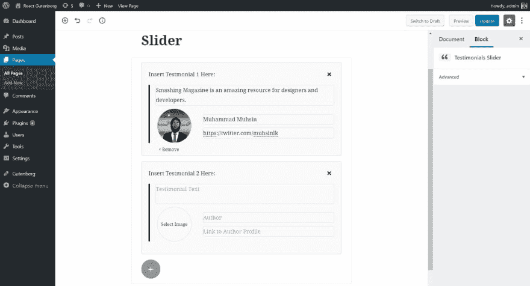
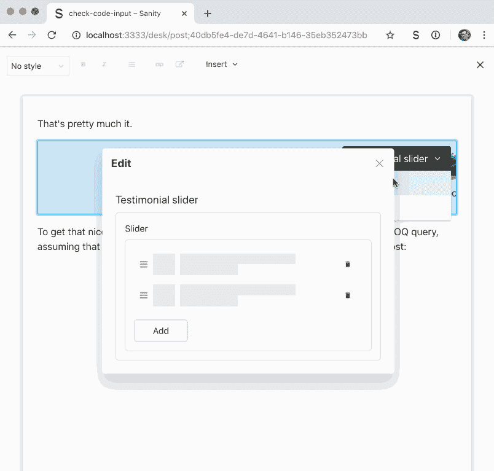
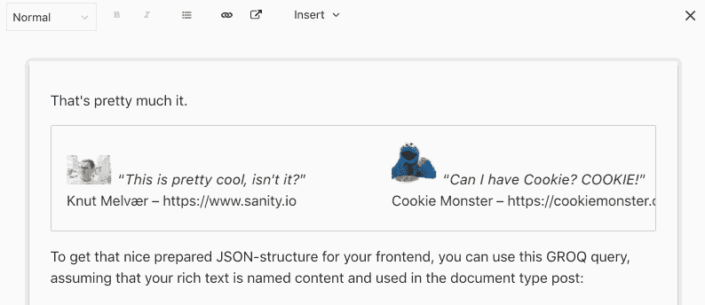

# 创建定制内容块:Wordpress Gutenberg vs. Sanity.io

> 原文：<https://dev.to/sanity-io/creating-custom-content-blocks-wordpress-gutenberg-vs-sanityio-4k5m>

Wordpress 5.0 带有一个全新的富文本编辑器，名为 [Gutenberg](https://wordpress.org/gutenberg/) 。它被寄予厚望，同时也引起了热议和 T2 的争议。Gutenberg 的承诺是可定制性，尤其是在添加定制内容块时。如果你想开始学习古腾堡，你可以在 Smashing 杂志上阅读这篇[的精彩介绍。它内置在 React 中，允许开发人员扩展编辑器的基本功能。](https://www.smashingmagazine.com/2018/10/gutenberg-testimonials-sliderblock/)

[](https://res.cloudinary.com/practicaldev/image/fetch/s--rWOHuEl6--/c_limit%2Cf_auto%2Cfl_progressive%2Cq_auto%2Cw_880/https://cdn.sanity.img/3do82whm/production/07e5821d81408fde490467f1cffd69613fa301cc-2000x1081.png) 在 Wordpress Gutenberg 中自定义奖状块类型。在 smashingmagazine.com 出版

尽管如此，我们还是无法抗拒。由于拥有自定义内容块是[理智](https://www.github.com/sanity-io/sanity)的 DNA，我们想展示重新创建 12 分钟阅读和 10 篇文章向您介绍的评价幻灯片是多么容易。像十一分之一的时间更容易。🐇

当然，这种比较仅限于此。Wordpress 是一个经典的带有模板引擎的 CMS，而你可以使用 Sanity 作为一个无头 CMS，带有你喜欢的前端框架，可以是 Vue，React 或者其他什么。

如果你还没有尝试过理智，只需要两分钟就可以开始。要创建一个项目并获得一个即时的托管内容 API，以及本地连接的开源编辑器，请在您的终端中运行以下代码:

```
 npm install -g @sanity/cli && sanity init 
```

如果您在 CLI 工具中选择 blog 模板，您就可以开始了！

## 奖状滑块内容模型

在 Smashing Magazine 的教程中，您将学习制作一个“推荐幻灯片”——通常用于营销页面，作为一种可视化产品社交证明的方式。

要重新创建 Wordpress 评价滑块，你只需要定义它的内容模型。我们将负责输入字段，并实时同步到数据存储。

内容模型非常简单:首先，我们为一个`testimonialSlider`创建类型。它是一个对象，包含一个带有字段`author`、`image`、`content`和`link`的证明对象数组(也包含证明的顺序)。我将内容字段设置为纯文本，但是如果我们想要富文本(以及滑块中的滑块，以防您对递归内容模式感兴趣)，我们也可以使用`blockContent`。如果我们将`options: { hotspot: true }`添加到图像域，你的编辑器甚至可以为图像设置自定义热点和裁剪，这对于图像艺术指导可能是有用的。

```
 const testimonialSlider = {
  name: 'testimonialSlider',
  title: 'Testimonial slider',
  type: 'object',
  fields: [
    {
      name: 'slider',
      title: 'Slider',
      type: 'array',
      of: [
        {
          name: 'testimonial',
          title: 'Testimonial',
          type: 'object',
          fields: [
            {
              name: 'author',
              title: 'Author',
              type: 'string'
            },
            {
              name: 'image',
              title: 'Image',
              type: 'image'
            },
            {
              name: 'content',
              title: 'Content',
              type: 'text'
            },
            {
              name: 'link',
              title: 'Link',
              type: 'url'
            }
          ]
        }
      ]
    }
  ]
}

const blockContent = {
  name: 'blockContent',
  type: 'array',
  of: [
    {
      type: 'block'
    },
    {
      type: 'testimonialSlider'
    }
  ]
}

export default {
  testimonialSlider,
  blockContent
} 
```

差不多就是这样。用户界面将是干净的，可以立即使用。

[](https://res.cloudinary.com/practicaldev/image/fetch/s--dIbDP2KS--/c_limit%2Cf_auto%2Cfl_progressive%2Cq_66%2Cw_880/https://thepracticaldev.s3.amazonaws.com/i/a2jp512e4wxj10b2w09e.gif)

要为您的前端获得准备好的 JSON 结构，您可以使用这个 GROQ 查询，假设您的富文本被命名为`content`，并在文档类型`post` :
中使用

```
*[_type == "post"]{
  ...,
  content[]{
    ...,
    _type == "testimonialSlider" => {
      slider[]{
        ...,
        image{
          ...,
          asset->
        }
      }
    }
  }
} 
```

## 自定义预览组件

您还可以添加一个带有 React 代码的定制预览组件:

```
import React from 'react'
import client from 'part:@sanity/base/client'
import urlBuilder from '@sanity/image-url'
const urlFor = source => urlBuilder(client).image(source)

const sliderPreview = ({ value = {} }) => {
  return (
    <marquee>
      {value &&
        value.slider.map(slide => (
          <div
            key={slide._key}
            style={{ display: 'inline-block', marginRight: '1em' }}
          >
            <figure>
              
              <span className="legend">
                “<em>{slide.content}</em>”<br />
                {slide.author} – {slide.link}
              </span>
            </figure>
          </div>
        ))}
    </marquee>
  )
}

export default sliderPreview 
```

通过将它添加到您的`testimonialSlider`内容类型模式:
中，将它包含在您的模式中

```
import React from 'react'
import sliderPreview from './sliderPreview.js'

const testimonialSlider = {
  name: 'testimonialSlider',
  title: 'Testimonial slider',
  type: 'object',
  preview: {
    select: {
      slider: 'slider'
    },
    component: sliderPreview
  },
  fields: [
    /* the fields */
  ]
} 
```

这里我使用了传统的 HTML 元素`<marquee>`来获得滚动效果；你可能不应该做同样的事情:

[](https://res.cloudinary.com/practicaldev/image/fetch/s--XQ3WQjBL--/c_limit%2Cf_auto%2Cfl_progressive%2Cq_66%2Cw_880/https://thepracticaldev.s3.amazonaws.com/i/2adq0mnxnz4cn6espygz.gif)

## 超越表象:深度键入丰富文本内容的优势

这个推荐滑动条的例子与网页上的一个特定的展示紧密地联系在一起，这在 WordPress 中是有意义的，因为它是为呈现和管理一个网站而构建的。WordPress 将 Gutenberg 中的输入保存为 HTML，这也是你最终从 API 中得到的。如果您想在自己喜欢的前端框架中使用 HTML，或者在应该在 web 浏览器之外的其他地方呈现的内容中使用 HTML，那么内容 API 中的 HTML 通常不是您想要的。

[Sanity](https://www.github.com/sanity-io/sanity) 将编辑器中的内容保存为[可移植文本](https://www.portabletext.org)，这使得它可以跨任何标记移植，但也使得富文本可查询。创建定制的编辑体验应该很容易，定制的类型和输入在您的项目或组织中是有意义的，并且应该很容易获取内容并使其适合任何形式的表示。