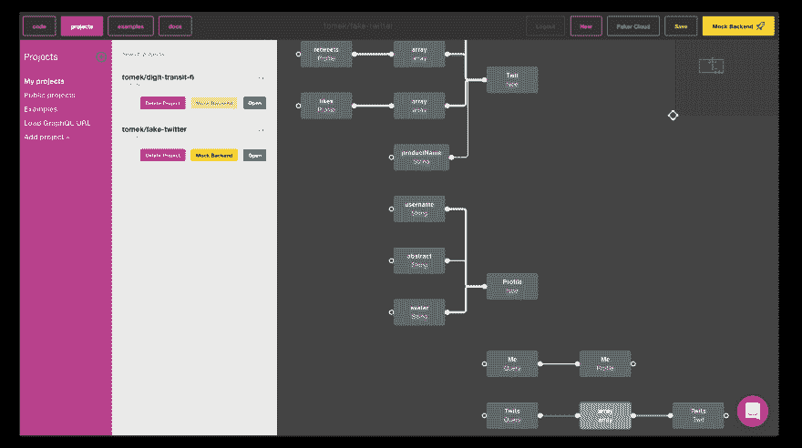
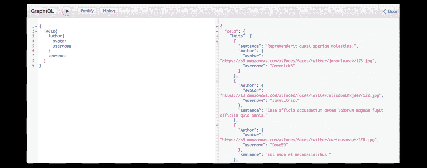

# 用 GraphQL 创建假后端

> 原文：<https://dev.to/graphqleditor/creating-fake-backend-with-graphql-551a>

## 什么是嘲讽？

模仿主要用于单元测试，它是创建一个对象或组件的伪版本的实践，所以你可以隔离它的行为来独立开发你的软件的其他部分。

## 嘲讽数据在现代项目中的重要性

出于几个原因，创建模拟后端被认为是一个好的实践:

### 1。加快发展

同时开始前端和后端开发是非常流行的。拥有一个模拟后端可以让你在依赖于前端服务器的任务上工作，即使你还没有一个工作的后端。

### 2。这是一种安全的方法

假后端让你运行本地测试。当你不需要连接到一个真正的后端时，它会更安全(也更快)。随着项目变得越来越复杂，仅仅为了运行一些测试而准备一个服务器基础设施可能是一件非常不愉快的任务，并且可能会给你带来很多麻烦。

## 创建一个模拟后端很难吗？

正如您所看到的，拥有一个模拟后端绝对是一个巨大的好处，那么您一定会问自己为什么这个解决方案仍然不受欢迎？我敢打赌，你脑海中出现的第一个原因可能是这太难或太费时间了。如果您想到了这一点，那么您就部分正确了——创建一个模拟后端过去很困难，但现在不再是了！

GraphQL 让嘲弄数据变得超级容易！GraphQL 是一种强类型语言。Type System 定义了可以在 GraphQL 应用程序中使用的各种数据类型，这些类型可以很容易地在前端和后端之间共享，因为它们拥有模拟数据所需的所有信息。

我们更进一步，我们的 [GraphQL 编辑器](https://graphqleditor.com)允许你点击一下就可以创建模拟后端！不信？自己测试一下。首先，去 https://app.graphqleditor.com/的:

您所需要的只是一个有效的 GraphQL 模式。您可以从一个链接上传一个现有的模式，或者使用我们的一个示例模式。一旦你加载了它，只需保存并点击“模拟后端”按钮:

就是这样！您已经为一些测试准备好了可以使用的伪后端端点。使用 GraphiQL 窗口，使用您的模拟后端:

PS:

原文章发布在 GraphQL 编辑博客-[https://blog.graphqleditor.com/visualize-your-schema/](https://blog.graphqleditor.com/visualize-your-schema/)

这里是 GraphQL 编辑器应用的链接，以防你想尝试一下-
[https://app.graphqleditor.com/showcase/fake-twitter/](https://app.graphqleditor.com/showcase/fake-twitter/)