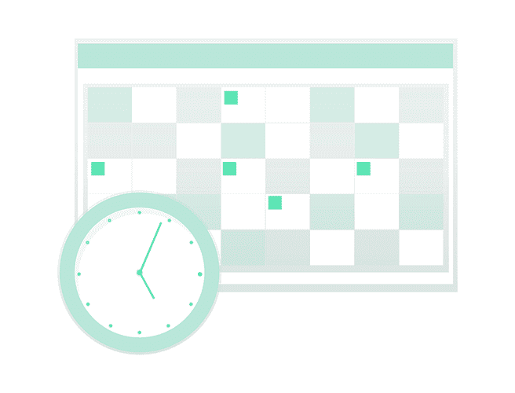
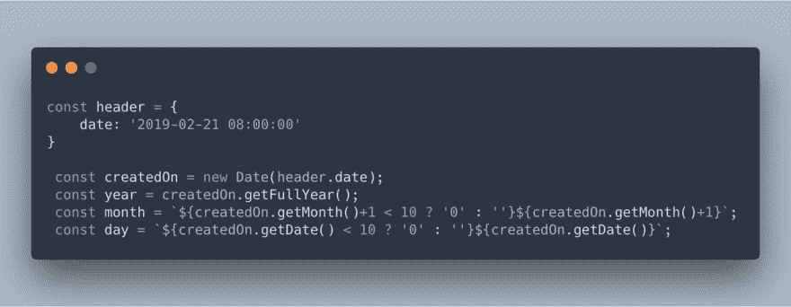

# 在节点中创建多个目录

> 原文：<https://dev.to/therealdanvega/creating-multiple-directories-in-node-37c6>

这将是一个快速教程，但我想这是我想分享的一个。我正在将近 1000 篇博客文章从 WordPress 迁移到 Gridsome，一个静态站点生成器。

像任何优秀(懒惰)的开发人员一样，我四处搜索了一个迁移脚本。Gridsome 是一个相当新的项目，我知道我找到一个脚本的机会非常小。花了大约 10 分钟环顾四周，我发现我的假设是正确的。

不要担心，因为我真的没有做任何 Gridsome 特定的事情。我想做的是将一堆 WordPress 帖子转换成 Markdown。有了所有写在静态站点生成器上的伟大博客，比如雨果、T2、哲基尔、T4、盖茨比，我确信我可以找到一些接近我正在寻找的东西。

果不其然，我看到了 Costa Alexoglou 写的这个了不起的 [Gatsby to WordPress](https://github.com/konsalex/gatsby-wordpress-migrate) 迁移脚本。这个脚本将把你的 WordPress 文章(导出为 XML)转换成 Markdown。这对我来说是一个好的开始，但我需要做的事情之一是将降价文件放入一个特定的文件夹格式中。

## 目录格式

我需要坚持我现有帖子的 url 格式，即**/blog/:year/:month/:day/:slug**。我还需要确保日期的某些部分采用以下格式:

*   年份:4 位数字
*   月份:2 位数字
*   日:2 位数字

[](https://res.cloudinary.com/practicaldev/image/fetch/s--EF5SioVU--/c_limit%2Cf_auto%2Cfl_progressive%2Cq_auto%2Cw_880/https://thepracticaldev.s3.amazonaws.com/i/yqw5w7ogg6m1ph2arwkt.png)

在我开始担心创建一个新的目录之前，我需要以我需要的格式从博客文章的日期得到我需要的 3 个部分。我做的第一件事是从 post date 创建一个名为 createdOn 的新日期。

```
const header = {
    date: '2019-02-21 08:00:00'
}
 const createdOn = new Date(header.date); 
```

现在我有了一个[日期](https://developer.mozilla.org/en-US/docs/Web/JavaScript/Reference/Global_Objects/Date)对象，我可以使用 API 来获得我想要的不同部分。这一年是最容易的一年，我不得不做一些工作来获得我想要的月份和日期格式。

月和日并不容易。先送走两个`getMonth()` &其中一个`getDate()`返回给你 1，2，3...我需要 01，02，03 两位数的格式。对于这两种情况，如果数字小于 10，我使用三元运算符填充 0。

这里的另一个问题是`getMonth()`将月份作为一个从零开始的值返回，所以一月是 0。知道我需要给从`getMonth()`返回的每个值加 1。

```
const header = {
    date: '2019-02-21 08:00:00'
}
 const createdOn = new Date(header.date);
 const year = createdOn.getFullYear();
 const month = `${createdOn.getMonth()+1 < 10 ? '0' : ''}${createdOn.getMonth()+1}`;
 const day = `${createdOn.getDate() < 10 ? '0' : ''}${createdOn.getDate()}`; 
```

虽然这不是超级困难，但它不是最简单或最优雅的解决方案。日期似乎总是每种语言的一个痛点，它们都有自己的怪癖。我想我会用推特，看看是否有人能帮我。

> 丹维加[@ therealdanvega](https://dev.to/therealdanvega)[【JavaScript】好友...我知道 JS 中有处理日期的库，但是必须有一种更容易/更优雅的方法来获得 2 位数格式的日和月。我错过了什么？](https://twitter.com/hashtag/JavaScript)2019 年 2 月 21 日下午 19:33[](https://twitter.com/intent/tweet?in_reply_to=1098667133112934401)[](https://twitter.com/intent/retweet?tweet_id=1098667133112934401)0[](https://twitter.com/intent/like?tweet_id=1098667133112934401)1

我没有得到任何真正好的答案，所以现在，这就是我要坚持的。有人还告诉我，IE11 不支持从字符串创建日期。当你不得不担心浏览器兼容性时，你应该考虑一下，但在我的情况下，这只是我运行的一个本地脚本，所以我不担心。

所以，如果你一直这样做，你应该会看到这样的东西。

```
const header = {
    date: '2019-02-20 08:00:00'
}

 const createdOn = new Date(header.date);
 const year = createdOn.getFullYear();
 const month = `${createdOn.getMonth()+1 < 10 ? '0' : ''}${createdOn.getMonth()+1}`;
 const day = `${createdOn.getDate() < 10 ? '0' : ''}${createdOn.getDate()}`; 
```

##使用节点写入目录

现在我们已经有了目录所需的部分，让我们创建完整的博客文章目录。我将所有内容以`/blog/:year/:month/:day`的形式存储在这个脚本的一个相关文件夹中，然后文件名将是`:slug.md`。所以我将从创建一个名为`blogPostFolder`的变量开始，我将使用模板文字创建路径。

```
const blogPostFolder = `./blog/${year}/${month}/${day}` 
```

接下来，我们将进入[节点的文件系统 API](https://nodejs.org/api/fs.html) 来实际创建目录。使用文件系统模块

```
const fs = require('fs'); 
```

文件系统 API 中有一个创建目录的方法。默认方法是异步的，但是在我们的例子中，我们实际上希望它是同步的，所以我们将使用 [`mkdirSync()`](https://nodejs.org/api/fs.html#fs_fs_mkdirsync_path_options) 。该方法的第一个参数是要创建的目录的路径。如果您尝试使用博客文章文件夹路径运行此方法:

```
fs.mkdirSync(blogPostFolder); 
```

您将得到以下错误:

```
vega recursive-dirs $ node app.js 
./blog/2019/02/21
fs.js:115
    throw err;
    ^

Error: ENOENT: no such file or directory, mkdir './blog/2019/02/21'
    at Object.mkdirSync (fs.js:753:3)
    at Object.<anonymous> (/Users/vega/dev/node/recursive-dirs/app.js:16:4)
    at Module._compile (internal/modules/cjs/loader.js:689:30)
    at Object.Module._extensions..js (internal/modules/cjs/loader.js:700:10)
    at Module.load (internal/modules/cjs/loader.js:599:32)
    at tryModuleLoad (internal/modules/cjs/loader.js:538:12)
    at Function.Module._load (internal/modules/cjs/loader.js:530:3)
    at Function.Module.runMain (internal/modules/cjs/loader.js:742:12)
    at startup (internal/bootstrap/node.js:283:19)
    at bootstrapNodeJSCore (internal/bootstrap/node.js:743:3) 
```

这是因为还没有博客文件夹，如果没有父文件夹，如何创建子文件夹。如果你创建一个博客文件夹，你会有同样的问题，因为没有 2019 文件夹。

这个问题的解决方案是递归地创建目录，但默认情况下，情况并非如此。`mkdirSync()`方法的第二个参数是一个 options 对象，它包含一个名为 recursive 的属性。如果你设置为真并再次运行你的脚本，一切都会好的。

```
fs.mkdirSync(blogPostFolder,{recursive: true}); 
```

> 我不是 100%确定这一点，但似乎这个选项在 v10.15.1 中起作用

如果你一直这样做，你应该会得到这样的结果

```
const fs = require('fs');

const header = {
    date: '2019-02-20 08:00:00'
}

const createdOn = new Date(header.date);
const year = createdOn.getFullYear();
const month = `${createdOn.getMonth()+1 < 10 ? '0' : ''}${createdOn.getMonth()+1}`;
const day = `${createdOn.getDate() < 10 ? '0' : ''}${createdOn.getDate()}`;

const blogPostFolder = `./blog/${year}/${month}/${day}`

fs.mkdirSync(blogPostFolder,{recursive: true}); 
```

## 结论

这只是迁移过程中出现的一个小问题。如果有人有兴趣了解迁移脚本的细节，请告诉我。我想把这篇文章集中在这个问题上，我希望它能帮助一些人。

快乐编码

丹