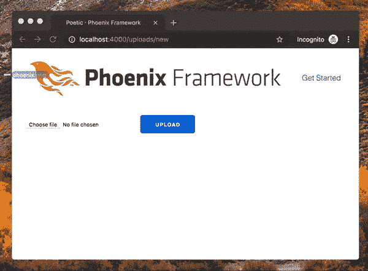
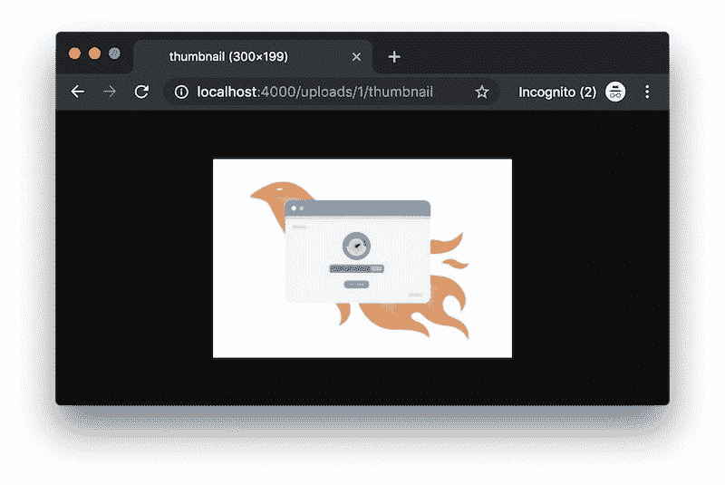
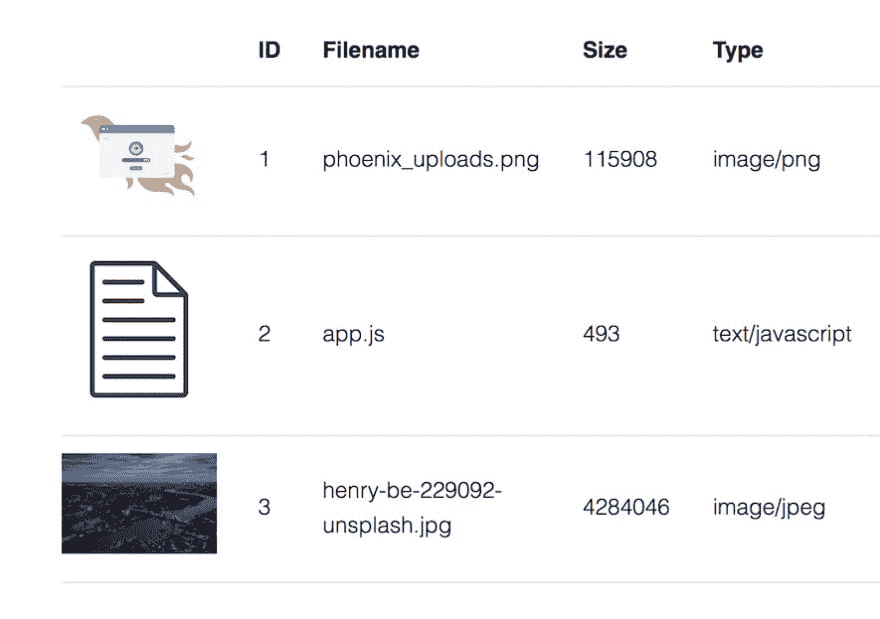
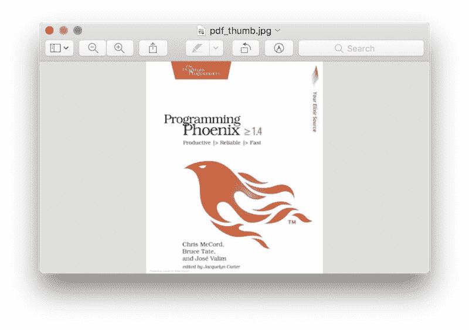
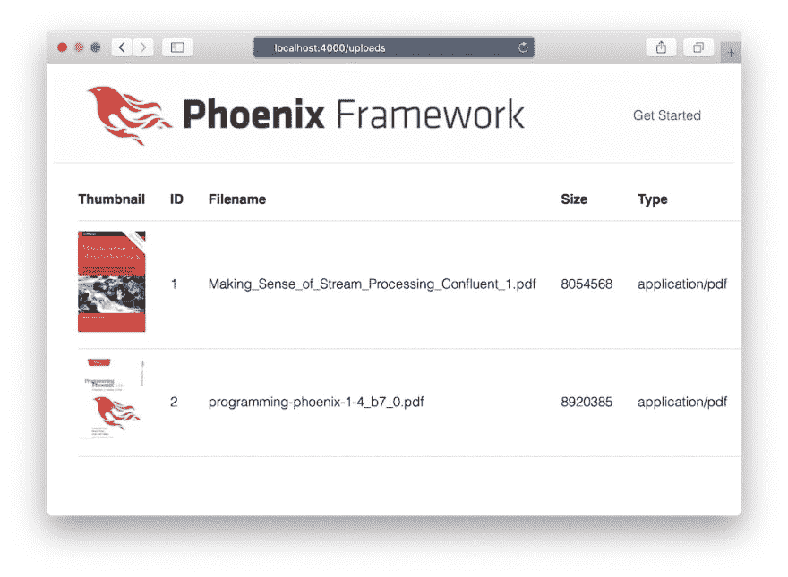

# 在 Phoenix 中创建上传图像和 PDF 的缩略图

> 原文：<https://dev.to/alvisesus/creating-thumbnails-of-uploaded-images-and-pdf-in-phoenix-21a3>

在[构建支持用户上传的 Phoenix 应用程序的分步教程中](https://www.poeticoding.com/step-by-step-tutorial-to-build-a-phoenix-app-that-supports-user-uploads/)我们从头开始构建了一个 Phoenix 应用程序，用户可以上传和下载他们的文件。我们看到了如何处理上传，将它们保存在本地，使用 Ecto 和 Postgres 数据库来保存文件的细节，如大小、文件名、哈希等。

我们现在要添加一个新层，在这里我们为图像和 PDF 文件创建缩略图。让我们快速看看如何让[前一部分的代码](https://github.com/poeticoding/phoenix_uploads_articles/tree/df18b03800df06c15b12791f21f559ebdc92f0d2)启动并运行，这样我们就可以从它开始构建。

```
$ git clone git@github.com:poeticoding/phoenix_uploads_articles.git
$ cd phoenix_uploads_articles 
# in phoenix_uploads_articles directory
$ git checkout tags/part-1 
```

为了保持一致，一旦克隆了存储库，让我们检查标签为`part-1`的提交，这是在[上一篇文章](https://www.poeticoding.com/step-by-step-tutorial-to-build-a-phoenix-app-that-supports-user-uploads/)末尾的情况。

然后，我们需要获得应用程序依赖关系，并构建 javascript 和 css 资产。

```
$ mix deps.get && mix deps.compile
$ cd assets && npm install && \
  node node_modules/webpack/bin/webpack.js \
  --mode development 
```

我们需要一个 Postgres 服务器启动并运行，在那里我们保存上传文件的细节。在 [Postgres using Docker](https://www.poeticoding.com/step-by-step-tutorial-to-build-a-phoenix-app-that-supports-user-uploads/#postgres-docker) 中，您可以详细了解如何在本地机器上使用 Docker 运行 Postgres 服务器。

一旦 Postgres 服务器准备就绪，我们就可以使用 Ecto mix 任务创建数据库和`uploads`表。

```
$ mix ecto.create
Generated poetic app
The database for Poetic.Repo has been created

$ mix ecto.migrate
[info] == Running 20190412141226 Poetic.Repo.Migrations.CreateUploads.change/0 forward
[info] create table uploads
[info] create index uploads_hash_index
[info] == Migrated 20190412141226 in 0.0s 
```

最后一件事——在 [`config/dev.exs`](https://github.com/poeticoding/phoenix_uploads_articles/blob/part-1/config/dev.exs#L78) 底部你会发现`uploads_directory`选项设置为我的本地目录`/Users/alvise/uploads_dev`。创建一个存储上传的文件夹(最好在项目目录之外)并在配置文件中设置绝对路径是很重要的。您还可以使用环境变量来设置它(这是生产中的最佳方式)。

我们现在准备运行 Phoenix 服务器并上传一个文件。

```
$ mix phx.server
[info] Running PoeticWeb.Endpoint with cowboy 2.6.3 at 0.0.0.0:4000 (http)
[info] Access PoeticWeb.Endpoint at http://localhost:4000
... 
```

[](https://res.cloudinary.com/practicaldev/image/fetch/s--IgQ-NTOH--/c_limit%2Cf_auto%2Cfl_progressive%2Cq_66%2Cw_880/https://www.poeticoding.com/wp-content/uploads/2019/05/upload_to_phoenix.gif)

## ImageMagick

为了创建图像和 PDF 的缩略图，我们需要安装 [ImageMagick](https://imagemagick.org) 。如果您以前从未使用过 ImageMagick，它是以编程方式处理图像的最著名和最常用的工具之一。我们将使用它来读取任何图像格式，并将其转换为可以在上传页面中显示的大小调整后的 jpeg。

在我的 mac 上，我用[家酿](https://brew.sh/)安装了它，这绝对是在 macOS 上安装它最简单的方法。

```
$ brew install imagemagick
$ magick --version
Version: ImageMagick 7.0.8-44 Q16 x86_64 ...
... 
```

如果您使用的是 linux，这取决于您使用的发行版。您可以使用 ImageMagick 网站上的二进制文件安装它， [Unix 二进制版本](https://imagemagick.org/script/download.php#unix)。如果你使用 Debian 或 Ubuntu，你可以使用`apt-get`

```
# Ubuntu 18.04
$ apt-get install imagemagick
$ mogrify -version
Version: ImageMagick 6.9.7-4 Q16 x86_64 20170114
... 
```

例如，Ubuntu 18.04 有一个稍旧的 ImageMagick 版本，这对我们需要做的事情来说不是问题。

ImageMagick 6.9 没有 Mac 安装中的`magick`命令。要检查版本，您可以运行`mogrify`命令，这是 ImageMagick 工具之一，我们将使用它来创建缩略图。

## 用药剂中的 Mogrify 创建缩略图

Mogrify 是 ImageMagick `mogrify`命令的包装器，它在处理图像方面带来了类似灵丹妙药的体验。我们把它加在我们的`mix.exs`下的`deps`下的

```
$ mix deps.get
Resolving Hex dependencies...
Dependency resolution completed:
...
  mogrify 0.7.2
... 
```

Mogrify 唯一的依赖项是 ImageMagick，我们已经安装了。

你可以下载 [`phoenix_uploads.png`](https://github.com/poeticoding/phoenix_uploads_articles/blob/part-2/assets/statimg/phoenix_uploads.png) 图片并保存到`assets/statimg/`文件夹中，这样你就可以用它在仙丹的交互外壳`iex`中做一些调整大小的实验。

```
$ iex -S mix
iex> Mogrify.open("assets/statimg/phoenix_uploads.png") \
...> |> Mogrify.resize_to_limit("300x300") \
...> |> Mogrify.save(path: "phoenix_uploads_thumb.jpg")
%Mogrify.Image{
  animated: false,
  buffer: nil,
  dirty: %{},
  ext: ".jpg",
  format: nil,
  frame_count: 1,
  height: nil,
  operations: [],
  path: "phoenix_uploads_thumb.jpg",
  width: nil
} 
```

*   使用`resize_to_limit("300x300")`调整图像大小，保持比例，将宽度和高度限制在最大 300 像素。
*   用`Mogrify.save(path: "phoenix_uploads_thumb.jpg")`开始加工。此时，库运行 ImageMagick `mogrify`命令。使用`:path`选项，我们指定我们想要存储文件的路径，并使用不同的扩展名(如*)。jpg* 在这种情况下)图像被转换成新的图像格式。

我们在项目的根目录中找到了调整后的图像。我们可以使用`Mogrify`来检查这个新图像的`width`和`hight`。

```
iex> ls
...
phoenix_uploads_thumb.jpg

iex> Mogrify.open("phoenix_uploads_thumb.jpg") \
...> Mogrify.verbose()
%Mogrify.Image{
  ...
  ext: ".jpg",
  format: "jpeg",
  height: 199,
  width: 300
  path: ...
} 
```

## `thumbnail?`字段在上传的 Ecto 模式中

用户应该能够上传任何文件格式，但我们可以只为图像和 PDF 创建缩略图。然后，我们需要在上传模式中有一个新的字段，反映我们的数据库中的布尔列，在那里我们存储上传是否有缩略图。

我们将*改变*当前的`uploads`数据库表，添加一个新的`has_thumb`布尔列。为此，我们生成一个新的外域迁移

```
$ mix ecto.gen.migration add_uploads_has_thumb
* creating priv/repo/migrations/20190514143331_add_uploads_has_thumb.exs 
```

该任务创建一个迁移模板文件，其中包含一个我们需要填充的空的`change`函数。

```
# priv/repo/migrations/20190514143331_add_uploads_has_thumb.exs
defmodule Poetic.Repo.Migrations.AddUploadsHasThumb do
  use Ecto.Migration

  def change do
        alter table(:uploads) do
          add :has_thumb, :boolean, default: false
    end
  end
end 
```

这样，我们改变了`uploads`表，增加了`has_thumb`列。所有现有的记录都将这个值设置为`false`。

为了应用该迁移，我们运行迁移任务

```
$  mix ecto.migrate
[info] == Running 20190514143331 Poetic.Repo.Migrations.AddUploadsHasThumb.change/0 forward
[info] alter table uploads
[info] == Migrated 20190514143331 in 0.0s 
```

让我们在 [`Poetic.Documents.Upload`模块](https://github.com/poeticoding/phoenix_uploads_articles/blob/part-2/lib/poetic/documents/upload.ex)中定义的*上传*模式中添加新的 [`thumbnail?`](https://github.com/poeticoding/phoenix_uploads_articles/blob/part-2/lib/poetic/documents/upload.ex#L12) 字段，使用`:source`选项
将该字段映射到`has_thumb`列

```
# lib/poetic/documents/upload.ex
defmodule Poetic.Documents.Upload do
  schema "uploads" do
    ...
    field :thumbnail?, :boolean, source: :has_thumb
    ...
  end
end 
```

## 上传模块和变更集

将`thumbnail?`字段添加到模式后，现在是时候编写创建缩略图和更新上传数据库记录的函数了。

让我们先从 [`Upload.changeset/2`](https://github.com/poeticoding/phoenix_uploads_articles/blob/part-2/lib/poetic/documents/upload.ex#L18) 功能说起。事实上，如果我们试图改变`thumbnail?`的值，什么都不会发生

```
iex> alias Poetic.Documents.Upload
iex> Upload.changeset(%Upload{},%{thumbnail?: true})
#Ecto.Changeset<
  action: nil,
  changes: %{},
  ...
> 
```

我们需要将`:thumbnail?`原子添加到传递给`cast`
的有效字段中

```
# lib/poetic/documents/upload.ex
def changeset(upload, attrs) do
  upload
  |> cast(attrs, [:filename, :size, :content_type, :hash, :thumbnail?])
  ...
end

# on iex
iex> Upload.changeset(%Upload{}, %{thumbnail?: true})
#Ecto.Changeset<
  action: nil,
  changes: %{thumbnail?: true},
  ...
> 
```

## 缩略图路径

现在，我们在哪里存储我们的缩略图？

我们可以将它们存储在项目的`priv/static/images`目录中，这样我们就可以使用服务于静态资产的 [`Plug.Static`](https://hexdocs.pm/plug/Plug.Static.html) 插件。只需将图像复制到`priv/static/images`目录中，就可以在 URL `http://localhost:40img/thumbnail_filename.jpg`检索到缩略图。这样真的很容易为新形象服务。`Plug.Static`也使用 etags 进行 HTTP 缓存。

但是我们将采用不同的方法，将缩略图保存到我们存储上传文件的同一个目录中。这样，我们把所有的东西放在一起，我们可以更好地控制基于用户许可的缩略图服务。

现在让我们定义一个 [`thumbnail_path/1`](https://github.com/poeticoding/phoenix_uploads_articles/blob/part-2/lib/poetic/documents/upload.ex#L41) 函数，为我们的缩略图
返回一个有效且唯一的绝对路径

```
# lib/poetic/documents/upload.ex
def thumbnail_path(id) do
  [@upload_directory, "thumb-#{id}.jpg"]
  |> Path.join()
end 
```

正如我们对 [`local_path/2`](https://github.com/poeticoding/phoenix_uploads_articles/blob/473968c80b6d882a88c839e7a87d231c12f46d9d/lib/poetic/documents/upload.ex#L35) 所做的那样，我们使用`id`来唯一地标识缩略图。一般来说，为每次上传建立一个专用的目录是一个好主意——这样我们可以自由地将涉及相同上传的多个文件分组，而不会使上传目录过度拥挤。由于这增加了一点复杂性(例如为每次上传创建一个目录)，我们将缩略图直接保存在`@upload_directory`中。

## 图像的缩略图

为了生成缩略图，我们使用了一个类似于我们之前在 iex 上尝试过的 Mogrify 代码

```
# lib/poetic/documents/upload.ex
 def mogrify_thumbnail(src_path, dst_path) do
   try do
     Mogrify.open(src_path)
     |> Mogrify.resize_to_limit("300x300")
     |> Mogrify.save(path: dst_path)
   rescue
     File.Error -> {:error, :invalid_src_path}
     error -> {:error, error}
   else
     _image -> {:ok, dst_path}
   end
 end 
```

总的来说，我更喜欢避免用 [`try/rescue`](https://elixir-lang.org/getting-started/try-catch-and-rescue.html) 构造来处理错误，通常模式匹配`{:error, _}` `{:ok, _}`元组更好。

当源图像文件不存在时,`Mogrify.open/1`函数会引发一个`File.Error`,所以我们需要使用`try/rescue`来正确处理错误并返回一个元组。

目前用现在的 Mogrify(0 . 7 . 2 版本)，`Mogrify.save/2`失败了也不返回或者抛出错误，这不是可以听天由命的事情。我们将在后面看到，在为 PDF 文件创建缩略图时，如何在 Elixir 中运行 ImageMagick 命令来处理打开和保存错误。

使用模式匹配，我们可以为我们想要的每个`content_type`定义一个 [`create_thumbnail/1`](https://github.com/poeticoding/phoenix_uploads_articles/blob/part-2/lib/poetic/documents/upload.ex#L46) 函数。我们从*图像*内容类型开始，以支持不同的图像格式(`image/png, image/jpg`等)。)

```
# lib/poetic/documents/upload.ex

def create_thumbnail(%__MODULE__{
  content_type: "image/" <> _img_type
}=upload) do

  original_path = local_path(upload.id, upload.filename)
  thumb_path = thumbnail_path(upload.id)
  {:ok, _} = mogrify_thumbnail(original_path, thumb_path)

  changeset(upload, %{thumbnail?: true})
end

def create_thumbnail(%__MODULE__{}=upload), 
    do: changeset(upload, %{}) 
```

函数参数是一个`%Upload{}`结构，其中`content_type`以`image/`开始。我们使用`id`和`filename`字段获取原始文件路径，使用`thumbnail_path/1`函数获取目标路径。

为了简单起见，我们期望`mogrify_thumbnail/2`返回一个`{:ok, _}`元组——当它返回`{:error, _}`时，一个`MatchError`被引发。如果不处理，可能会导致向用户显示 *HTTP 500 内部服务器错误*错误消息。有许多方法可以处理这种类型的错误:我们可以悄悄地失败并设置一个通用的缩略图，或者返回一个在`thumbnail?`字段有错误的变更集。最终，这取决于我们希望我们的应用程序在这些情况下如何表现。

在函数的最后一行，我们将 upload 结构转换为一个 Ecto 变更集，将`thumbnail?`值设置为`true`。这个函数不会对上传的记录应用任何更改——为了保持这个更改，我们将把变更集传递给`Repo.update/1`函数。

第二个`create_thumbnail/1`是一个包罗万象的条款。它处理文件不是图像的情况。它只是返回一个没有更改的变更集。

## 单据上下文

现在我们已经拥有了创建缩略图所需的一切，我们只需要决定在代码的哪个部分生成它。

让我们从最简单的方法开始，在 [`Documents.create_upload_from_plug_upload/1`](https://github.com/poeticoding/phoenix_uploads_articles/blob/part-2/lib/poetic/documents.ex#L37) 函数中添加一个新的步骤。我们可以向事务中的`with`添加一个新步骤。

```
# lib/poetic/documents.ex
defmodule Poetic.Documents do

  def create_upload_from_plug_upload(%Plug.Upload{...}) do
    ...

    with ...,
     {:ok, upload} <- 
         ... |> Repo.insert(),
     ...
     {:ok, upload} <- 
         Upload.create_thumbnail(upload) |> Repo.update() 
    do
      ...
    else
      ...
    end

    ...
  end
end 
```

如果我们现在运行我们的应用程序并上传一张图片，我们仍然看不到上传页面中显示的任何缩略图，但在上传文件夹中，我们看到缩略图已在上传过程中成功创建。

[](https://res.cloudinary.com/practicaldev/image/fetch/s--6shz1FNo--/c_limit%2Cf_auto%2Cfl_progressive%2Cq_66%2Cw_880/https://www.poeticoding.com/wp-content/uploads/2019/05/create_thumbnail_working.gif)

## 上菜并展示缩略图

我们刚刚看到,`Documents`上下文成功地为图像文件创建了缩略图，但是这些没有显示在上传页面中。由于缩略图在上传目录中，为了提供它们，我们首先需要在路由器中添加一条路由，并在 [`PoeticWeb.UploadController`](https://github.com/poeticoding/phoenix_uploads_articles/blob/df18b03800df06c15b12791f21f559ebdc92f0d2/lib/poetic_web/controllers/upload_controller.ex) 中添加一个动作。

```
# lib/poetic_web/router.ex
...
scope "/", PoeticWeb do
  resources "/uploads", UploadController, only: [:index, :new, :create, :show] do
    get "/thumbnail", UploadController, :thumbnail, as: "thumbnail"
  end
end 
```

```
$ mix phx.routes
...
upload_thumbnail_path  GET  /uploads/:upload_id/thumbnail  PoeticWeb.UploadController :thumbnail
... 
```

在上传资源中，我们定义了一个指向`UploadController.thumbnail`动作的`get`路径。

使用`mix phx.routes`,我们看到新的路由被列出，并且`upload_thumbnail_path`助手被创建。注意，用于在参数中传递 id 的键现在是`upload_id`。

在`UploadController`中我们编写了 [`thumbnail/2`](https://github.com/poeticoding/phoenix_uploads_articles/blob/part-2/lib/poetic_web/controllers/upload_controller.ex#L36) 函数

```
# lib/poetic_web/controllers/upload_controller.ex
def thumbnail(conn, %{"upload_id" => id}) do
  thumb_path = Upload.thumbnail_path(id)

  conn
  |> put_resp_content_type("image/jpeg")
  |> send_file(200, thumb_path)
end 
```

我们对`upload_id`进行模式匹配，得到缩略图路径。然后，我们将内容类型设置为 *image/jpeg* ，并将文件发送给客户端。我们可以立即看到它是否工作，上传一个文件并用浏览器发出一个 GET 请求

[](https://res.cloudinary.com/practicaldev/image/fetch/s--Ip6DK4RV--/c_limit%2Cf_auto%2Cfl_progressive%2Cq_auto%2Cw_880/https://www.poeticoding.com/wp-content/uploads/2019/05/http_get_thumbnail.jpg)

现在让我们更改`lib/poetic_web/templates/upload/index.html.eex`文件以显示列表
中的缩略图

```
<%= for upload <- @uploads do %>

<tr>
    <td>
        <%= if upload.thumbnail? do 
            img_tag Routes.upload_thumbnail_path(@conn, :thumbnail, upload.id)
          else
            img_tagimg/generic_thumbnail.jpg"
          end 
        %>
    </td>

    <td>...</td>

</tr>
<% end %> 
```

*   如果上传有缩略图，我们使用`img_tag`和`upload_thumbnail_path`助手显示缩略图(返回路径以获取给定上传 id 的缩略图)。
*   在没有缩略图的情况下，我们在`assets/static/images`中显示一个通用缩略图。

[](https://res.cloudinary.com/practicaldev/image/fetch/s--j29kcZtD--/c_limit%2Cf_auto%2Cfl_progressive%2Cq_auto%2Cw_880/https://www.poeticoding.com/wp-content/uploads/2019/05/uploads_with_thumbnails-1.jpg)

## PDF 的缩略图

到目前为止，我们只关注图像的缩略图。对于 PDF 文件，我们可以创建第一页的缩略图。

从 PDF 页面创建图像的最佳工具是 ImageMagick 的`convert`命令，Mogrify 包装器不包含该命令。

所以我们需要基于 [`System.cmd/3`](https://hexdocs.pm/elixir/System.html#cmd/3) 构建运行`convert`命令的 Elixir 函数。

首先，让我们看看如何创建 PDF 的缩略图

```
# on linux/mac/unix
$ convert -density 300 -resize 300x300 'programming-phoenix.pdf[0]' 'pdf_thumb.jpg' 
```

pdf 路径后面的`[0]`用于选择我们要转换的页面，从 0 开始。

如果`convert`返回类似`convert: no images defined`的错误，可能与用于处理 pdf 的`ghostscript` 9.26 有关。为了暂时修复这个问题，等待下一个版本，我已经将 ghostscript 降级到 9.25 版本。

```
$ brew uninstall ghostscript
$ brew install https://raw.githubusercontent.com/Homebrew/homebrew-core/b0b6b9495113b0ac5325e07d5427dc89170f690f/Formula/ghostscript.rb 
```

在 Windows 上，在 ImageMagick 7 中，该命令略有不同。我们需要在前面加上`magick`

```
> magick.exe convert ... 
```

[](https://res.cloudinary.com/practicaldev/image/fetch/s--m8djU5Ee--/c_limit%2Cf_auto%2Cfl_progressive%2Cq_auto%2Cw_880/https://www.poeticoding.com/wp-content/uploads/2019/05/pdf_thumbnail_preview.jpg)

太棒了，所以我们现在给上传模块添加了一个新功能

```
# lib/poetic/documents/upload.ex
def pdf_thumbnail(pdf_path, thumb_path) do
  args = ["-density", "300", "-resize", 
          "300x300","#{pdf_path}[0]", 
          thumb_path]

  case System.cmd("convert", args, stderr_to_stdout: true) do
    {_, 0} -> {:ok, thumb_path}  
    {reason, _} -> {:error, reason}
  end
end 
```

参数作为一个列表传递，我们使用`stderr_to_stdout`选项来捕捉命令输出的任何内容。

*   在`convert`与`0`一起退出的情况下，表示缩略图创建正确。
*   对于任何其他退出代码，我们返回`{:error, reason}`，其中`reason`是命令的输出字符串

如果我们试图让它失败，提供一个无效的 PDF 路径，我们得到一个预期的`{:error, reason}`元组。

```
iex> Poetic.Documents.Upload.pdf_thumbnail("invalid.pdf", "thumb.jpg")
{:error,
 "convert: unable to open image 'invalid.pdf': No such file or directory @ error/blob.c/OpenBlob/3497.\nconvert: no images defined `thumb.jpg' @ error/convert.c/ConvertImageCommand/3300.\n"} 
```

因为我们在`stdout`和`stderr`上捕捉所有的输出，所以错误字符串可能有点太冗长。我们可以处理字符串，例如只获取第一行直到@符号。

无效输出路径
也是如此

```
iex> Poetic.Documents.Upload.pdf_thumbnail("programming-phoenix.pdf", "/tmp/invalid/thumb.jpg")
{:error,
 "convert: unable to open image '/tmp/invalid/thumb.jpg': No such file or directory @ error/blob.c/OpenBlob/3497.\n"} 
```

我们现在可以使用这个函数来扩展对`application/pdf`内容类型的支持。

```
# lib/poetic/documents/upload.ex
def create_thumbnail(%__MODULE__{
  content_type: "application/pdf"
}=upload) do
    original_path = local_path(upload.id, upload.filename)
    thumb_path = thumbnail_path(upload.id)
    {:ok, _} = pdf_thumbnail(original_path, thumb_path)
    changeset(upload, %{thumbnail?: true})
end 
```

我们看到，一旦将这个新的`create_thumbnail`子句添加到上传模块中，PDF 的缩略图就创建并成功显示了

[](https://res.cloudinary.com/practicaldev/image/fetch/s--GNXRdRji--/c_limit%2Cf_auto%2Cfl_progressive%2Cq_auto%2Cw_880/https://www.poeticoding.com/wp-content/uploads/2019/05/uploaded_pdf_with_thumbnails.jpg)