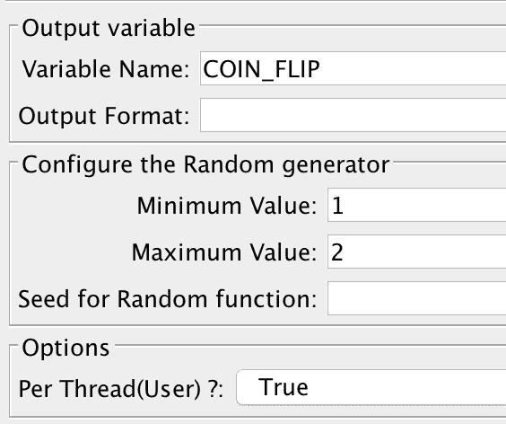
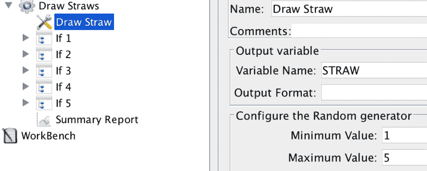
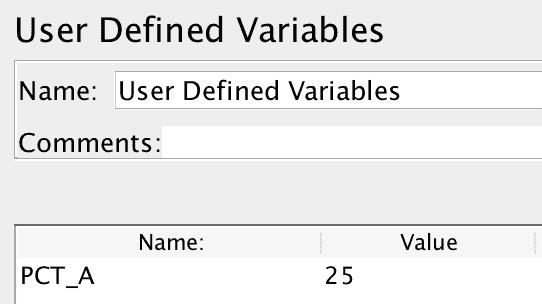
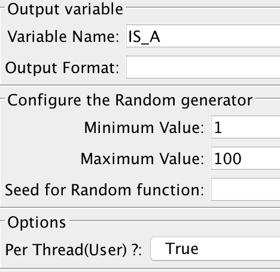

# 在 JMeter 中创建加权流

> 原文：<https://dev.to/ambertests/creating-weighted-flows-in-jmeter-354d>

对于应用程序来说，拥有多个流路径是很常见的。例如，在手机游戏中，对于已经通过脸书认证的玩家，有一个呼叫流，而对于匿名玩家，有一个非常不同的呼叫流是很常见的。当试图在 JMeter 中复制真实的服务器负载时，能够处理用户在客户端应用程序中采用的不同路径是很重要的。

JMeter 实际上具有开箱即用的能力，不需要 Groovy 脚本或二级插件。通过一个**随机变量**和几个 **If 控制器**，您可以在您的负载测试脚本中启用任意数量的不同流程。

## 抛钱币

让我们从最简单的场景开始:您希望在测试中平均分配的两条路径。要做到这一点，首先添加随机变量元素，它将生成一个介于 1 和 2 之间的数字，确保将每个线程选项设置为 True，这样硬币就会在每个用户线程上翻转。

<figure>

[](https://res.cloudinary.com/practicaldev/image/fetch/s--kTiIuWLg--/c_limit%2Cf_auto%2Cfl_progressive%2Cq_auto%2Cw_880/https://thepracticaldev.s3.amazonaws.com/i/4dvnqt7vce2qwgpllbu5.png)

<figcaption>JMeter Coin Flip</figcaption>

</figure>

接下来添加两个 If 控制器来控制两条路径。

##### 条件 A:

```
${COIN_FLIP} == 1
```

##### 条件 B:

```
${COIN_FLIP} == 2
```

这就是你需要做的一切——简单！您可以使用同样的策略在任意数量的路径中平均分配您的测试；只是增加你的随机变量的最大值。

[](https://res.cloudinary.com/practicaldev/image/fetch/s--8WBFKy5F--/c_limit%2Cf_auto%2Cfl_progressive%2Cq_auto%2Cw_880/https://thepracticaldev.s3.amazonaws.com/i/qgwbnbbibbxthlcypl62.png)

## 百分比 A/B

当你有两条不同的道路，但其中一条比另一条更常见的时候呢？如果你想测试 A 和 B 路径的不同比率呢？在这种情况下，我使用了以下技巧:

首先，在您的脚本中添加一个用户定义的变量元素，以跟踪通过 A 流的迭代的百分比。

[](https://res.cloudinary.com/practicaldev/image/fetch/s--E2-sNeeD--/c_limit%2Cf_auto%2Cfl_progressive%2Cq_auto%2Cw_880/https://thepracticaldev.s3.amazonaws.com/i/5ydfzf25ke06y2p0kqt8.png)

然后设置你的随机变量的最大值为 100。

[](https://res.cloudinary.com/practicaldev/image/fetch/s--jVeNWoEw--/c_limit%2Cf_auto%2Cfl_progressive%2Cq_auto%2Cw_880/https://thepracticaldev.s3.amazonaws.com/i/0gvfrzm879b0lxn42z95.png)

现在，我们转到 If 控制器，在用于 *A* 路径的控制器中，设置以下条件:

```
${IS_A} <= ${PCT_A}
```

而在*非*路径中，放相反的:

```
${IS_A} > ${PCT_A}
```

然后*瞧，*根据给定的百分比，在两条路径之间进行近乎完美的分割。如果您真的觉得很酷，您可以将 PCT_A 值设置为在命令行上传递的属性。但这是另一篇文章的主题。

## 示例文件

说明所有这些例子的脚本可从这里获得: [WeightedFlows.jmx](https://github.com/ambertests/JMeterExamples/blob/master/WeightedFlows.jmx) 。如果你想看另一个例子，请告诉我！

*原贴[此处](https://ambertests.com/2017/03/21/creating-weighted-flows-in-jmeter/)T3】*