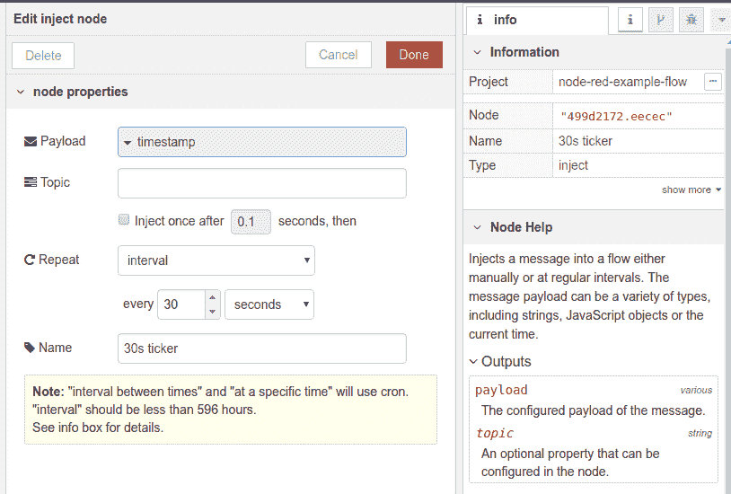
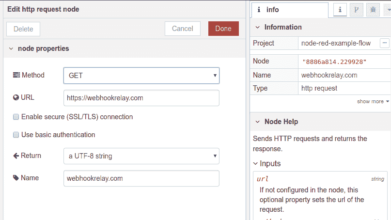
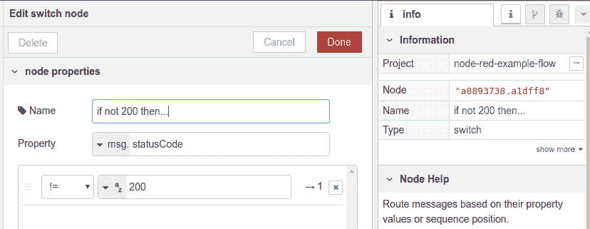
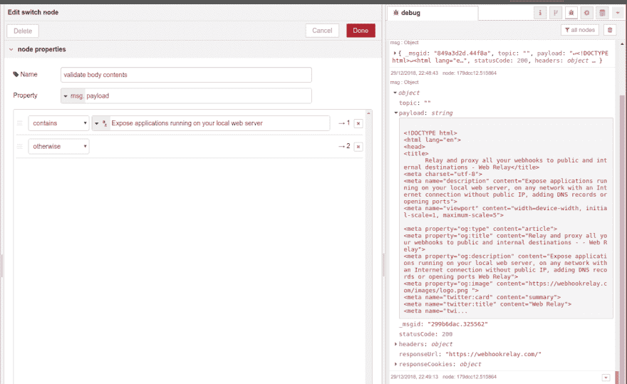
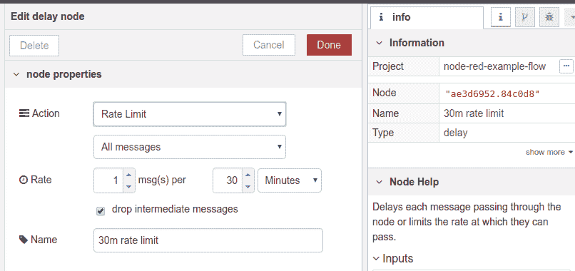

# 使用 Node-RED 创建您自己的运行状况检查监视器

> 原文：<https://dev.to/webhookrelay/creating-your-own-health-check-monitor-with-node-red-51fn>

如果你正在运行自己的博客、SaaS 应用程序或论坛，你可能会遇到运行时间/健康监测器，如[https://uptimerobot.com](https://uptimerobot.com)和他们的竞争对手(有很多:[https://alternativeto.net/software/uptimerobot](https://alternativeto.net/software/uptimerobot))。在这个简短的教程中，我们将构建我们自己的简单(但灵活，你可以扩展远远超过其他工具所能提供的)。

我们的网站健康监测将是:

1.  查询 3 个网站
2.  检查它们的响应状态代码和内容
3.  限速通知
4.  向电子邮件和空闲时间发送通知

流程如下所示:

[](https://res.cloudinary.com/practicaldev/image/fetch/s--xLUvrBo8--/c_limit%2Cf_auto%2Cfl_progressive%2Cq_auto%2Cw_880/https://thepracticaldev.s3.amazonaws.com/i/s7tgqlxl8k98axt8fcmh.png)

## 什么是 Node-RED？

从[https://nodered.org/:](https://nodered.org/:)

> Node-RED 是一个编程工具，用于以新颖有趣的方式将硬件设备、API 和在线服务连接在一起。它提供了一个基于浏览器的编辑器，可以使用调色板中的大量节点轻松地将流连接在一起，只需单击一下就可以将这些节点部署到它的运行时。

可以在这里找到[入门指南。](https://nodered.org/docs/getting-started/)

尽管我的首选语言是 Go，但我发现使用 Node-RED 非常有趣:)

## 第一步:时间跑马灯

Time ticker 是来自**输入**类别的一个简单的**注入**节点。根据您的需要配置*间隔*，我们将添加一些信息速率限制，因此您甚至可以将其设置为 1 或 5 秒。在我的例子中，我将其设置为 30 秒:

[](https://res.cloudinary.com/practicaldev/image/fetch/s--9iCqjnad--/c_limit%2Cf_auto%2Cfl_progressive%2Cq_auto%2Cw_880/https://thepracticaldev.s3.amazonaws.com/i/5pnvmkfolmg11idaqa42.png)

我们不关心主题或有效载荷，它可以注入任何东西。我们唯一需要的是引发进一步的行动。

## 第二步:提出请求

要发出请求将使用来自**功能**类别的 **http 请求**节点。

[](https://res.cloudinary.com/practicaldev/image/fetch/s--xJT23J7j--/c_limit%2Cf_auto%2Cfl_progressive%2Cq_auto%2Cw_880/https://thepracticaldev.s3.amazonaws.com/i/vfmsi95exuo1gdpef9s2.png)

如你所见，这真的很简单。这里不需要额外的配置。该节点将发出一个 GET 请求，并返回一个包含多个字段的消息，但我们只关心:

*   状态码 -我们将检查它是否为 200。
*   **responseUrl** -我们将把它合并到警告消息中。
*   **payload**——这是包含 HTML 的实际响应体。我们将检查它是否包含我们知道应该存在的某个短语。

## 步骤 3:验证回应

在这一步中，我们将添加一个简单的 HTTP 状态代码验证(如果网站关闭，您将不会得到 200 响应)。然而，有时你仍然可以得到 200(从你的反向代理显示一个空页面)或只是网站更新出错。在这种情况下，您会希望检查响应正文，以获得一些应该在那里的特定短语或关键字。

#### 检查响应状态码

为了验证响应状态代码，我们将使用来自**功能**类别的**开关**节点:

[](https://res.cloudinary.com/practicaldev/image/fetch/s--vMgP0g7M--/c_limit%2Cf_auto%2Cfl_progressive%2Cq_auto%2Cw_880/https://thepracticaldev.s3.amazonaws.com/i/5ns0thxfuf4x3tygkvx0.png)

#### 检查响应正文内容

为了检查响应正文内容，我在开关中找不到“不包含”选项，所以我只是颠倒了逻辑，选择了第二个输出，如下所示:

[](https://res.cloudinary.com/practicaldev/image/fetch/s--KFnr6F-A--/c_limit%2Cf_auto%2Cfl_progressive%2Cq_auto%2Cw_880/https://thepracticaldev.s3.amazonaws.com/i/3jmv495dghdx8qjta171.png)

然后，我们只需连接第二个输出(让第一个输出为空)，就可以得到我们想要的结果:)

## 第四步:生成有效载荷

这一步真的取决于你和你想展示什么。对于 **Slack** 有效负载，我们需要格式化一个简单的 JSON 消息，所以我们将使用来自**函数**类别的**函数**节点。

不良响应体的函数如下:

```
return {
    payload: `{"response_type": "in_channel", "text": "[WARNING] ${msg.responseUrl} URL returned unexpected contents, please investigate" }`,
    topic: msg.topic
} 
```

Enter fullscreen mode Exit fullscreen mode

而对于错误的状态码:

```
return {
    payload: `{"response_type": "in_channel", "text": "[WARNING] ${msg.responseUrl} responded with status code '${msg.statusCode}'" }`,
    topic: msg.topic
} 
```

Enter fullscreen mode Exit fullscreen mode

电子邮件不必是 JSON 有效负载，所以它看起来像:

```
return {
    payload: `[WARNING] ${msg.responseUrl} responded with status code '${msg.statusCode}'`,
    topic: msg.topic
} 
```

Enter fullscreen mode Exit fullscreen mode

您可以尝试根据触发流程的原因添加更多信息。在这种情况下，我们希望根据状态代码或响应正文内容是否意外来区分有效负载。

## 第五步:时差和电子邮件通知

在设置通知节点之前，我真的建议对你的信息流进行限速，因为在最糟糕的时候，一连串的邮件/垃圾信息会分散你的注意力:)

可以通过**功能**类别中的**延迟**节点添加速率限制。配置看起来像:

[](https://res.cloudinary.com/practicaldev/image/fetch/s--sjFcvFEI--/c_limit%2Cf_auto%2Cfl_progressive%2Cq_auto%2Cw_880/https://thepracticaldev.s3.amazonaws.com/i/7gyiv1nh70ees5293ps2.png)

> 提示:如果您为每个主题添加了一个速率限制，您的消息将不会出现。在第一条消息之后，它将等待整个持续时间来接收任何新消息，并且仅在那时显示它们。但是，您可以为每个网站创建单独的延迟，以限制那里的事件。

至于通知，有很多方法。我选了两个:Slack 和 email。对于 Slack 通知，我们创建了一个 **http 请求**节点，它将把有效负载(我们在上一步中生成的)发送到一个‘传入的 web hooks URL’，比如`https://hooks.slack.com/services/............`。你可以在这里了解他们:[https://api.slack.com/incoming-webhooks](https://api.slack.com/incoming-webhooks)。

对于电子邮件，我们将使用来自**社交**类别的**电子邮件**节点。对于 gmail 用户，你可以在这里生成一个“应用密码”:https://support.google.com/accounts/answer/185833。

## [T1。/wrap_up](#wrapup)

虽然有很多监控服务都有免费层，但在测试特定功能时，它们通常无法与 Node-RED 的灵活性相媲美。借助 Node-RED，我们可以:

*   设置我们想要的检查频率
*   在网站上执行多个操作或使用不同的非 HTTP 协议
*   整合到我们现有的任何通知系统中(发送 webhooks、Slack、Telegram、Twilio，甚至在我们的内部问题跟踪系统中创建一个新的标签)

显然，也有不利的一面，比如:

*   尽管这很容易，但您实际上必须创建这些流，而不仅仅是提供一个第三方服务的 URL
*   这些服务通常在世界各地部署了多个应用程序，因此它们托管应用程序的数据中心可能会出现故障，但不会破坏它们的业务(如果您的节点红色 RPI 停止工作，您不会收到警告，除非您也监控您的 RPI，这是完全可行的:)。

我建议混合使用公共 SaaS 产品(你可以在它们上面有一个免费层)和你自己的定制监控应用程序，这样可以更好、更深入地测试你的主要服务。您还可以在 uptimerobot 中注册一个监视器来测试您的节点红色监视应用程序。您的节点红色实例 uptimerobot 和您的 SaaS 应用程序在您没有得到通知的情况下同时失败是极不可能的:)

## 接下来是什么

在下一篇文章中，我将演示如何创建一个更有趣的异步流，对 SaaS 应用程序进行端到端测试。