# 表单输入类型的跨浏览器兼容性问题

> 原文：<https://dev.to/lambdatest/cross-browser-compatibility-issues-with-form-input-types-b24>

自 HTML 建立以来，表单就一直是其不可或缺的一部分，允许网站与用户无缝交互以收集数据。HTML 4 最初只有 8 种输入类型，这对 web 表单的开发人员和功能造成了巨大的限制。然而，随着 2014 年 HTML5 和 web forms 2.0 的推出，引入了 13 种新的表单输入类型，增强了 HTML 表单。

新的输入类型不仅引入了特定的数据字段，如电话、电子邮件、url、日期、号码等，还添加了可视化交互小部件，如日期选择器、颜色选择器、滑块等，以将用户体验提升到一个全新的角度。

尽管这些新引入的表单输入类型看起来不错，但它们带来了过多的跨浏览器兼容性和一致性问题，在某些情况下可能会[影响用户体验](https://goo.gl/a9uazm)或导致错误的表单提交。

今天，我们将探讨表单输入类型的一些主要跨浏览器兼容性问题，以及如何使用 javascript/jquery 插件和 polyfills 来解决这些问题，以便它们甚至可以在 IE 等传统浏览器中完美工作

## LambdaTest——跨浏览器测试工具

在我们研究解决跨浏览器兼容性问题的方法之前，我们需要一种机制来检查我们的代码是否以预期的方式被不同的浏览器呈现。然而，在你的系统和移动设备上维护一个完整的浏览器库的想法是不可行和昂贵的。这就是基于云的跨浏览器测试工具的用武之地。好吧，如果你的目标是[执行跨浏览器测试](https://goo.gl/VBFzMi)，那么 LambdaTest 就是适合你的平台。

使用 [LambdaTest](https://goo.gl/pMDynY) ，您可以测试 2000 多种浏览器，以及通过云服务器运行的虚拟机托管的操作系统组合。我将在下面演示 LambdaTest 的[实时测试](https://goo.gl/C9LtgU)功能，使用它我们可以在 LambdaTest 托管的虚拟机内与我们的网页进行交互，并确保修复是否按预期工作。

## 1。表单输入类型的跨浏览器兼容性问题–日期/时间

HTML5 引入了 5 种新的输入类型，使 web 开发人员能够使用原生 HTML 轻松地向任何网站添加日期和时间选择器，而不依赖于任何 JavaScript 或 jQuery 库。

*   日期
*   月
*   周
*   时间
*   日期时间-本地

这 5 种表单输入类型用于创建输入字段，使用户不仅可以选择单个日期，还可以选择周、月、时间，或者使用随不同浏览器而变化的专用日期/时间选择器小部件界面来选择完全不同的时区。

**注意**:HTML<输入 type= "datetime" >已被弃用，浏览器不再支持。这个输入时间允许用户选择日期、时间和时区。但是，它已被新的输入时间“datetime-local”所取代。

**语法**

```
<input type="date" name="user_date" >
<input type="week" name="user_week">
<input type="month" name="user_month">
<input type="time" name="user_time">
<input type="datetime-local" name="user_dateTime"> 
```

Enter fullscreen mode Exit fullscreen mode

这些输入类型可以通过使用像最小值、最大值、值和步长这样的属性来进一步增强。

```
<input type="date" id="start" name="startDate " value="2019-01-01" min="1900-01-01" max="2099-01-01"> 
```

Enter fullscreen mode Exit fullscreen mode

*   最大值:可接受日期的最高值
*   min:可接受日期的最小值
*   readonly:如果输入的内容是只读的
*   步进:单击向上和向下微调按钮时的步进间隔

[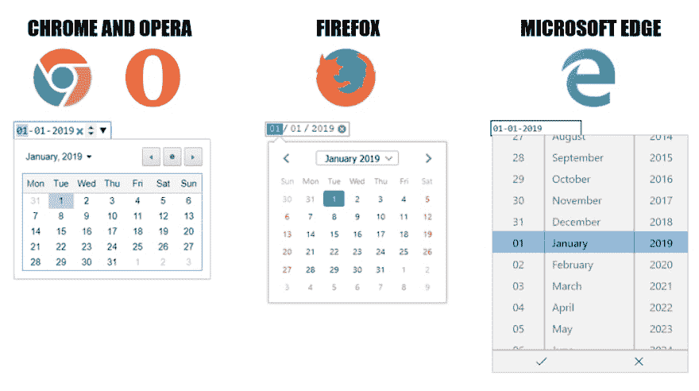](https://goo.gl/WRzb8J)

## 浏览器支持

[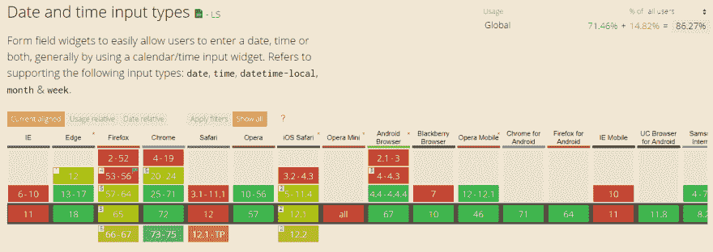](https://goo.gl/WRzb8J)

在所有新的 HTML5 表单特性中，日期时间输入类型是浏览器支持最差的类型之一。正如你在上面的[我能使用](https://caniuse.com/)截图中看到的，这 5 种日期和时间输入类型不受任何 Internet Explorer 版本的支持，无论是 Safari 还是 Opera mini 都不支持。同样，直到 v57，Firefox 也不支持日期/时间输入。在不受支持的浏览器中，<输入类型“日期”>(或时间、周、月或本地日期时间)优雅地退化为简单的文本框<输入类型= "文本">。

[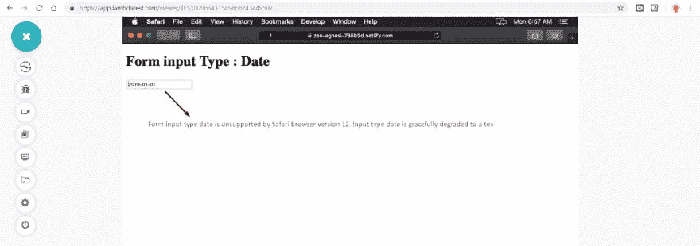](https://res.cloudinary.com/practicaldev/image/fetch/s--E3O2Gmey--/c_limit%2Cf_auto%2Cfl_progressive%2Cq_auto%2Cw_880/https://www.lambdatest.com/blog/wp-content/uploads/2019/02/image3-1-1.png) 
表单输入类型 Safari 12 不支持“日期”
[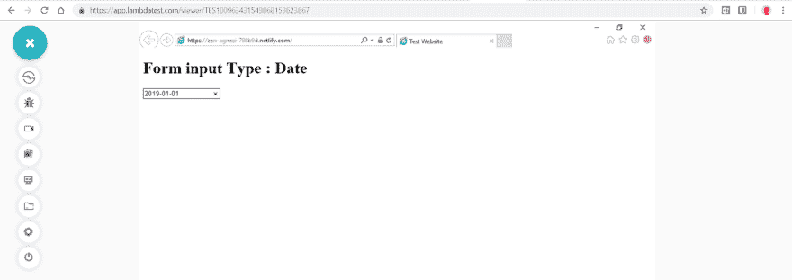](https://res.cloudinary.com/practicaldev/image/fetch/s--6yNU-01q--/c_limit%2Cf_auto%2Cfl_progressive%2Cq_auto%2Cw_880/https://www.lambdatest.com/blog/wp-content/uploads/2019/02/image4-1.png) 
表单输入类型 Internet Explorer 11 不支持“日期”

你注意到 Safari 12 和 IE 11 之间的表单输入类型的跨浏览器兼容性问题了吗？

那只是一个例子。如果你想测试一个静态网站，或者你想批量抓取你的网页的屏幕截图，会发生什么？

嗯，我们可以利用 LambdaTest 提供的[截图测试](https://goo.gl/uRgxxz)功能。自动批量截图可以让你一次性测试 25 个浏览器+操作系统的配置。

我已经针对日期和时间支持输入进行了测试。点击[此处](https://links.lambdatest.com/FC6CJEXCZW764ZUG4VVTFGPM10IOXHMVL9VBP3FUVEPAHRZXXY54E6LKJEY5CEHK)查看输出。你有没有注意到使用 LambdaTest 的自动截图功能进行跨[浏览器兼容性测试](https://goo.gl/SsDCxh)有多容易？

你也会发现下面的视频教程非常有用。本视频将演示与 HTML 日期属性相关的表单输入类型的跨浏览器兼容性问题。

## 修复跨浏览器兼容性问题 jQuery UI

用日期选择器处理跨浏览器兼容性问题最流行和可靠的方法之一是使用一个非常流行的 jQuery 库，名为 [jQuery UI](https://jqueryui.com//) 。使用下面的代码，我们可以利用 jQueryUI 的 DatePicker 将所有输入类型为“date”的表单元素作为目标，不仅为不支持的浏览器(如 Internet Explorer 和 Safari)添加日期/时间选择器功能，还可以确保所有浏览器的窗口小部件界面的一致性。

[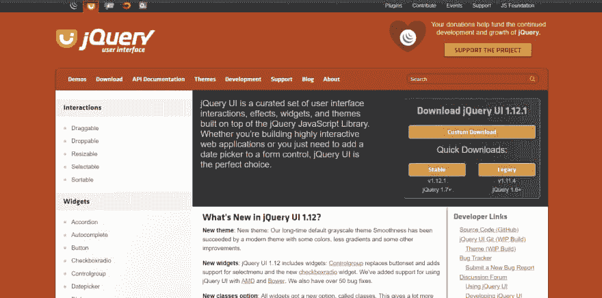](https://res.cloudinary.com/practicaldev/image/fetch/s--a7mB_KLz--/c_limit%2Cf_auto%2Cfl_progressive%2Cq_auto%2Cw_880/https://www.lambdatest.com/blog/wp-content/uploads/2019/02/image12-1.png)

前往 jQuery UI 网站[下载](https://jqueryui.com/download/)必要的文件。将 jquery-ui.min.css、jquery-ui.min.js 和 jquery 文件添加到项目中。你也可以额外使用 ui-lightness 这样的主题。

```
<head>
    Form Input type Date | jQuery UI
        <link rel="stylesheet" href="/jquery-ui.min.css">
    <link rel="stylesheet" href="https://code.jquery.com/ui/1.12.1/themes/ui-lightness/jquery-ui.css">
    <script src="https://ajax.googleapis.com/ajax/libs/jquery/3.3.1/jquery.min.js"></script>
    <script src="jquery-ui.min.js"></script>
    <script>
        $(function(){
         // Find any date inputs and override their functionality
         $('input[type="date"]').datepicker({ dateFormat: 'yy-mm-dd'});
    });
</script>
</head>

<body>
    <h1>Form input Type : Date</h1>
    <input type="date" id="user-date" name="user-date" value="2018-07-22" min="2019-01-01" max="2019-12-31">
</body> 
```

Enter fullscreen mode Exit fullscreen mode

[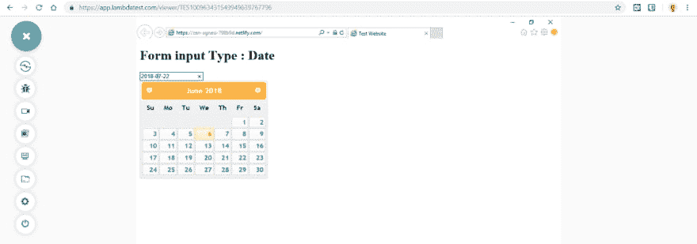](https://res.cloudinary.com/practicaldev/image/fetch/s--0tz3y5CS--/c_limit%2Cf_auto%2Cfl_progressive%2Cq_auto%2Cw_880/https://www.lambdatest.com/blog/wp-content/uploads/2019/02/image7-1.png)

这段代码的一个缺点是浏览器(如 chrome 或 firefox)的本机日期选择器和 jQuery UI 都将生效并重叠。我们需要确保，如果浏览器支持输入类型 date，那么不要触发 jQuery UI datepicker。

我们可以通过两种方式确保这一点

1.  仅在不受支持的浏览器中使用普通 javascript 触发 jQuery UI datepicker。正如我们之前讨论的，在这种情况下,< input type="date" >被优雅地降级为< input type="text" >。如下面的代码所示，如果变量“elem”返回输入类型 text，则有条件地应用 datepicker。

```
<script>
(function() {
var elem = document.createElement('input');
elem.setAttribute('type', 'date');

if ( elem.type === 'text' ) {
$('input[type="date"]').datepicker({ dateFormat: 'yy-mm-dd'});
}
})();
</script> 
```

Enter fullscreen mode Exit fullscreen mode

1.  使用 Modernizr javascript 库运行表单输入类型 date 的功能检测测试，并为不受支持的浏览器有条件地加载 jQuery Ui datepicker。如果你是 modernizr 的新手，那么你可以关注我的另一个博客，在那里我展示了使用 Modernizr 进行跨浏览器兼容性的[特性检测](https://goo.gl/2AJWyz)。从官网下载 modernizr.js 开发构建。

```
<script>
$(function(){
if(!Modernizr.inputtypes.date) { /* Browsers that fail in modernizr detection test for date input type  */
$('input[type="date"]').datepicker({ dateFormat: 'yy-mm-dd'});
}
});
</script> 
```

Enter fullscreen mode Exit fullscreen mode

## 2。表单输入类型的跨浏览器兼容性问题–颜色

表单输入类型颜色允许用户在文本字段中输入颜色的十六进制值，或者从浏览器自带的可视颜色选择器小部件中选择颜色。有些浏览器只允许简单的十六进制值，不允许任何字母值。颜色选择器小部件因浏览器而异。

**语法**
`< input type="color" name="user-color" value="#ff0000" >`
[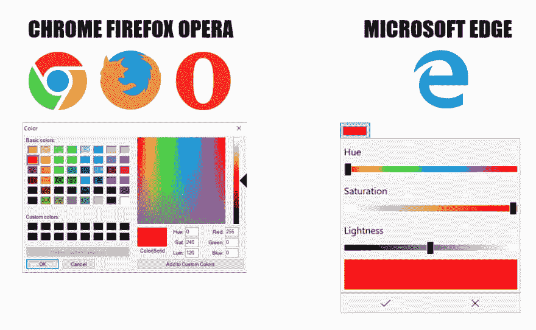](https://res.cloudinary.com/practicaldev/image/fetch/s--iRtwWDiO--/c_limit%2Cf_auto%2Cfl_progressive%2Cq_auto%2Cw_880/https://www.lambdatest.com/blog/wp-content/uploads/2019/02/image5-1.png)

## 浏览器支持

[](https://res.cloudinary.com/practicaldev/image/fetch/s--bBZ_9T7q--/c_limit%2Cf_auto%2Cfl_progressive%2Cq_auto%2Cw_880/https://www.lambdatest.com/blog/wp-content/uploads/2019/02/image6-1.png)

就像日期和时间输入类型一样，颜色类型也受到浏览器支持不佳的困扰。虽然所有主流浏览器如 Google Chrome、Opera、Mozilla Firefox 和 Edge 都支持表单输入类型颜色；Internet Explorer、Safari、iOS 和 Opera mini 不支持该功能。可以使用 javascript/jQuery 插件或 polyfills 为这些浏览器添加颜色选择器功能。

[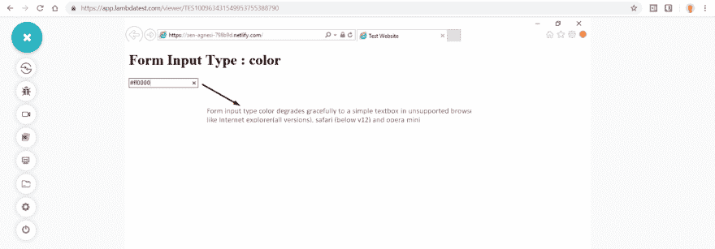](https://res.cloudinary.com/practicaldev/image/fetch/s--81f5fDu4--/c_limit%2Cf_auto%2Cfl_progressive%2Cq_auto%2Cw_880/https://www.lambdatest.com/blog/wp-content/uploads/2019/02/image9-1.png)

## 修复跨浏览器兼容性问题——Spectrum jquery 插件

由于 jQuery UI 没有提供 colorpicker 插件，我们可以使用 Spectrum，这是一个 jQuery 插件，不仅高度可定制，还可以用作简单的输入 type=color polyfill。
[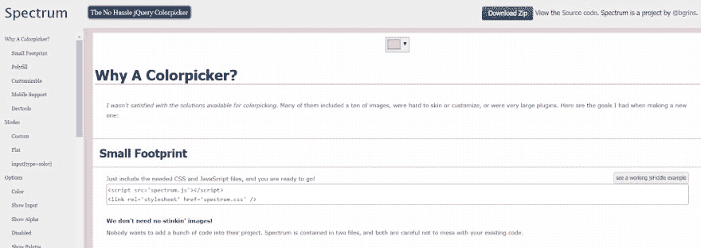T3】](https://res.cloudinary.com/practicaldev/image/fetch/s--9-C_Y3ya--/c_limit%2Cf_auto%2Cfl_progressive%2Cq_auto%2Cw_880/https://www.lambdatest.com/blog/wp-content/uploads/2019/02/image8-1.png)

访问 Spectrum Github 资源库，下载 spectrum.css 和 spectrum.js 文件。光谱颜色选择器可以进一步定制，如下面的代码所示。

```
<head>
     Form Input type Date | jQuery UI 
    <link rel="stylesheet" href="/spectrum.css">
    <script src="https://ajax.googleapis.com/ajax/libs/jquery/3.3.1/jquery.min.js"></script>
    <script src="/spectrum.js"></script>
</head>

<body>
    <h2>Basic Usage</h2>
    <input type='text' id="basic" />

    <script>
        $("#basic").spectrum({
            color: "#f00",
            change: function (color) {
                $("#basic-log").text("change called: " + color.toHexString());
            }
        });
    </script>

</body> 
```

Enter fullscreen mode Exit fullscreen mode

[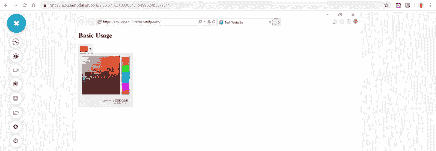](https://res.cloudinary.com/practicaldev/image/fetch/s--HRscAdHl--/c_limit%2Cf_auto%2Cfl_progressive%2Cq_auto%2Cw_880/https://www.lambdatest.com/blog/wp-content/uploads/2019/02/image11-1.png) 
表单输入类型的跨浏览器兼容性问题——通过使用光谱插件，针对 Internet explorer 11 修复了“颜色”问题

**完全定制**

```
<body>
<h2>Basic Usage</h2>
    <input type='text' id="basic" />
    <em id='basic-log'></em>

    <h2>Full Example</h2>
    <input type='text' id="full" />

    <script>
        $("#basic").spectrum({
            color: "#f00",
            change: function (color) {
                $("#basic-log").text("change called: " + color.toHexString());
            }
        });

        $("#full").spectrum({
            color: "#ECC",
            showInput: true,
            className: "full-spectrum",
            showInitial: true,
            showPalette: true,
            showSelectionPalette: true,
            maxSelectionSize: 10,
            preferredFormat: "hex",
            localStorageKey: "spectrum.demo",
            move: function (color) {

            },
            show: function () {

            },
            beforeShow: function () {

            },
            hide: function () {

            },
            change: function () {

            },
            palette: [
                ["rgb(0, 0, 0)", "rgb(67, 67, 67)", "rgb(102, 102, 102)",
                    "rgb(204, 204, 204)", "rgb(217, 217, 217)", "rgb(255, 255, 255)"
                ],
                ["rgb(152, 0, 0)", "rgb(255, 0, 0)", "rgb(255, 153, 0)", "rgb(255, 255, 0)",
                    "rgb(0, 255, 0)",
                    "rgb(0, 255, 255)", "rgb(74, 134, 232)", "rgb(0, 0, 255)", "rgb(153, 0, 255)",
                    "rgb(255, 0, 255)"
                ],
                ["rgb(230, 184, 175)", "rgb(244, 204, 204)", "rgb(252, 229, 205)", "rgb(255, 242, 204)",
                    "rgb(217, 234, 211)",
                    "rgb(208, 224, 227)", "rgb(201, 218, 248)", "rgb(207, 226, 243)", "rgb(217, 210, 233)",
                    "rgb(234, 209, 220)",
                    "rgb(221, 126, 107)", "rgb(234, 153, 153)", "rgb(249, 203, 156)", "rgb(255, 229, 153)",
                    "rgb(182, 215, 168)",
                    "rgb(162, 196, 201)", "rgb(164, 194, 244)", "rgb(159, 197, 232)", "rgb(180, 167, 214)",
                    "rgb(213, 166, 189)",
                    "rgb(204, 65, 37)", "rgb(224, 102, 102)", "rgb(246, 178, 107)", "rgb(255, 217, 102)",
                    "rgb(147, 196, 125)",
                    "rgb(118, 165, 175)", "rgb(109, 158, 235)", "rgb(111, 168, 220)", "rgb(142, 124, 195)",
                    "rgb(194, 123, 160)",
                    "rgb(166, 28, 0)", "rgb(204, 0, 0)", "rgb(230, 145, 56)", "rgb(241, 194, 50)",
                    "rgb(106, 168, 79)",
                    "rgb(69, 129, 142)", "rgb(60, 120, 216)", "rgb(61, 133, 198)", "rgb(103, 78, 167)",
                    "rgb(166, 77, 121)",
                    "rgb(91, 15, 0)", "rgb(102, 0, 0)", "rgb(120, 63, 4)", "rgb(127, 96, 0)",
                    "rgb(39, 78, 19)",
                    "rgb(12, 52, 61)", "rgb(28, 69, 135)", "rgb(7, 55, 99)", "rgb(32, 18, 77)",
                    "rgb(76, 17, 48)"
                ]
            ]
        });
    </script>

</body> 
```

Enter fullscreen mode Exit fullscreen mode

[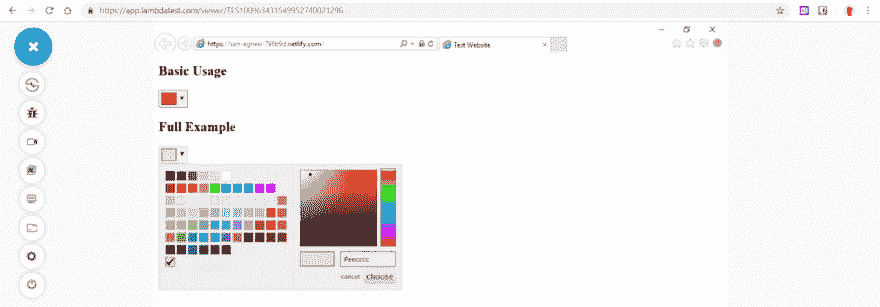](https://res.cloudinary.com/practicaldev/image/fetch/s--N9VfUAz1--/c_limit%2Cf_auto%2Cfl_progressive%2Cq_auto%2Cw_880/https://www.lambdatest.com/blog/wp-content/uploads/2019/02/image16-1.png)

## 3。表单输入类型的跨浏览器兼容性问题–范围

表单输入类型范围允许用户选择一个预定义范围内的数值——不小于指定的最小值，不大于指定的最大值(默认范围为 0 到 100)。大多数浏览器将表单输入类型范围呈现为滑块，而一些浏览器也可以将其呈现为拨号控件。仅当精确值不需要太精确时，才应使用范围输入类型

**语法**
`< input type="range" name="points" min="0" max="10" >`

通过使用最小值、最大值、值和步长等属性，可以进一步增强范围输入类型。

`< input type="range" name="points" min="0" max="100" value="50" step="10" >`

*   最大值:范围滑块中的最大值
*   最小值:范围滑块中的最小值
*   步进:滑块移动的步进间隔

[](https://res.cloudinary.com/practicaldev/image/fetch/s--NAY-9_s7--/c_limit%2Cf_auto%2Cfl_progressive%2Cq_auto%2Cw_880/https://www.lambdatest.com/blog/wp-content/uploads/2019/02/image10-1.png)

## 浏览器支持

[](https://res.cloudinary.com/practicaldev/image/fetch/s--hcDABIjz--/c_limit%2Cf_auto%2Cfl_progressive%2Cq_auto%2Cw_880/https://www.lambdatest.com/blog/wp-content/uploads/2019/02/image13-1.png)

与日期和颜色表单输入类型不同，range 具有更广泛的跨浏览器兼容性。Internet explorer 10-11 以及所有版本的 Mac 和 iOS 版 Safari 浏览器都支持范围输入类型。唯一值得注意的例外是 Internet Explorer 9。

[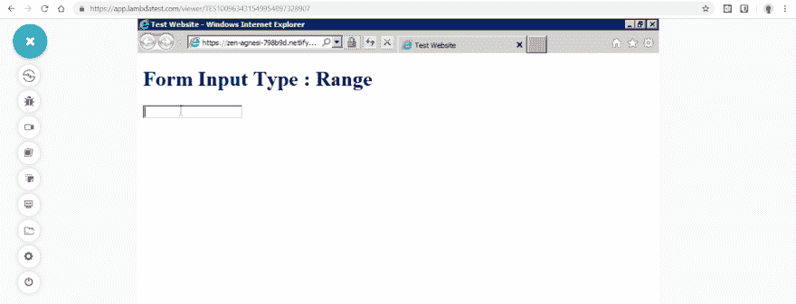](https://res.cloudinary.com/practicaldev/image/fetch/s--vbl3ZNoV--/c_limit%2Cf_auto%2Cfl_progressive%2Cq_auto%2Cw_880/https://www.lambdatest.com/blog/wp-content/uploads/2019/02/image18-2.png)

## 修复跨浏览器兼容性问题–range slider . js poly fill

为了给 IE9 添加表单输入类型范围功能，rangeslider.js 提供了最实用、最容易实现的解决方案，它是一个轻量级的 javascript/jquery polyfill，提供了一个完全可定制的范围滑块。

[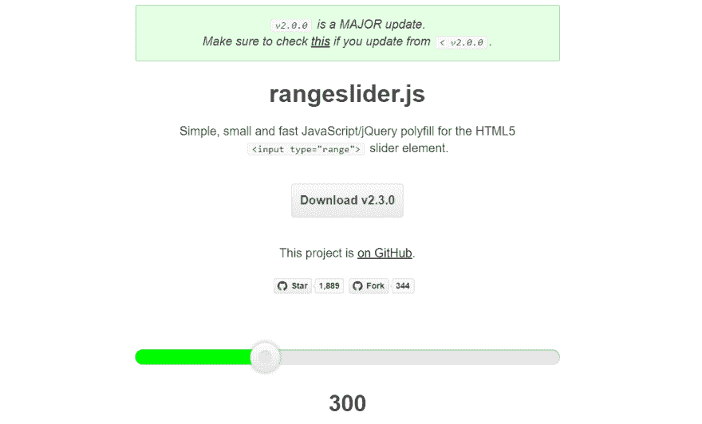](https://res.cloudinary.com/practicaldev/image/fetch/s--ZCnE_IU1--/c_limit%2Cf_auto%2Cfl_progressive%2Cq_auto%2Cw_880/https://www.lambdatest.com/blog/wp-content/uploads/2019/02/image15-1.png)

访问 rangeslider.js Github 存储库，下载 rangeslider.min.css 和 rangeslider.min.js 文件，或者简单地使用如下所示的 CDN 链接—

```
<head>
     Form Input Type Range | Rangeslier.js
    <link rel="stylesheet" href="https://cdnjs.cloudflare.com/ajax/libs/rangeslider.js/1.2.1/rangeslider.min.css">
</head>

<body>
    <h1>Form Input Type : Range</h1>
    <input id="range-control" type="range" min="0" max="100" step="1" value="0">
    <script src="https://ajax.googleapis.com/ajax/libs/jquery/3.3.1/jquery.min.js"></script>
    <script src="https://cdnjs.cloudflare.com/ajax/libs/rangeslider.js/1.2.1/rangeslider.min.js"></script>
    <script>
        $("#range-control").rangeslider({
            polyfill: false,
            onSlideEnd: function (position, value) {
                console.log('Position', position, 'Value', value);
            }
        });
    </script>
</body> 
```

Enter fullscreen mode Exit fullscreen mode

[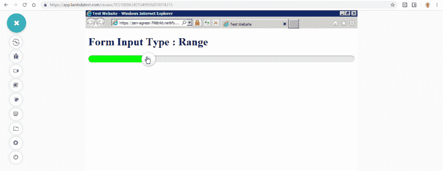](https://res.cloudinary.com/practicaldev/image/fetch/s--8M46jYN6--/c_limit%2Cf_auto%2Cfl_progressive%2Cq_auto%2Cw_880/https://www.lambdatest.com/blog/wp-content/uploads/2019/02/image19-1.png)

## 4。表单输入类型的跨浏览器兼容性问题–数字

表单输入类型数字允许用户在文本字段中只输入一个数值，或者使用微调框按钮控件(上下箭头)。Opera 是第一个实现数字输入类型的浏览器。虽然大多数浏览器都提供 spinbox 控件，但 IE10+和 Edge 没有。但是，如果字段输入了非数字值，当字段焦点丢失时，它将不会被保留。

**语法**
`<input type="number" name="quantity" min="1" max="10">`

数字输入类型可以通过使用像 min、max、placeholder、step 和 readonly 这样的属性来进一步增强。

`<input type="number" name="points" min="0" max="10" placeholder="5 step="1">`

*   max:可接受的最大数值
*   min:可接受的最小数值
*   占位符:显示字段中的默认数值
*   步进:步进控制(上/下箭头),增加或减少数值

[](https://res.cloudinary.com/practicaldev/image/fetch/s--POYvzF5W--/c_limit%2Cf_auto%2Cfl_progressive%2Cq_auto%2Cw_880/https://www.lambdatest.com/blog/wp-content/uploads/2019/02/image14-2.png)

## 浏览器支持

[](https://res.cloudinary.com/practicaldev/image/fetch/s--TRMOSAao--/c_limit%2Cf_auto%2Cfl_progressive%2Cq_auto%2Cw_880/https://www.lambdatest.com/blog/wp-content/uploads/2019/02/image17-1.png)

就像输入类型范围一样，数字以及其他输入类型如电子邮件、电话、url 都是 IE 10-11 和 safari 支持的跨浏览器兼容功能。IE9 是唯一的主要例外。

[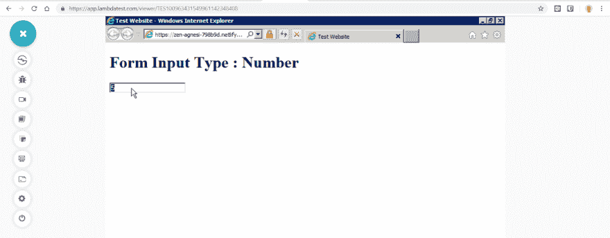](https://res.cloudinary.com/practicaldev/image/fetch/s--ghGmSMG2--/c_limit%2Cf_auto%2Cfl_progressive%2Cq_auto%2Cw_880/https://www.lambdatest.com/blog/wp-content/uploads/2019/02/image20-1.png)

## 修复跨浏览器兼容性问题——号码多填

为了给 IE9 添加表单输入类型数字功能，我们可以使用 jonstipe 的 number polyfill，html5please 也建议这样做。唯一的要求是在 head 部分添加 number-polyfill.js 文件。CSS 文件可以用来样式字段以及增量减量箭头。如果脚本检测到浏览器不支持数字输入类型，它会将其配置为仅数字输入字段，并添加递增/递减箭头按钮。

```
<head>
     Form Input Type Number | Number Polyfill 
    <link rel="stylesheet" href="/inputnumber.css">
</head>

<body>
    <h1>Form Input Type : Number</h1>
    <input type="number" class="modify-me" />
    <script src="https://ajax.googleapis.com/ajax/libs/jquery/3.3.1/jquery.min.js"></script>
    <script src="jquery.inputnumber.min.js"></script>
    <script>
        $().ready(function () {
            $('.modify-me').inputNumber();
        });
    </script>
</body> 
```

Enter fullscreen mode Exit fullscreen mode

[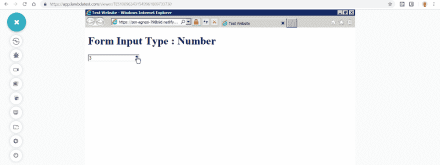](https://res.cloudinary.com/practicaldev/image/fetch/s--HAzYszPC--/c_limit%2Cf_auto%2Cfl_progressive%2Cq_auto%2Cw_880/https://www.lambdatest.com/blog/wp-content/uploads/2019/02/image21-1.png)

## 结论

自从 HTML5 表单功能(也称为 Web forms 2.0)的概念被提出以来，已经过去了将近十年。大多数新的表单输入类型都是跨浏览器兼容的，所有主流现代浏览器都支持，唯一值得注意的例外是 Safari 和 Opera Mini。在不久的将来，我们很有可能会看到跨浏览器的表单元素和输入类型的视觉界面的一致性，也很有可能所有剩余的不一致性，特别是 Safari 和 Opera 浏览器将被永久解决。开发人员唯一的障碍是 IE11/IE9，它以其四面楚歌的支持而臭名昭著。但是有了正确的 javascript/jquery 插件、库和 polyfills，web 开发人员现在有了一种可靠的方法来解决表单输入类型的跨浏览器兼容性问题。

[](https://goo.gl/nmc4Bb)

原文出处:[lambdatest.com](https://goo.gl/SpwUY1)

**相关文章**

1.  [用 LambdaTest 实验验证 HTML 日期属性的跨浏览器兼容性](https://goo.gl/VMsWE5)
2.  [JavaScript 跨浏览器兼容问题及解决方法](https://goo.gl/Qs1wWj)
3.  [修复 Javascript 跨浏览器兼容性问题](https://goo.gl/2jst3u)
4.  [如何做一个跨浏览器兼容的网站？](https://goo.gl/ojf2M8)
5.  [避免跨浏览器兼容性问题的 9 种方法](https://goo.gl/QSU9SA)