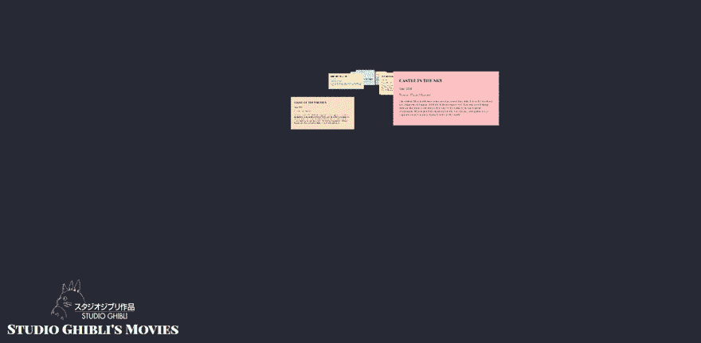
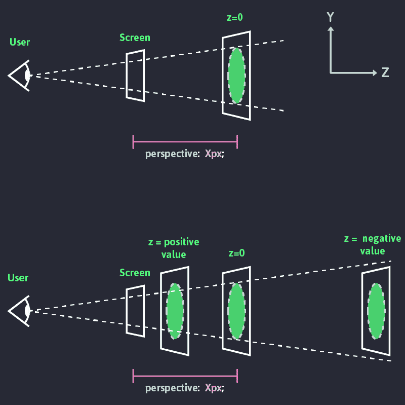
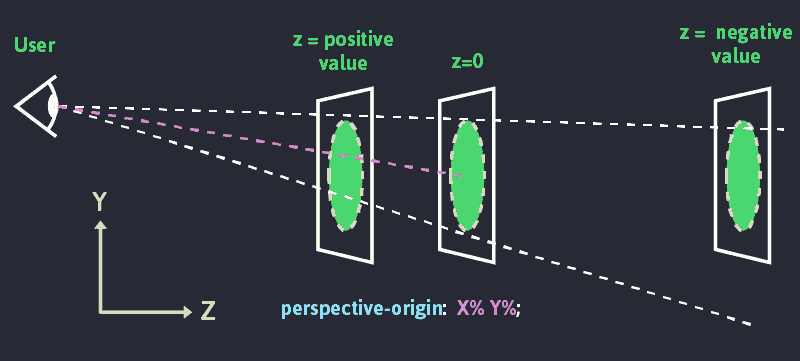

# CSS 3D-z 轴滚动

> 原文：<https://dev.to/vinceumo/css-3d---scrolling-on-the-z-axis-45i9>

[](https://res.cloudinary.com/practicaldev/image/fetch/s--XZqq4nSA--/c_limit%2Cf_auto%2Cfl_progressive%2Cq_66%2Cw_880/https://vinceumo.github.io/devNotes/dist/img/css3d-z-scroll-demo.gif)

在本文中，我们将创建一个小的 3D 场景，用户可以在 z 轴上滚动。你可以在 [github](https://github.com/vinceumo/CSS-3D-Scrolling-z-axis-demo/) 上找到这个教程的最终代码，如果你点击这个[链接](https://vinceumo.github.io/CSS-3D-Scrolling-z-axis-demo/)就可以看到演示。

本文假设您已经掌握了一些关于 CSS 和 JS 的知识。我们将使用 CSS 自定义属性，如果您不熟悉，您可以阅读 [CSS 自定义属性- Cheatsheet](https://vinceumo.github.io/devNotes/css/2019/02/20/css-customs-properties.html) 。

## CSS 3D 简介

当谈到 CSS 3D 时，我们实际上是在谈论 CSS3 transform 3D。这个方法允许我们使用`transform` CSS 属性来设置 DOM 元素在 z 轴上的透视或旋转。

> “转换 CSS”属性允许您旋转、缩放、倾斜或平移元素。它修改 CSS 可视化格式模型的坐标空间。
> 
> [变换- MDN](https://developer.mozilla.org/en-US/docs/Web/CSS/transform)

为了能够在 3D 空间中呈现我们的 Dom 元素，我们需要查看以下属性:

*   远景
*   透视原点
*   改变

### 透视

`perspective`是一个 CSS 属性，设置 z=0 和用户之间的距离。透视值越小，我们看到的失真就越大。(在下面的 codePen 示例中尝试更改`scenePerspective`的值)。

```
.container-scene {
  perspective: 100px;
} 
```

Enter fullscreen mode Exit fullscreen mode

`perspective`的值是一个[长度单位](https://developer.mozilla.org/en-US/docs/Web/CSS/length)。

[](https://res.cloudinary.com/practicaldev/image/fetch/s--vbM1r7LD--/c_limit%2Cf_auto%2Cfl_progressive%2Cq_auto%2Cw_880/https://vinceumo.github.io/devNotes/dist/img/css3d-z-scroll-perspective1.png)

在下面的例子中，尝试将`scenePerspective`的值设置为 0 和 70。您可以注意到，如果我们的立方体的值设置为 0，那么它根本没有透视效果。如果该值设置为 70，您可以看到立方体透视非常强烈的扭曲。透视值越小，越深。

[https://codepen.io/vinceumo/embed/jdJLge/?height=600&default-tab=result&embed-version=2](https://codepen.io/vinceumo/embed/jdJLge/?height=600&default-tab=result&embed-version=2)

为了能够呈现 3D 空间，我们需要在子元素上指定`transform-style: preserve-3d;`。在上面的例子中，它设置为我们的`.cube`。默认情况下，元素被展平。

```
.container-scene {
  perspective: 400px;
}

.container-scene .cube {
  transform-style: preserve-3d;
} 
```

Enter fullscreen mode Exit fullscreen mode

### 透视原点

> CSS 属性决定了查看者正在查看的位置。它被透视属性用作消失点。
> 
> [MDN](https://developer.mozilla.org/en-US/docs/Web/CSS/perspective-origin)

这个属性基本上允许我们移动 3D 场景的消失点。

```
.container-scene {
  perspective: 400px;
  perspective-origin: 50% 100%; /*X position value, Y position value*/
}

.container-scene .cube {
  transform-style: preserve-3d;
} 
```

Enter fullscreen mode Exit fullscreen mode

对于 x 和 y，我们可以使用百分比来设置位置。但是我们也可以使用以下值:

*   x 位置:
    *   `left` = 0%
    *   `center` = 50%
    *   `right` = 100%
*   y 位置
    *   `top` = 0%
    *   `center` = 50%
    *   `bottom` = 50%

[](https://res.cloudinary.com/practicaldev/image/fetch/s--D4HxMM4t--/c_limit%2Cf_auto%2Cfl_progressive%2Cq_auto%2Cw_880/https://vinceumo.github.io/devNotes/dist/img/css3d-z-scroll-perspective-origin.png)

在下面的例子中，您可以更改`perspectiveOriginX`和`perspectiveOriginY`的值。

[https://codepen.io/vinceumo/embed/wOwzBY/?height=600&default-tab=result&embed-version=2](https://codepen.io/vinceumo/embed/wOwzBY/?height=600&default-tab=result&embed-version=2)

### 变换 Z

我们之前已经提到过,`transform` CSS 属性允许我们在 3D 空间中设置元素。

Transform 提供了不同的功能来转换我们的 3D 元素:

*   rotateX(angle) - [MDN](https://developer.mozilla.org/en-US/docs/Web/CSS/transform-function/rotateX)
*   rotateY(角度)- [MDN](https://developer.mozilla.org/en-US/docs/Web/CSS/transform-function/rotateY)
*   旋转(角度)-(t0)MDN
*   translateZ(tz) - [MDN](https://developer.mozilla.org/en-US/docs/Web/CSS/transform-function/translateZ)
*   scaleZ(sz) - [MDN](https://developer.mozilla.org/en-US/docs/Web/CSS/transform-function/scaleZ)

正如我们在`perspective`部分的插图中看到的。`translateZ()`允许我们沿 3D 空间的 z 轴定位元素。或者我们可以使用`translate3D(x, y, z)` CSS 函数。

在下面的例子中，您可以通过改变`cubeTranslateZ`和`cubeFacesTranslateZ`的值来调整`.cube`和`.face-`的 Z 轴位置。

[https://codepen.io/vinceumo/embed/VRZKEB/?height=600&default-tab=result&embed-version=2](https://codepen.io/vinceumo/embed/VRZKEB/?height=600&default-tab=result&embed-version=2)

## 在 z 轴上滚动

现在我们已经很好地理解了 CSS 3D 是如何工作的，我们将创建一个 3D 场景，我们将能够在 z 轴上滚动。

### 设置场景

我们将创建一个页面，列出吉卜力工作室的所有电影。每部电影都将是一张位于场景 z 轴上的卡片。请随意选择或[下载](https://codepen.io/vinceumo/share/zip/JzaXqN)下面的代码作为入门材料。我使用 [axios](https://github.com/axios/axios) 和[工作室吉卜力 API](https://ghibliapi.herokuapp.com/) 来填充这个页面。

[https://codepen.io/vinceumo/embed/JzaXqN/?height=600&default-tab=result&embed-version=2](https://codepen.io/vinceumo/embed/JzaXqN/?height=600&default-tab=result&embed-version=2)

如果你想跟随你自己的内容，我们将需要以下标记:

```
<div class="viewport">
  <div class="scene3D-container">
    <div class="scene3D">
      <div>Card1</div>
      <div>Card2</div>
      <!--Etc.-->
    </div>
  </div>
</div> 
```

Enter fullscreen mode Exit fullscreen mode

#### 造型

首先，我们将设置我们的 [CSS 自定义属性](https://vinceumo.github.io/devNotes/css/2019/02/20/css-customs-properties.html) (CSS 变量)。这些变量中的一些将使用 JS 进行转换。他们将帮助我们与场景互动。

```
:root {
  --scenePerspective: 1;
  --scenePerspectiveOriginX: 50;
  --scenePerspectiveOriginY: 30;
  --itemZ: 2; // Gap between each cards
  --cameraSpeed: 150; // Where 1 is the fastest, this var is a multiplying factor of --scenePerspective and --filmZ
  --cameraZ: 0; // Initial camera position
  --viewportHeight: 0; // Viewport height will allow us to set the depth of our scene
} 
```

Enter fullscreen mode Exit fullscreen mode

`.viewport`将允许我们设置窗口的高度。我们稍后将使用它来设置场景的深度，并使用滚动条在 z 轴上导航。

```
.viewport {
  height: calc(var(--viewportHeight) * 1px);
} 
```

Enter fullscreen mode Exit fullscreen mode

`.scene3D-container`设置场景透视和透视原点。它的位置是固定的，所以它总是停留在屏幕上。我们也要设置透视原点。

```
.viewport .scene3D-container {
  position: fixed;
  top: 0;
  left: 0;
  width: 100%;
  height: 100%;
  perspective: calc(var(--scenePerspective) * var(--cameraSpeed) * 1px);
  perspective-origin: calc(var(--scenePerspectiveOriginX) * 1%) calc(
      var(--scenePerspectiveOriginY) * 1%
    );
  will-change: perspective-origin;
  transform: translate3d(
    0,
    0,
    0
  ); //Allows Hardware-Accelerated CSS, so transitions are smoother
} 
```

Enter fullscreen mode Exit fullscreen mode

设置场景在 z 轴上的位置，这有点像在 z 轴上移动摄像机。但实际上我们是在移动场景，而摄像机(视口)是固定的。在本文的其余部分，我们将使用相机比较。`.scene3D`获取视窗的全高和全宽。

```
.viewport .scene3D-container .scene3D {
  position: absolute;
  top: 0;
  height: 100vh;
  width: 100%;
  transform-style: preserve-3d;
  transform: translateZ(calc(var(--cameraZ) * 1px));
  will-change: transform;
} 
```

Enter fullscreen mode Exit fullscreen mode

最后但同样重要的是，我们要在场景中放置我们的卡片。所有项目都是绝对位置。奇数项放在左边，偶数项放在右边。

我们使用 SCSS 程序翻译每一项。在 **X** 和 **Y** 轴上，我们随机将它们在 X 轴上平移-25%到 25%,在 Y 轴上平移-50%到 50%。我们使用一个`@for`循环，这样每个项目都可以在 **z** 轴上平移，并乘以它们的索引。

```
.viewport .scene3D-container .scene3D {
  > div {
    position: absolute;
    display: block;
    width: 100%;
    top: 40%;

    @media only screen and (min-width: 600px) {
      width: 45%;
    }

    &:nth-child(2n) {
      left: 0;
    }

    &:nth-child(2n + 1) {
      right: 0;
    }

    @for $i from 0 through 25 {
      &:nth-child(#{$i}) {
        transform: translate3D(
          random(50) - 25 * 1%,
          random(100) - 50 * 1%,
          calc(var(--itemZ) * var(--cameraSpeed) * #{$i} * -1px)
        );
      }
    }
  }
} 
```

Enter fullscreen mode Exit fullscreen mode

CSS 现在完成了，我们有了一个 3D 场景。在本文接下来的部分，我们将编写一些 javascript 来允许我们在场景中导航。

[https://codepen.io/vinceumo/embed/WmgxBG/?height=600&default-tab=result&embed-version=2](https://codepen.io/vinceumo/embed/WmgxBG/?height=600&default-tab=result&embed-version=2)

#### 在 z 轴上滚动(移动摄像机)

为了能够滚动，我们首先需要设置`--viewportHeight`的值，它模拟场景的深度。

场景的深度等于下列各项的相加:

*   用户窗口的高度
    *   window.innerHeight
*   `.scene3D-container`视角
    *   `var(--scenePerspective) * var(--cameraSpeed)`
*   我们最后一个项目的平移 z 值
    *   `var(--itemZ) * var(--cameraSpeed) * items.length`

让我们创建一个`setSceneHeight()`函数，它将在加载时更新`--viewportHeight`的值。

```
document.addEventListener("DOMContentLoaded", function() {
  setSceneHeight();
});

function setSceneHeight() {
  const numberOfItems = films.length; // Or number of items you have in `.scene3D`
  const itemZ = parseFloat(
    getComputedStyle(document.documentElement).getPropertyValue("--itemZ")
  );
  const scenePerspective = parseFloat(
    getComputedStyle(document.documentElement).getPropertyValue(
      "--scenePerspective"
    )
  );
  const cameraSpeed = parseFloat(
    getComputedStyle(document.documentElement).getPropertyValue("--cameraSpeed")
  );

  const height =
    window.innerHeight +
    scenePerspective * cameraSpeed +
    itemZ * cameraSpeed * numberOfItems;

  // Update --viewportHeight value
  document.documentElement.style.setProperty("--viewportHeight", height);
} 
```

Enter fullscreen mode Exit fullscreen mode

我们的页面现在有了滚动条，但我们仍然无法滚动。我们需要添加一个事件监听器来监听用户滚动。滚动事件将调用一个`moveCamera()`函数。它会用[window . page yo offset](https://developer.mozilla.org/en-US/docs/Web/API/Window/pageYOffset)的值更新`--cameraZ`的值。

```
document.addEventListener("DOMContentLoaded", function() {
  window.addEventListener("scroll", moveCamera);
  setSceneHeight();
});

function moveCamera() {
  document.documentElement.style.setProperty("--cameraZ", window.pageYOffset);
}

function setSceneHeight() {
  // ...
} 
```

Enter fullscreen mode Exit fullscreen mode

[https://codepen.io/vinceumo/embed/pYxpLW/?height=600&default-tab=result&embed-version=2](https://codepen.io/vinceumo/embed/pYxpLW/?height=600&default-tab=result&embed-version=2)

#### 移动摄像机角度

最后，让我们的场景更有活力一点。在[鼠标移动事件](https://developer.mozilla.org/en-US/docs/Web/API/Element/mousemove_event)中，我们将改变`scenePerspectiveOriginX`和`scenePerspectiveOriginY`的值。这会给人一种摄像机在移动的错觉。这些项目将直接留在场景中。如果你想给一个更真实的相机旋转运动，你可以在场景中应用 [rotate3d()](https://developer.mozilla.org/en-US/docs/Web/CSS/transform-function/rotate3d) 。

首先，我们将在一个`perspectiveOrigin`对象中存储这两个变量的初始值，我们将设置一个`perspectiveOrigin.maxGap`值，它将限制变量的最大值和最小值。例如，如果`scenePerspectiveOriginY`等于 50%。在 mousemove 上，新值将介于 40%和 60%之间。

```
const perspectiveOrigin = {
  x: parseFloat(
    getComputedStyle(document.documentElement).getPropertyValue(
      "--scenePerspectiveOriginX"
    )
  ),
  y: parseFloat(
    getComputedStyle(document.documentElement).getPropertyValue(
      "--scenePerspectiveOriginY"
    )
  ),
  maxGap: 10
}; 
```

Enter fullscreen mode Exit fullscreen mode

如果用户光标位于屏幕中央，我们将把`--scenePerspectiveOriginX`和`--scenePerspectiveOriginX`的值设置为初始值。光标离中心越远，这些值增加/减少的幅度越大。如果用户移动到左上角，值将增加，在右下角，值将减少。

`moveCameraAngle()`函数将更新这些值:

*   `xGap`和`yGap`返回用户在 X 和 Y 轴上相对于窗口中心的鼠标位置百分比。
*   `newPerspectiveOriginX`和`newPerspectiveOriginY`返回新的透视原点。

```
document.addEventListener("DOMContentLoaded", function() {
  window.addEventListener("scroll", moveCamera);
  window.addEventListener("mousemove", moveCameraAngle);
  setSceneHeight();
});

function moveCameraAngle(event) {
  const xGap =
    (((event.clientX - window.innerWidth / 2) * 100) /
      (window.innerWidth / 2)) *
    -1;
  const yGap =
    (((event.clientY - window.innerHeight / 2) * 100) /
      (window.innerHeight / 2)) *
    -1;
  const newPerspectiveOriginX =
    perspectiveOrigin.x + (xGap * perspectiveOrigin.maxGap) / 100;
  const newPerspectiveOriginY =
    perspectiveOrigin.y + (yGap * perspectiveOrigin.maxGap) / 100;

  document.documentElement.style.setProperty(
    "--scenePerspectiveOriginX",
    newPerspectiveOriginX
  );
  document.documentElement.style.setProperty(
    "--scenePerspectiveOriginY",
    newPerspectiveOriginY
  );
} 
```

Enter fullscreen mode Exit fullscreen mode

[https://codepen.io/vinceumo/embed/NJEwwo/?height=600&default-tab=result&embed-version=2](https://codepen.io/vinceumo/embed/NJEwwo/?height=600&default-tab=result&embed-version=2)

我们的场景现在结束了🎉。我希望你喜欢这篇文章😃

## 资源

*   [透视投影](https://tympanus.net/codrops/css_reference/perspective/)
*   [透视- MDN](https://developer.mozilla.org/en-US/docs/Web/CSS/perspective)
*   [变换样式代码](https://tympanus.net/codrops/css_reference/transform-style/)
*   [变换样式 MDN](https://developer.mozilla.org/en-US/docs/Web/CSS/transform-style)
*   [透视-原点- MDN](https://developer.mozilla.org/en-US/docs/Web/CSS/perspective-origin)
*   [使用 CSS 3D - CSS-tricks 时需要注意的事项](https://css-tricks.com/things-watch-working-css-3d/)

* * *

*   [在 twitter 上关注我](https://twitter.com/vince_umo)
*   [在 Github 上关注我](https://github.com/vinceumo)
*   [跟我一起去](https://dev.to/vinceumo)