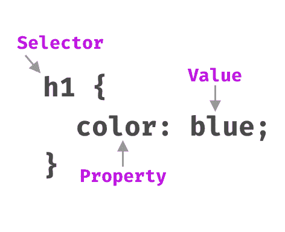
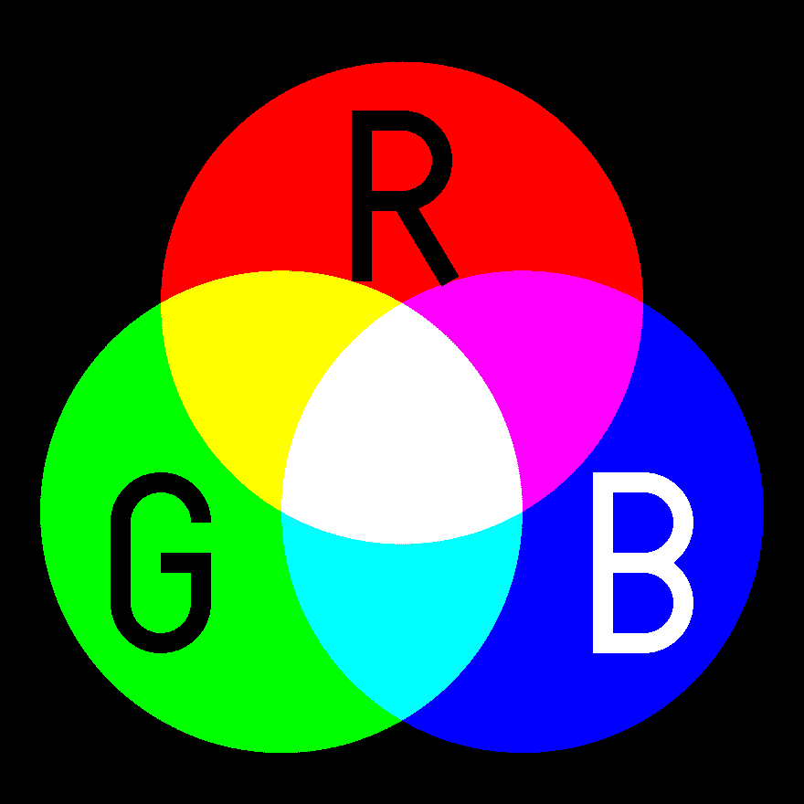
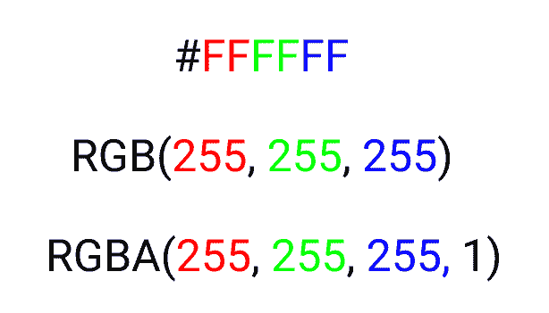
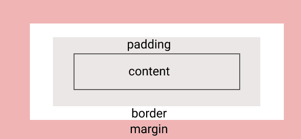

# CSS:从零到英雄

> 原文：<https://dev.to/aspittel/css-from-zero-to-hero-3o16>

CSS 定义了你的网站的外观。HTML 是你的内容，JavaScript 增加了交互，但外观归结为 CSS。CSS 是超级强大的，并且内置了大量令人敬畏的东西。这篇文章将带你从介绍语法到创建布局和使网站响应！

## 语法

CSS 由**选择器**和**声明**组成。选择器是我们告诉 CSS 对哪些元素应用样式的方式。声明是将应用于该元素的实际样式，也就是说，它们是大括号内的所有内容。在这些声明中，我们有**属性**和**值**。属性是我们应用的样式类型，值是我们实际应用的内容。

[](https://res.cloudinary.com/practicaldev/image/fetch/s--OKgDRq8---/c_limit%2Cf_auto%2Cfl_progressive%2Cq_auto%2Cw_880/https://thepracticaldev.s3.amazonaws.com/i/plbffq89hy8s5pm1el2s.png)

上面的 CSS 是说，把 h1 的字体颜色设为蓝色。`h1`是选择器，声明是大括号之间的一切，属性是 color，值是 blue。

CSS 语法的最后一部分是注释——这些被浏览器忽略了——它们只是为了让人们记录他们的代码。在 CSS 中，这些看起来如下:

```
/* this is a comment */ 
```

## 选择器

在 CSS 中，我们将使用**选择器**来指定我们想要样式化的 HTML 元素。有时，这将是页面上的每个元素。其他时候，我们只想选择某些元素。

有时，我们会想要选择页面上元素的每个实例，例如，所有的`h2`。我们可以用它们的名称来选择元素！

```
h2 {
  color: blue;
  font-family: sans-serif;
} 
```

有时候，我们会选择元素组——比如说我们只想加粗某些段落，我们可以使用**类**来区分这些段落。

```
<h2 class="center">Hello World</h2>
<h2 class="center">Hello World</h2>
<h2>Hello World</h2> 
```

我们通过在 CSS 中的类名前加一个`.`来区分元素和类选择器——这样 CSS 就知道我们在寻找一个名为`center`的类，而不是元素！

```
.center {
  text-align: center;
} 
```

现在，带有`center`类的前两个`h2`标签将居中，第三个没有该类的标签看起来仍然正常。

还有一些比较复杂的选择器，比如:

```
h1, h2, h3 {
  /* The commas allow you to group selectors! In this case, all h1-h3's will be blue */
  color: blue;
}

h3:hover {
  /* pseudo-classes allow us to select elements in certain states. So, in this case, when an h3 is hovered, it will be pink! */
  color: pink;
} 
```

这里有更多关于[伪类](https://developer.mozilla.org/en-US/docs/Learn/CSS/Introduction_to_CSS/Pseudo-classes_and_pseudo-elements)的内容，这里有一个[很棒的游戏](https://flukeout.github.io/)可以用更复杂的选择器来练习。

[https://codepen.io/aspittel/embed/WPxBgr?height=600&default-tab=result&embed-version=2](https://codepen.io/aspittel/embed/WPxBgr?height=600&default-tab=result&embed-version=2)

您可能已经将 IDs 用于 JavaScript 代码或其他 web 开发；但是，我不建议在 CSS 中使用它们，因为它们只出现在一个元素中，而且你希望你的代码是可重用的！

## **属性**

让我们来谈谈 CSS 中的基本属性以及如何使用它们！我们将进入布局，这往往是一个小技巧，在这篇文章的后面，但现在，我们将检查颜色和文本样式！

### **颜色**

有几种方法可以使用 CSS 给文档添加颜色，包括文本和背景。此外，在 CSS 中有几种表示颜色的方法。

首先是使用命名的颜色。CSS 中有 [140 种带有名称](https://www.w3schools.com/colors/colors_names.asp)的颜色，你只需输入一个名称就可以使用它们！

```
.red {
  background-color: tomato;
} 
```

但是——有 140 多种颜色，所以我们也有一些更复杂的方法来表现更多的颜色。这些是基于组成一种颜色的红色、绿色和蓝色的数量。想象你有三盏灯，每种颜色一盏灯，还有一个背景。如果三盏灯都熄灭了，那么背景将是黑色的。如果三个都向上翻，背景将是白色的。而且，如果其中一个灯一直开着，而其他的灯没有开，背景就是那个颜色。然后，灯光可以组合起来创造任何颜色。

[](https://res.cloudinary.com/practicaldev/image/fetch/s--xbN0MteI--/c_limit%2Cf_auto%2Cfl_progressive%2Cq_auto%2Cw_880/https://upload.wikimedia.org/wikipedia/commons/thumb/c/c2/AdditiveColor.svg/2000px-AdditiveColor.svg.png)

RGB、RGBA 和十六进制颜色都是从上述颜色组合中派生出来的。红、绿、蓝“灯”的每种颜色可以被赋予一个从 0 到 255 的值，因此每个值可以存储在一个字节中。在 RGB 和 RGBA 中，使用十进制数来表示值，在十六进制值中，使用十六进制系统。RGBA 值也有“阿尔法”值，即颜色的不透明度。

[](https://res.cloudinary.com/practicaldev/image/fetch/s--0KFrqCWP--/c_limit%2Cf_auto%2Cfl_progressive%2Cq_auto%2Cw_880/https://thepracticaldev.s3.amazonaws.com/i/kdzonyv0apyl7t83ami9.png)

你可以用上面的系统给文本、背景、边框等等上色！

[https://codepen.io/aspittel/embed/ZwOdbv?height=600&default-tab=result&embed-version=2](https://codepen.io/aspittel/embed/ZwOdbv?height=600&default-tab=result&embed-version=2)

### **正文**

另一个真正重要的 CSS 特性是样式化文本。您可以选择字体、文本间距和大小。

大多数电脑都内置了一些字体，它们被称为网页安全字体。您也可以通过包含字体文件来添加漂亮的字体。你可以使用像[谷歌字体](https://fonts.google.com/)这样的网站来找到你喜欢的字体。

```
body {
  /* if the user's computer has Arial, use that, if not Helvetica, 
  then fall back to the operating system's default sans-serif font */
    font-family: Arial, Helvetica, sans-serif;
} 
```

你也可以用几种不同的方式改变文本的大小——首先是像素——这通常是最容易上手的，然后还有 ems 和 rems，它们允许你以不同的方式缩放字体。你可以在这里阅读更多关于那些[。](https://css-tricks.com/rems-ems/)

[https://codepen.io/aspittel/embed/exzwEK?height=600&default-tab=result&embed-version=2](https://codepen.io/aspittel/embed/exzwEK?height=600&default-tab=result&embed-version=2)

### 盒子模型

CSS 使用盒子模型操作。首先，你有你的内容。如果要在背景中的内容周围或其周围的边框周围添加间距，可以使用填充。然后，您可以添加一个边框，它通常会有不同的颜色和图案。最后，在背景和边框之外是边距——这是我们的元素和页面上其他元素之间的间距。

[](https://res.cloudinary.com/practicaldev/image/fetch/s--Kj9ckbUg--/c_limit%2Cf_auto%2Cfl_progressive%2Cq_auto%2Cw_880/https://thepracticaldev.s3.amazonaws.com/i/czlxrh1thf7s565hly1c.png)

[https://codepen.io/aspittel/embed/zeBVWy?height=600&default-tab=result&embed-version=2](https://codepen.io/aspittel/embed/zeBVWy?height=600&default-tab=result&embed-version=2)

一个快速有用的空白片段是`margin: 0 auto;,`，它允许你将大多数元素水平居中。0 值意味着元素的顶部和底部没有边距。Auto 向元素两侧添加相等的边距，使元素在其容器中居中。

[https://codepen.io/aspittel/embed/XOKLoO?height=600&default-tab=result&embed-version=2](https://codepen.io/aspittel/embed/XOKLoO?height=600&default-tab=result&embed-version=2)

### 显示

一个更重要的 CSS 属性是`display`。这里有几个值可以使用。第一个是隐藏内容的`none`。这有助于隐藏不同尺寸屏幕上的某些内容或 JavaScript 事件。`inline`删除元素后的换行符，这也意味着增加高度和宽度不会有任何效果。`block`表示下一个元素将在下一行。`inline-block`类似于 inline，尽管您可以对元素应用高度和宽度。固定和粘滞显示使元素停留在通常最常用和最传统的位置上，然而，最近的两个改变了布局游戏。

[https://codepen.io/aspittel/embed/omLrKj?height=600&default-tab=result&embed-version=2](https://codepen.io/aspittel/embed/omLrKj?height=600&default-tab=result&embed-version=2)

### Layouts

通常 CSS 的一个棘手的部分是为你的网页创建布局。由于 CSS Grid 和 Flexbox 这两个较新的 CSS 显示属性，使事情正确对齐比现在困难得多。如果你想更深入地学习它们，CSS Tricks 为 [Grid](https://css-tricks.com/snippets/css/complete-guide-grid/) 和 [Flexbox](https://css-tricks.com/snippets/css/a-guide-to-flexbox/) 提供了很好的指南。我也要在这里复习几个技巧！

为了水平居中一个元素，通常可以使用`text-align: center;`或`margin: 0 auto;`。但是——垂直居中曾经更加困难。好消息！Flexbox 让这变得简单多了。下面的代码片段放在您试图居中的元素的父元素上，将使它水平和垂直居中。

```
parent {
  display: flex;
  align-items: center;
  justify-content: center;
} 
```

[https://codepen.io/aspittel/embed/GzqVJm?height=600&default-tab=result&embed-version=2](https://codepen.io/aspittel/embed/GzqVJm?height=600&default-tab=result&embed-version=2)

额外收获:[这里有](https://egghead.io/lessons/flexbox-center-an-element-horizontally-and-vertically-using-flexbox)这个例子的视频版本！

你可以用 CSS grid 很好地创建元素行。

```
.cards {
  display: grid;
  grid-template-columns: repeat(3, 1fr);
  grid-gap: 10px;
} 
```

[https://codepen.io/aspittel/embed/omLKbx?height=600&default-tab=result&embed-version=2](https://codepen.io/aspittel/embed/omLKbx?height=600&default-tab=result&embed-version=2)

上面的代码在页面上生成三个大小相等的列。网格间隙增加了每列之间的间距。

额外收获:[这里有](https://egghead.io/lessons/css-create-a-card-layout-with-css-grid)这个例子的视频版本！

此外，它们使“圣杯”的三栏加页眉和页脚布局变得更加容易——查看[这篇](https://css-tricks.com/css-grid-one-layout-multiple-ways/)帖子，了解如何用 CSS Grid 实现它的几种方法！

## 默认值

有时候，你的页面上可能会出现一些看起来莫名其妙的样式。浏览器实际上已经为您预先编写了一些样式。例如，正文有 8px 的边距，表格块有 2px 的边框，标题有更大的字体。有时你不想要这些预加载的样式，所以你可以覆盖它们！

## **级联**

层叠是 CSS 中最臭名昭著也是最有争议的特性之一。这模仿了面向对象编程中的继承，并定义了样式如何相互覆盖。如果开发人员使用 CSS 库，如 Bootstrap，这可能更难导航。

CSS 选择器有不同层次的特性，这些特性定义了当更多的样式被应用时如何覆盖样式。

例如，如果我们有下面的 CSS 代码:

```
body {
  font-family: sans-serif;
} 
```

body 标签中的所有文本都将是无衬线的——即使它们也在 h1 或 p 或任何其他标签中。但是，有时我们希望 h1 的是衬线，我们可以这样添加:

```
h1 {
  font-family: serif;
} 
```

现在我们的 h1 有了衬线字体，主体中的所有其他标签仍然是无衬线的。

[https://codepen.io/aspittel/embed/XOKLGG?height=600&default-tab=result&embed-version=2](https://codepen.io/aspittel/embed/XOKLGG?height=600&default-tab=result&embed-version=2)

此外，不同的选择器具有不同的特异性水平。ID 是最具体的，虽然我一般不在 CSS 中使用它们，因为使用它们不是很模块化，然后是类，然后是元素本身，然后是它们的父元素。因此，如果我向一个类添加样式，它将覆盖添加到元素的样式。使用级联可能很棘手，但它使你的 CSS 更具可重用性。

# **媒体查询**

有时您会希望某些属性根据屏幕大小而改变。您可以使用媒体查询来完成此操作。

以下 CSS 选择器仅在屏幕小于 800 像素时适用。您可以先更改为移动的最小宽度！

```
@media only screen and (max-width: 800px) {
  body {
     background-color: MediumOrchid;
  }
} 
```

[https://codepen.io/aspittel/embed/BMzXQY?height=600&default-tab=result&embed-version=2](https://codepen.io/aspittel/embed/BMzXQY?height=600&default-tab=result&embed-version=2)

## **动画**

CSS 允许用户创建带有关键帧的动画。您可以指定动画中特定点的属性、动画将持续多长时间以及执行的计时功能。

此外，您可以添加在添加伪选择器时应用的转换，例如元素悬停在其上。这些都是超级性能！

[https://codepen.io/aspittel/embed/aXZeEd?height=600&default-tab=result&embed-version=2](https://codepen.io/aspittel/embed/aXZeEd?height=600&default-tab=result&embed-version=2)

## **阅读更多**

这篇文章仅仅触及了你能用 CSS 做的所有事情的表面，它是超级强大的，并且是网络中非常重要的一部分。这里有一些资源，您可以更深入地了解一下

*   [CSS 招数](https://css-tricks.com/)
*   [MDN](https://developer.mozilla.org/en-US/docs/Web/CSS)
*   [你不知道自己需要的 5 个 CSS 技巧](https://dev.to/lynnewritescode/5-css-tips-you-didnt-know-you-needed-nb3)
*   [与 CSS 关系良好](https://dev.to/sarah_chima/having-a-good-relationship-with-css-f1e)
*   [CSS 特异性](https://dev.to/emmawedekind/css-specificity-1kca)