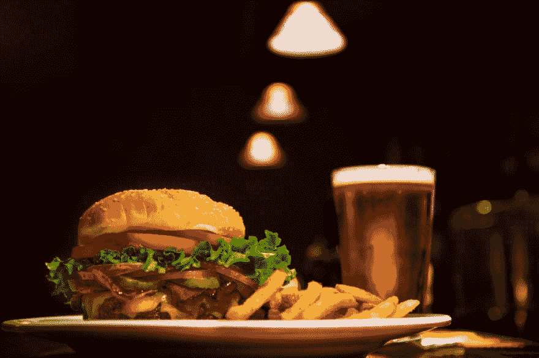

# 仅 CSS 响应导航菜单

> 原文：<https://dev.to/edezekiel/css-only-responsive-navigation-menu-4nef>

本周，我专注于我的 CSS 技能，在不使用 Javascript 的情况下构建了一个响应式导航栏。

我对这个项目的结果非常满意！这里有一个[代码笔](https://codepen.io/edezekiel/pen/drrQzP?editors=1100)的链接。这显然不是一个成熟的网站，但自从我开始这个博客以来，我就一直想建立这种 navbar。

完整的桌面视图显示一个标准的导航栏，链接到不同的页面。如果你在移动设备上浏览这个网站，或者缩小你的浏览器窗口，你会看到导航栏缩小到“汉堡包”按钮的样式。

### 为什么是这个项目？为什么没有 Javascript？

在 Flatiron，我们大多使用 CSS 框架，如语义用户界面或导航菜单栏的布尔玛。我想看看从头开始实现一个响应式导航条会是什么样子。

我决定不使用 Javascript 作为挑战。我只是觉得看看我能用 CSS 和 HTML 构建什么样的高级功能会很有趣。

### Flexbox

Flexbox 为这个项目做了很多繁重的工作。如果你以前没有用过 Flexbox，或者只是需要复习一下，我绝对推荐这个[游戏](https://flexboxfroggy.com/)和这个[站点](https://css-tricks.com/snippets/css/a-guide-to-flexbox/)入门。

### “汉堡”菜单没有 JS 怎么用？

这里的技巧有几个部分。首先，在 HTML 中添加复选框和标签标记。对于标签，我使用了 HTML unicode #9776。这在技术上被称为“天堂三字”字形，但人们通常认为它是“汉堡图标”

接下来，在样式表中将这些元素的显示设置为“none”。之后，为较小的屏幕创建 CSS 媒体查询，例如，当客户端是移动电话时。在较小的屏幕上，媒体查询隐藏导航链接，显示汉堡包图标。

单击汉堡图标将导航链接切换回 flexbox 显示。然而，导航的位置是固定的，导航链接的伸缩方向被设置为“列”综上所述，这就产生了一个弹出导航链接的汉堡菜单。