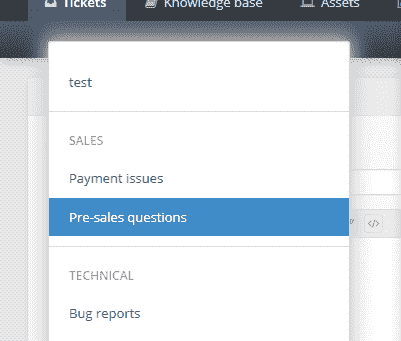

# CSS 阴影技巧

> 原文：<https://dev.to/alexjitbit/css-shadows-trick-fk2>

我注意到很多网站和应用程序使用这样的“盒子阴影”:

`box-shadow: 0px 0px 20px 5px #ddd`

字面意思是“让我们有一个#ddd 颜色的阴影，零偏移，5 像素宽，20 像素模糊”。在大多数情况下，这是完全正常的。

只有一个问题:

看，当放置在浅色背景上时，阴影看起来很酷。但是一旦它移到黑暗面(顶部区域)，你的盒子周围就会出现难看的“光晕”。

解决方法是**总是使用黑色半透明阴影**像这样:
`box-shadow: 0px 0px 20px 5px rgba(0,0,0,0.15)`现在说“使用黑色阴影，但使其 15%透明”。

IE9 及更高版本完美支持。另外，火狐/Chrome 的阴影更加一致，这一直是个问题(“火狐的灰色阴影看起来比 Chrome 暗”)。