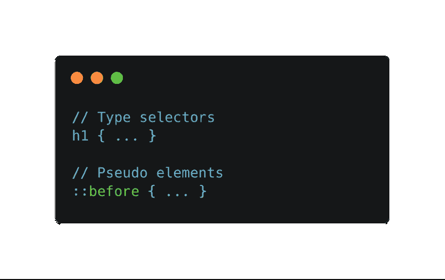
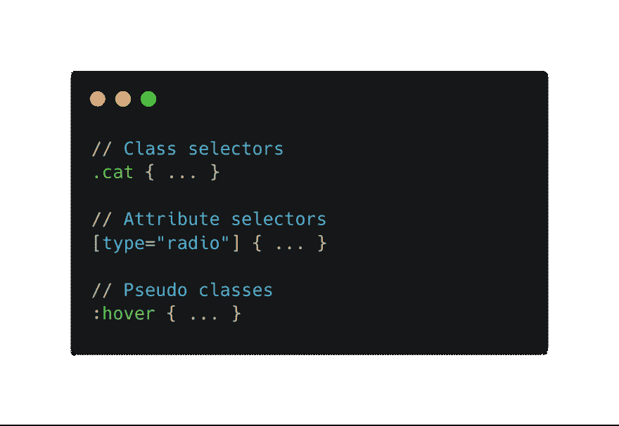
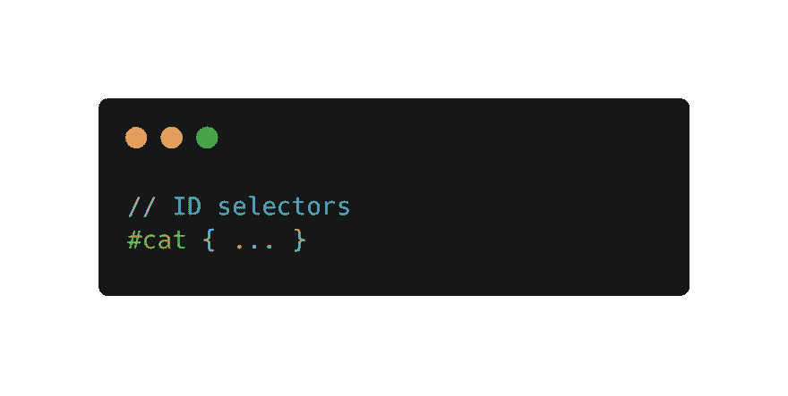
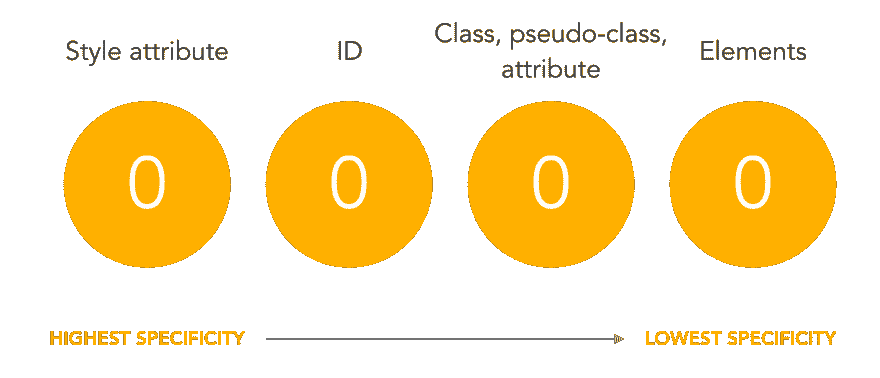
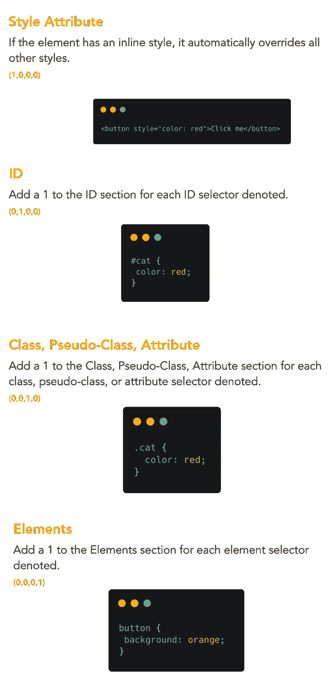
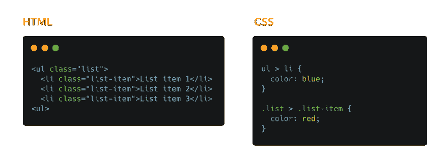
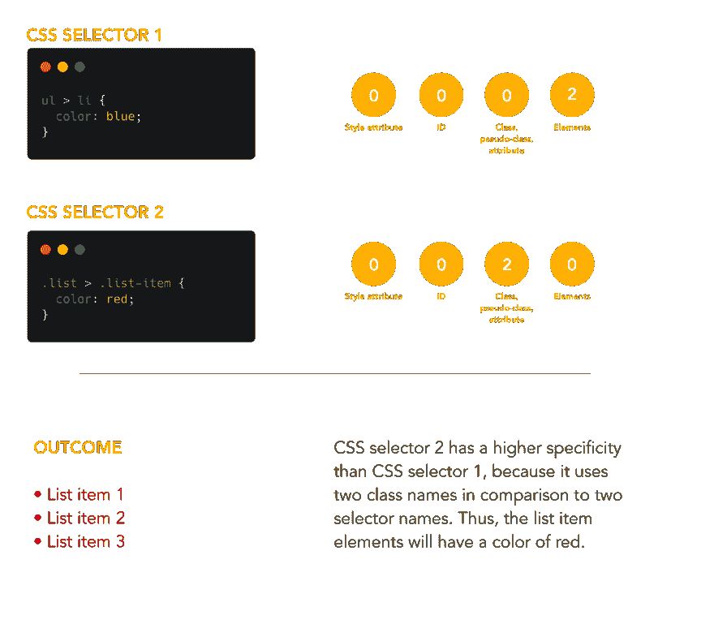
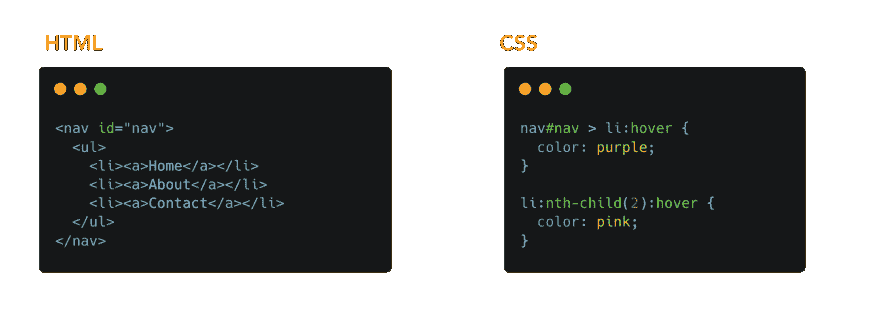
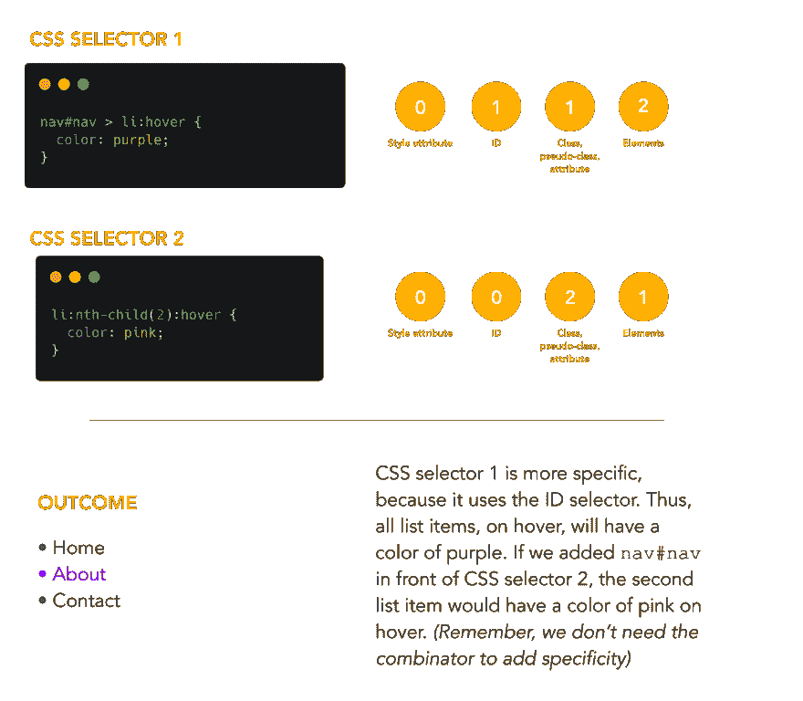
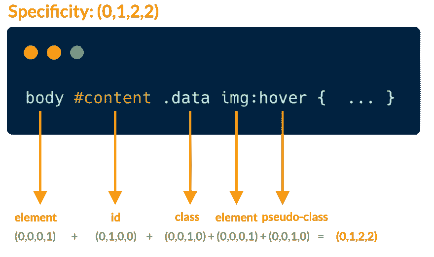

# CSS 特异性

> 原文：<https://dev.to/emmabostian/css-specificity-1kca>

CSS 特异性是应用于 CSS 选择器的一组规则，用于确定将哪种样式应用于元素。一个 CSS 样式越具体，它所累积的分值越高，就越有可能出现在元素的样式上。

理解 CSS 特异性并利用它为您带来好处有很多好处。

要理解为什么你的 CSS 样式没有被应用到一个元素中，你必须首先对 CSS 特性有一个基本的了解。

给你的 CSS 样式加上一个`!important`值是很容易的，但是这会导致你的 CSS 很快失去控制。

通过了解样式是如何应用的，您可以确保要显示的样式正在被呈现。

当我们没有停下来为我们的样式表考虑一个架构时，CSS 会很快变得难以控制，相反，在没有考虑特殊性的情况下，到处扔一堆 CSS 选择器。

对抗混乱的 CSS，并确保您的特性规则如预期的那样被应用的一个方法是采用 CSS 命名架构。[Block-element-modifier](http://getbem.com/)(BEM)是最常用的 CSS 命名架构之一。我们现在不会深入研究命名架构，但是它们可以帮助你确保你的风格不会互相覆盖。

通过充分利用 CSS 的特性，您可以确保您的代码是有组织的，并且您的选择器不会相互冲突。

看到代码基础被`!important`覆盖弄得千疮百孔并不罕见。虽然`!important`给了你一种方式来说“忘记所有其他的风格，我想要这一个被应用！！!"当你需要更新一个样式而又不知道从哪里开始时，这会导致严重的问题。

CSS 特异性允许您以正确的方式包含样式化元素所需的 CSS。当您确切地知道哪个选择器样式化了特定的元素时，更容易快速地更改样式。另外，您可能会发现自己总体上编写的 CSS 代码更少了，这将有助于提高可维护性。

在一个高层次上，你的 CSS 可以分为三类:

*   通用选择器、组合器(>、+等。)和否定伪类`:not()`对 CSS 特异性没有影响；在`:not()`伪类中定义的样式。
*   内联样式(添加到 HTML 元素的样式)总是覆盖外部样式表中声明的任何样式；这些通常不是好的实践，因为最好在一个地方定义你所有的风格。
*   `!important`覆盖所有其他标注的样式；这是一种不好的做法，因为它会使调试 CSS 更加困难。当两种冲突的样式使用一个！重要宣言，最具体的风格胜出。

*在利用 CSS 框架(如 Bootstrap)时，您可能会遇到无法使用 CSS 特异性来覆盖本机样式的情况。在这些情况下，使用`!important`并不是不好的做法。*

您可能会问自己“好吧，CSS 特异性很好，但是我实际上如何确定哪种样式是最具体的呢？”我们使用一个四分类系统来给 CSS 选择器赋值。具有最具体值的选择器获胜。

# 例 1

假设我们有一个包含三个列表项的无序列表。该列表及其所有列表项都有类名。假设我们已经创建了两个不同的 CSS 选择器。哪个更具体？

让我们来分解 CSS 特异性的计算。

# 例 2

假设您正在设计一个导航元素，它具有以下 HTML 结构。

我们有两种样式可以改变悬停时导航列表项的颜色。我们希望将悬停时列表项 2 的颜色改为粉红色。但是它并没有像预期的那样工作。

为了将悬停时列表项 2 的颜色改为粉红色，我们需要一个更具体的 CSS 选择器。因此，在选择器前面加上`nav#nav`或者仅仅是`#nav`就可以完成这项工作。

# 例 3

让我们计算下面代码片段的 CSS 特异性。

CSS 特异性并不难，但这是一项技能，一旦学会，将会为您节省大量的痛苦和折磨。

通过学习这些关键的特性规则，你将能够编写有组织的和优化的 CSS 代码。

查看下面的参考资料，获得更多 CSS 特性的乐趣！

[具体性](https://medium.com/r/?url=https%3A%2F%2Fspecifishity.com%2F)

[特异性计算器](https://medium.com/r/?url=https%3A%2F%2Fspecificity.keegan.st%2F)

[CSS 招数:特异性](https://medium.com/r/?url=https%3A%2F%2Fcss-tricks.com%2Fspecifics-on-css-specificity%2F)

[特异性星球大战](https://medium.com/r/?url=https%3A%2F%2Fstuffandnonsense.co.uk%2Farchives%2Fcss_specificity_wars.html)

[CSS 特异性](https://medium.com/r/?url=http%3A%2F%2Fcssspecificity.com%2F)