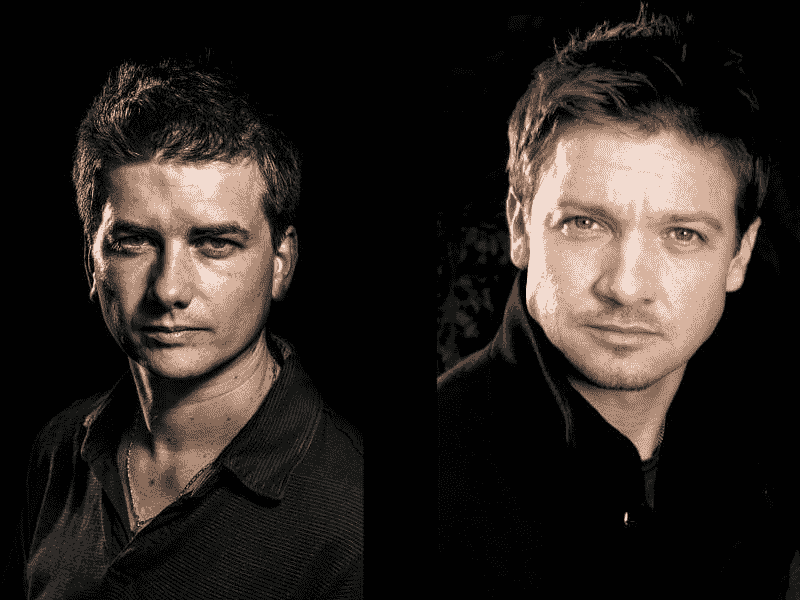
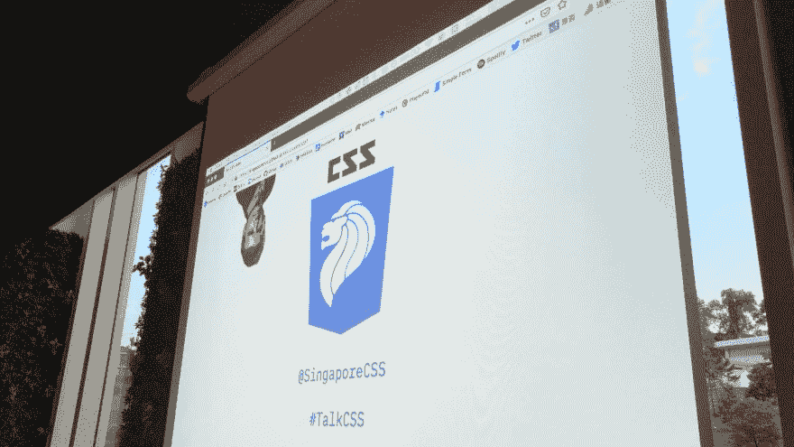

# CSS 变量为乐趣和没有利润

> 原文：<https://dev.to/huijing/css-variables-for-fun-and-no-profit-28ic>

我每月都开一个名为 Talk 的小型 CSS 聚会。CSS 和那个在 2015 年 10 月一个晴朗的早晨和我一起创立这项事业的人已经搬回墨尔本了。那个人是[克里斯·利纳特](https://twitter.com/cliener)，下面是他帅气的侧面图。帅到有时会被误认为鹰眼。\_(ツ)_/

<figcaption>诡异……眯眼看去，他们可能是双胞胎</figcaption>

[](https://res.cloudinary.com/practicaldev/image/fetch/s--t_6WdFkS--/c_limit%2Cf_auto%2Cfl_progressive%2Cq_auto%2Cw_880/https://www.chenhuijing.com/asseimg/posts/chris-script/hawkeye%402x.jpg)

现在被称为“克里斯脚本”(商标待定)的背景是这样的。在 2019 年的第一次聚会期间，这是克里斯告别后举行的第一次聚会，我有一个愚蠢的想法，在我介绍聚会时，在我旁边的 iPad 上放了克里斯的个人资料照片。

但是后来，我在网上找不到克里斯的高分辨率照片，我的 iPad 作为相框也不怎么样。突然，我有了一个更好的主意。简直是最好的。比其他的都好。为什么不让克里斯在[演讲中从各个方向随机冒出头来。CSS 介绍幻灯片](https://singaporecss.github.io/talk.css)？

## 实现克里斯脚本

此时最重要的事情是要求一张这个人自己的高分辨率侧面照片，克里斯勇敢地提供了，不知道我要用它做什么。他的信仰令人钦佩。经过一点小小的裁剪，我手上有了一个可爱的克里斯头像。

我的第一个想法是在站点上加载 1 个 Chris 头，首先将它偏移到帧外，然后随机将其平移/旋转回视口，这样看起来就像头会在预定义的时间长度后从各个方向窥视。考虑到`translateX`、`translateY`和`rotate`值的组合，这比预期的要难。

最终我决定用 4 个克里斯头像来代替。我相当肯定比我聪明的人可以用一个克里斯头做这件事，但我的大脑无法解决它，说真的，我白天有工作，你知道。就像我前面提到的，这里涉及到 3 个转换值。

如果你对幻灯片本身是如何制作的感兴趣，我[不久前写了一点东西](https://dev.to/huijing/html-slides-without-frameworks-just-css-323g)涵盖了它，所以如果你好奇的话可以看看。为此，我在页面底部添加了一个`<div>`，4 个克里斯头像如下:

```
<div class="nonsense" id="nonsense">
  
  
  
  
</div> 
```

Enter fullscreen mode Exit fullscreen mode

类名和 ID 是`nonsense`，因为这正是这个想法。废话。但充满乐趣，这才是最重要的。肯定会涉及到一些 Javascript，我想做的是确保我的 Javascript 相关的 CSS 类只用于这个目的。对我来说，我选择给它们加上前缀`js`。

### CSS-y 位

4 个 Chris 头的初始设置如下:

```
:root {
  --tx: 0;
  --ty: 0;
}

.nonsense {
  position: relative;
  width: 100vw;
  height: 100vh;
  z-index: 1;
  text-align: initial;
}

[class^="chris"] {
  position: absolute;
}

.chris-top {
  transform: translate(var(--tx, 0), -100%) rotate(180deg);
}

.chris-right {
  transform: translate(calc(100vw + 1em), var(--ty, 0)) rotate(-90deg);
}

.chris-bottom {
  transform: translate(var(--tx, 0), 100vh) rotate(0deg);
}

.chris-left {
  transform: translate(calc(-100% - 1em), var(--ty, 0)) rotate(90deg);
} 
```

Enter fullscreen mode Exit fullscreen mode

如您所见，这里涉及到一些 CSS 自定义属性。因为我想要一种更简单的方法来引入随机定位元素，而且我认为`style.setProperty`是一种方便的方法。

因此，转换函数的好处在于，你可以在其中使用`calc()`函数，尽管它在 Internet Explorer 中并不完全正确，如果你需要支持它，[一个变通方法](https://www.saninnsalas.com/using-calc-inside-css3-transform-in-internet-explorer/)是合适的。

此外，当使用 CSS 自定义属性时，传递给`var()`语法的第二个参数是一个后备，以防自定义属性值**无法计算**。然而，如果浏览器根本不支持 CSS 自定义属性，那么**不会**起作用。

这一组初始样式将所有 4 个 Chris 头都定位在视窗之外。这个想法是每 20 秒触发一个函数，一次在一个 Chris 头上随机添加`.active`类。`.active`类将运行一个动画效果，将头部转换回视口。

```
.chris-top.active {
  animation: popdown 4000ms ease;
}

.chris-right.active {
  animation: popleft 4000ms ease;
}

.chris-bottom.active {
  animation: popup 4000ms ease;
}

.chris-left.active {
  animation: popright 4000ms ease;
}

@keyframes popdown {
  50% {
    transform: translate(var(--tx, 0), 0) rotate(180deg);
  }
}

@keyframes popleft {
  50% {
    transform: translate(calc(100vw - 100%), var(--ty, 0)) rotate(-90deg);
  }
}

@keyframes popup {
  50% {
    transform: translate(var(--tx, 0), calc(100vh - 100%)) rotate(0deg);
  }
}

@keyframes popright {
  50% {
    transform: translate(0, var(--ty, 0)) rotate(90deg);
  }
} 
```

Enter fullscreen mode Exit fullscreen mode

### Javascript-y 位

可能有更简洁的方法来编写这个函数，但我是一个懒惰的人。这就是了。看，克里斯脚本(商标待定)！

```
(function() {
  const chrisHeads = document.getElementsByClassName('jsChris')
  const nonsense = document.getElementById('nonsense')
  var lastActiveHead = null

  function headAppear() {
    // the bit that does the random positioning
    nonsense.style.setProperty('--tx', Math.floor(Math.random() * 100) + 0 + 'vw')
    nonsense.style.setProperty('--ty', Math.floor(Math.random() * 100) + 0 + 'vh')

    // the bit that randomly assigns the .active class
    if (lastActiveHead) lastActiveHead.classList.toggle('active')
    const random = Math.floor(Math.random() * (chrisHeads.length - 1)) + 0
    const randomHead = chrisHeads[random]
    randomHead.classList.toggle('active')
    lastActiveHead = randomHead

    // the bit that determines how long before a Chris head pops out
    setTimeout(headAppear, 20000)
  }
  headAppear()
})() 
```

Enter fullscreen mode Exit fullscreen mode

如果我有多余的时间，我会考虑如何重构这个东西，以便在 DOM 中只有一个 Chris head 的情况下工作。但是现在，这个实现似乎达到了它的目的。

## 包装完毕

我不知道这里有用的东西是什么，除了 CSS 自定义属性为 Javascript 提供了一种非常方便的方式来挂钩 CSS。我倾向于用我的时间做许多无用的事情，但这很有趣，难道这不重要吗？(我还不得不多次谷歌如何拼写方便，嘘…不要告诉大家)

[](https://res.cloudinary.com/practicaldev/image/fetch/s--nb8o6Qww--/c_limit%2Cf_auto%2Cfl_progressive%2Cq_auto%2Cw_880/https://www.chenhuijing.com/asseimg/posts/chris-script/chris-script-1280.jpg)