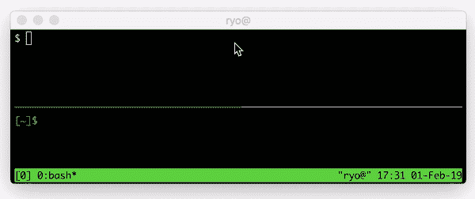
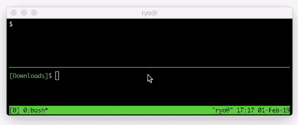
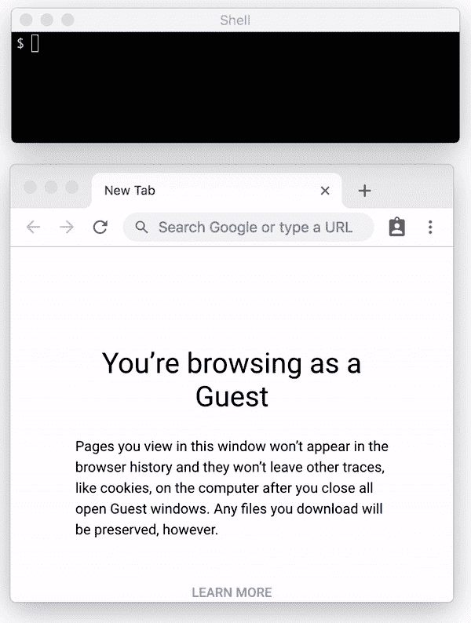
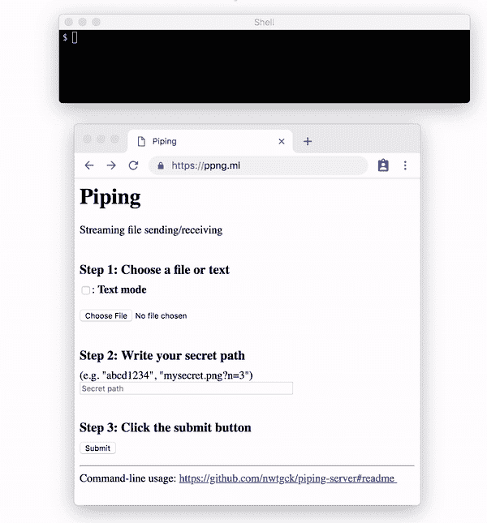
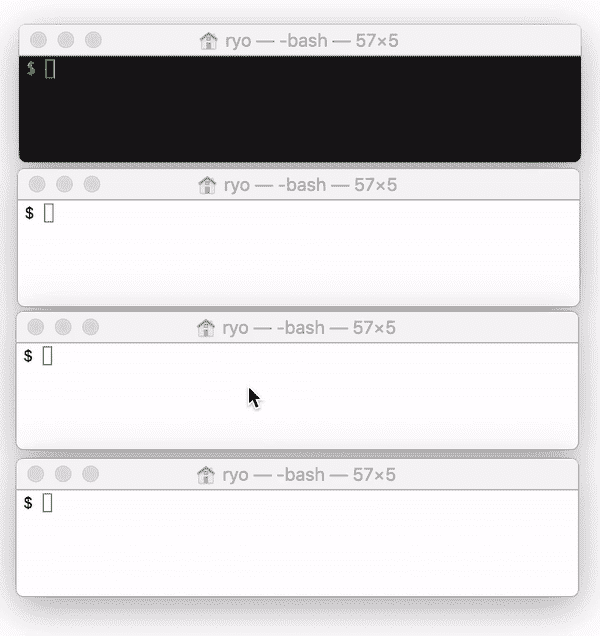
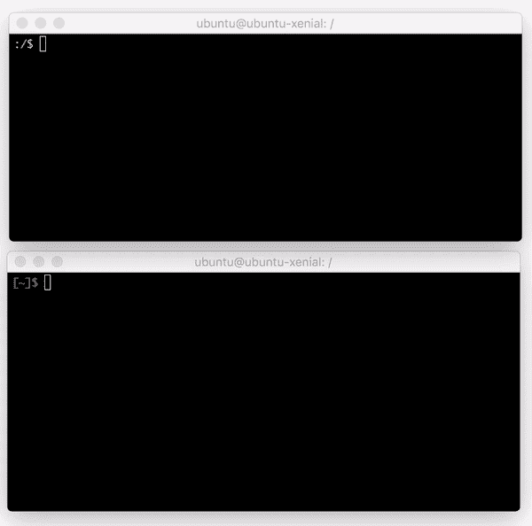

# 通过 HTTP/HTTPS 在每台设备之间传输数据流

> 原文：<https://dev.to/nwtgck/data-streaming-with-every-device-over-httphttps-mo4>

大家好！我对开发社区很陌生。今天，我想介绍几乎每台设备之间通过 HTTP/HTTPS 的数据流传输，它是为 Unix 管道和浏览器设计的！

## 我要解决什么？

我们有时希望在 Mac、Windows、Linux、Unix、iPhone 和 Android 之间传输数据...虽然我们有隔空投送、谷歌驱动、Dropbox、Slack、WhatsApp、Skype、`netcat`、`ssh`等等，但我们需要

*   找到发送方和接收方共同使用的服务
*   安装额外的 GUI 软件
*   注册一些服务
*   解决 NAT 穿越

此外，几乎现有的数据传输服务不是 CUI 友好的或者 GUI 友好的。

所以，我针对上面的问题做了一个解决方案。该系统允许您

*   几乎可以在任何设备上传输数据
*   无需额外安装即可使用
*   使用它与 Unix/Linux 管道和它的工程师友好

## 实际用法

我想介绍一下如何使用我制作的系统。

下面是转移`seq 100000`的演示。

[](https://res.cloudinary.com/practicaldev/image/fetch/s--GQ6_8xHT--/c_limit%2Cf_auto%2Cfl_progressive%2Cq_66%2Cw_880/https://thepracticaldev.s3.amazonaws.com/i/kwm8mdrlu8hr5l38oovl.gif) 
发送:`seq 100000 | curl -T - https://ppng.io/myseq`
获取:`curl https://ppng.io/myseq`

* * *

这是一个传输 100MB 文件的演示。

[](https://res.cloudinary.com/practicaldev/image/fetch/s--hndCcKhT--/c_limit%2Cf_auto%2Cfl_progressive%2Cq_66%2Cw_880/https://thepracticaldev.s3.amazonaws.com/i/8qkvg7tkmep5ryeh2ofx.gif) 
发送:`cat 100MB.dat | curl -T - https://ppng.io/mydata`
获取:`curl https://ppng.io/mydata > mydata`

* * *

您可以使用管道传输任何数据。举个例子，

压缩&发送:`cat myfile | gzip | curl -T ...`
获取&解压缩:`curl ... | zcat > myfile`
和
加密&发送:`cat myfile | openssl aes-256-cbc | curl -T ...`
获取&描述:`curl ... | openssl aes-256-cbc -d > myfile`
和
发送目录(zip): `zip -q -r - ./mydir | curl -T - https://ppng.io/mydir.zip`
发送目录(tar.gz): `tar zfcp - ./mydir | curl -T - https://ppng.io/mydir.tar.gz`

* * *

这是一个将数据**传输到浏览器**的演示。

[](https://res.cloudinary.com/practicaldev/image/fetch/s--qYpCubZy--/c_limit%2Cf_auto%2Cfl_progressive%2Cq_66%2Cw_880/https://thepracticaldev.s3.amazonaws.com/i/8yiu3zxvmm2cxdowg0ig.gif)

* * *

这是一个从浏览器传输数据**的演示。**

[](https://res.cloudinary.com/practicaldev/image/fetch/s--T7ReNcBV--/c_limit%2Cf_auto%2Cfl_progressive%2Cq_66%2Cw_880/https://thepracticaldev.s3.amazonaws.com/i/f9hzl0b812zvloos34g8.gif)

这意味着你可以从安卓/iPhone/iPad 传输文件...到另一个设备！

* * *

### 传送给多个接收者

[](https://res.cloudinary.com/practicaldev/image/fetch/s--i1CQBXYz--/c_limit%2Cf_auto%2Cfl_progressive%2Cq_66%2Cw_880/https://thepracticaldev.s3.amazonaws.com/i/a337vdmul0ozqyk7vd5r.gif)

### 终端屏幕分享！

[](https://res.cloudinary.com/practicaldev/image/fetch/s--6QpDHMgL--/c_limit%2Cf_auto%2Cfl_progressive%2Cq_66%2Cw_880/https://thepracticaldev.s3.amazonaws.com/i/9blobmr61goaesjcqcxg.gif)

分享:`script -f >(curl -T - https://ppng.io/myscript >&/dev/null)`
查看:`curl https://ppng.io/myscript`
(用 Mac 中的`script -F`代替`script -f`)

## GitHub 资源库

该项目是管道服务器，见下面的链接。
GitHub:[https://github.com/nwtgck/piping-server](https://github.com/nwtgck/piping-server)

##  [ nwtgck ](https://github.com/nwtgck) / [管道服务器](https://github.com/nwtgck/piping-server)

### 通过管道或浏览器在纯 HTTP 上在每个设备之间无限传输

<article class="markdown-body entry-content container-lg" itemprop="text">

# 管道服务器

[](https://www.npmjs.com/package/piping-server)[](https://www.codefactor.io/repository/github/nwtgck/piping-server)[](https://ci.appveyor.com/project/nwtgck/piping-server)[](https://github.com/nwtgck/piping-server/actions)[](https://hub.docker.com/r/nwtgck/piping-server/)[](https://microbadger.cimg/nwtgck/piping-server "Get your own image badge on microbadger.com")

通过 HTTP/HTTPS
[](https://github.com/nwtgck/piping-serverdemo_images/piping-server-terminal-hello.gif) 在每个设备之间无限传输

## 转移

管道服务器很简单。可以按如下方式转账。

```
# Send
echo 'hello, world' | curl -T - https://ppng.io/hello
```

Enter fullscreen mode Exit fullscreen mode

```
# Get
curl https://ppng.io/hello > hello.txt
```

Enter fullscreen mode Exit fullscreen mode

管道服务器将数据传输到`POST /hello`或`PUT /hello`进入`GET /hello`。路径`/hello`可以是任何路径，例如`/mypath`或`/mypath/123/`。指定相同路径的发送者和接收者可以传送。发送方和接收方都可以先开始传输。第一个等待另一个。

你也可以在浏览器上使用类似 [https://ppng.io](https://ppng.io) 的 Web UI。https://piping-ui.org 的[有一个更现代的用户界面，支持 E2E 加密。](https://piping-ui.org)

### 溪流

最重要的是数据是流式的。这意味着你可以无限传输任何数据。下面的演示用`seq inf`传输一个无限文本流。

[](https://github.com/nwtgck/piping-serverdemo_images/seq-inf.gif)

## 主意

…

</article>

[View on GitHub](https://github.com/nwtgck/piping-server)

这个项目是用 TypeScript 编写的。

## 公共服务器

这里是公共服务器。我的推荐是 [https://ppng.io](https://ppng.io) 因为名字很短。

*   [https://ppng.io/](https://ppng.io/)
*   [https://ppng.herokuapp.com](https://ppng.herokuapp.com)
*   [https://piping-92sr2pvuwg14.runkit.sh/](https://piping-92sr2pvuwg14.runkit.sh/)

在我的政策下，你可以自由运行服务器。我想描述一下以后怎么跑。

您可以从以下网站获得工程师友好的帮助。

```
$ curl https://ppng.io/help
<Help will be displayed here> 
```

Enter fullscreen mode Exit fullscreen mode

## 工作原理

我认为 Piping Server 就像是 Pear-to-Pear 中的 TURN server。管道服务器将您的数据转发到另一个设备，以解决 NAT 穿越问题。

POST/PUT HTTP 请求的主体被传递给 GET HTTP 响应的主体。

## 如何运行管道服务器

我们有几种方法来运行管道服务器。我来一一介绍。

### Heroku

在[https://github.com/nwtgck/piping-server](https://github.com/nwtgck/piping-server)中按下【部署到 Heroku】按钮。

### 可移植的二进制可执行文件

以下命令使管道服务器在 [http://localhost:8888](http://localhost:8888) 上运行。

```
wget https://github.com/nwtgck/piping-server-pkg/releases/download/v0.8.7/piping-server-macos
chmod +x piping-server-macos
./piping-server-macos --http-port=8888 
```

Enter fullscreen mode Exit fullscreen mode

你还可以在[https://github.com/nwtgck/piping-server-pkg](https://github.com/nwtgck/piping-server-pkg)的 GitHub 版本中找到其他平台版本。可移植的可执行文件由 [zeit/pkg](https://github.com/zeit/pkg) 制作。

### 码头工人

A `docker run`让管道服务器在 [http://localhost:8888](http://localhost:8888) 上运行。

```
docker run -d --restart=always -p 8888:80 nwtgck/piping-server --http-port=80 
```

Enter fullscreen mode Exit fullscreen mode

### npm

以下命令使管道服务器在 [http://localhost:8888](http://localhost:8888) 上运行。

```
# install
npm install -g piping-server
# run
piping-server --http-port=8888 
```

Enter fullscreen mode Exit fullscreen mode

## 通过 HTTP 传输数据的可能性

我正在进行一项实验，以揭示通过 HTTP 可以传输多少数据。我在 55 天零 7 个小时前开始这项实验，超过 1000 兆字节的数据被传输。

实验的方法如下。
无限发送:`cat /dev/urandom | curl -T - localhost:8888/rand`
无限丢弃:`curl localhost:8888/rand > /dev/null`

## 传送速度与围棋相比

下面是 TypeScript/Node.js 和 Go 实现之间传输速度的简单比较。从视频来看，似乎没有什么不同。

**TypeScript/node . js**:
T3

**去:**
[https://www.youtube.com/embed/NuKvDwB9JSU](https://www.youtube.com/embed/NuKvDwB9JSU)

回购结束。:[https://github.com/nwtgck/go-piping-server](https://github.com/nwtgck/go-piping-server)

## 日本邮政

以下是我的日文原帖:[https://qiita.com/nwtgck/items/78309fc529da7776cba0](https://qiita.com/nwtgck/items/78309fc529da7776cba0)。
你可以在那里得到更多的信息。

非常感谢您的阅读。祝你有美好的一天！