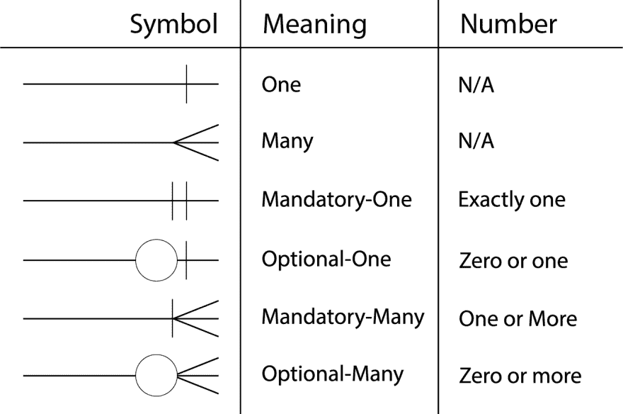
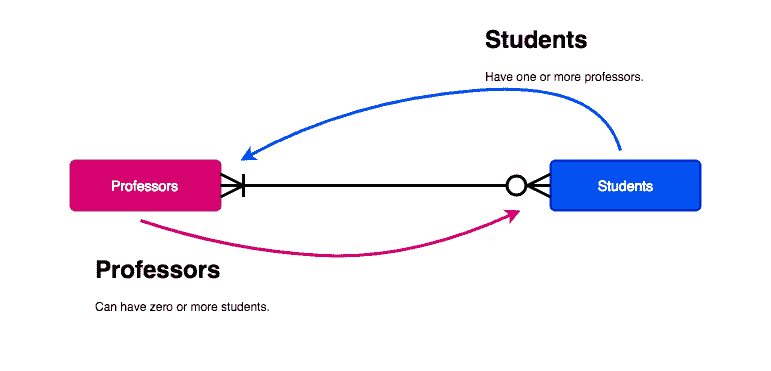
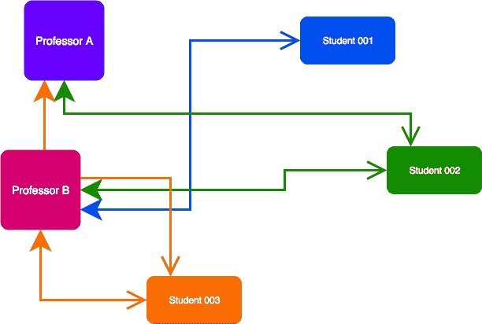

# 数据库模型和实体关系图第二部分

> 原文：<https://dev.to/kevindsteeleii/database-models-and-erds-for-newbs-part-2-6d9>

## 回顾上一次

到目前为止，我们已经介绍了数据库模型作为一种创建抽象的方法，这些抽象表示实体或具有可量化属性的事物。接下来，我将解释一些关于关系的观点，以及我们如何去解决它们。

## 什么是鱼尾纹符号？

乌鸦脚符号可以追溯到 20 世纪 70 年代中期，如果你想在这之后做更多的阅读，可以使用结构化系统分析和设计方法。本质上，这是一种用方框来表示实体，用线条来表示它们之间的关系的方式，线条上的标记大致类似于一只乌鸦的脚。它也被称为巴克符号。抛开历史错误不谈，让我们来谈要点。

为什么要用？

虽然我们作为开发人员完全有能力以编程方式创建令人惊叹的数据库，但首先编写代码会导致许多错误。错误会导致更大的成本，而成本会导致风险或产品的失败。所以就像木匠一样，我们需要测量两次，切割一次。顺便说一下，你**不需要**使用这个特定的符号。在开始编程之前，使用任何有效的系统来设计您的模型及其关系。我个人对系统设计之类的很感兴趣，这也是我写这篇文章的原因。

它看起来像什么？

在行动？

让我们打开这个。教授可以有学生，但不一定需要有学生。学生需要至少有一个教授。所以想象一下一个只记录注册学生的小学校。教授们可能会也可能不会教授一门课程，但是所有的学生都需要至少选修一门课，才能获得任何种类的学分。然而，以这种方式实现的多对多关系会导致基数较低，或者有大量重复的信息。见下图。

加入救援表！

连接表就像它听起来的那样。它连接相关的表并创建匹配实体的行。但是，它将只包含对它们的引用，而不是副本，以避免低基数。在我们的案例中，我们使用课程注册来加入我们的许多学生和教授。

请注意，我们仍然可以改进它，以制作一个更好的实体关系图，但这要等到下周了。

在第 3 部分中，我们将对此进行更深入的分析，以构建一个更好的系统。如果可以的话，这次我会添加一些代码。