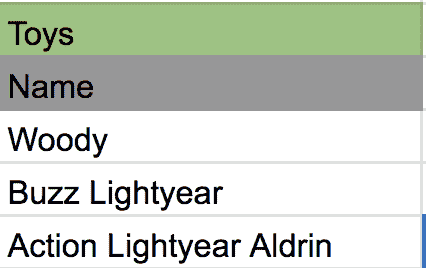
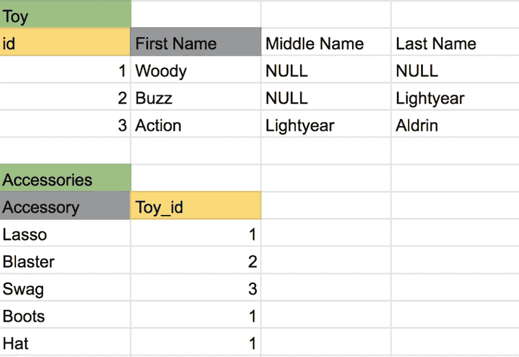

# 面向对象程序员的数据库规范化

> 原文：<https://dev.to/scottslatton/database-normalization-for-object-oriented-programmers-3a4m>

优化是我一直热爱的事情。这主要表现在我试图挤出尽可能多的时间睡觉，所以我利用日程安排的捷径，这样我就可以尽可能多的时间温暖舒适的躺在床上。这肯定会影响到我的兴趣，因为我真的很喜欢在保持质量的同时尽可能快而一致地做事。所以今天我将冒险进入一个与“有趣”或“有意思”这样的词并不完全相关的话题，但是我发现即使意识到规范化是存在的，也在面向对象编程的其他方面帮助了我。那么什么是规范化，它与 OOP 有什么关系呢？

标准化是我们优化数据库的过程，使它们更加灵活、可扩展和易于使用。对于直接与数据库打交道的人来说，这是一项必不可少的能力。这个过程可以在开发过程中的任何时候应用，并且在最初创建对象模型时牢记在心，并且可以在调整和发现对象的新关系时重新应用。这可能听起来令人生畏，但我会在整个过程中牵着你的手，这样你就可以回来在你自己的项目中参考这个指南。

在我们开始之前，有几个定义:

**归一化**

为了实现“规范化”或考虑我们的数据库**“规范化”**我们需要让我们的数据库经历几个步骤，对于每一步，我们都认为我们的数据库处于一个新的水平或**“形式”**。我将带你经历前三种形式，因为再往前走，你就开始飘向数学可能性的领域，而不是现实世界的实用性。一旦我们达到第三种形式，你就可以放心地认为你的数据库是正常的。这些步骤将分别缩短为 1NF、2NF 和 3NF。

**主键**

主键候选需要两个条件:

1.  绝不允许为 Null/Nil。

2.  必须是唯一的值。

3.  可能永远不会改变。

幸运的是，在我们的面向对象语言中，我们的实例对象都有一个唯一的键，叫做对象 ID。另一方面，我们的数据库像 SQLite 一样，自动包含一个唯一的自动递增行。

**外键**

外键只是来自其他表的主键。通常一个链接表会有自己的主键和两个或更多的外键。这些将两个独立的表连接在一起。

## 通过表格

让您的数据库经历前三个规范化步骤将极大地提高您存储的数据的质量。幸运的是，利用面向对象的语言特性，如类，可以非常容易地拥有一个高效的数据库，而不必考虑幕后发生了什么。在开始规范化之前，您需要有一个主键，对于面向对象的语言，这将是对象 ID 本身(在。在 Ruby 中是 self)，或者当存储在数据库中时，将被自动添加为通常自动递增的“id”列。

如您所知，类的属性可以非常灵活地映射到数据库中的列。通过第一范式获取数据意味着每列和每个单元格应该只包含一个值。这意味着 Toy 类的实例对象(姑且称之为“Woody”)在数据库中有一个标题为“Name”的列，其值为“Woody”。但是，如果我们想存储另一个名为“巴斯光年”的玩具，会发生什么呢？在下面的表格中，我已经这样做了，为了更好的测量，我们还放了第三个玩具，名字叫“行动光年奥尔德林”。

当我们开始询问数据库问题时，麻烦就开始了，比如“嘿，数据库，你能帮我找到所有以‘光年’为姓的玩具吗？”嗯，你没有一个名为“姓”的列，所以你必须查询“名”列，比如“嘿，数据库，给我所有名为‘光年’的玩具。”我敢肯定，你会期望它会返回巴兹和奥尔德林，这不是你想要的。对于一个玩具盒来说，这可能看起来微不足道，但是如果您正在查询一个有几十万或几百万行的数据库，您会发现没有将数据分解成更小的部分会很快变得完全不可管理和操作。

或者，当所有的值都被塞进一个单元格时，就要小心了。如下图。
 
这违背了第一范式，必须加以纠正，不过，如果你正确使用你的类，这种情况不太可能发生。

这是 1NF 的第一点:原子性。

在面向对象的语言中，这个问题通常是通过当你试图在一个单元格中放入多个值时报错并建议你使用数组来解决的。

继续，让我们快速解决这个问题，添加一行将名称分成三部分，并让附加的名称可选地为 null/nil，就像 Woody 的情况一样。

我们还将添加一个附件列，因为我们希望跟踪每个玩具的附件。但是并不是每个玩具都只有一个配件，所以我们需要更多的柱子来放置玩具的每一个配件。

这种策略的问题是，对于我们的玩具类的每个新实例(从 ToyBox 重新命名)，对象可能有不同数量的附件。如果您注意到您的列名以递增的数字结尾，那么很有可能您遇到了一个问题，可以通过取出这些列并创建一个与玩具有关系的新类来解决，如果必要的话，可以将这种关系存储在一个链接表中(就像您发现实际上存在多对多关系一样)。

### 第二种形式

据我所知，第二种形式规范化在没有任何人工干预的情况下，用 OOP 处理得很好。它主要处理**复合主键**，其中两列用于唯一标识表中的一行。我相信在某些情况下，记住这一点是有好处的，但我愿意承认，在这一点上，我还没有遇到这是必要的情况。

基本上 2NF 声明任何非键字段都应该依赖于整个主键。这种情况通常出现在链接表中。

### 第三形态

第三范式陈述:
你能从任何其他非关键字段中找到一个字段的值吗？

下面你可以看到，如果你知道玩具的价格和售出的数量，你总是可以找到玩具订单的总数。

最佳实践是删除“总计”行，并使用一种方法或内置的数据库功能来计算该信息。

### 包扎

您可能已经注意到，面向对象语言和现代数据库从一开始就将这些原则牢记在心，但是尝试创建自己的快捷方式可能很有诱惑力。尽量避免这些陷阱，花时间分析你存储了哪些数据以及这些数据之间的关系。