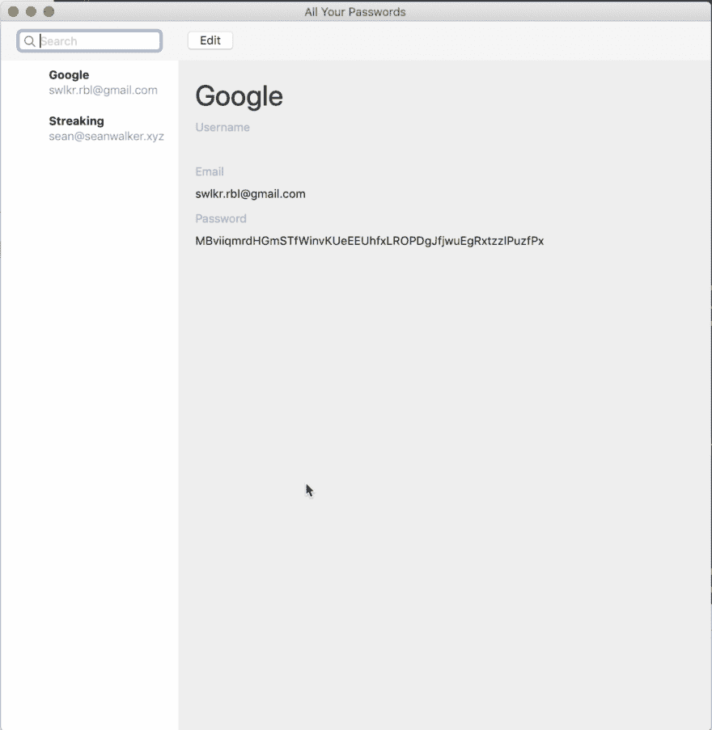

# 第 15 天:为讨厌云的人提供 Swift macOS 密码管理器

> 原文：<https://dev.to/swlkr/day-15-swift-macos-password-manager-for-people-who-hate-the-cloud-2e24>

[<——第 14 天去这里](https://dev.to/swlkr/day-14-swift-macos-password-manager-for-people-who-hate-the-cloud-4m5d)

📅2019 年 1 月 15 日
🚀距离发布还有 15 天
🔥十四天连胜
💰4.99 美元的价格(这个价格一直在变)
🤑0 美元收入
📈0 顾客
⌚️花了 11.5 小时
💻20 个文件被更改，1289 个插入(+)，171 个删除(-)
🏁今天的目标:**搜索**

**下午 1 点 21 分**
又要开始下班了，我真的需要早点开始睡觉了。

**下午 6:50**
好了，回到正题，搜索开始。

晚上 8 点 14 分
比我想象的要长得多。等等，我很确定我每次都这么写。我设法解决了今天困扰我的几件事。我的自定义单元格视图根本不起作用。它只是显示相同的文本单元格，没有其他内容，但它现在可以工作了🎉我开始搜索了。检查一下:

[](https://res.cloudinary.com/practicaldev/image/fetch/s--NvqUTYsG--/c_limit%2Cf_auto%2Cfl_progressive%2Cq_66%2Cw_880/https://thepracticaldev.s3.amazonaws.com/i/q9lp87stq1i96ok4kxcm.gif)

我对内存使用也很好奇，我注意到当我打开每个视图，尝试一些东西，比如搜索，添加一个新密码，它似乎徘徊在大约 28 MB 的内存。我觉得这是对电子的改进💪。今天晚上，我已经在这个*上花了将近两个小时。得注销了。虽然弄清楚如何让搜索字段工作很有趣，但在 storyboard 中重新制作表格单元格视图就没那么有趣了(更不用说在代码中设置高度了)。说到代码，有一种方法可以让搜索字段和表格视图互相交流:* 

```
 func controlTextDidChange(_ obj: Notification) {
        if obj.object as? NSSearchField == searchField {
            filterWithString(searchField.stringValue)
        }
    }

    func filterWithString(_ searchFieldValue: String) {
        if searchFieldValue.count > 0 {
            logins = rows?.filter { r in
                return (r[login.name]?.lowercased().contains(searchFieldValue.lowercased()))! ||
                    (r[login.username]?.lowercased().contains(searchFieldValue.lowercased()))! ||
                    (r[login.email]?.lowercased().contains(searchFieldValue.lowercased()))!
            }
        } else {
            logins = Array(try! db.prepare(login.table))
        }

        if(logins?.count == 1) {
            tableView.selectRowIndexes(NSIndexSet(index: 0) as IndexSet, byExtendingSelection: false)
        }

        tableView.reloadData()
    } 
```

哦，别忘了为那个`controlTextDidChange`函数设置搜索字段的委托`searchField.delegate = self`。明天同一时间(或多或少)，同一地点继续收听。