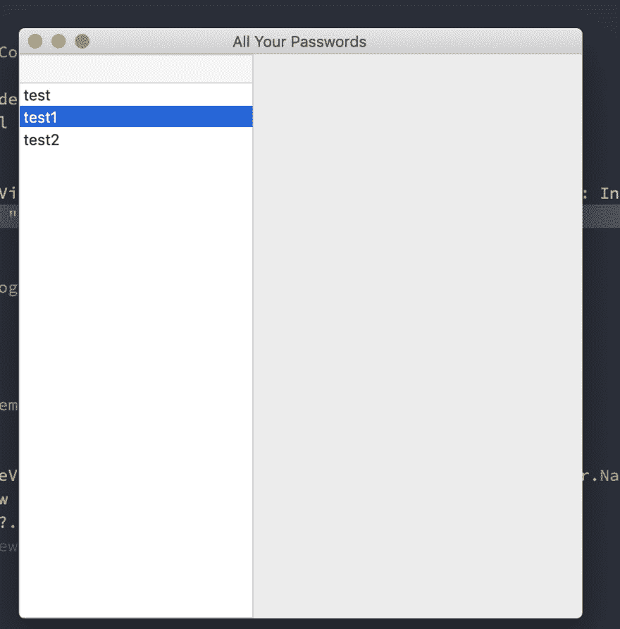

# 第 7 天:为讨厌云的人制作一个 swift macOS 密码管理器

> 原文：<https://dev.to/swlkr/day-7-making-a-swift-macos-password-manager-for-people-who-hate-the-cloud-32bn>

[< -第 6 天，请点击此处](https://dev.to/swlkr/day-6-making-a-swift-macos-password-manager-for-people-who-hate-the-cloud-1361)

这标志着我在这个项目上工作的第一周🎉如果你刚刚收听，我想告诉你一些我希望在 3 周内完成的事情:

*   收费 29 美元/终身
*   把这个东西放到 macOS 应用商店
*   开源代码(但尝试将人们推向付费版本)
*   算出我实际工作了多少小时，然后给出一个关于整个月的冷静的总结

说到删帖，我只想花点时间回想一下过去的 6 天，写下这个应用程序从哪里来(什么都没有)以及现在在哪里(什么都没有):

第一天:做了一个新的 xcode 项目，在里面放了一个有点大的屏幕`NSSecureTextField`(1 小时)
第二天:尝试使用 CoreData 来存储所有内容，没有成功，引入 SQLite.swift 和 KeychainSwift 来处理繁重的工作，还根据主密码设置与否来切换初始视图控制器， 将设置的主密码保存到钥匙串(2 小时)
第三天:让主密码解锁屏幕工作(0.5 小时)
第四天:在密码表旁边的容器视图中显示新密码屏幕视图(1 小时)
第五天:去滑雪，整天和朋友一起玩。 在新密码屏幕中拍打标签和文本字段(0.25 小时)
第六天:实际将新登录插入 sqlite，将新密码插入 keychain (0.67 小时)
第七天:这篇帖子！

迄今总时间:4.75 小时

### 山地时间晚上 8 点 20 分

除了设计帮助，这个东西还需要什么？它需要列出密码，这就是我今晚要做的。我们开始工作吧。

### 山地时间晚上 8:30

看一会 pewdiepie

### 山地时间晚上 8 点 34 分

真正开始工作。

### 山地时间晚上 9 点 47 分

网飞看着看着，终于想通了一些。密码显示在列表视图中。它工作的时候我几乎不敢相信，不得不截图

### 山地时间晚上 9 点 48 分

截图
[](https://res.cloudinary.com/practicaldev/image/fetch/s--ehDdFm9G--/c_limit%2Cf_auto%2Cfl_progressive%2Cq_auto%2Cw_880/https://thepracticaldev.s3.amazonaws.com/i/3dx17xltzel0e8zvh3p5.png)

下面是相关代码

```
class PasswordListViewController: NSViewController {
    @IBOutlet weak var containerView: NSView!
    @IBOutlet weak var tableView: NSTableView!
    var logins : [Row]?
    let login = Login()

    override func viewDidLoad() {
        super.viewDidLoad()

        tableView.delegate = self
        tableView.dataSource = self

        let db = Database.open()

        logins = Array(try! db.prepare(login.table))

        tableView.reloadData()
    }
} 
```

这就是用 swift 在 macos 中填充 tableview 的全部内容

```
extension PasswordListViewController: NSTableViewDataSource {
    func numberOfRows(in tableView: NSTableView) -> Int {
        return logins?.count ?? 0
    }
}

extension NSUserInterfaceItemIdentifier {
    static let NameCell = NSUserInterfaceItemIdentifier("NameCellID")
}

extension PasswordListViewController: NSTableViewDelegate {

    fileprivate enum CellIdentifiers {
        static let NameCell = "NameCellID"
    }

    func tableView(_ tableView: NSTableView, viewFor tableColumn: NSTableColumn?, row: Int) -> NSView? {
        var text: String = ""

        guard let item = logins?[row] else {
            return nil
        }

        text = item[login.email]!

        if let cell = tableView.makeView(withIdentifier: NSUserInterfaceItemIdentifier.NameCell, owner: self) as? NSTableCellView {
            cell.textField?.stringValue = text
            return cell
        }
        return nil
    }

} 
```

哦，我遗漏的事情是，当我真正需要在 TableViewColumn 中填充标识符时，我正在将 storyboard 中的标识符添加到 TableViewCell 中。我真傻。

⌚️6.25 小时(我会把皮蒂皮和网飞也放进去，只是为了好玩)💰$0

🔥明天第八天