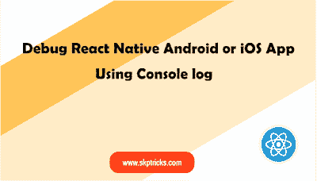

# 使用控制台日志调试本地 Android 或 iOS 应用程序

> 原文：<https://dev.to/skptricks/debug-react-native-android-or-ios-app-using-console-log-3ap3>

帖子链接:[使用控制台日志调试 React 原生 Android 或 iOS 应用](https://www.skptricks.com/2019/03/debug-react-native-android-or-ios-app.html)

本教程解释了如何在 react 本机应用程序中使用 console.log()执行调试。Console.log()是 javascript 中内置的预定义函数。这个函数是为 Android 和 iOS 应用程序创建的，用于在运行时维护和调试应用程序中的错误。Console.log()帮助我们检测代码中的错误。

在本例中，我们在函数中使用 console.log 语句，该函数作为点击监听器映射到按钮。当用户在按钮上执行 click 事件时，它将在控制台中打印 console.log 语句消息。让我们使用下面完整的源代码在控制台中记录消息，最终帮助您调试代码。