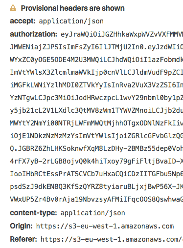
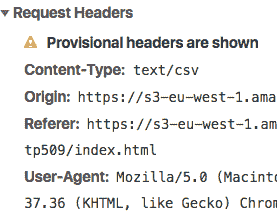

# 调试历史记录:缺少 Lambda 调用

> 原文：<https://dev.to/dvddpl/debugging-chronicles-missing-lambda-invocation--c27>

TLDR；为什么即使正确配置和执行了网关 API，许多 Lambda 中也只有一个没有被执行？

确保对 GatewayAPI 的每一次获取都通过了头中的 Cognito 授权令牌。

* * *

我正在做一个 FullStack 项目，在这个项目中，我们最近在通过 GatewayAPI 调用的 Lambda 函数之上添加了 Cognito。

我们使用无服务器框架，配置非常简单

```
functions:
  create-user-lambda:
    handler: create.handler
    events:
     - http:
          path: users
          method: post
          cors: true
          authorizer:
            type: COGNITO_USER_POOLS
            authorizerId:
              Ref: ApiGatewayAuthorizer
  get-user-lambda:
    handler: get.handler
    events:
     - http:
          path: users/{id}
          method: get
          cors: true
          authorizer:
            type: COGNITO_USER_POOLS
            authorizerId:
              Ref: ApiGatewayAuthorizer

  my-special-lambda:
    handler: publish.handler
    events:
     - http:
          path: publish
          method: post
          cors: true
          authorizer:
            type: COGNITO_USER_POOLS
            authorizerId:
              Ref: ApiGatewayAuthorizer 
```

Enter fullscreen mode Exit fullscreen mode

几天后——以及其他一些 pull requests——我们注意到，只有一个 API 端点在被 React 应用程序调用时不工作。

我确信功能是正常的:**单元测试都在工作**，并且**集成测试在更新数据库时也是成功的**。因为测试直接调用我们的逻辑，绕过了处理程序，所以我需要检查 Lambda 本身在被客户端调用时的行为。

我使用[无服务器离线插件](https://www.npmjs.com/package/serverless-offline)在本地启动我的无服务器堆栈，然后配置在 localhost:3000 上运行的前端来调用 localhost:3001 上的 API。一切都好。

我还尝试使用 [ngrok](https://ngrok.com/) 向外界展示我运行的 lambda 本地版本，并使用 [switcheroo chrome 插件](https://dev.to/dvddpl/tools-i-wish-i-knew-from-the-start-48kl)将对网关 API 的调用重定向到 Ngrok URL，这样我就可以直接在 QA 上的应用版本上进行测试。同样没问题。

很明显，在网关 API / Cognito 层有问题，特别是因为尽管无服务器离线插件很棒，但本地版本的堆栈在许多方面(aws 凭证、角色和 authtokens)与 AWS 上的真实版本不同。

这个理论被 Lambda 的对数完全是空的这一事实所证实。(您可以在 Cloudwatch UI 控制台中检查它们，或者只通过`sls logs -f YOUR_FUNCTION -s STAGE/ENV`):这意味着 Lambda 永远不会被触发，但是由于浏览器在 POST 成功之前进行了选项握手，这意味着网关 API 配置正确...

这肯定与授权者有关，但**配置与所有其他 lambda**完全相同...我很快移除了 Lambda 上的授权者并重新部署。当然，端点又像预期的那样开始工作了。
会有什么问题呢？！？！

我再次检查了 Chrome Dev tools 的网络面板中的请求标题和内容。
工作的长这样:
[](https://res.cloudinary.com/practicaldev/image/fetch/s--mV5mkJ3O--/c_limit%2Cf_auto%2Cfl_progressive%2Cq_auto%2Cw_880/https://thepracticaldev.s3.amazonaws.com/i/eae4qxkgfl1vd2bw4hf9.png) 
坏的长这样:
[](https://res.cloudinary.com/practicaldev/image/fetch/s--BYA7GcHJ--/c_limit%2Cf_auto%2Cfl_progressive%2Cq_auto%2Cw_880/https://thepracticaldev.s3.amazonaws.com/i/4gme5z0flitgda9ytkzx.png)

很明显，被破坏的 lambda 没有发送授权令牌！令人误解的是，本地主机上的请求头(使用无服务器离线)完全相同，但是端点正在工作。所以检查它并没有立即闻到..

然后我记得前端正在使用 [ReactAdmin](https://marmelab.com/react-admin/) ，为了让它的 dataprovider 与 [Amplify](https://aws-amplify.github.io/docs/js/authentication) 一起工作(它自动调用应用程序的每个资源/部分的端点),我们必须以某种方式覆盖它的 httpClient，以将 jwt 令牌推送到每个获取。
因为我们的特殊 Lambda 并没有真正遵循 ReactAdmin 的严格结构——它是一个绑定到按钮而不是特定 UI 网格的外部方法，所以我们在那里直接使用 fetch...

```
import { Auth } from "aws-amplify";
import restDataProvider from "ra-data-simple-rest";
import { fetchUtils } from "react-admin";
const httpClient = async (url, options = {}) => {
    options.user = {
        authenticated: true,
        token: (await Auth.currentSession()).idToken.jwtToken,
    };
    return fetchUtils.fetchJson(url, options);
};
const dataProvider = restDataProvider(process.env.REACT_APP_API_URL, httpClient); 
```

Enter fullscreen mode Exit fullscreen mode

我只是在 const httpClient 声明中添加了`export`，并在唯一直接使用它的地方替换了`fetch' with` httpClient `(而不是来自 ReactAdmin 的 data provider)
Tadaa！！。
[T6】](https://i.giphy.com/media/BoBOKNtlR8rTi/giphy.gif)