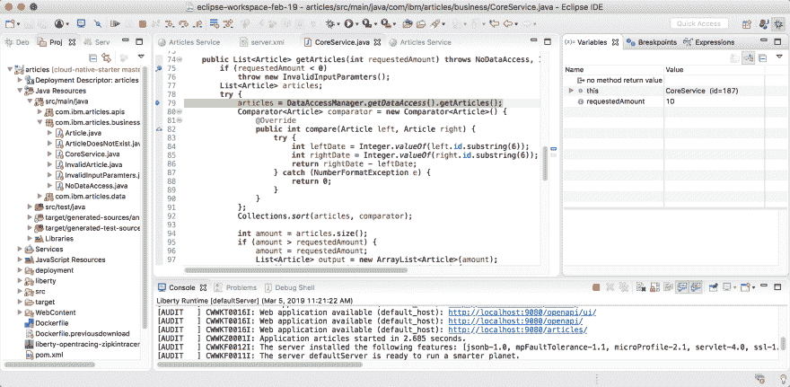

# 调试在 Kubernetes 中运行的微服务

> 原文：<https://dev.to/nheidloff/debugging-microservices-running-in-kubernetes-3f2b>

为了学习更多关于微服务、容器编排和服务网格的知识，我用 Minikube、Istio 和 Kiali 之类的工具建立了一个本地开发环境，并创建了一个[示例应用](https://github.com/nheidloff/cloud-native-starter)。在本文中，我描述了如何在本地调试这些服务。

微服务可以用多种语言和多种框架开发。对于不同的实现类型，有专门的和已建立的 ide(集成开发环境)和工具来调试单个服务。

调试云原生应用程序时的新挑战是，应用程序通常有许多微服务，它们之间有大量的通信。仅测试和调试单独的服务是不够的。

**要求**

下面是我的调试需求列表。在最佳情况下，我想…

*   在我最喜欢的 IDE 中本地运行和调试我的代码(而不是使用缓慢的远程调试器)
*   将单个服务作为整个应用程序的一部分运行，例如从另一个服务调用它(而不是仅仅通过单元测试和模拟对象)
*   在与生产环境相同的本地容器中运行代码(而不是在本地安装应用服务器)
*   在本地修改代码并立即测试它们(而不是重启容器)

**网真**

调试微服务有几种不同的方法。一个很好的解决方案是使用 [Telepresence](https://www.telepresence.io/) ，这是一个开源工具，用于“KUBERNETES 和 OPENSHIFT 微服务的快速本地开发”。

这里有一个例子。我正在使用一个简单的应用程序,到目前为止它有两个微服务。BFF(后端对前端)“web-api”微服务调用另一个“文章”微服务。我想在本地调试“文章”服务，并让“web-api”服务调用它，它运行在 Kubernetes 集群中。

我在 Eclipse 中用 JavaEE、OpenJ9、 [Open Liberty](https://openliberty.io/) 和 MicroProfile 实现了这些服务。有很多关于如何通过 [Open Liberty 工具](https://github.com/OpenLiberty/open-liberty-tools)在 Eclipse 中调试 Open Liberty 的文档。您可以将“文章”服务作为现有的 Maven 项目导入。为了在本地 Open Liberty 服务器上运行该服务，您需要检查“项目方面”设置中的“动态 Web 模块”。在此之后，您可以启动本地 Open Liberty 服务器。

为了在 Kubernetes 上运行“文章”服务，我编写了一个简单的[脚本](https://github.com/nheidloff/cloud-native-starter/blob/master/scripts/deploy-articles-java-jee.sh)来部署它。这里是 [yaml](https://github.com/nheidloff/cloud-native-starter/blob/master/articles-java-jee/deployment/kubernetes.yaml) 文件:

```
kind: Service
apiVersion: v1
metadata:
  name: articles
  labels:
    app: articles
spec:
  selector:
    app: articles
  ports:
    - port: 9080
      name: http
  type: NodePort
---

kind: Deployment
apiVersion: apps/v1beta1
metadata:
  name: articles
spec:
  replicas: 1
  template:
    metadata:
      labels:
        app: articles
        version: v1
    spec:
      containers:
      - name: articles
        image: articles:1
        ports:
        - containerPort: 9080 
```

现在是激动人心的部分。Telepresence 允许您将 Kubernetes 中运行的 pod 与本地运行的服务进行交换。Kubernetes 中对 pod 的所有请求都被重定向到本地 URL 和端口。

安装[网真](https://www.telepresence.io/reference/install)后，可以运行以下命令:

```
$ telepresence --method inject-tcp --swap-deployment articles --expose 9080:9080 
```

[](https://thepracticaldev.s3.amazonaws.com/i/nw4w9rljd3g8b1u037kg.png)

一旦 Kubernetes 远程端口 9080 被映射到本地端口 9080，就可以从 Kubernetes 中运行的“web-api”服务调用本地运行的服务。最棒的是，您还可以使用 Eclipse 调试器，就好像一切都将在本地运行一样。

[](https://thepracticaldev.s3.amazonaws.com/i/8k2f2lsf3g3ayjndn5h1.png)

**从本地服务呼叫 Kubernetes**

通过这种简单的设置，Kubernetes 中的服务可以调用本地服务。不幸的是，另一个方向行不通。例如，本地运行的服务“web-api”不能通过 [http://articles:9080](http://articles:9080) 调用 Kubernetes 服务“articles”。

幸运的是，网真自带一个[机制](https://www.telepresence.io/tutorials/java)来支持这一点。本质上，您可以在本地 Docker 容器中运行您的代码，并使用远程调试器来调试它。Telepresense 可以用一个双向代理来代替 Kubernetes pod，该代理处理到本地 Docker 容器的流量。甚至支持“热代码替换”(参见文档)。

我还没有尝试过双向通信，但功能听起来很有前途，会满足上述要求！

如果您想尝试一下，使用[示例应用程序](https://github.com/nheidloff/cloud-native-starter)，建立一个[本地开发环境](http://heidloff.net/article/setup-local-development-kubernetes-istio)，并按照上面的说明进行操作。