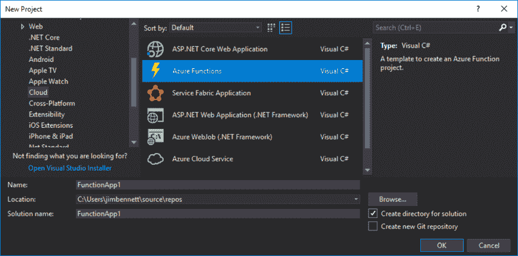
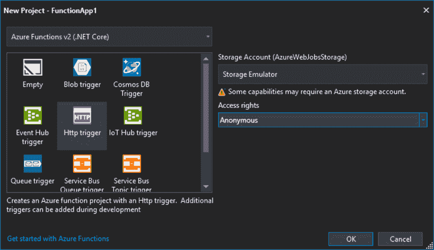
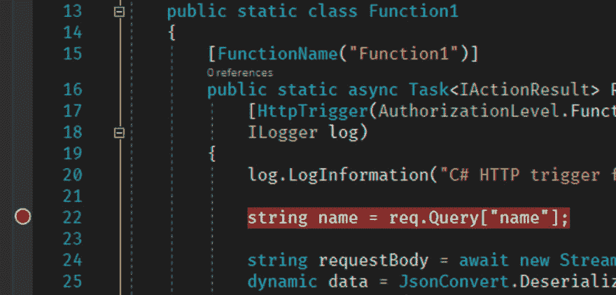
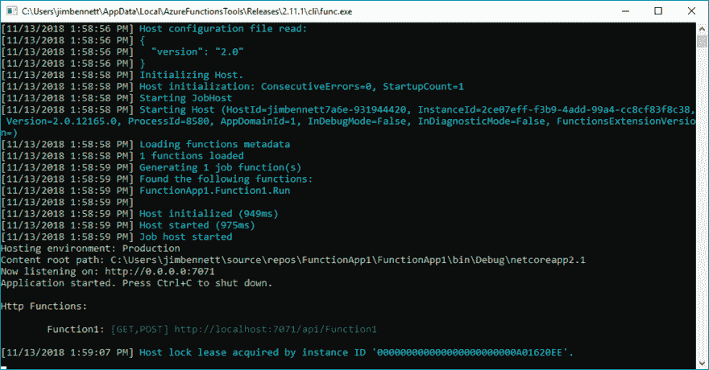
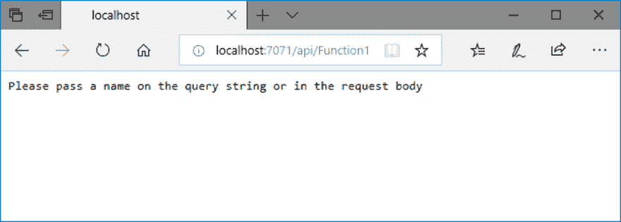
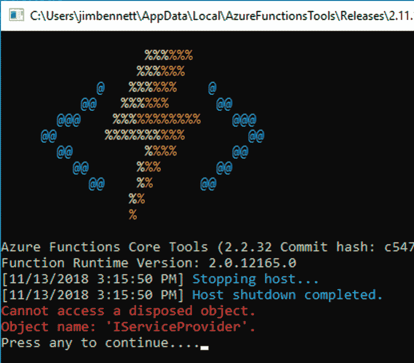
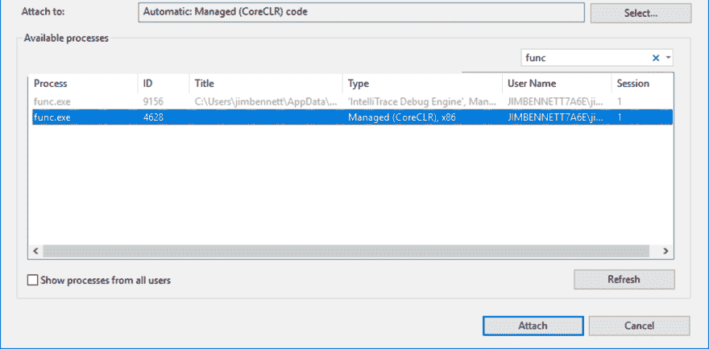
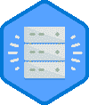

# 同时调试多个 Azure 函数应用

> 原文：<https://dev.to/azure/debugging-multiple-azure-functions-apps-at-the-same-time-1ka4>

牙医不想让你知道这 5 个提示，它们展示了在本地运行多个 Azure Functions 应用程序并同时调试它们是多么容易！

3 号会让你大吃一惊！

[](https://res.cloudinary.com/practicaldev/image/fetch/s--4_F0LPXO--/c_limit%2Cf_auto%2Cfl_progressive%2Cq_auto%2Cw_880/https://www.jimbobbennett.io/conteimg/2018/11/andre-guerra-676198-unsplash.jpg)

废话说够了，上帖子。

我最近构建了一个[演示应用](https://github.com/jimbobbennett/AzurePhotoSharer)，其中有两个 Azure Functions 项目——一个使用新的 V2 函数运行时并用 C#编写，另一个使用旧的 V1 运行时，以便它可以访问一些。NET 框架位并用 F#编写。

Azure Functions 提供的一个非常酷的功能是能够[在本地](https://docs.microsoft.com/azure/azure-functions/functions-develop-local/?WT.mc_id=debugfunctionslocally-devto-jabenn)运行您的函数，并提供完整的调试体验，这在 Visual Studio 2017 和 VSCode 中都受到支持。

> 本帖重点介绍如何在 VS2017 中做到这一点。对于 VSCode，遵循这些指令[。](https://code.visualstudio.com/tutorials/functions-extension/run-app/?WT.mc_id=debugfunctionslocally-devto-jabenn)

这篇文章着眼于:

*   调试一个功能应用程序
*   如何同时运行多个功能 app
*   如何使用 Visual Studio 2017 同时调试多个函数应用程序

### 调试一个功能 app

这很容易自己尝试，只需在 Visual Studio 中创建一个新的 Azure Functions 应用程序，在 HTTP 触发器中添加一个断点，然后开始调试。Azure Function 应用程序将在本地 functions 主机中启动，您的触发器将在本地`http://localhost:7071/api/Function1`可用——因此监听端口`7071`。您可以启动您最喜欢的浏览器，导航到这个 URL，您的断点将被命中，通过观察、编辑和继续以及所有正常的功能提供完整的调试体验。

创建其中一个:

[](https://res.cloudinary.com/practicaldev/image/fetch/s--6Talb2lL--/c_limit%2Cf_auto%2Cfl_progressive%2Cq_auto%2Cw_880/https://www.jimbobbennett.io/conteimg/2018/11/2018-11-13_13-53-20.png)

使用这些设置(V2、HTTP 触发器、匿名):

[](https://res.cloudinary.com/practicaldev/image/fetch/s--h2AZ_FPc--/c_limit%2Cf_auto%2Cfl_progressive%2Cq_auto%2Cw_880/https://www.jimbobbennett.io/conteimg/2018/11/2018-11-13_13-54-12.png)

在函数中插入一个断点:

[](https://res.cloudinary.com/practicaldev/image/fetch/s--RAPDyj_Q--/c_limit%2Cf_auto%2Cfl_progressive%2Cq_auto%2Cw_880/https://www.jimbobbennett.io/conteimg/2018/11/2018-11-13_13-56-31.png)

像任何普通应用程序一样开始调试功能(您可能需要授予防火墙访问权限)。这将启动一个控制台窗口，运行函数 host 您将看到一些很酷的 ASCII 艺术，然后是函数输出，包括所有 HTTP 触发器的 HTTP URLs:

[](https://res.cloudinary.com/practicaldev/image/fetch/s--HFQchVCK--/c_limit%2Cf_auto%2Cfl_progressive%2Cq_auto%2Cw_880/https://www.jimbobbennett.io/conteimg/2018/11/2018-11-13_14-00-39.png)

现在，启动您最喜欢的浏览器，导航至功能 1 URL。该函数将运行，您的断点将被命中。这是带有“编辑并继续”的完整调试会话:

[](https://res.cloudinary.com/practicaldev/image/fetch/s--9N3LmvHG--/c_limit%2Cf_auto%2Cfl_progressive%2Cq_auto%2Cw_880/https://www.jimbobbennett.io/conteimg/2018/11/2018-11-13_14-02-14.png)

点击**继续**，在浏览器中查看函数输出:

[](https://res.cloudinary.com/practicaldev/image/fetch/s--L2nOBMz1--/c_limit%2Cf_auto%2Cfl_progressive%2Cq_auto%2Cw_880/https://www.jimbobbennett.io/conteimg/2018/11/2018-11-13_14-12-18.png)

> 还有一个存储模拟器，您可以在本地运行，这样您就可以读/写 blobs、表和队列，甚至可以使用触发器。点击阅读更多[。](https://docs.microsoft.com/azure/storage/common/storage-use-emulator/?WT.mc_id=debugfunctionslocally-devto-jabenn)

### 同时运行多个功能 app

本地运行一个功能 app 很酷，运行多个更酷！

[](https://res.cloudinary.com/practicaldev/image/fetch/s--tLaFzb-t--/c_limit%2Cf_auto%2Cfl_progressive%2Cq_auto%2Cw_880/https://www.jimbobbennett.io/conteimg/2018/11/2018-11-13_14-12-18-1.png)

向您的项目添加一个新的函数应用程序，然后使用*Debug->Start without Debug*运行它而不进行调试。这将启动本地 Azure Functions 主机并开始监听端口`7071`。

现在，眼尖的你们会注意到这是第一个函数应用程序的同一个端口。默认情况下，本地函数主机监听端口`7071`上的 HTTP 请求，因此如果您现在启动第一个函数应用程序，它将会失败——并出现一个非常奇怪的错误:

```
Cannot access a disposed object.
Object name: 'IServiceProvider'. 
```

Enter fullscreen mode Exit fullscreen mode

[](https://res.cloudinary.com/practicaldev/image/fetch/s--EcQH9Gnp--/c_limit%2Cf_auto%2Cfl_progressive%2Cq_auto%2Cw_880/https://www.jimbobbennett.io/conteimg/2018/11/2018-11-13_15-17-57.png)

解决这个问题的方法是告诉函数主机在不同的端口上运行，这可以通过向调试函数应用程序时运行的命令行添加参数来实现。关闭所有功能主机，打开第二个功能应用的属性。转到**调试选项卡**，将应用程序参数设置为:

```
host start --pause-on-error --port 5860 
```

Enter fullscreen mode Exit fullscreen mode

这将在`port 5860`启动主机监听功能。当然，你可以使用任何你想要的端口。

> 这些设置不会保存在项目本身中，只是保存在您的用户设置中，因此不会在源代码控制中。

现在，如果您运行第二个功能应用程序，它将监听不同的端口:

[](https://res.cloudinary.com/practicaldev/image/fetch/s--YU_Vg-Si--/c_limit%2Cf_auto%2Cfl_progressive%2Cq_auto%2Cw_880/https://www.jimbobbennett.io/conteimg/2018/11/2018-11-13_15-25-31.png)

### 在 VS2017 中调试多个功能 app

运行多个很好，但是调试它们更好！

[](https://res.cloudinary.com/practicaldev/image/fetch/s--lwUWg4RL--/c_limit%2Cf_auto%2Cfl_progressive%2Cq_auto%2Cw_880/https://www.jimbobbennett.io/conteimg/2018/11/rawpixel-974535-unsplash.jpg)

虽然 Visual Studio 2017 不能同时启动多个应用程序，但您可以启动一个应用程序，然后附加到其他应用程序。为此:

*   将断点放在两个函数应用的 HTTP 触发器中
*   不调试启动第一个功能 app
*   通过调试器启动第二功能 app
*   将调试器附加到第一个功能应用程序:
    *   选择*调试- >连接*到过程...
    *   搜索功能
    *   一个`func.exe`进程将变灰——这是当前正在调试器中运行的进程。选择另一个并点击**连接**。

[](https://res.cloudinary.com/practicaldev/image/fetch/s--mcr3XoNG--/c_limit%2Cf_auto%2Cfl_progressive%2Cq_auto%2Cw_880/https://www.jimbobbennett.io/conteimg/2018/11/2018-11-13_15-39-25.png)

现在，您应该能够在浏览器中打开`http://localhost:7071/api/Function1`并在您的第一个功能应用程序中点击断点，在第二个功能应用程序中打开`http://localhost:5860/api/Function1`并点击断点。

> 你不能在你附加的函数应用程序中获得“编辑并继续”，只能在通过原始调试器运行的应用程序中获得。如果您想要“编辑并继续”,请确保您要使用的功能应用程序通过调试器运行，并附加到其他应用程序。

* * *

想了解更多关于 Azure 函数的知识？作为微软学习的一部分，我们有一个学习途径。点击这里查看[。](https://docs.microsoft.com/learn/paths/create-serverless-applications/?WT.mc_id=debugfunctionslocally-devto-jabenn)

[](https://res.cloudinary.com/practicaldev/image/fetch/s--8mbbfnLi--/c_limit%2Cf_auto%2Cfl_progressive%2Cq_auto%2Cw_880/https://www.jimbobbennett.io/conteimg/2018/11/create-serverless-applications.svg)