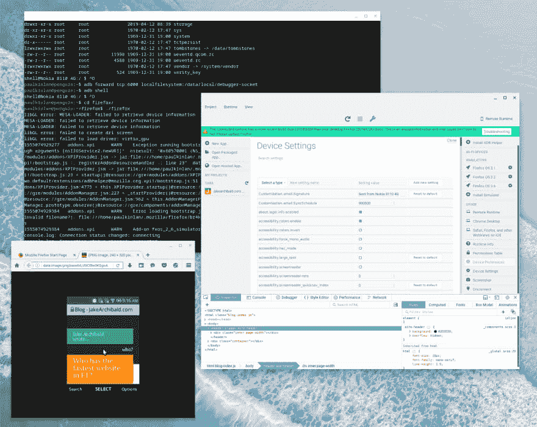

# 使用 Chrome 操作系统调试带有 KaiOS 的诺基亚 8110 的网页

> 原文：<https://dev.to/chromiumdev/debugging-web-pages-on-the-nokia-8110-with-kaios-using-chrome-os-4h8c>

这篇文章是关于使用 Web IDE 调试 [KaiOS 设备的文章的延续，但是你现在可以使用 Chrome OS (m75)和 Crostini，而不是使用 macOS。](a%20href=%22https://paul.kinlan.me/debugging-web-pages-on-the-nokia-8110-with-kaios/%22>https://paul.kinlan.me/debugging-web-pages-on-the-nokia-8110-with-kaios/</a)

我从 [KaiOS 环境设置](a%20href=%22https://developer.kaiostech.com/environment-setup%22>https://developer.kaiostech.com/environment-setup</a)抄袭而来，这是一个好的开始，但对于使用 Chrome OS 和 Crostini 来说还不够。以下是我遵循的粗略指南。

确保您使用的至少是 Chrome OS m75(截至 4 月 15 日，目前为开发频道)，然后:

1.  确保您启用了 Crostini USB 支持-[chrome://flags/# cros TiNi-USB-support](https://dev.tochrome://flags/#crostini-usb-support)
2.  打开克罗斯蒂尼的终点站
3.  你需要确保你已经安装了 USB 工具。
4.  `lsusb` -你现在应该可以看到你连接的设备了，如果还是不行，可能是另一个问题。
5.  `sudo apt-get install --no-install-recommends autoconf2.13 bison bzip2 ccache curl flex gawk gcc g++ g++-multilib git lib32ncurses5-dev lib32z1-dev libgconf2-dev libgl1-mesa-dev libx11-dev make zip lzop libxml2-utils openjdk-8-jdk nodejs unzip python`
6.  `sudo apt install android-tools-adb android-tools-fastboot`
7.  我不确定我是否需要它，但是我也跑了
8.  `sudo chmod a+r /etc/udev/rules.d/51-android.rules`然后将设备供应商 ID 添加到文件中。

如果以上都完成了，那么您应该能够`adb devices`并获得您的连接设备列表。