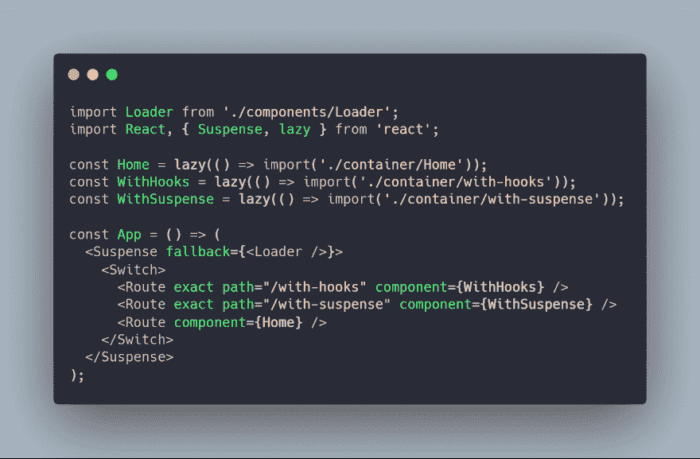
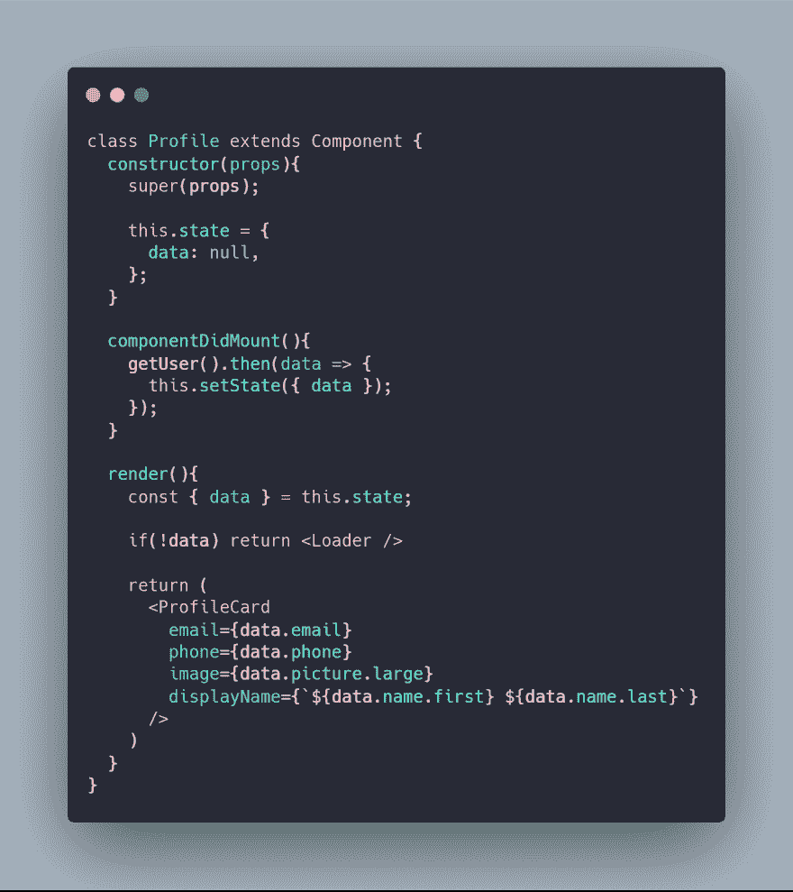
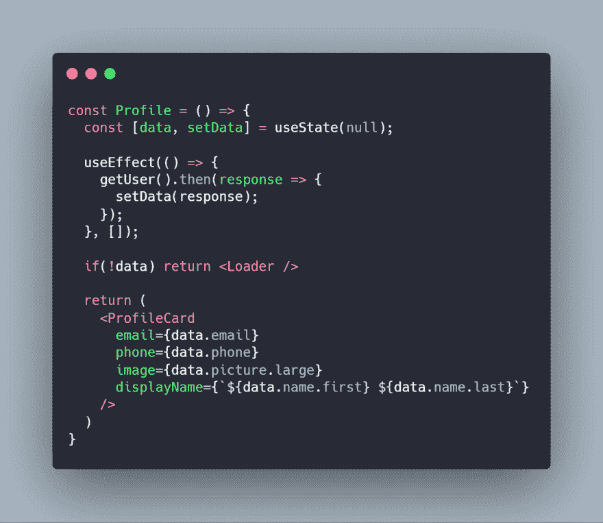
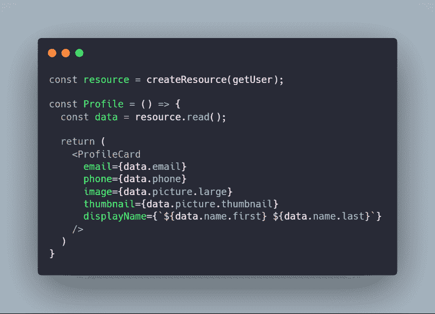
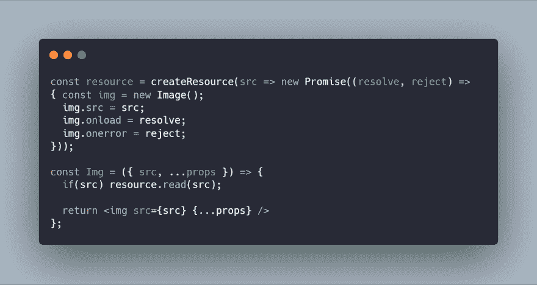
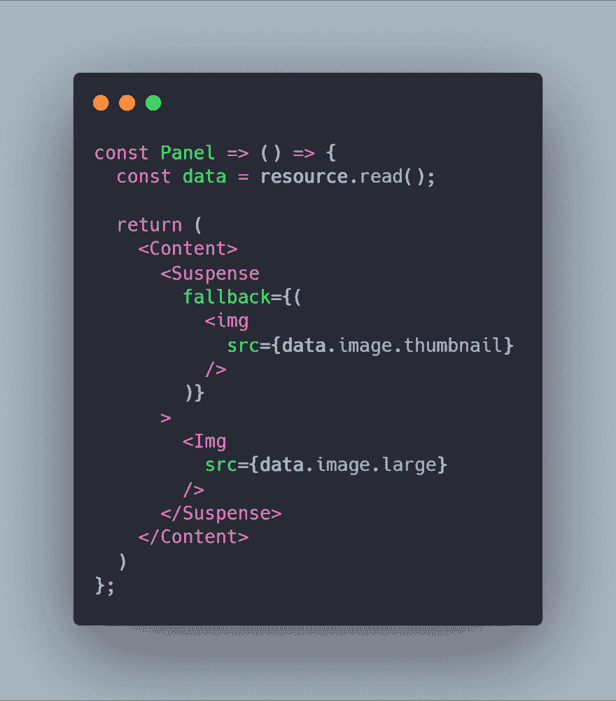
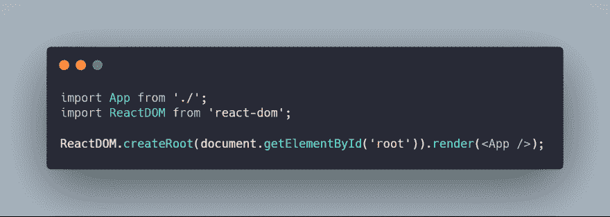

# 使用 React 进行声明性资源加载

> 原文：<https://dev.to/josemunoz/declarative-resource-loading-with-react-51pc>

由@ Alex Jones on unsplash.com 的^(photo)

# 装东西很难

你们中有多少人写的单词*一天要加载*10 次？很多时候，我们希望我们的应用程序即使在慢速连接时也能响应，所以我们有加载指示器来给用户反馈应用程序正在工作。如果你考虑你的应用程序，大量的时间和精力都集中在协调什么时候输入，什么时候输出，以及向用户显示什么。这是我们的浏览器使用的任何资源，甚至是我们没有明确获取的资源，如图像、字体、代码等。影响我们的时间互动和 UX。在本帖中，我们将看看在我们的应用程序中加载资源的几种方法，以及这在不久的将来会如何发展。

# 代码拆分

代码分割是指只发送加载正在访问的页面所需的代码，然后在用户导航时将其余代码发送给客户端。虽然有很多其他方法可以实现这一点，React 有几个 API 可以帮助我们将包分成代码块，这些代码块以最有效的方式分组，以减少文件大小。为了拆分我们的应用程序，我们需要的第一个 API 叫做 lazy，它非常简单，它采用一个函数返回一个动态导入，然后它就可以直接替代您的组件。

另一个 API 叫悬疑。暂记帮助我们确定我们试图调用的资源是否可用，并在资源可用时显示另一种加载状态。换句话说，悬念是一个声明性的加载状态 API。

# 数据抓取

看看下面这个传统的基于类的数据获取组件的例子:

它在构造函数上初始化状态，在装载时获取数据，并在呈现时评估是否有数据要呈现，或者是否可以显示加载器回退。你一定在想，使用钩子当然会更好，对吗？

有了钩子，您可以使用 effects 获取数据，并强制检查加载状态以显示加载器，直到资源可用。我们减少了一些样板代码，使其更干净，但它仍然是相同的过程，它仍然强制性地决定是否呈现加载程序或内容。

到目前为止，我们只能使用悬念来加载 lazy 的动态代码，但实际上，我们也可以将它用于其他类型的资源。你可以挂起组件层次结构中的任何元素，如果调用资源不能挂起该子树的呈现并提供一个后备，它将在树中查找，直到找到一个可以挂起或出错的元素，它就像一个错误边界一样工作。

暂停允许异步资源表现得好像它们有同步访问权限一样。我们现在甚至在获取组件上没有加载器，我们只是让 React 知道资源还没有准备好，而悬念将沿着树的某个地方提供一个后备，以等待我们的资源准备好呈现。

悬念不仅通过指数级减少我们的代码行来改善我们的 DX，而且它还允许加载状态之间更平滑的转换，比如当你的应用程序从延迟加载代码到获取数据时。

# 其他资源

另一个很好的例子是图像，有时我们的页面渲染和一些图像丢失，对这些资源的请求可能会更重。让我们做我们的新把戏，用悬念加载一个图像。

当然，你不一定要自己做这些，[-platform](https://github.com/palmerhq/the-platform)是一个漂亮的库，它为你提供了包装好的图像组件和其他准备就绪的资源。

作为一个后备方案，你可以用一个普通的``标签来代替一个微调器，它将提供缩略图和全尺寸图像之间的平滑过渡。

# 严格模式

现在我们加载了一些资源，如果继续加载，我们的应用程序可能会开始变慢，我们需要决定我们愿意为每个资源等待多长时间。我肯定需要首先检索代码和数据，但是为了交付一个几乎完整的 UI，我可以多显示几秒钟低分辨率的缩略图。悬念为我们提供了第二个道具`maxDuration`，这个道具允许我们在 milis 中指定在它提供一个回退或内容之前应该等待多长时间。`maxDuration`只有在满足特定条件时才会起作用，这就是事情变得有点棘手的地方。

为了让 React 正确评估正在发生的事情，挂起的树中不应该有不赞成使用的 API。为了帮助我们识别可能的问题，React 公开了一个名为`StrictMode`的标签。严格模式是一个稳定的 API，你现在就可以在生产中使用它，没有什么会中断，但是，如果在它的子节点中使用了任何不赞成使用的 API，你将会在你的浏览器控制台上得到错误。

# 并发渲染

如果你在严格模式下包装了你的应用程序，而你的控制台仍然是清晰的，那么恭喜你！您现在能够激活并发模式并开始利用`maxDuration`。但是*并发模式*到底是什么？用丹·阿布拉莫夫的话说:

> 并发模式让 React 应用程序能够在不阻塞主线程的情况下渲染组件树，从而提高响应速度。它是可选的，并允许 React 中断长时间运行的呈现(例如，呈现新的提要故事)来处理高优先级事件(例如，文本输入或悬停)。并发模式还通过跳过快速连接上不必要的加载状态来改善用户的悬念体验。

有两种方法可以在您的应用中启用并发模式，同样，这些功能是实验性的，预计将于 2019 年 Q2 发布。React-dom 公开了一个名为`createRoot`(目前为 *unstable_createRoot* )的函数，它接收对应用将被渲染的元素的 dom 引用，你可以用应用实例链接一个`render`方法。

作为一个可选功能，React 公开了一个名为`ConcurrentMode`的标签，您可以使用它来包装应用程序的子部分，以便只在它们的子树中启用并发渲染。

如需演示，请访问[https://sdjs-demo . jdmg 94 . now . sh](https://sdjs-demo.jdmg94.now.sh)
完整源代码请访问:

## [jdmg 94](https://github.com/jdmg94)/[sdjs-悬疑-演示](https://github.com/jdmg94/sdjs-suspense-demo)

### 一个简单的数据获取演示程序，使用了类、钩子和悬念。大约 2019 年

<article class="markdown-body entry-content container-lg" itemprop="text">

# 圣地亚哥 JS React 每月演示

一个快速的数据获取演示，用类、钩子和悬念演示了数据获取。包括使用 React *lazy* 的代码分割、并发模式以及使用悬念的数据和图像获取。

### 使用

选项显示在主页上，类和挂钩的工作方式几乎相同，它们都在 mount 上加载数据，并且是强制性的，因此如果事情没有及时完成，您可以在加载器上看到一个小的*‘jump’*。相比之下，使用悬念，我们不仅进一步减少了代码样板文件，而且允许我们将数据视为同步操作，它将使用错误边界的代数效应来查找其树中最近的回退，并等待直到一切都准备好利用并发模式进行呈现。

如果您打开悬念示例页面，您将…

</article>

[View on GitHub](https://github.com/jdmg94/sdjs-suspense-demo)