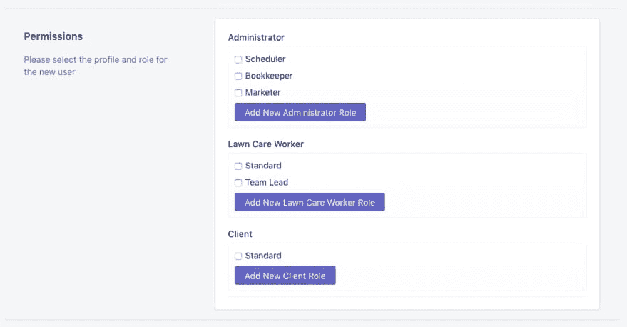
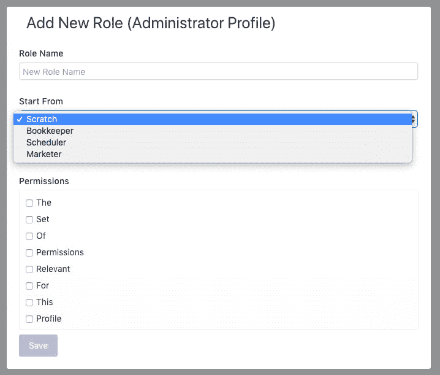

# 基于活动的权限系统中的用户类型和角色

> 原文：<https://dev.to/craigmichaelmartin/decoupling-user-profiles-from-user-roles-in-activity-based-permission-systems-1lm>

*在基于活动的权限系统中将用户类型与用户角色分离*

#### TLDR；

假设我们正在开发一个应用程序。在我们的应用程序中，我们应该有许多粒度级的原子权限。我们应该支持角色(权限分组)，但这是由管理员用户为他们的组织定义的，所以对我们来说是 100%任意的。这些角色应该存在于简档类型中，简档类型的*是由我们定义的*，并且用于知道我们正在与哪种“类型”的用户打交道。一个用户可以在多个简档中拥有多个角色，但一次只能充当一个简档。我们的应用程序代码在处理用户时，可以检查他们的个人资料(即`user.is(Profile)`来回答“我们应该把他们送到哪里？”)或者执行许可检查(即`user.can(Operation, Object)`来回答问题“当他们到达那里时，他们应该能够做什么/看到什么？”).

## 概念

**权限**

*   权限是一种基于活动的细粒度访问控制。
*   权限由开发团队指定。

**配置文件**

*   简档是应用程序中支持的用户类型。
*   概要文件是由开发团队指定的。
*   简档(用户类型)用于确定用户应该去哪里。它们与应用程序中构建的曲目相对应(例如，转到哪个仪表板)。
*   对于每个简档，组织创建他们自己的角色。
*   一个用户可能在多个简档中拥有角色。

**角色**

*   角色是对简档的一组权限。
*   角色不是由开发团队指定的，完全是任意的，而是由特权用户为他们的组织指定的。
*   一个用户可能在每个配置文件中有多个角色。

**用户**

*   一个用户只有一个活动简档(至少有一个角色)，但可以切换简档。
*   一个用户可能在多个组织中拥有角色。

**组织**

*   组织是具有内部层次结构的分组实体。
*   组织的配置文件存在角色。

档案的存在是为了回答与应用程序处理的用户“类型”相关的问题。存在回答与用户可以拥有什么访问权限相关的问题的权限。(例如，配置文件:“用户是否应该被路由到管理或附属仪表板？”vs 权限:“一旦被路由，他们应该看到什么，并且能够编辑什么？”)角色的存在是为了使权限易于管理。

如果没有配置文件，您最终会得到一组虚假的权限——“权限”，这些权限实际上只是对用户的类型感兴趣(例如，canSeeAdminDashboard 和 canSeeAffiliateDashboard 实际上只是关于使用应用程序的用户类型的问题)。

如果没有角色，每个用户都是一次性的权限集。例如，如果您要创建多个用户来管理发票，您必须为每个用户重新选择完全相同的权限，包括几个月后您雇佣另一个人来管理发票。或者，假设一个新的发票功能稍后出现。您必须记住哪些用户在做发票工作，并用这个新的权限更新每个用户。

如果没有组织，角色必须是全球性的，由开发团队管理。相反，系统中的每个组织可以为他们适用的概要文件配置他们自己的角色——选择由开发团队为该概要文件定义的权限。

## 图式

```
operation               # actions types in the system (read, edit, create, etc)
- id

object                  # entity types to be acted upon (invoices, customers, etc)
- id

permission              # atomic abilities in the app
- id
- operation_id
- object_id

role                    # an organization's group of permissions for a profile
- id
- value
- label
- profile_id
- organization_id

role_permission         # specifies which permissions are in a role
- id
- role_id
- permission_id

profile                 # a supported user identity type in the app
- id
- value
- label

profile_permission      # specifies which profiles a permission is valid for
- id
- permission_id
- profile_id

organization
- id

user
- id
- active_profile_id

user_role               # specifies the roles a user has
- user_id
- role_id

# There would be no `user_profile` table, as access to a profile is a permission 
```

## 代码

`User`

*   `is(Profile)` -返回用户是否主动充当某个简档类型(回答诸如“我们应该将该用户发送到哪里？”)
*   `can(Operation, Object, Organization?)` -遍历用户活动简档的角色(针对特定组织，如果提供的话)，以确定他们是否有权限(回答诸如“用户应该能够查看/更改哪些资源？”)
*   `switchProfile(Profile)` -更改用户的活动档案

## 让它不那么抽象:一个例子

假设你和我为草坪护理企业开发了一个应用程序。

*   *草坪护理业主*登录创建客户，创建员工，给员工分配工作，给客户发发票，给客户写关于草坪护理技巧的每月简讯。
*   *草坪护理人员*登录查看他们的日程安排。
*   *客户*登录支付他们的发票，并查看过去的发票。
*   作为会员系统的一部分，*房主协会*可以登录查看他们社区的客户。
*   产品营销公司可以登录这个应用程序发布广告，因为它对企业主是免费的。
*   最后，*内部员工*(你和我以及我们的员工)可以登录查看数据、指标、图表等。

因此，我们创建了这六个配置文件:

*   草坪护理管理员
*   草坪护理员
*   客户
*   房主协会代表
*   品牌代表
*   内部员工

虽然每个配置文件都是已知的，并且对我们有特殊的意义，但是角色都是用户生成的，在我们的代码中永远不会被引用或知道。

我们先来看前三个。

开始时，所有者在每个概要文件中创建一个角色，并将其分配给自己。随着公司的发展，他为每一个部门雇佣员工，很快就有了多种类型的员工:仅仅在行政部门，一个经理安排客户并为他们指派草坪护理人员；记账员查看已付/未付财务；一个负责撰写时事通讯的市场实习生。类似地，在他不断壮大的草坪护理人员队伍中也出现了等级制度，限制了新人的权限，而允许团队领导拥有全部权限。最后，在接受商业客户时，会创建一个具有不同权限的角色。

```
Administrator
 - Scheduler
 - Bookkeeper
 - Marketer

Lawn Care Worker
 - Entry Level
 - Experienced
 - Team Lead

Client
 - Residential
 - Commercial 
```

实际上，这些角色的焦点不是“谁”，而是“什么”。例如，如果上面定义的住宅和商业之间的差异实际上是业主允许客户支付方式的差异，那么拥有“trusted_payer”权限将更有意义，该权限允许客户不将他们的信用卡存档，而是代之以开具发票等。然后，当所有者最喜欢的客户读到信用卡诈骗并要求开具发票而不是他的信用卡存档时，该用户的帐户可以进行有意义的更新。记住，一个用户可以有多个角色，这不是一个非此即彼的问题。权限只是为了方便和一致而对权限进行“分组”！他们*不是*创造完全描述性的类别。(作文 vs 类别)

下一类登录我们应用的用户是*房主协会代表*。他们决定创建一个具有有限权限的角色，并允许 HOA 成员查看 HOA 新收入来源的一些指标。

```
Homeowner Association Rep
 - President
 - Member 
```

下一类用户是品牌代表。他们登录以查看其活动的广告指标，并为其实习生创建了一个具有有限权限的角色。

```
Brand Rep
 - Full
 - Intern 
```

最后一类用户是*内部员工*用户。这些是你和我的员工，他们登录查看和配置数据。

```
Internal Staff
 - Superuser
 - Customer Support
 - Marketer 
```

上述六个配置文件中的每一个角色都是特定于创建它们的“组织”的。在前三种情况下，这些角色是草坪护理业务组织的一部分；对于 HOA 代表档案，hoa 组织；对于品牌代表档案，品牌组织；最后是我们的雇主，一个内部员工组织。

这听起来可能很奇怪，这些组织不是平行的。如果一个组织包括业务或 hoa 或品牌的具体细节，这是正确的，但我们的组织没有。该数据将有一个单独的“业务”/“Hoa”/“品牌”表。组织只是一个用于许可的实体，并不与业务、hoa、品牌、租户、企业集团或任何您可能使用的分组相关联。

用户可以根据他们的角色(组织感知的)在组织内执行操作。

假设一个用户是:

*   客户同时使用汤姆的草坪护理(每周修剪)和杰克的景观美化(不太频繁的景观调整)
*   业主协会的主席，并使用附属推荐计划为他们的 HOA(蓝色草地)筹集资金
*   我们应用公司的营销员工，使用 staff 应用。

这个用户帐户与四个不同的组织相关联:Tom 的、Jack 的、Blue Meadows 的和 Internal Staff 的。它与三种不同的个人资料相关联:客户、房主协会代表和内部员工。

当该用户登录时，他们会看到自己的个人资料。如果他们选择内部员工，他们可以看到更好地营销我们的应用程序的指标和数据。如果他们选择房主协会代表，他们会看到一个指示板，上面有他们的介绍回扣。如果他们选择 Client，他们会看到 Tom 和 Jack 的发票，因为 Jack 给了他们更多的权限，所以他们可以看到他的成本明细项目。有一天，汤姆被互联网吓到了，取消了所有的客户权限，所以只有杰克出现在这里。

因此，一个用户可能拥有跨多个组织的多个角色的多个配置文件——但是我们的应用程序代码只关心配置文件、组织和权限(而不是角色)。如果 a

需要注意的是，配置文件中组织内的角色是“相加的”——即使配置文件中的一个角色缺少权限，如果另一个角色中存在该权限，则用户拥有该权限。

### 示例 ui

企业主将新用户与其组织相关联时权限的超级粗略演示示例 UI:
[](https://res.cloudinary.com/practicaldev/image/fetch/s--s4uN40xV--/c_limit%2Cf_auto%2Cfl_progressive%2Cq_auto%2Cw_880/https://thepracticaldev.s3.amazonaws.com/i/xpjvjly5q01506w13tqb.png)

企业主为其组织添加新角色的超级粗略演示示例:
[](https://res.cloudinary.com/practicaldev/image/fetch/s--hWOJ12Xw--/c_limit%2Cf_auto%2Cfl_progressive%2Cq_auto%2Cw_880/https://thepracticaldev.s3.amazonaws.com/i/ysy353ke6hqwqpc6002f.png)

当一个拥有多个配置文件的用户登录时，应用程序必须强制只允许用户作为一个配置文件(因此让用户选择哪个配置文件，或者默认为最后一个配置文件，等等)。

# 灵感/更好的文章:

[基于角色的访问控制](https://csrc.nist.gov/CSRC/media/Presentations/Role-based-Access-Control-an-Overview/images-media/alvarez.pdf)由美国国家标准技术研究院
提供[基于角色的访问控制](https://www.enterpriseready.io/square/role-based-access-control/)由 Square
提供[不做基于角色的授权检查；做基于活动的检查](https://lostechies.com/derickbailey/2011/05/24/dont-do-role-based-authorization-checks-do-activity-based-checks/)吴镇男·贝利