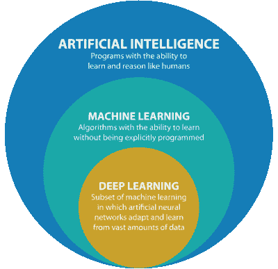
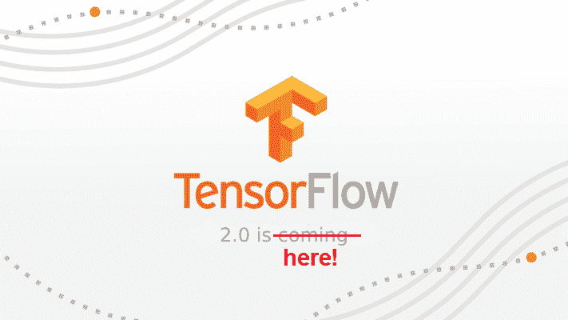
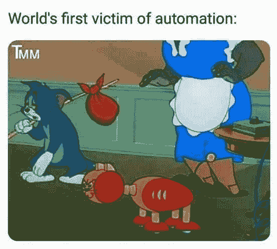
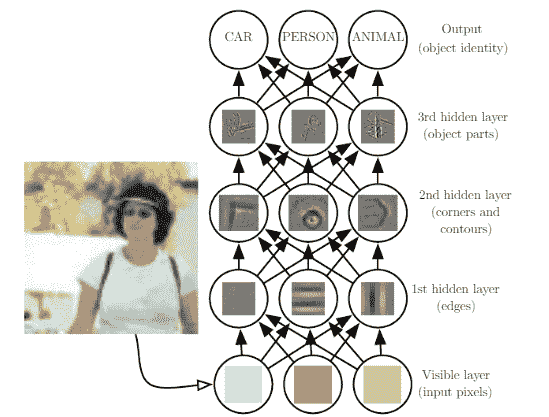
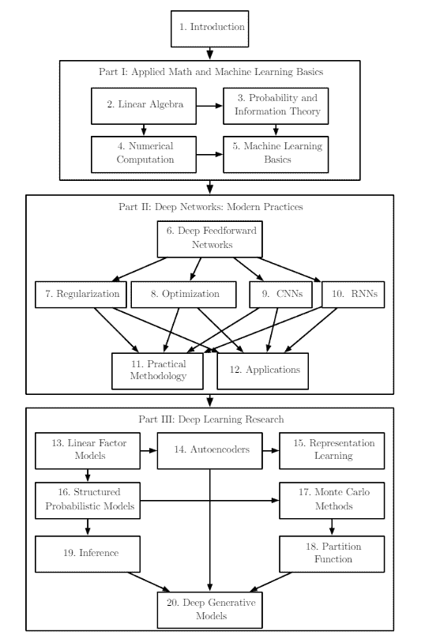
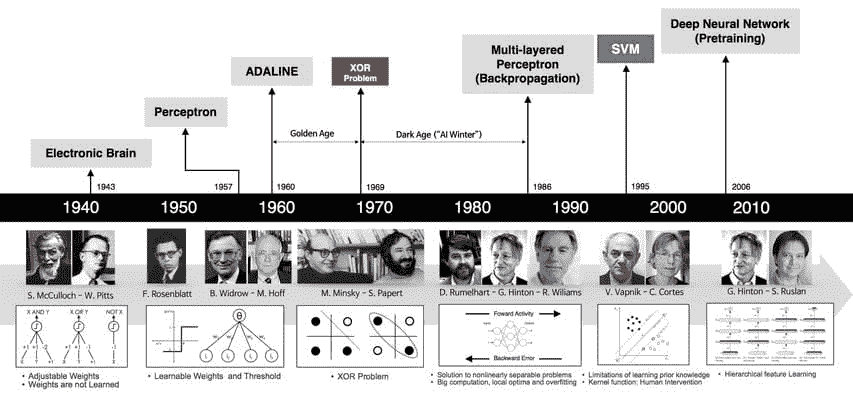

# TF 2.0 深度学习:01.00-简介

> 原文：<https://dev.to/mmithrakumar/deep-learning-with-tf-2-0-01-00-introduction-1310>

## 01.00 —前言

### 深度学习

[深度学习](https://www.deeplearningbook.org/)教材由伊恩·古德菲勒、约舒阿·本吉奥和亚伦·库维尔编写，这本书旨在帮助学生和从业者进入机器学习领域，特别是深度学习领域。这是我到目前为止发现的一本关于深度学习的优秀、全面的教科书，通篇优雅而严谨。这本书解释了正在发生的事情及其原因，这样你将能够做出原则性的决定，而不仅仅是盲目地实施事情。

这本书主要分为三个部分:

*   第一部分:应用数学和机器学习基础

*   第二部分:现代实用深度网络

*   第三部分:深度学习研究

有关章节的详细视图，请参见[索引](https://nbviewer.jupyter.org/github/adhiraiyan/DeepLearningWithTF2.0/blob/master/notebooks/Index.ipynb)。

这本书几乎包括了理解深度学习算法所需知道的一切，但这本书可能具有挑战性，原因有两个。

第一，这是一本理论性很强的书，是作为学术文本来写的，即使你有一整部分的应用数学背景，这本书仍然需要额外的数学背景，作者承认这一点。

第二，学习这些概念的最好方法是实践它，解决问题和解决编程示例，在搜索互联网后，没有完整的练习或编程指南到这本伟大的书。

最终导致我用 Tensorflow 2.0 写了[深度学习。我的目标是为看起来太复杂的部分提供解释，总结那些不复杂的部分，最后提供 Tensorflow 2.0 中的编程示例。](https://www.adhiraiyan.org/DeepLearningWithTensorflow.html)

### Tensorflow

Tensorflow 1.x 的主要瓶颈是它有很高的学习曲线，并且对于那些习惯于用命令式编程语言(如 Python)编程的人来说，声明式编程不是很直观。

Tensorflow 2.0 带来了重大变化，由于这些变化，如果您刚刚开始使用 Tensorflow，那么您将处于最佳位置。您可以直接投入并开始学习，而不必担心 Tensorflow 1.x。但那句老话怎么说来着，那些记不起过去的人注定会重复过去。听起来不是不祥之兆，但了解从 Tensorflow 1.x 到 Tensorflow 2.0 的变化将有助于新用户更好地理解和学习框架，如果您最终使用 Tensorflow 1.x 代码，那么您需要知道如何升级到 Tensorflow 2.0。

对于那些像我一样不得不努力学习 Tensorflow 1.x 框架的用户，我很抱歉我的朋友们，你们将不得不重新学习如何使用新框架并重写你们的代码库，但一个小小的安慰是，Tensorflow 1.x 并没有完全抛弃我们，Tensorflow 团队已经创建了 tf_upgrade_v2 实用程序来帮助将遗留代码过渡到新 API。但是转换工具并不完美，所以你可能仍然需要手动修改一些代码。简言之，TensorFlow 2.0 是向后不兼容的。

TensorFlow 1.x 的主要问题是难以学习、应用和调试，TensorFlow 2.0 通过以下方式解决了这一问题:

**急切执行**:这是一个命令式编程环境，可以立即计算操作，不需要构建图形，不像 Tensorflow 1.x 中使用 Python 作为图形的声明性元编程工具。简而言之，图和图运行时都被抽象掉了，这意味着没有会话和全局图状态。

更多 Tensorflow 1.x 和 Tensorflow 2.0 [的变化可以在这里](https://www.tensorflow.org/alpha)阅读。

如果你不明白 graph runtime 是什么意思，我想这是你第一次使用 Tensorflow，所以你是幸运的。

现在，我们回顾了过去，为未来准备了什么。Tensorflow 拥有一个全面、灵活的工具生态系统，包括 **[TensorFlow.js](https://www.tensorflow.org/js/)** 创建新的机器学习模型，并使用 JavaScript 部署现有模型， **[TensorFlow Lite](https://www.tensorflow.org/lite/)** 在移动和嵌入式设备上运行推理，如 Android、iOS、Edge TPU 和 Raspberry Pi，**[tensor flow Extended](https://www.tensorflow.org/tfx/)**部署生产就绪的机器学习管道，用于训练和推理。这使得研究人员可以推动机器学习的最新发展，开发人员可以轻松构建、部署和扩展机器学习驱动的应用程序。注意规模，还有谁比谷歌更适合教我们关于规模的知识呢？

## 01.01 —简介

人类长久以来一直梦想创造会思考的机器。这种欲望至少可以追溯到古希腊时期，追溯到像代达罗斯和赫菲斯托斯这样的人物，追溯到像加拉太亚、塔罗斯和著名的潘多拉这样的人造生命。不是阿凡达中的星球，而是潘多拉魔盒的神话😉。

甚至在可编程计算机发明之前，人们就梦想有软件来自动化日常工作，理解语音或图像，进行医学诊断。

好莱坞第一次提到人工智能要追溯到 1951 年的电影《地球静止的那一天》。

但这确实是自动化的第一个受害者:

从早期到现在，计算机擅长于人类认为困难的任务，真正的挑战仍然是那些人类认为容易并感觉自动的任务，如识别口语或驾驶。

这本书是关于这些更直观的问题的解决方案。

根据你学习人工智能和机器学习的来源，你甚至可能不熟悉作为一个独立学科的机器学习和深度学习，因为这些短语经常被互换使用。

深度学习是人工智能的方法之一。阅读深度学习在人工智能中的位置[这里](https://www.adhiraiyan.org/ai/what-it-means-to-have-ai)。

简而言之，我们允许计算机从经验中学习，并根据概念的层次来理解世界。如果我们画一个图表来显示这些概念是如何建立在彼此之上的，那么这个图表是很深的，有许多层。

下图显示了深度学习系统如何通过组合更简单的概念来表示人的概念，例如拐角和轮廓，这些概念又是根据边缘来定义的。

## 01.02 —谁应该阅读这本书

这本书最初是为两个目标读者写的:

1.  学习机器学习的大学生(本科生或研究生)，包括那些开始从事深度学习和人工智能研究的人。

2.  没有机器学习或统计背景，但希望快速获得一个并开始在其产品或平台中使用深度学习的软件工程师。

我的目标是将受众扩大到任何有兴趣开始学习深度学习、有限的机器学习、统计学、python 和 tensorflow 背景的人。请注意，我假设您对 python 有一个基本的了解，当我们更深入地学习这些材料时，我们将解决的问题可能最终会涉及 Python，在这些部分中，我将参考您可以用来学习 Python 的更多资源。

下面给出的是本书的高层组织。从一章到另一章的箭头表示前一章是理解后一章的先决材料。

如果你熟悉某些部分，可以跳过它们。

## 01.03 —深度学习简史

纵观历史，深度学习被称为许多名字，听起来像是推理小说的开头，在很大程度上，它曾经是，在某种程度上，它仍然是一个谜。在 20 世纪 40-60 年代，深度学习被称为控制论，在 80-90 年代，人们称之为连接主义，它在 2006 年以深度学习的名字复活。

深度学习的起源可以大致追溯到 1943 年，当时威廉·麦卡洛克和沃尔特·皮茨发表了[“神经活动中固有的思想逻辑演算”](https://dl.acm.org/citation.cfm?id=104377)，首次概述了神经网络的计算模型，即学习如何在大脑中发生或可能发生的模型。因此，深度学习的一个名字是**人工神经网络(ann)**。

那么，如果深度学习自 20 世纪 40 年代以来就已经存在，那么为什么它现在才到达主流计算受众？

主要的两个原因是海量数据的可用性和负担得起的图形处理单元(GPU)的不断增长的能力。

这是迄今为止深度学习的完整历史，它本身将需要一本书，所以我敦促感兴趣的读者阅读章节[简介](https://www.deeplearningbook.org/contents/intro.html)，但是如果你想直接进入，让我们从[线性代数](https://www.adhiraiyan.org/deeplearning/02.00-Linear-Algebra)开始。

## ❤️下篇:带 Tensorflow 的线性代数 2.0

阅读关于 Tensorflow 2.0 的[线性代数。](https://www.adhiraiyan.org/deeplearning/02.00-Linear-Algebra)

我很乐意听到你的意见，如果你需要更多的解释，有任何疑问或问题，你可以在下面评论或者通过[脸书](https://www.facebook.com/adhiraiyan)亲自联系我。

这是我的书《用 Tensorflow 2.0 进行深度学习》的第一章，我将每两周发布一次，所以请务必查看我的[博客](https://www.adhiraiyan.org/)的更新和 [Github](https://github.com/adhiraiyan/DeepLearningWithTF2.0) 的代码。