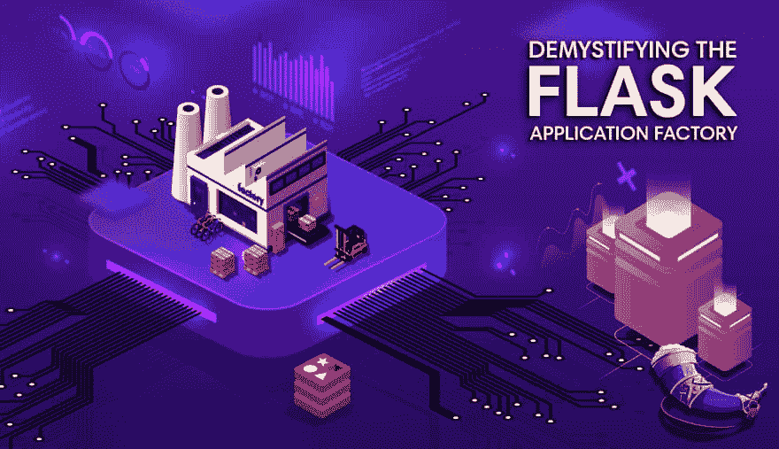

# 揭秘 Flask 的“应用工厂”

> 原文：<https://dev.to/hackersandslackers/demystifying-flasks-application-factory-o79>

[](https://res.cloudinary.com/practicaldev/image/fetch/s--KmK6WSlC--/c_limit%2Cf_auto%2Cfl_progressive%2Cq_auto%2Cw_880/https://cdn.hackersandslackers.com/2020/06/flask_factory-.jpg)

让我一直着迷的一个技能是，一些开发人员在回避对他们所做的事情的基本理解的同时，能在他们的职业生涯中走多远。我自己可能就是这种现象的典型代表，因为我已经设法欺骗了你(和成千上万的其他人),让你认为我有资格写值得信赖的教程。顺便说一句，谢谢你的阅读。

我提出幸福的无知是因为我发现大多数 Flask 教程是多么令人沮丧。我主要指的是 Flask 通常是如何作为一个超级简单的框架引入的，其中所有源代码和业务逻辑都属于一个名为 **app.py** 的文件。如果你曾经见过一个名为 **app.py** 的烧瓶教程，我敢打赌它看起来像这样:

<figure>

```
from flask import Flask, render_template

app = Flask( __name__ )
app.config['FLASK_DEBUG'] = True

@app.route("/")
def home():
    return render_template("index.html")

@app.route("/about")
def about():
    return render_template("about.html")

@app.route("/contact")
def contact():
    return render_template("contact.html") 
```

Enter fullscreen mode Exit fullscreen mode

<figcaption>The wrong way to build Flask apps</figcaption>

</figure>

很容易认为上面的例子没有问题。对于一个有三页的应用程序来说，它是可读的，并且运行良好...然而，问题就在这里:没有人渴望为了构建一个三页的应用程序而学习一个 web 框架。你要添加更多的页面...多得多。你需要从数据库中提取数据。您甚至可能想要处理表单和用户登录。如果我们构建一个应用程序，其中所有的逻辑都保存在一个名为 **app.py** 的文件中，那么我们的应用程序将会是一个*怪物*，同时也是我们自身无能的*纪念碑*。将这种令人厌恶的东西上传到公共 Github repo 是确保你永远不会被雇佣的一个好方法。

毫无疑问，Flask 的官方文档本身加剧了这个问题。Flask 的文档没有引导用户走向最佳实践，读起来就像一个分心的孩子试图解释宇宙中的一切。Flask 社区非常强调快速入门，但没有提到这个“微框架”可以轻松地扩展，以构建像用 Django 构建的应用程序那样大且功能丰富的应用程序。

## Flask 的“应用工厂”和“应用上下文”

结构良好的 web 应用程序将文件和模块之间的逻辑分开，通常会考虑到*关注点分离*。乍看之下，Flask 似乎有些棘手，因为我们的应用程序依赖于我们通过`app = Flask( __name__ )`创建的“应用程序对象”。分离模块之间的逻辑意味着我们将到处导入这个 app 对象，最终导致类似循环导入的问题。**烧瓶** **应用工厂**指的是解决这种困境的一种常见“模式”。

*应用工厂*之所以如此重要，与 Flask 的**应用上下文**有关。我们的应用程序的“上下文”是指组成我们的应用程序的 Python 文件和模块的分类，并把它们放在一起，这样它们就可以彼此看到并协同工作。为了让 Flask 识别我们在`models.py`中拥有的数据模型、我们的蓝图或任何其他东西，Flask 需要被告知这些东西在应用程序通过`app = Flask( __name__ )`被“创建”后存在。

下面是 [Flask 对应用工厂](https://flask.pocoo.org/docs/1.0/patterns/appfactories/)的看法:

> 如果你已经为你的应用程序使用了包和蓝图(带有蓝图的模块化应用程序),有几个非常好的方法来进一步改善体验。一个常见的模式是在导入蓝图时创建应用程序对象。

这是他们对应用环境的[描述:](https://flask.pocoo.org/docs/1.0/appcontext/)

> 应用程序上下文在请求、CLI 命令或其他活动期间跟踪应用程序级数据。不是将应用程序传递给每个函数，而是访问 current_app 和 g 代理。

如果我们不理解术语指的是什么，那就不完全有用。让我们解决这个问题。

## 应用工厂 App 的俯视图

你是那种首先在我们的基本目录中创建一个 **app.py** 文件来启动一个应用程序的人吗？如果是这样，请停止——这仅仅是*而不是*构建生产就绪应用程序的现实方式。当我们创建一个遵循应用程序工厂模式的应用程序时，我们的应用程序应该是这样的:

<figure>

```
/app
├── /application
│ ├── __init__.py
│ ├── auth.py
│ ├── forms.py
│ ├── models.py
│ ├── routes.py
│ ├── /static
│ └── /templates
├── config.py
└── wsgi.py 
```

Enter fullscreen mode Exit fullscreen mode

<figcaption>The Flask Application Factory pattern</figcaption>

</figure>

注意，在我们的基本目录中没有 **app.py** 、 **main.py** 或任何类似的东西。相反，我们的整个应用程序都存在于**/应用程序**文件夹中，应用程序的创建发生在 **__init__。py** 。init 文件是我们实际创建应用程序工厂的地方。

如果你想知道我们如何部署一个主入口点不在根目录的应用程序，我为你感到非常自豪。是的，我们的应用程序正在**应用程序/__init__ 中*创建*。py，**所以一个名为 **wsgi.py** 的文件简单地导入这个文件作为我们的应用程序网关。下次再详细讲。

## 在 __ **init__** 启动烧瓶。巴拉圭

我们来深究一下吧！我们将创建一个示例 Flask 应用程序，它利用一些常见的模式，比如利用 Redis 存储连接到数据库。这只是为了演示，展示所有全局可访问的 Flask 插件是如何在标准 Flask 应用程序中初始化的。

正确配置的应用程序工厂应该完成以下任务:

*   创建一个 Flask `app`对象，该对象派生配置值(来自 Python 类、配置文件或环境变量)。
*   初始化我们的应用程序的任何部分都可以访问的插件，如数据库(通过`flask_sqlalchemy`)、Redis(通过`flask_redis`)或用户认证(通过`Flask-Login`)。
*   导入构成我们的应用程序的逻辑(如路线)。
*   注册蓝图。

下面的例子做了所有这些事情:

<figure>

```
from flask import Flask
from flask_sqlalchemy import SQLAlchemy
from flask_redis import FlaskRedis

# Globally accessible libraries db = SQLAlchemy()
r = FlaskRedis()

def init_app():
    """Initialize the core application."""
    app = Flask( __name__ , instance_relative_config=False)
    app.config.from_object('config.Config')

    # Initialize Plugins
    db.init_app(app)
    r.init_app(app)

    with app.app_context():
        # Include our Routes
        from . import routes

        # Register Blueprints
        app.register_blueprint(auth.auth_bp)
        app.register_blueprint(admin.admin_bp)

        return app 
```

Enter fullscreen mode Exit fullscreen mode

<figcaption>__init__.py</figcaption>

</figure>

这里的操作顺序至关重要。我们来分解一下。

### 步骤 1:创建插件对象的实例

我们所做的绝大多数事情都发生在一个叫做`init_app()`的函数中。在我们开始创建我们的应用程序之前，我们创建了`flask_sqlalchemy`和`flask_redis`的全局实例。即使我们已经设置了这些，在我们的应用程序对象被创建之后，直到我们“初始化”这些插件之前，什么都没有发生。

<figure>

```
...

# Globally accessible libraries db = SQLAlchemy()
r = FlaskRedis()

... 
```

Enter fullscreen mode Exit fullscreen mode

<figcaption>Initialize plugins</figcaption>

</figure>

### 第二步:App 创建

`init_app()`的前两行并不奇怪:我们正在创建我们的 Flask app 对象，并声明应该在名为 **config.py:**
的文件中使用名为 **Config** 的类来配置它

<figure>

```
...

def init_app():
    """Initialize the core application."""
    app = Flask( __name__ , instance_relative_config=False)
    app.config.from_object('config.Config') 
```

Enter fullscreen mode Exit fullscreen mode

<figcaption>Starting our Flask app in `init_app()`</figcaption>

</figure>

### 第三步:插件初始化

创建 app 对象后，我们接着“初始化”前面提到的那些插件。初始化插件向我们的 Flask 应用程序注册一个插件。在`init_app()`之外将插件设置为全局变量使得它们可以被我们应用程序的其他部分全局访问，我们实际上不能使用它们，直到它们被初始化到我们的应用程序:

<figure>

```
...

def init_app():
    ...

    # Initialize Plugins
    db.init_app(app)
    r.init_app(app) 
```

Enter fullscreen mode Exit fullscreen mode

<figcaption>Bind plugins to Flask</figcaption>

</figure>

### 第四步:应用上下文

现在到了关键时刻:**创建应用程序上下文。**应用程序环境中发生的事情，就留在应用程序环境中...但是说真的。我们的应用程序中任何没有在`with app.app_context():`块中有效导入、初始化或注册的部分*都不存在*。这个程序块是我们 Flask 应用程序的生命线——它本质上是在说“这是我程序的所有部分”

我们在上下文中做的第一件事是导入我们的应用程序的基础部分(任何 Python 文件或不是蓝图的逻辑)。我已经通过`from . import routes`导入了 **routes.py** 。这个文件包含了我的应用程序主页的路径，所以现在访问这个应用程序实际上会解决一些问题。

接下来，我们注册蓝图。蓝图是通过在我们的`app`对象上调用`register_blueprint()`并传递蓝图模块的名称，然后传递我们的蓝图的名称来“注册”的。例如，在`app.register_blueprint(auth.auth_bp)`中，我有一个名为 **auth.py** 的文件，其中包含一个名为 **auth_bp** 的蓝图。

我们最后用`return app`结束了事情。

<figure>

```
...

def init_app():
    ...

    with app.app_context():
        # Include our Routes
        from . import routes

        # Register Blueprints
        app.register_blueprint(auth.auth_bp)
        app.register_blueprint(admin.admin_bp)

        return app 
```

Enter fullscreen mode Exit fullscreen mode

<figcaption>Wrapping up `init_app()`</figcaption>

</figure>

## 我们 App 的入口

所以我们的函数返回`app`，但是*我们到底要返回什么*？这就是早先神秘的 **wsgi.py** 文件出现的原因。几乎每个 **wsgi.py** 文件看起来都是这样的:

<figure>

```
from application import init_app

app = init_app()

if __name__ == " __main__":
    app.run(host='0.0.0.0') 
```

Enter fullscreen mode Exit fullscreen mode

<figcaption>wsgi.py</figcaption>

</figure>

啊哈！现在，我们在应用程序的根目录中有了一个文件，它可以作为我们的入口点。当设置一个生产 web 服务器指向您的应用程序时，您几乎总是会将其配置为指向 **wsgi.py** ，这又会导入并启动我们的整个应用程序。