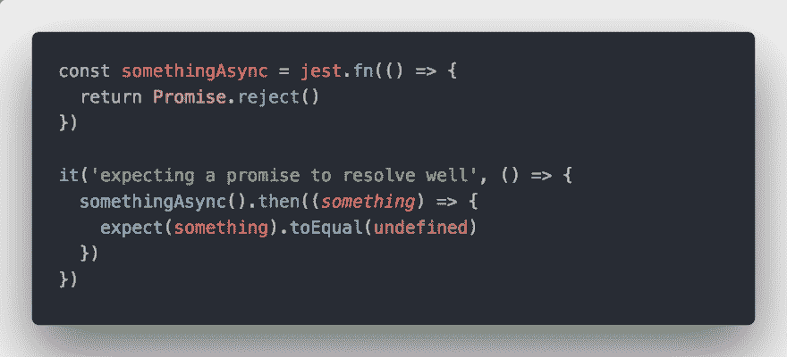
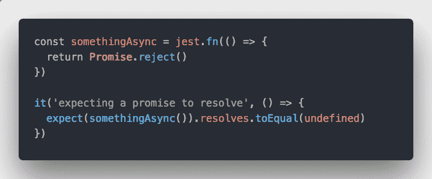
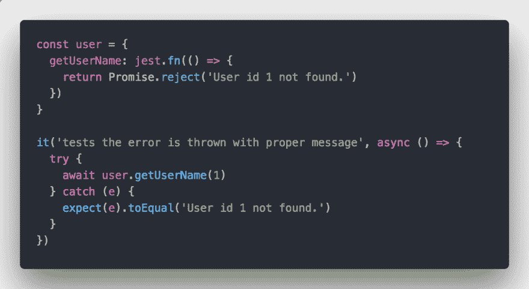
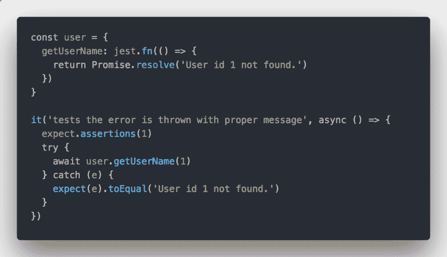
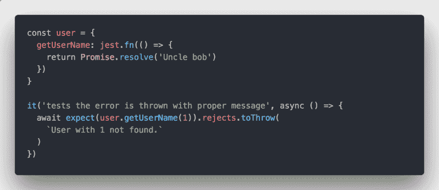

# 揭秘 Jest 异步测试模式

> 原文：<https://dev.to/lirantal/demystifying-jest-async-testing-patterns-4n5n>

谈到异步测试，有几个陷阱很容易落入。此外，根据你的口味，有几种方法可以达到同样的效果。

开发人员可以拥有的一个重要的洞察力是不要遵循什么坏的实践，以及识别坏的代码模式。

在这篇文章中，我想揭开这些异步模式的神秘面纱，并强调隐藏在其中的陷阱。

## 期待承诺

想象一个没有 Async/Await 的世界。

在下面的用例中，我们有一个异步函数 somethingAsync，它执行一些我们想要测试的业务逻辑，并返回一个承诺，也许我们还会存根它的一部分，但这不是重点。

断言的一种模式可以是调用这个存根或测试中的实际主题，一旦 promise 解析，我们就将它链接到一个 thenable，它允许使用 Jest 的自定义匹配器对结果进行断言。

这里有一个例子:

事情是这样的，上面的测试写得不好——**总会过**。

因为我们没有从测试中返回承诺，所以 Jest 不知道这个测试是异步的，所以它只是调用承诺并继续。因为没有期望触发任何错误，所以测试通过了。

理解语义很重要:

*   事实上，当 somethingAsync 拒绝承诺时，测试本身会通过，并且会有一个未处理的承诺拒绝警告，因为没有什么可以捕捉它。
*   如果您将 somethingAsync 的返回值改为 resolve 而不是 reject，那么会发生更糟糕的事情——永远不会达到预期，并且您会得到一个错误的肯定，没有任何迹象表明该测试实际上没有测试任何东西。

以上还有另一种变化，那就是用 expect 包装任何承诺，并使用其内置的匹配器来断言返回值。

看起来是这样的:

也很容易落入这种方法的陷阱，因为我们习惯于断言数据结构或者可能的同步函数调用。

所以上面的代码片段也被破坏了——当期望被调用时，没有办法断言它的返回值，因为测试代码已经结束了。

上述代码片段的结果要么是一个盲目通过的测试，要么是一个由于未处理的承诺拒绝和未达到预期而通过了附加日志输出的测试。

它看起来像这样:

上述两种方法的解决方案都是返回承诺，如下例所示:

* * *

## 当错误消失时

我们回到了我们的异步/等待世界。耶！

在下面的用例中，我们希望驱动应用程序抛出一个错误并拒绝承诺，我们希望捕捉它并匹配错误消息。

一种诱人的方法是捕捉抛出的错误，因为您知道 getUserName 将要抛出，并断言确切的错误对象和消息:

这里有一个非常常见的错误，如果 getUserName() async 函数已经被重构，实际上解决了承诺，那么测试将盲目地通过，因此使这个测试无用，并在它应该失败的地方提供一个假阳性。

如果您热衷于 try/catch 块，处理上述问题的一种方法是声明一个预期的断言计数，如下所示:

上述代码片段中的 2 处更改如下:

*   我们更新了 getUserName()来解析，以便模拟改变逻辑的代码重构。
*   我们向测试本身添加了一个预期的断言计数。由于没有到达 catch 块，上面的测试将以没有断言结束。Jest 将会失败，因为它错过了预期的断言计数。

## 明确的期望

我发现断言计数有点不优雅。幸运的是，还有另一种方法。

Jest 有承诺匹配器，可以断言一个已解决或拒绝的承诺。我发现这种方式对于测试在做什么或期望什么更加明确和自我解释。

让我们改变上面的测试:

您应该还记得测试异步代码的黄金法则——总是返回一个承诺(返回期望)或者确保等待期望来解开承诺的返回值。

* * *

## 期待断言

关于何时使用以及何时避免断言规划的最后一点说明(基于艾娃的参考文献):

当出现以下情况时，避免使用 expect.assertions(N ):

*   您的测试是同步的
*   你在使用承诺(在这种情况下，只需返回期望)
*   您正在使用异步/等待与尝试/捕获(同样，只是等待期望)

在下列情况下使用 expect.assertions(N ):

*   您的测试有条件——因此，您可能在代码的一个分支中有一个期望，在另一个分支中有几个期望。这使得不可能计划准确的断言数量，但是幸运的是，您可以使用 expect.hasAssertions()来验证至少已经做出了一个断言。
*   您的异步测试代码使用回调——如果您在这些回调中断言，那么您希望确保您定义了预期的断言，以便您可以确保回调确实被调用和断言。

快乐玩笑！😋