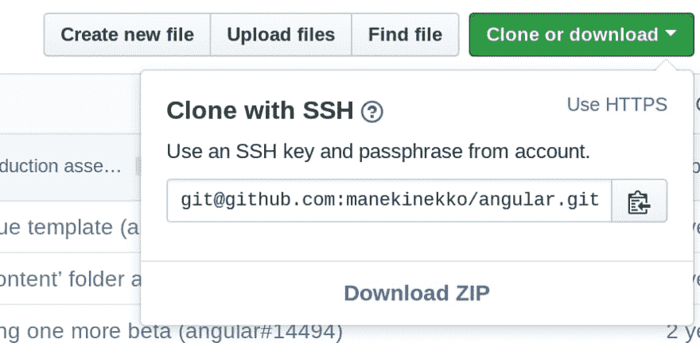
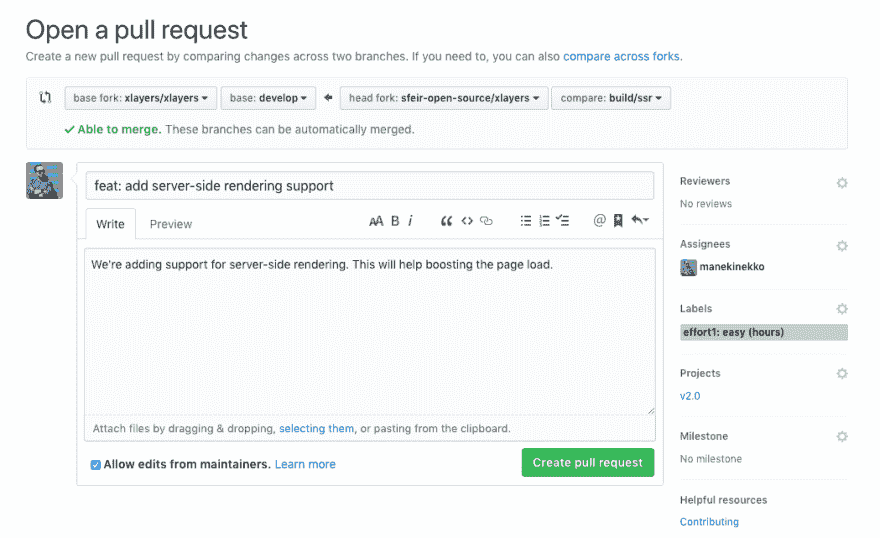

# 揭开开源贡献的神秘面纱

> 原文：<https://dev.to/wassimchegham/demystifying-open-source-contributions-1moi>

这个快速指南主要是为第一次投稿的人和想开始帮助开源项目的人准备的。

作为一个开源项目的作者和维护者，我很高兴听到和看到我的项目被使用。我甚至喜欢其他开发人员介入并提供帮助来修复和改进我的项目。

在这个快速指南中，我想向您展示开始为任何开源项目做贡献是多么容易。相信我，这基本上是不需要动脑筋的！

我假设你已经熟悉 Git 了。如果不是这样，这里有一个完整的指南给你。

# 确定你想做的项目

首先，首先确定你最感兴趣的项目，或者你愿意为之做出贡献的项目。我通常建议第一次投稿者从他们日常工作中使用的工具项目开始。由于您对这些工具很熟悉，并且您可能已经意识到了一些问题或您想要帮助修复或改进的缺失功能，因此为这些工具做出贡献会更容易。

同时，没有什么能阻止你选择任何你想参与的项目。有些人选择项目是基于他们使用的技术，有些人选择项目没有特别的原因，只是为了挑战！

这取决于你。随便挑一个！

# 叉项目

在你开始投稿之前，你需要将项目转到你的 GitHub 账户(假设你正在使用 [GitHub](https://github.com/) )。这个过程基本上会将上游项目复制到您自己的 GitHub 项目中，因此您可以拥有自己的项目副本来工作。

# 克隆并安装依赖项

下一步是克隆——下载——你刚刚克隆到本地机器上的项目，这样你就可以开始工作了——黑客攻击。

如果你主要从事文档、翻译或修改错别字，这绝对是你可以直接在浏览器上完成的事情。不需要在本地克隆项目。但是，如果项目要求您为文档运行一个构建步骤，或者在推送您的更改之前对文档本身运行一个格式化过程，那么您将必须在本地克隆项目并安装所需的依赖项。

一旦你在本地克隆了项目，你需要确保仔细阅读 [CONTRIBUTING.md](https://github.com/angular/angular/blob/master/CONTRIBUTING.md) 文件或者 [README.md](https://github.com/angular/angular#want-to-help) 或者任何其他描述在本地运行和构建项目的必要步骤的文件。如果你遇到困难，只需向项目维护者寻求帮助，他们会很乐意帮助你。

不要害羞！你在“免费”提供你的帮助，项目的维护者——包括我自己——对此只能心存感激！

# 你能帮上什么忙

大多数第一次投稿的人通常会对这个步骤及其实际含义感到困惑。先说清楚什么是“贡献”。

为开源项目做贡献不仅仅意味着写代码和解决技术问题。开源贡献实际上没有限制或边界。它们可以是(从快速到更吸引人):

1.  使用这个工具并感谢开发它的团队，
2.  在活动或网上推广项目，
3.  帮助回答问题，
4.  修复文档中的错别字，
5.  撰写或翻译文档，
6.  帮助重现错误和报告的问题，
7.  重构现有代码，
8.  修复技术上的错误，
9.  编写单元测试，
10.  实现新功能，
11.  挑战核心架构设计
12.  你能说出它的名字！

基本上就是你能做的任何有助于改进项目的事情。

# 确定要“解决”的问题

我们所说的“修理”是指“提供帮助”。我通常建议初次投稿者从小做起。选择一些你能轻松快速解决的问题。文档中的错别字很严重。此外，您将能够阅读整个项目文档，并对项目更加熟悉——如果您想获得高水平的图片，这是非常好的！

接下来，编写或修复单元测试也是另一种开始做出贡献的简单方法。单元测试允许你按照自己的步调逐步深入到特定特性的实现细节中。如果项目有集成测试，从单元测试之前的那些开始。通过这种方式，您将对高级架构有所了解，而无需深入了解实现细节。

话虽如此，您应该可以随意选择任何您认为可以解决的问题。然而，只要确保通过在项目的存储库页面上评论相关的线程，让项目的其他贡献者知道你正在处理那个特定的问题。

# 应用“修补”

这一步实际上取决于您正在解决的问题的类型。只要确保你仔细阅读了项目的贡献指南，并遵守它们。大多数主流开源项目都有严格的指导方针和格式规则，所有贡献者都必须遵守。

此外，如果您遇到困难或有任何问题，请随时向维护者或其他贡献者寻求帮助。

# 提交并推送您的更改

一旦你准备好了，你应该为自己感到骄傲！你已经做了艰苦的工作，剩下的只是一种形式。

因此，接下来，您需要提交您的更改并将其推送到您自己的项目副本——您分叉的那个副本！

再次，仔细阅读项目的贡献指南，并检查您应该如何格式化您的提交消息和分支名称。每个项目都有自己的惯例。此外，将您的变更——修复——推到不同的分支而不是“主”或“开发”,这被认为是一个很好的实践，这样您就可以很容易地在以后合并或重置您的变更——如果您必须这样做的话。

在提交的主体中包含一个关于你的变更/修复/实现的详细描述通常是受欢迎的，有时是强制性的。这将有助于其他人立即了解这个提交所带来的变化。

# 发送请购单——拉取请求

现在，您已经准备好将您的更改发送到原始项目——上游项目。为此，您必须打开一个拉取请求。

现在，发送您的 PR，并交叉手指！有时候，项目的维护者会要求你在合并你的 PR 之前更新或者提供一些修改。

如果项目的维护人员因为某种原因(通常是技术原因)不能合并你的 PR，不要沮丧或失望！再试一次，或者干脆继续前进，去解决另一个问题。这完全没问题，这是贡献的一部分。

我希望你现在对开源贡献有一个清晰的概念，以及它们有多简单。

干杯。

* * *

*在 Twitter 上关注我 [@manekinekko](https://twitter.com/@manekinekko) 了解更多关于开源的更新。*