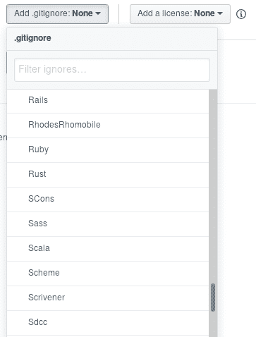
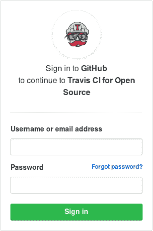
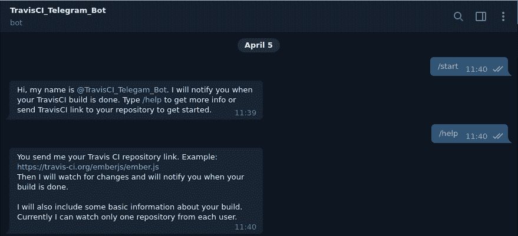
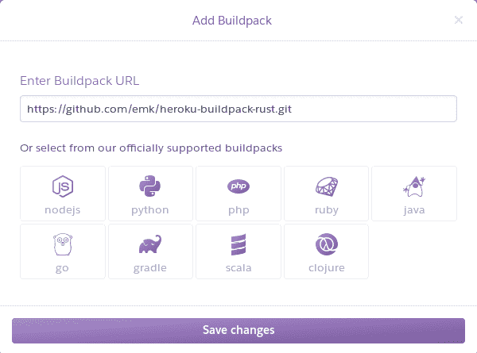

# 从 GitHub 到 Heroku 的火箭应用部署

> 原文：<https://dev.to/mattdark/deploy-de-aplicacion-rocket-desde-github-a-heroku-1fk8>

如果正在开发一个使用[【拉斯特】](https://rust-lang.org/) 和 **[【火箭】](https://rocket.rs/)** 的 web 应用程序，并希望配置 Travis CI 测试发送到 GitHub 存储库的更改，然后部署到 Heroku，在此

## 。吉蒂尔

对于从本地开发环境执行的测试，应创建文件“`.gitignore`”，以防止编译期间生成的文件与存储库同步。档案应包含下列内容:

```
# Generated by Cargo
# will have compiled files and executables
/target/

# Remove Cargo.lock from gitignore if creating an executable, leave it for libraries
# More information here https://doc.rust-lang.org/cargo/guide/cargo-toml-vs-cargo-lock.html
Cargo.lock

# These are backup files generated by rustfmt
**/*.rs.bk 
```

Enter fullscreen mode Exit fullscreen mode

通过选择项目使用的语言，可以在创建新存储库后生成此文件。
[](https://res.cloudinary.com/practicaldev/image/fetch/s--OFBWiufB--/c_limit%2Cf_auto%2Cfl_progressive%2Cq_auto%2Cw_880/https://thepracticaldev.s3.amazonaws.com/i/65iqtti0edm2ss112w59.png)

也可以从 **[gitignore.io](https://gitignore.io/)** 创建，下载文件并将其添加到存储库中。

## 特拉维斯词

**Travis CI** 是一个分布式的连续集成系统，用于构建和测试 GitHub 中托管的项目。它支持多种语言，如 Python、Ruby、Go、PHP 和 Rust。提供免费的开源项目版本，可在“**T3”Travis-ci . org“t5”上找到。**

访问 Travis CI 不需要创建帐户，只需登录 GitHub 并授权访问。
[](https://res.cloudinary.com/practicaldev/image/fetch/s--Zoaz2F9w--/c_limit%2Cf_auto%2Cfl_progressive%2Cq_auto%2Cw_880/https://thepracticaldev.s3.amazonaws.com/i/ywe08xxjwgtvz3psunpd.png)

Travis CI 连接到 GitHub 帐户后，必须在项目存储库中创建一个文件，显示正在使用的 Rust 版本。

然后，在存储库中创建一个名为“
”的文件，该文件必须包含以下内容:

```
language: rust
rust:
  - nightly
cache: cargo 
```

Enter fullscreen mode Exit fullscreen mode

指定了项目语言，指明了正在使用的拉斯特版本，Rocket 占领了 Nightly，Travis 将下载该版本进行测试，然后生成依赖项缓存，以避免在没有新版本的情况下下载和编译依赖项。

一旦添加了此文件，Travis CI 将对项目进行第一次测试。每次发送到存储库时，都会执行新的测试。从 Travis CI 生成的 URL 可以实时查看测试，如:`https://travis-ci.org/usuario/repositorio`。并且如果没有发生错误，会显示如下:
[](https://res.cloudinary.com/practicaldev/image/fetch/s--_QKXY_Kf--/c_limit%2Cf_auto%2Cfl_progressive%2Cq_auto%2Cw_880/https://thepracticaldev.s3.amazonaws.com/i/zjagw1wrjhs3ifgjx6ov.png)

为了在考试结束时收到电报通知，可以使用**[【travisci-telegam-Bot】](https://github.com/artemgurzhii/TravisCI-Telegam-Bot)**，这是一种非正式 bot，可以通过打开以下链接添加:`https://telegram.me/TravisCI_Telegam_Bot`。
[](https://res.cloudinary.com/practicaldev/image/fetch/s--dBM3t2jH--/c_limit%2Cf_auto%2Cfl_progressive%2Cq_auto%2Cw_880/https://thepracticaldev.s3.amazonaws.com/i/5jgwwap4bkmzj1mz7c42.png)

要指明哪个项目需要发送通知，只需将 URL 传递给您并返回以下消息，您就可以从此处发送通知。
[](https://res.cloudinary.com/practicaldev/image/fetch/s--2gD8WhbN--/c_limit%2Cf_auto%2Cfl_progressive%2Cq_auto%2Cw_880/https://thepracticaldev.s3.amazonaws.com/i/rjhsnyykefireuhqmbvw.png)

## Heroku

**[【heroku】](https://heroku.com/)**支持 Node.js、Ruby、Java、PHP、Python 和 Go 等语言和技术，以及通过社区开发的建设包(build packs)进行拉斯特等语言。

在 Heroku 中创建应用程序后，将进行相应的配置。

在申请窗格的`Deploy`项中，修改如下:

*   选择一个合适的部署方式。
    [T3】](https://res.cloudinary.com/practicaldev/image/fetch/s--C5PvNZAX--/c_limit%2Cf_auto%2Cfl_progressive%2Cq_auto%2Cw_880/https://thepracticaldev.s3.amazonaws.com/i/uqejg8tvtmyj4zg3uwkn.png)

*   搜索要从中进行部署和连接的存储库。
    [](https://res.cloudinary.com/practicaldev/image/fetch/s--VOgGYSBv--/c_limit%2Cf_auto%2Cfl_progressive%2Cq_auto%2Cw_880/https://thepracticaldev.s3.amazonaws.com/i/yqtjy11aq69z4ilp6dqq.png)

*   启用自动部署，方法是选择要部署的分支，然后选中“`Wait for CI to pass before deploy`”选项，表示 Travis CI 完成测试并成功完成后将执行部署。
    [](https://res.cloudinary.com/practicaldev/image/fetch/s--O7SgvUgA--/c_limit%2Cf_auto%2Cfl_progressive%2Cq_auto%2Cw_880/https://thepracticaldev.s3.amazonaws.com/i/yhczvg5tq7068mzkdk86.png)

然后在`Settings`分段中进行以下设置:

*   将添加相应的构造包的 URL，对于拉斯特为“`https://github.com/emk/heroku-buildpack-rust.git`”。

从中访问应用程序的 URL 的格式为“`https://nombre-aplicacion.herokuapp.com`”。

然后在存储库中创建文件`Rocket.toml`、`RustConfig`和`Procfile`。

`Procfile`文件指定 Heroku 用于部署的拉斯特版本，因为默认情况下它下载稳定版本，火箭需要 Nightly。

```
VERSION = nightly 
```

Enter fullscreen mode Exit fullscreen mode

Rocket.toml 文件设置了应用地址，如《官方文件》所示。

```
[global]
limits = { forms = 32768, json = 32768 }

[development]
address = "localhost"
port = 8000
log = "normal"

[staging]
address = "0.0.0.0"
port = 8000
log = "normal"

[production]
base_url = "https://nombre-aplicacion.herokuapp.com"
log = "critical" 
```

Enter fullscreen mode Exit fullscreen mode

最后，`Procfile`档案会写入启动应用程式的指示。

```
ROCKET_PORT=$PORT ROCKET_ENV=prod ./target/release/nombre-binario 
```

Enter fullscreen mode Exit fullscreen mode

Heroku 动态分配端口，因此在文件“`Rocket.toml`”中未指定该端口，因为该端口是使用“`ROCKET_PORT=$PORT`”获取的，此外还指示应用程序在生产环境中使用“`ROCKET_ENV=prod`”和相应的二进制路径“`./target/release/nombre-binario`”运行，如“`./target/release/nombre-binario`”中所示

配置完成后，会将一个小更改发送到存储库，以便 Travis CI 进行测试，然后将其部署到 Heroku。

此 URL 中可以看到一个示例:[https://reveal-gallery . herokupp . com/](https://reveal-gallery.herokuapp.com/)和 GitHub 存储库[在此](https://github.com/mattdark/reveal.js-gallery)。

希望本教程对您有所帮助。