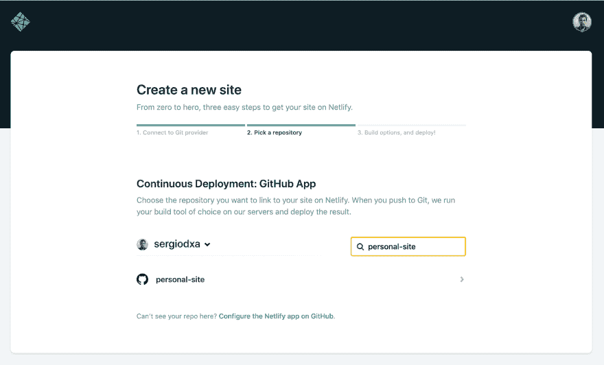

# 部署内容网络

> 原文：<https://dev.to/sergiodxa/deploy-de-contentz-a-netlify-1hdd>

https://sergiodxa.com/articles/contentz-netlify/T3

[**【content】**](https://contentz.tech)是一种无需设置任何内容即可轻松创建网站和博客的工具，但可以选择为某些事情这样做。 [Netlify](https://www.netlify.com/) 是一个全面部署静态网站的平台。

contentz 生成静态站点，因此非常适合使用 Netlify。在本文中，我们将讨论如何设置我们需要的所有内容，以便在一起使用。

## 创建存储库

首先，我们需要创建 Git 存储库，我们将在其中存储我们的内容。Netlify 支持 GitHub、GitLab 和 Bitbucket，在这种情况下，我们将使用 GitHub。

为此，我们将进入[【https://github . com/new】](https://github.com/new)，创建一个我们称之为`personal-site`的存储库。然后我们将储存库复制到电脑上。

```
git clone git@github.com:username/personal-site.git 
```

Enter fullscreen mode Exit fullscreen mode

## 我们开始了这个项目

现在我们开始我们的网站，为此我们运行以下命令:

```
npx gitignore node
npx license MIT -o "Sergio Xalambrí" > LICENSE
yarn init --yes
yarn add contentz
mkdir articles 
```

Enter fullscreen mode Exit fullscreen mode

现在，让我们用命令来创建我们的第一篇文章:

```
yarn contentz write hola-mundo.mdx 
```

Enter fullscreen mode Exit fullscreen mode

并将文章元数据中的`published`改为`true`，在文件的开头。

然后我们产生了我们文章的社会形象:

```
yarn contentz social articles/hola-mundo.mdx 
```

Enter fullscreen mode Exit fullscreen mode

最后，我们保存所有内容，提交并推送 GitHub。

```
git add .
git commit -m "Inicio del sitio"
git push origin master 
```

Enter fullscreen mode Exit fullscreen mode

## 配置网络生活

现在，我们将配置 Netlify，为此，我们登录并转到“[”https://app . netlify . com/start“](https://app.netlify.com/start)”添加一个新站点。我们将它连接到 GitHub 帐户并搜索我们的存储库。

[](https://res.cloudinary.com/practicaldev/image/fetch/s--s4qd5lJQ--/c_limit%2Cf_auto%2Cfl_progressive%2Cq_auto%2Cw_880/https://sergiodxa.com/static/articles/netlify-add.png)

我们在构建选项中创建了站点，并将所有内容保留为空。

现在，在我们的存储库中，我们将创建一个包含以下内容的文件:

```
[build]
  publish = "public"
  command = "yarn contentz build" 
```

Enter fullscreen mode Exit fullscreen mode

通过此配置，我们配置您要发布的文件夹`public`，它会带来欢乐，您将使用的命令是`yarn contentz build`。

现在，我们保存、提交和推送存储库。

```
git add netlify.toml
git commit -m "Configure Netlify"
git push origin master 
```

Enter fullscreen mode Exit fullscreen mode

## 我们进入我们的网站

这样 Netlify 就可以建造我们的网站并让它顺利部署。如果我们访问 Netlify 提供的 URL，或访问我们自己的域(如果已配置)，我们将看到我们的网站成功运行。