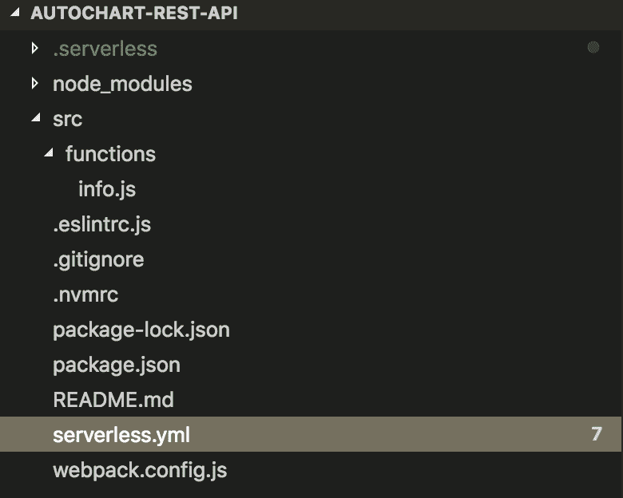
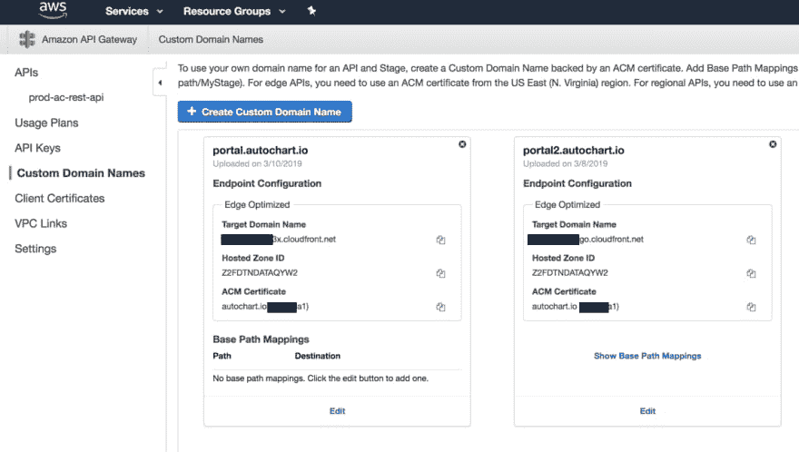
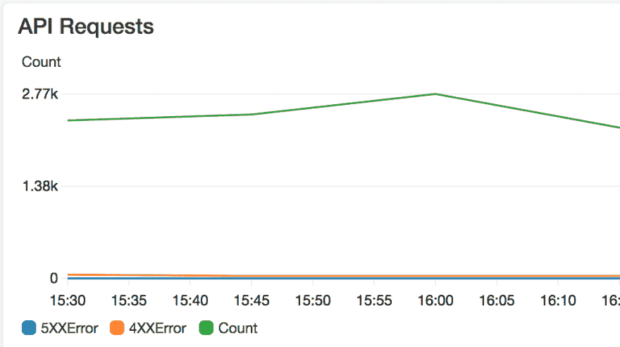

# 将 API 网关部署为传统 API 前面的代理

> 原文：<https://dev.to/paulswail/deploying-api-gateway-as-a-proxy-in-front-of-a-legacy-api-56l8>

在[最后一次更新](https://winterwindsoftware.com/serverless-migration-journal-part2/)中，我决定将 API Gateway 放在传统应用的经典 ELB 之前，以使我能够逐渐将路由从它迁移到 Lambda 函数。

在这篇文章中，我开始着手实现。具体来说，我将介绍:

*   为 DNS 做好准备，使其更易于通过基础设施即代码进行管理
*   对于 Git 源代码控制，我应该从单回购还是微回购方法开始？
*   设置测试 Lambda 支持的 API 端点
*   如何通过 API 网关将请求代理到我的遗留后端
*   设置基本的 CloudWatch 警报
*   将生产流量切换到 API 网关

## 在 Route53 中准备 DNS

我为此次迁移设定的第二个目标是，不再使用将开发、试运行和生产环境的资源与其他不相关项目/产品的资源混合在一起的传统 AWS 帐户(`autochart-legacy`)，而是使用专用的独立帐户来管理开发/试运行(`autochart-dev`)和生产(`autochart-prod`)。

这意味着将`autochart.io` Route53 托管区域中的记录从旧帐户迁移到新的`autochart-prod`生产帐户。AWS 文档[有详细的步骤](https://docs.aws.amazon.com/Route53/latest/DeveloperGuide/hosted-zones-migrating.html)说明如何做到这一点，所以相对来说没什么痛苦。概括来说，这是一个 4 步流程:

1.  使用 AWS Route53 CLI 从`autochart-legacy`帐户为我的托管区域记录集导出 JSON
2.  手动整理 JSON，删除不需要的条目。
3.  使用 AWS Route53 CLI 将 JSON 记录集导入新的`autochart-prod`帐户
4.  更新我的域提供商(Namecheap)上的名称服务器记录，以指向托管区域的名称服务器。

我还在我的`autochart-dev` AWS 帐户中为`dev.autochart.io`和`staging.autochart.io`子域名设置了两个托管区域，并在根托管区域中创建了名称服务器记录，以便将 DNS 委派给子托管区域。按照[这些步骤](https://docs.aws.amazon.com/Route53/latest/DeveloperGuide/CreatingNewSubdomain.html)，这非常简单。

最后，我创建了一个新的别名记录`portal-legacy.autochart.io`，它指向传统负载平衡器的同一个地址，也就是我的生产 API 的子域`portal.autochart.io`当前指向的地址。这个新的 DNS 条目将用于为我的代理 API 网关请求配置后端位置，如下所示。

🔥*提示——为了测试新域名服务器是否有效，我暂时将我的 MacBook DNS 从【1.1.1.1】的[cloud flare DNS](https://1.1.1.1)切换到【8.8.8.8】的[谷歌公共 DNS](https://developers.google.com/speed/public-dns/)，因为前者似乎仍在缓存我的旧域名服务器。然后，我可以运行一个`dig`命令来验证我新创建的 DNS 条目是否正常。*

现在我已经在我的新帐户中设置了托管区域，我可以使用无服务器框架(和 CloudFormation)通过基础设施作为代码来管理我的 DNS 记录。

## 单回购还是多回购？

我现在已经准备好设置 API 网关了。我将使用[无服务器框架](https://serverless.com/framework/docs/providers/aws/events/apigateway)来做到这一点。所以我的下一个问题是——我把我的代码放在哪里？

我知道我肯定不想把我现有的 Git 回购用于 monolith Express 应用程序。我也知道我的最终目标是有一套边界清晰的微服务，每个微服务都有自己的`serverless.yml`文件。我可以看到在回购层面实施这种分离的好处。

然而，我还没有确定这些界限，一切都还在不断变化。我不知道我可能需要在服务之间共享什么代码。所以我现在从一个单一的“单一回购”开始，给它起一个有点通用的名字`autochart-rest-api`。

我开始时使用一个简单的文件夹结构，但是我希望在我开始识别服务边界和实现 Lambda 函数时，我会重新调整结构。

[](https://res.cloudinary.com/practicaldev/image/fetch/s--_N-G31p9--/c_limit%2Cf_auto%2Cfl_progressive%2Cq_auto%2Cw_880/https://winterwindsoftware.com/img/blog-images/serverless-initial-folder-structure.png)

## 用我的自定义域设置 API 网关

因为我想将我的 live 子域(`portal.autochart.io`)指向我的 API 网关，所以我需要配置我的 API 网关实例来使用自定义域。

Alex DeBrie 在 Serverless.com 博客上有一篇[的精彩文章](https://serverless.com/blog/serverless-api-gateway-domain/)展示了如何做到这一点。总而言之，我做了以下事情:

1.  使用[证书管理器控制台](https://console.aws.amazon.com/acm)在我的`autochart-dev`和`autochart-prod`账户中创建证书。前者有以下子域:

```
*.dev.autochart.io
dev.autochart.io
*.staging.autochart.io
staging.autochart.io 
```

而后者有这些:

```
*.autochart.io
autochart.io 
```

1.  使用 [`serverless-domain-manager`](https://github.com/amplify-education/serverless-domain-manager) 插件及其 CLI 命令，使用正确的证书配置和部署自定义域。

## 创建测试路线

我创建了一个简单的“hello world”风格的 Lambda 函数，它将作为新测试路径`/api/1/info`的处理程序。这是它在`serverless.yml`中的样子:

```
functions:
  info:
    handler: src/functions/info.handle
    events:
      - http: GET ${self:custom.apiRoot}/info 
```

然后，我将这个路由部署到生产帐户。由于我还没有准备好通过 API 网关路由生产流量，我已经将其配置为使用一个临时自定义子域`portal2.autochart.io`。
然后，我可以用一个简单的 cURL 命令:`curl https://portal2.autochart.io/api/1/info`测试我的测试路由处理程序。

## 将请求代理到遗留后端

我现在需要告诉 API Gateway 代理所有不是通过上述“信息”路由到我的遗留 ELB 后端的请求。为此，我对 API 网关使用了所谓的“HTTP 代理集成”。

这是给我带来最大麻烦的一步，因为关于这个主题的 AWS 文档并没有告诉我完成这个工作需要做的所有事情。我花了几个小时尝试不同的配置，直到我最终发现了这篇关于[使用 Cloudformation](https://cjohansen.no/aws-apigw-proxy-cloudformation/) 设置 Api 网关代理资源的博文，作者与我遇到了相同的问题，并记录了他是如何修复的。😀

这是我目前为止的完整配置:

```
service: ac-rest-api

custom:
  stage: ${opt:stage, self:provider.stage}
  profile:
    dev: autochart_dev
    prod: autochart_prod
  apiRoot: api/1
  domains:
    dev: portal.dev.autochart.io
    prod: portal2.autochart.io # to be changed to portal.autochart.io after testing
  hostedZones:
    dev: Z38AD79BYT7000
    prod: Z3PI5JUWKKW999
  # Automatically create DNS record from `domain` to API Gateway's custom domain?
  createRoute53Record:
    dev: true
    prod: false
  # URL where back-end exists
  backendUrls:
    dev: "https://portal-legacy-staging.autochart.io"
    prod: "https://portal-legacy.autochart.io"
  # Host header to be passed through to back-end
  backendHostHeaders:
    dev: "portal-staging.autochart.io"
    prod: "portal.autochart.io"
  # config for serverless-domain-manager plugin
  customDomain:
    domainName: ${self:custom.domains.${self:custom.stage}}
    stage: ${self:custom.stage}
    createRoute53Record: ${self:custom.createRoute53Record.${self:custom.stage}}
    hostedZoneId: ${self:custom.hostedZones.${self:custom.stage}}

provider:
  name: aws
  runtime: nodejs8.10
  stage: dev
  profile: ${self:custom.profile.${self:custom.stage}}

package:
  individually: true

functions:
  info:
    handler: src/functions/info.handle
    events:
      - http: GET ${self:custom.apiRoot}/info

resources:
  Resources:
    ProxyResource:
      Type: AWS::ApiGateway::Resource
      Properties:
        ParentId: !GetAtt ApiGatewayRestApi.RootResourceId
        RestApiId: !Ref ApiGatewayRestApi
        PathPart: '{proxy+}'
    RootMethod:
      Type: AWS::ApiGateway::Method
      Properties:
        ResourceId: !GetAtt ApiGatewayRestApi.RootResourceId
        RestApiId: !Ref ApiGatewayRestApi
        AuthorizationType: NONE
        HttpMethod: ANY
        Integration:
          Type: HTTP_PROXY
          IntegrationHttpMethod: ANY
          Uri: ${self:custom.backendUrls.${self:custom.stage}}
          PassthroughBehavior: WHEN_NO_MATCH
          RequestParameters:
            integration.request.header.Host: "'${self:custom.backendHostHeaders.${self:custom.stage}}'"
    ProxyMethod:
      Type: AWS::ApiGateway::Method
      Properties:
        ResourceId: !Ref ProxyResource
        RestApiId: !Ref ApiGatewayRestApi
        AuthorizationType: NONE
        HttpMethod: ANY
        RequestParameters:
          method.request.path.proxy: true
        Integration:
          Type: HTTP_PROXY
          IntegrationHttpMethod: ANY
          Uri: ${self:custom.backendUrls.${self:custom.stage}}/{proxy}
          PassthroughBehavior: WHEN_NO_MATCH
          RequestParameters:
            integration.request.path.proxy: 'method.request.path.proxy'
            integration.request.header.Host: "'${self:custom.backendHostHeaders.${self:custom.stage}}'"

plugins:
  - serverless-pseudo-parameters
  - serverless-webpack
  - serverless-domain-manager 
```

这里有一些重要的事情需要注意:

*   所有的 HTTP 代理配置都需要在文件的`Resources`部分用原始的 CloudFormation 编写，因为还没有无服务器插件(我能找到的)可以做到这一点。
*   第`PathPart: '{proxy+}'`行是我如何创建一个资源，它在根处充当一个无所不包的处理程序。
*   我需要创建一个单独的`RootMethod`，因为`'{proxy+}'`通配符不处理根路径。
*   我需要在`RequestParameters`中设置一个`integration.request.path.proxy`,以便映射从客户端请求到代理后端请求的路径。
*   我的后端(出于遗留原因)需要一个 HTTP `Host`头来匹配一个期望值，以便从请求中返回一个有效的响应。我通过向`integration.request.header.Host` RequestParameter 传递一个固定值来实现这一点。

## 测试代理请求

在将更新后的 API 网关配置部署到我的生产帐户后，我再次使用 cURL 进行一些请求测试。例如，通过运行`curl -I https://portal2.autochart.io/login`，我可以看到我从后端得到了正确的响应。我还可以看到 API Gateway 添加的新 HTTP 头，前缀为`x-amzn-`:

```
› curl -I https://portal2.autochart.io/login
HTTP/2 200
content-type: text/html; charset=utf-8
content-length: 5166
date: Mon, 11 Mar 2019 11:24:23 GMT
x-amzn-requestid: 38d955b4-43f0-11e9-bcb9-9fe9969752ee
x-amzn-remapped-content-length: 5166
x-amzn-remapped-connection: keep-alive
set-cookie: connect.sid=s%3AJusMzBoqngb7-ggEs2MK0rPsxc8Ed4zG.JFQnY8S26GVJV2HtvdnhpMdIW7xNeFD7SvnOsbfuYnY; Path=/; HttpOnly
x-amz-apigw-id: WX_IMHFgIAMF6Iw=
vary: Accept-Encoding
x-amzn-remapped-server: nginx/1.14.0
x-powered-by: Express
etag: W/"142e-3RGZdhc0ZhtNpKgqQqHjwzVK82E"
x-amzn-remapped-date: Mon, 11 Mar 2019 11:24:23 GMT
x-cache: Miss from cloudfront
via: 1.1 bb45ea5b3a4c19db9fecccf1bc9e803d.cloudfront.net (CloudFront)
x-amz-cf-id: mJYOlSyTbkRHUnEZ4tiq0I3ohMIk2jddmBOyiQtOjgX7ZsrNrjbvPw== 
```

我还对我的测试路径运行了 cURL 命令，以确保它没有被代理通过，并且工作正常。

不幸的是，我没有自动化的端到端测试套件来运行。我在遗留代码库中现有的自动化测试要么是在单元级别，要么是在集成级别，不能在这里使用。这是我希望在迁移过程中通过为每个被迁移的端点编写端到端测试来解决的问题。

虽然在这里有一个端到端的测试套件会给我更多的信心，但我所执行的手动 cURL 和浏览器测试的结合已经足够让我放心，继续切换生产流量是足够安全的。

## 设置监控

但在此之前，我想使用 CloudWatch 警报设置一些基本的警报，以便在任何错误开始发生时通知我。如果我的经典弹性负载平衡器开始发现常规的 HTTP 500 错误，我已经为它做好了准备，所以我想在这里重新创建相同级别的监控。

为此，我使用了 [`serverless-aws-alerts`插件](https://github.com/ACloudGuru/serverless-plugin-aws-alerts)来设置一个单一的警报，如下所示:

```
# Cloudwatch Alarms
  alerts:
    stages:
      - prod
    dashboards: true
    topics:
      alarm:
        topic: ${self:service}-${opt:stage}-alerts-alarm
        notifications:
          - protocol: email
            endpoint: myname+alerts@company.com
    definitions:
      http500ErrorsAlarm:
        description: 'High  HTTP  500  errors  from  API  Gateway'
        namespace: 'AWS/ApiGateway'
        metric: 5XXError
        threshold: 5
        statistic: Sum
        period: 60
        evaluationPeriods: 3
        comparisonOperator: GreaterThanOrEqualToThreshold
        treatMissingData: notBreaching
    alarms:
      - http500ErrorsAlarm 
```

这也为我在 CloudWatch 控制台中生成了一个漂亮的仪表板。

## 将生产流量切换到 API 网关

到目前为止，我一直使用`portal2.autochart.io`作为我的 API 网关在生产帐户中的定制域。我们现在准备将它改为`portal.autochart.io`。

我原以为这只是更新 DNS 条目的问题，然而事情并不那么简单。
每当我将 API 网关配置为使用自定义域时(通过无服务器域管理器插件的 [`create_domain`](https://github.com/amplify-education/serverless-domain-manager#running) 命令)，AWS 会在内部创建一个 CloudFront 发行版来保存 SSL 证书，它位于实际 API 网关的前面(这就是为什么我上面的 cURL 响应中有 CloudFront 头)。

为了执行转换，我需要我的 DNS 指向这个内部 CloudFront 发行版的 DNS 名称。然而，这个 CloudFront 发行版似乎与我最初创建它时使用的单个`portal2`子域联系在一起。因此，在我首先将我的`custom.domains.prod` serverless.yml 条目更新为`portal.autochart.io`之后，我现在需要再次运行`sls create_domain —stage prod`。创建这个新的自定义域最多需要 40 分钟。

创建完成后，您可以在 API GW 控制台中看到自定义域名:

[](https://res.cloudinary.com/practicaldev/image/fetch/s--kLWW6W6a--/c_limit%2Cf_auto%2Cfl_progressive%2Cq_auto%2Cw_880/https://winterwindsoftware.com/img/blog-images/apigw-custom-domains.png)

然后我运行`sls deploy --stage prod`来为这个定制域创建基本路径映射。

我的最后一步是手动更新`portal.autochart.io`的 Route53 DNS 记录，以指向新创建的`portal.autochart.io` APIGW 自定义域名的`Target Domain Name`。API 网关现已上线！

作为一个快速的冒烟测试，我重新运行了与之前相同的 cURL 命令和手动浏览器测试。我使用了`amzn-`特定的 HTTP 头来验证 DNS 是否已经更新，我的请求是否由 API 网关提供服务。

到目前为止，一切都很好！👍

[](https://res.cloudinary.com/practicaldev/image/fetch/s--ibbWVYrZ--/c_limit%2Cf_auto%2Cfl_progressive%2Cq_auto%2Cw_880/https://winterwindsoftware.com/img/blog-images/apigw-requests-cloudwatch.png)

## 下一步

现在我已经有了 API Gateway live 和项目代码结构，我可以开始对 monolith API 进行分析，以确定我可以提取哪些微服务，从而确定我可以开始为哪些路线实现 Lambdas。

我想到了几个问题，需要尽快解决，即:

*   我想把一个 **CI/CD 过程**放在适当的位置，从 dev = > staging = > prod 提升代码(到目前为止我只使用了 dev 和 prod 阶段)。在将我的第一个“真正的”Lambda 函数实现发布到产品之前，我需要设计我的方法来做这件事，并准备好流程。
*   为了降低引入的风险，我可以为 Api 路由的每个新 Lambda 做一个 **canary release** 吗？例如，对该路径的 5%的请求使用新的 Lambda，而其余的继续通过无所不包的处理程序到达 ELB？我知道 Lambda 支持不同版本的函数的 canary 版本，但我不认为这在这里会有帮助。

如果你对这些有任何建议或推荐，请告诉我。

✉️ *如果你想在这一系列准备就绪后尽快获得未来的更新，并且**访问我用来跟踪我在这个项目中执行的所有任务的 Trello 板**，你可以[在这里订阅](https://winterwindsoftware.com/serverless-migration-journal/#signup)。*

* * *

您还可能会喜欢:

*   [担心无服务器带走](https://winterwindsoftware.com/concerns-that-serverless-takes-away/)
*   [“无服务器”的不同定义](https://winterwindsoftware.com/serverless-definitions/)
*   [无服务器词汇表](https://winterwindsoftware.com/serverless-glossary/)

*原载于 winterwindsoftware.com*。