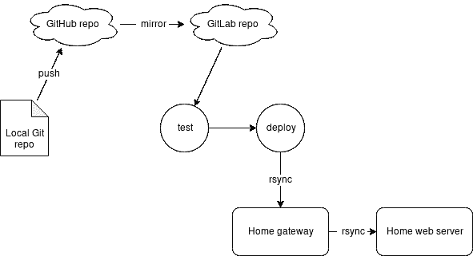

# 使用 GitLabCI 部署 Jekyll

> 原文：<https://dev.to/remyg/deploying-jekyll-with-gitlabci-1ggj>

*这篇文章最初发表在[我的博客](https://remyg.fr/blog/2019/02/27/deploying-jekyll-with-gitlabci/)上。*

我的博客是基于 [Jekyll](https://jekyllrb.com/) ，一个静态网站生成器。这意味着页面需要在部署之前生成。直到最近，我一直使用 [Jekyll Docker 映像](https://hub.docker.com/r/jekyll/jekyll)在本地构建内容，提交并推送生成的内容到我的 [GitHub repo](https://github.com/RemyG/remyg.ovh) ，SSH 到我的 web 服务器，并从 repo 中提取更改。

这个过程相当烦人，这就是为什么我决定建立一个 CI/CD(持续集成和交付)管道，使用 [GitLabCI](https://docs.gitlab.com/ee/ci/) 。

## 管道

我实现的 CI/CD 管道如下:

[](https://res.cloudinary.com/practicaldev/image/fetch/s--ngEu10sA--/c_limit%2Cf_auto%2Cfl_progressive%2Cq_auto%2Cw_880/https://remyg.fr/assets/img/jekyll-gitlab-ci.png)

管道是在项目的根文件
中定义的

```
image: ruby:2.5

cache:
  key: "jekyll"
  paths:
    - vendor

variables:
  JEKYLL_ENV: production
  LC_ALL: C.UTF-8
  NOKOGIRI_USE_SYSTEM_LIBRARIES: "true"

before_script:
- bundle install

test:
  stage: test
  script:
  - bundle exec jekyll build -d ./public
  - bundle exec htmlproofer ./public --only-4xx --check-favicon --check-html --assume-extension
  artifacts:
    paths:
    - public

deploy:
  stage: deploy
  before_script:
  - 'which ssh-agent || ( apt-get update -y && apt-get install openssh-client -y )'
  - eval $(ssh-agent -s)
  - ssh-add <(echo "$SSH_PRIVATE_KEY" | base64 -d)
  - mkdir -p ~/.ssh
  - chmod 700 ~/.ssh
  - echo "$SSH_HOST_KEY" > ~/.ssh/known_hosts
  - chmod 644 ~/.ssh/known_hosts
  - which rsync || ( apt-get update -y && apt-get install rsync -y )
  script:
  - ssh -p$SSH_PORT $SSH_SRV "mkdir -p /tmp/jekyll"
  - ssh -p$SSH_PORT $SSH_SRV "rm -rf /tmp/jekyll_old"
  - ssh -p$SSH_PORT $SSH_SRV "mv /tmp/jekyll /tmp/jekyll_old"
  - rsync -rav -e "ssh -p $SSH_PORT" --exclude='.git/' --exclude='.gitlab-ci.yml' --delete-excluded ./public $SSH_SRV:/tmp/jekyll
  - ssh -p$SSH_PORT $SSH_SRV "sh /home/gitlabci/rsync-jekyll.sh"
  only:
  - master 
```

它包括两个步骤:`test`和`deploy`。

`test`步骤构建 Jekyll 项目，然后对生成的文件运行 [HTMLProofer](https://github.com/gjtorikian/html-proofer) 。这一步将检查和验证 HTML 输出。

`deploy`步骤将生成的文件传输到我的家庭网关，然后运行一个脚本(位于网关上)将这些文件传输到我的 web 服务器(web 服务器不暴露在我的网络之外)。

## SSH 配置

网关通过 SSH 访问。为此，我创建了一个只由 GitLab CI 使用的特定 SSH 密钥。

生成新的 SSH 密钥:

```
ssh-keygen -o -t rsa -b 4096 -C "gitlabci" 
```

公钥需要添加到授权密钥中才能使用:

```
cat ~/.ssh/id_rsa.pub >> ~/.ssh/authorized_keys 
```

## 配置

管道包含提高安全性的变量:

*   用于访问我的网关的 SSH 私有密钥的 base-64 表示。通过在网关上运行以下命令来检索该值:`cat id_rsa > base64 -w0`
*   `SSH_HOST_KEY`:网关的 RSA 密钥。在网关上运行检索:`ssh-keyscan -t rsa server_ip`
*   `SSH_SRV`:SSH 连接信息，如`my_user@my_server`
*   `SSH_PORT`:网关上的 SSH 端口

## 用法

我现在可以按照以下流程发布对我的网站的更改:

*   如果需要，在我的电脑上克隆 GitHub repo
*   进行更改(创建新的博客帖子，…)
*   在本地测试更改(Docker compose 文件允许我在自己的计算机上构建和维护网站)
*   提交并推动变更
    *   如果我推到除了`master`之外的分支，则只执行`test`步骤
    *   如果我推送到`master`，整个管道被执行，所以我的站点被构建、测试和自动部署。