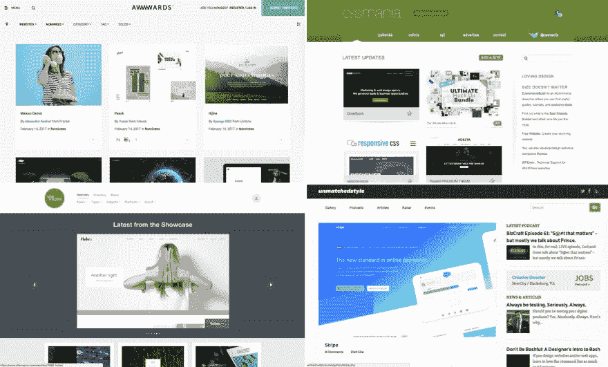
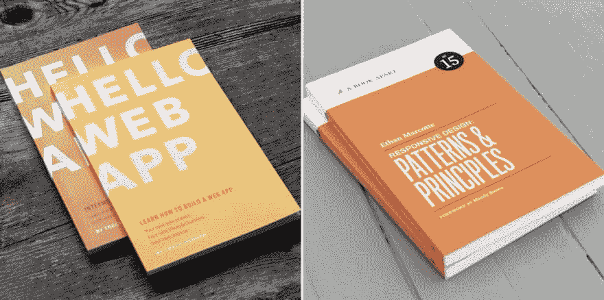

# 为非设计师设计(第三部分)

> 原文：<https://dev.to/tracymakes/design-for-non-designers-part-3-3oi>

本设计系列的第 1 部分讨论了视觉设计，而[的第 2 部分](https://dev.to/tracymakes/design-for-non-designers-part-2-c17)深入探讨了用户体验、内容和测试。

在这里，我们将简单介绍一下理论和保证，这将帮助你成为一名更好的设计师。

## 像艺术家一样偷窃。

想象一下 June——她是一名开发人员，需要建立一个新的个人主页来展示她的开源设计作品。June 在她的书桌前坐下来，把它擦干净，然后拿出一些纸和笔，开始画她的想法。:e

理论上听起来很棒，对吧？

更有可能的是，June 会坐着摆弄手指，画出一些想法，感到沮丧，再次尝试画画，然后把纸揉成一团扔掉。

我知道这一点，因为*我自己每次都经历这个过程*如果我试图设计而没有首先研究和找到灵感。

简单地说，坐下来尝试在没有任何灵感的情况下从头开始构思想法，就像在没有谷歌或 Stack 的情况下尝试编程一样。

<figure> 

<figcaption>没有灵感的设计就像没有谷歌或堆栈溢出的编程。
</figcaption>

</figure>

**把灵感想象成视觉调试。**关注伟大的设计和灵感将帮助你找到解决自己设计时可能遇到的问题的方法。

去哪里找灵感？对于网页设计，有大量的网站只是收集和分享好的设计。

<figure> 

<figcaption>CSSMania、无与伦比的风格、Awwwards、网站灵感只是寻找网页设计灵感的几个选项。</figcaption>

</figure>

当然， ***不要抄袭*** 的设计。如果你找到了你喜欢的东西，你可以做一些类似的事情，但是一字不差地抄袭是非常大的禁忌。

我的 Hello Web App 书籍的灵感来自精彩的*一本书之外*本书:

<figure> 

<figcaption>这一本拆开的书有如此美丽的设计，这启发了我的排版和色彩。</figcaption>

</figure>

我为自己为 *Hello Web App* 所做的设计感到特别自豪，但我真诚地认为，如果没有受到《T2》的极大启发，它们不会有现在的效果。看到这些书帮助我确定了我喜欢的尺寸和厚度，更不用说平坦美妙的颜色激发了我自己对 *Hello Web App* 封面的图形处理。

当你找到你喜欢的东西，你想自己做的东西——无论是布局、颜色、字体选择等——以此为灵感**建造一些相似但不完全相同的东西**。

## 训练你的设计眼光和直觉。

让自己在设计方面做得更好的最有用的活动之一是**看看其他设计，批判性地思考哪些做得好，哪些做得差。**寻找灵感时的绝佳练习过程！

你做得越多(好的设计和坏的设计)，你就越能训练你的“设计眼光”和设计直觉，让你更容易从零开始创造好的设计。

让我们以一个旧的 Slack 主页设计为例:

<figure> 

<figcaption>Slack 一贯拥有非常棒的网页设计，非常适合练习挑选出好的设计决策。</figcaption>

</figure>

使用我们上面讨论的原则，你认为他们做得好吗？我挑选了一些细节:

*   大量的空白。由于背景“填充”了空间，所以感觉并不多，但看看标题和页面顶部之间的空间——这实际上是一个非常通风的设计。
*   **独特的标题效果。在网站的实时版本中，标题实际上是动态的。即使在上面的静态版本中，“手绘”下划线效果也是吸引眼球的不寻常元素。**
*   内容中重要的词用粗体显示。“NASA 喷气推进实验室”和“Slack”都是粗体，所以你第一眼看到它们，就会联想到 Slack 这个著名的组织。
*   主按钮是明亮醒目的颜色。背景是棕色的,“创建新团队”按钮是可爱的对比色浅绿色。它是互补的，但也是引人注目的。
*   主窗体有一个黑色背景。这确保了顶部的文本易于阅读(因为它更小),并使表单更加醒目。

你还能看到哪些好的设计决策？

开始更用心地浏览网页，批判性地思考设计在做什么，你的设计直觉将会提高。把这作为一种实践会让你更容易自然地做出更好的设计。

当你正在积极地进行一项新的设计时，这一点尤其重要。首先，从你所在领域优秀设计的例子中寻找灵感，同时也看看你的竞争对手。找出他们做得好的地方，并在你自己的设计中实现这些想法。找出你认为不好的地方(尤其是在你竞争对手的设计中)，并确保在你自己的设计中避免这些东西。

## 记住:设计永远不会觉得容易。

我从十二岁开始建网站(20 年的网站开发！)我拥有艺术与设计学位……毫无疑问，这是我每次开始新设计时的思考过程:

> "废物废物废物废物废物废物废物废物废物废物废物废物废物废物废物废物废物废物废物废物废物废物废物废物废物废物废物废物废物废物废物废物废物废物废物废物废物废物废物废物废物废物废物废物废物废物废物废物废物废物…是的！"

第一张草图，设计的第一次迭代总是让人感觉很糟糕。当我开始设计时，我会紧张并担心我的设计感觉有多糟糕，直到某个神奇的时刻，一些东西开始工作，设计开始走到一起。有时候不是“是！”，有时候可以是“也许？”但从来不是“是！”从一开始。

如果你是设计新手，你觉得你最初的迭代很糟糕，这并不意味着你是一个糟糕的设计师。这意味着你是一名设计师。

* * *

这是一个为非设计师设计的三部分系列。[见第一部分关于设计和杂乱这里](https://dev.to/tracymakes/design-for-non-designers-part-1-28m2)和[见第二部分关于用户体验这里](https://dev.to/tracymakes/design-for-non-designers-part-1-28m2)。

你可以在我的书里找到更多的信息和建议！ *Hello Web Design* 将不仅包含上述信息，还将包含针对程序员和非设计人员的务实且易于理解的理论和最佳实践。

[购买你好网页设计](https://hellowebbooks.com/learn-design)

<small>*电子书的起价为 24.95 美元。*</small>

谢谢大家！如有任何问题，[关注并在 Twitter 上给我发消息](https://twitter.com/tracymakes)。

想法？有问题吗？请在下面的评论中告诉我！