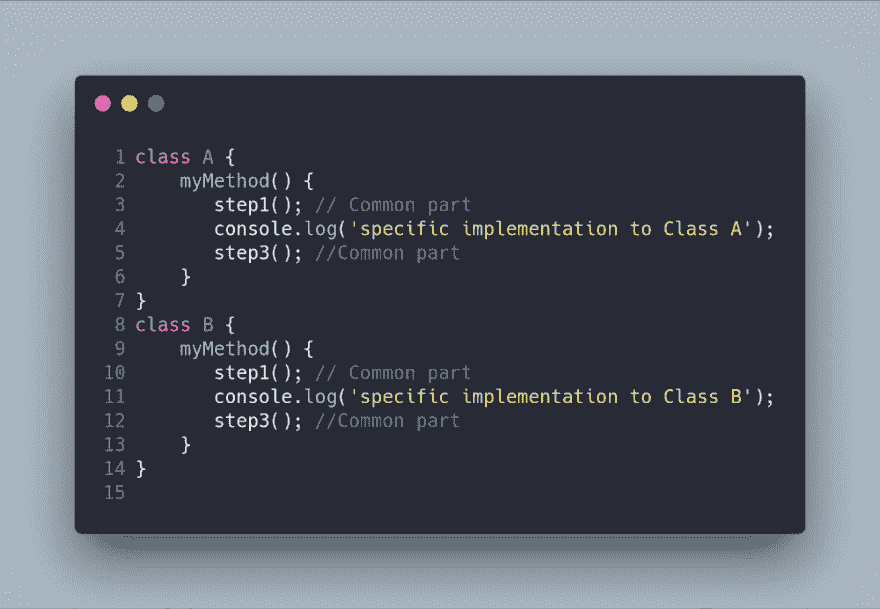
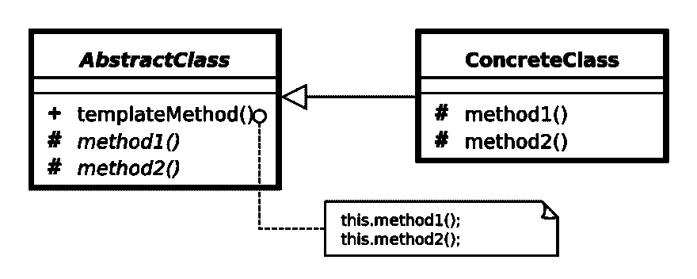
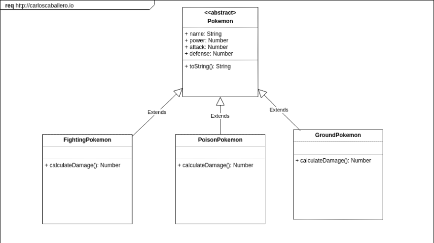
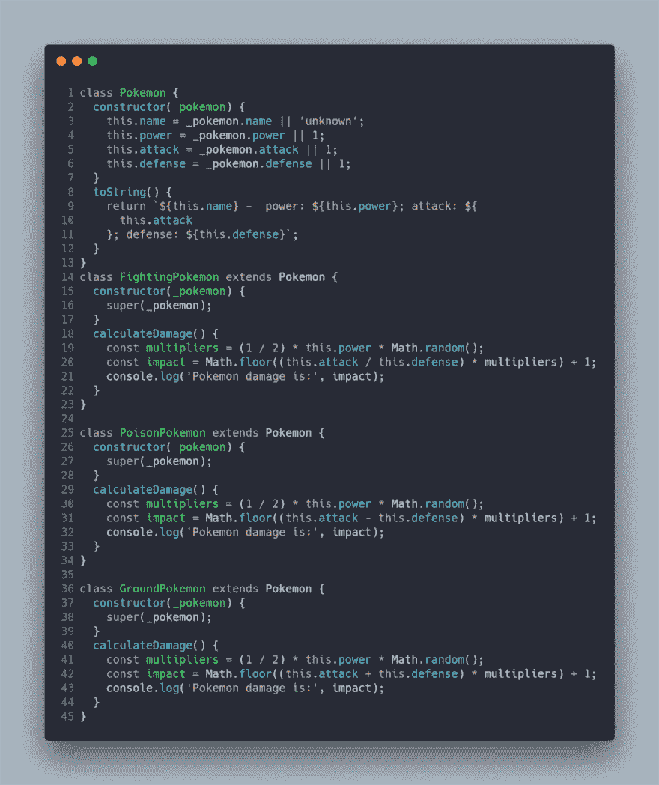
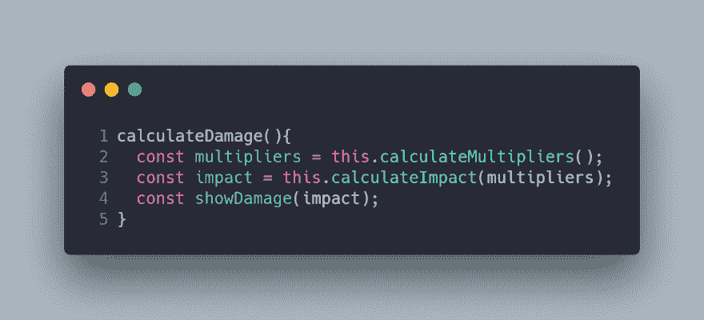
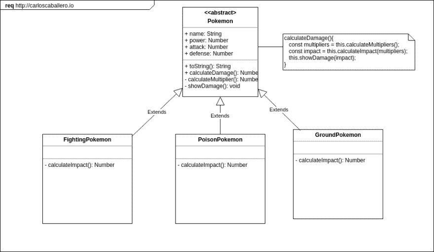
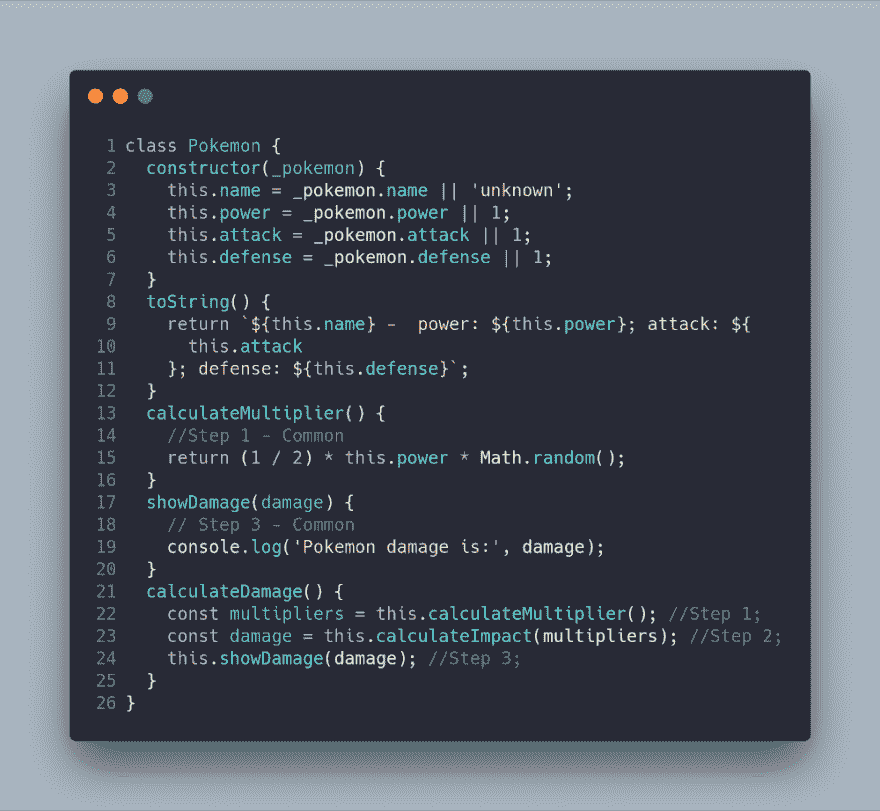
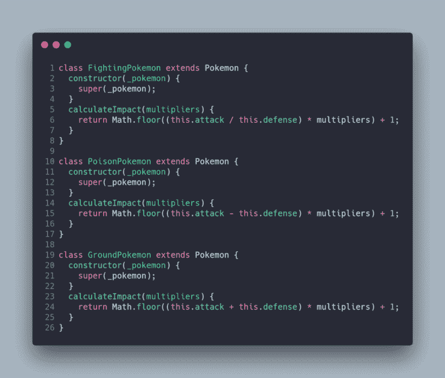
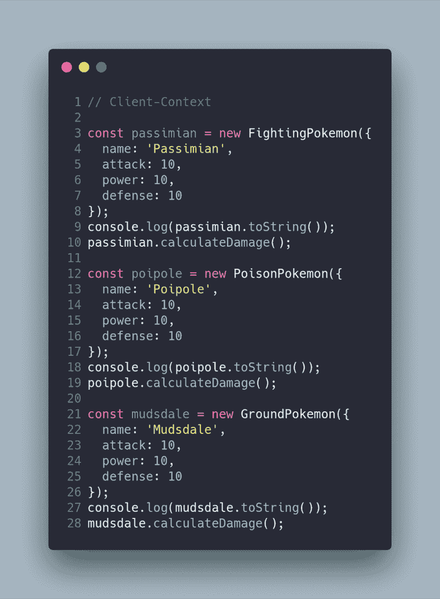

# 设计模式-模板方法

> 原文：<https://dev.to/carlillo/design-patterns---template-method-180k>

有 23 个经典的设计模式，在原著中有描述，
`Design Patterns: Elements of Reusable Object-Oriented Software`。这些模式
为特定的问题提供解决方案，经常在软件
开发中重复。

在这篇文章中，我将描述如何使用**模板模式；以及如何以及何时应用 T2。**

### 模板方法模式:基本思想

> **模板方法模式**是一个[行为](https://en.wikipedia.org/wiki/Behavioral_pattern) [设计模式](https://en.wikipedia.org/wiki/Software_design_pattern)，它定义了一个操作中[算法](https://en.wikipedia.org/wiki/Algorithm)的[程序框架](https://en.wikipedia.org/wiki/Program_skeleton)，将一些步骤推迟到
> [子类](https://en.wikipedia.org/wiki/Subclass_(computer_science))——维基百科
> 
> 在操作中定义算法的框架，将一些步骤推迟到子类。模板方法允许子类在不改变算法结构的情况下重新定义
> 算法的某些步骤。—设计模式:可重用面向对象软件的元素

这种模式的主要特点是算法在不同种类的类之间略有不同。当在具体的类中实现时，这些共同的部分在不同的
算法中重复。

* * *

最初发布于[www . carloscaballero . io](https://www.carloscaballero.io/design-patterns-template-method/)2019 年 3 月 1 日。

以下代码显示了一个经典问题，您必须重复部分
算法(复制/粘贴),只做很小的改动:

我们可以通过使用**模板方法模式**使代码更加简洁，这允许我们避免在算法的
的不同实现中重复代码。这个模式的 UML 图表如下:

注意抽象类，包含模板方法和私有方法
。模板方法描述了不同步骤的算法。共有的
步骤在抽象类中实现，而每个具体类中不同的具体
步骤在所述具体类中实现。

### 模板-方法模式:何时使用

1.  由**模板方法**模式解决的问题是使用一种具有不同变化的算法。当在不同的实现之间共有时，您需要将您的算法分成不同的步骤，在抽象类中实现。另一方面，不同的步骤将在具体的类中实现。
2.  另一个有趣的情况是，当您在不同的类之间复制/粘贴代码(私有函数)时，您会发现需要这种模式。
3.  最后，当你的大多数类都有相关行为时，你可能会用到这种模式。

### 模板-方法模式:优势

模板方法模式有几个优点，总结为以下
点:

*   创建算法的具体实现**相当容易，因为您通过使用抽象类移除了问题域的公共部分。**
*   **清理代码**，因为你避免了重复的代码。
*   **更干净的代码**因为你把算法分成私有的方法/函数，更简单，更容易测试。

### 模板模式:使用 JavaScript 的口袋妖怪示例

我现在将向您展示如何使用 JavaScript 实现这种模式。请
记住 Javascript 既缺少接口也缺少抽象类。
因此，理解这种模式的最好方法是使用一个例子。在我们的例子中，我想到了一个问题，其中有一个名为
`Pokemon`的抽象类定义了一个口袋妖怪。一个口袋妖怪除了经典的`toString`方法外，还有
`name``power``attack``defense`等一系列属性。
有一个口袋妖怪类型的分类，例如`FightingPokemon`、
、`PoisonPokemon`和`GroundPokemon`，它们定义了一个称为
`calculateDamage`的具体方法，该方法根据属性
和口袋妖怪的类型来计算数值。下面的 UML 图显示了我刚刚描述的场景。

使用 JavaScript 实现实际情况的代码是下面的
:

方法`calculateDamage`在每个具体的类中重复，也就是说，有一个气味
代码(复制/粘贴-复制代码)。这个方法可以拆分成
不同的步骤，比如这样:

注意，我们的方法被分成了三个函数。事实上，两个是
通用的，一个是特定的，这取决于实现它的类
( `calculateImpact`)。我们的`Template-Method`模式已经成功应用。
在下面的 UML 中，你可以看到使用模板方法的版本更新。

类别`Pokemon`如下所示:

您可能已经注意到方法`this.calculateImpact`不是在这个类中实现的
。这是因为具体的实现将在具体的类中
。这个口袋妖怪类就是我们问题中的抽象类。

下一步包括实现具有
和`calculateImpact`方法的具体类。

最后，我们使用具体口袋妖怪的客户端/上下文代码是下面的
:

这段代码创建了具体的 Pokemon，它调用它的`calculateDamage`。它的
实现对客户端/上下文是透明的，但是，代码不会
重复。最后，我创建了两个 npm 脚本，分别在应用模板方法模式之前和之后运行代码。

`npm run step0`
T1】

### 结论

**模板方法模式**是一种可以避免在
你的项目中重复代码的模式，当一个算法既有不变部分又有变化部分，后者
取决于具体的类。在这篇文章中，你可以观察到一个使用 JavaScript 语言的
简单实现，它缺少
接口/抽象。如果你使用的编程语言有接口/抽象，你可以遵循 UML 模式。

最重要的事情不是实现我给你展示的模式，而是
能够识别这个特定模式可以解决的问题，以及
你何时可以或不可以实现所述模式。这一点至关重要，因为
的实现会因您使用的编程语言而异。

* * *

最初发布于[www . carloscaballero . io](https://www.carloscaballero.io/design-patterns-template-method/)2019 年 3 月 1 日。