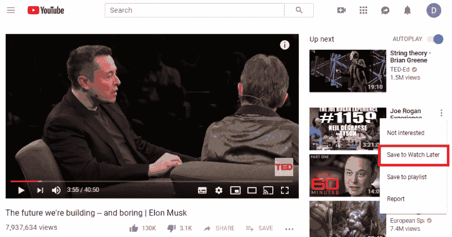
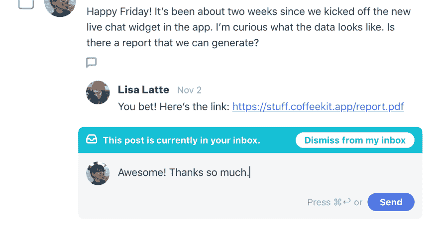
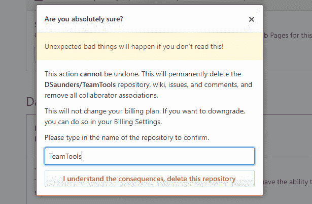

# 为流动而设计

> 原文：<https://dev.to/davejsaunders/designing-for-flow-1f5>

作为构建软件的人，我们都处于“流动”状态；完全沉浸在一项活动中，高度专注，工作效率极高。

当我们设计我们的软件时，我们需要考虑我们要求用户在更广泛的用户体验环境中执行的交互——维护用户的“流程”..

# 别让我翻页

从一个页面切换到另一个页面是破坏流量的罪魁祸首之一。

即使页面加载得很快，用户不必等待，他们也必须重新构建他们的思维模型，并弄清楚他们需要在一个全新的页面上做什么。

这可能没什么大不了的，但是这种上下文切换对用户体验有非常负面的影响。

> 经验法则:除非上下文也在变化，否则不要让用户切换到另一个页面

例子: YouTube 的“保存下来以后看”就是一个很好的例子。当你在观看视频时，看到你感兴趣的“下一个”内容，你可以将其添加到列表中，而无需离开当前页面。稍后，当你积极寻找新的东西看(你现在在一个不同的“环境”)，你可以导航到一个新的页面，显示你的列表。

# 不要让我更换输入设备

作为一名开发人员，我的主要输入设备是键盘。当我写代码时，切换到鼠标会降低我的速度，打断我的流程。我喜欢一切都可以使用键盘快捷键。

例如，在 TeamTools 的情况下，用户需要能够打开搜索模式，搜索代码片段，并完全通过键盘将其插入到他们的代码中。

如果你喜欢的话，你可以使用鼠标，但是强迫用户在输入的时候切换到鼠标会产生很大的摩擦，很可能根本没有人会使用它。

> 经验法则:在整个交互过程中，尽量坚持使用一致的输入设备

*例子:*尽管 Slack 在总体上不太适合流量，但它做到了这一点。当你输入信息并想添加表情符号时，你根本不需要鼠标。表情符号可以通过键入:。这将打开一个列表，您可以在其中继续输入以过滤列表，然后使用箭头键(或者鼠标，如果您喜欢的话)来选择一个。整个“发送消息”交互可以完全通过键盘来执行。

# 除非情况紧急，否则不要显示通知

这就是为什么聊天工具会成为生产力杀手。

默认情况下，只要有人提到你，你就会收到通知。不仅如此，他们还鼓励“提及整个频道”的行为，以确保有人回复——否则信息会滚动，可能永远不会被回复。

如果你要弹出一个通知或者显示一个“祝酒词”消息，只在需要用户输入的时候才这样做。否则，一个小的`(1)`通知，当用户不在“流”中时可以访问，通常是好的。

> 经验法则:除非需要用户立即注意，否则不要用通知打断用户。

*举例:* Level 就是围绕这个前提设计的一个通讯工具。不鼓励分散注意力的通知，非紧急的对话是安全的，用户可以在自己的时间查看。

# 何时故意断流

有时一个动作会产生严重的后果，你需要迫使用户停下来思考。

很容易在点击的时候不小心做了一些事情，所以有时候做与上面的“经验法则”相反的事情有助于打断用户的流程，迫使他们停下来思考，避免他们犯代价高昂的错误。

> 经验法则:当一个动作的结果需要更多深思熟虑时，故意打断用户流

*举例:*在 GitHub 中删除一个库的时候，一次点击是不够的。此时您可能正在使用鼠标，但是在可以删除它之前，您不得不停下来键入存储库的名称(请参见“不要让我更改我的输入设备”)。仅仅显示一个需要再次点击鼠标的确认对话框可能无法防止分心的用户意外删除错误的存储库。

# 结论

从一开始，为心流而构建就需要是一个深思熟虑的过程，当有些事情“感觉”不对时，就很难再改进了。在设计和建造过程中的每一点上，我们都需要在心里检查清单上的东西。

最后，没有什么可以替代把东西放在用户面前，看着有人真正使用它。

* * *

这原本是为团队工具博客写的。TeamTools 是一个 Visual Studio 插件，旨在让您的团队保持流畅！请随意看看，并让我知道你的想法😊