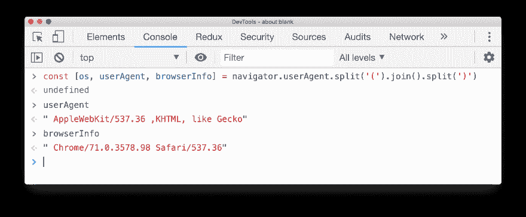
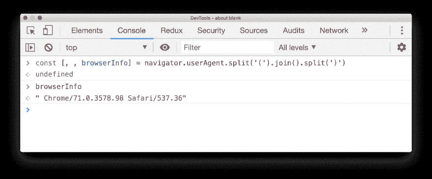
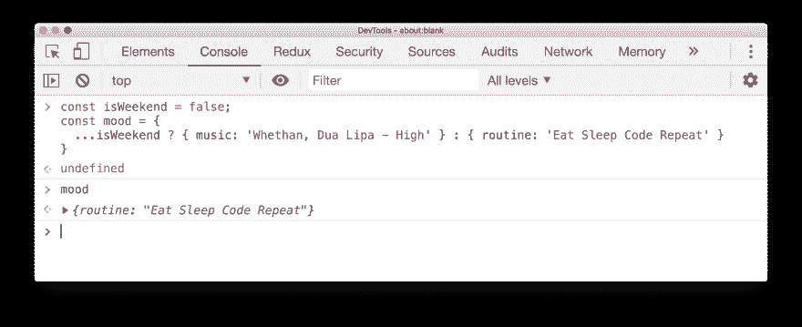
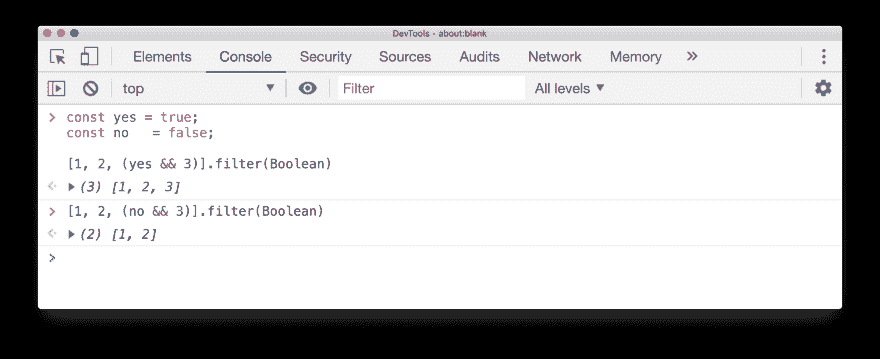

# JavaScript 中的析构

> 原文：<https://dev.to/mahmoudelmahdi/destructuring-in-javascript-87n>

**析构赋值**是现代 JavaScript 中最灵活、最简单的特性之一。它是一个 JavaScript 表达式，可以将数组中的值、对象中的属性甚至函数参数解包到不同的变量中。

## 破坏物体

我们经常在代码库中的几个地方引用同一个变量，我们希望避免重复声明同一个变量。例如，向服务器发出请求可能需要在头的请求中有一个授权(令牌)。假设我们有一个持有`token`和`refresh_token`键的`session`对象

ES5:

```
const token = session.token;
const refreshToken = session.refresh_token; 
```

Enter fullscreen mode Exit fullscreen mode

ES6:

```
const {
  token,         // ↓ alias ↓
  refresh_token: refreshToken
} = session; 
```

Enter fullscreen mode Exit fullscreen mode

在上面的 ES6 代码片段中，语法变得更加清晰。就像您可以用一条`let`语句声明多个逗号分隔的变量一样，您也可以在一个析构表达式的花括号中声明多个变量。也有这样的情况，我们希望将属性名重命名为不同的名称；在这种情况下，您将使用一个`: amAlias`。上面我们使用 alias 将属性名从 snake-case 改为 camelCase。

## 功能参数

我们可以在函数参数中使用析构来从作为函数参数传递的对象中解包字段。如果我们想实现一个只考虑参数的某些属性的函数，通过预先析构来显式引用这些属性可能是一个好主意。预先析构一切，当输入不符合函数约定时，很容易发现。

```
const getFullName = ({ user }) => 
  user && `${user.firstName}  ${user.lastName}`;

const state = {
    user: {
        firstName: 'Mahmoud',
        lastName: 'Elmahdi'   
    }
};

getFullName(state); // Mahmoud Elmahdi 
```

Enter fullscreen mode Exit fullscreen mode

## 解析函数返回值

每当有一个函数返回一个对象或一个数组时，析构可以使对返回值的处理更加简洁。下面的例子展示了一个`getUser`函数，它返回一个包含用户数据的对象，其中我们只获取我们感兴趣的数据:`isAdmin`并忽略其余的

```
const getUser = () => ({
    id: 156,
    isAdmin: true,
    fullName: 'Mahmoud Elmahdi',
    email: 'abracadabra@email.com',
    languages: ['Arabic', 'English', 'Russian']
});

const { isAdmin } = getUser();
isAdmin && retrieveSensitiveData(); 
```

Enter fullscreen mode Exit fullscreen mode

## 数组解构

析构数组使用方括号而不是花括号。不用像`x = arr[0]`那样在代码中加入实现细节，通过析构，你可以清楚地表达你的意思，不用显式地引用索引，而是命名值

[](https://res.cloudinary.com/practicaldev/image/fetch/s--ZC0oeUji--/c_limit%2Cf_auto%2Cfl_progressive%2Cq_auto%2Cw_880/https://thepracticaldev.s3.amazonaws.com/i/bq1ah6knfxvchj1angwd.png)

当析构数组时，我们也可以跳过那些不需要引用的属性

[](https://res.cloudinary.com/practicaldev/image/fetch/s--Z5Q1fKWT--/c_limit%2Cf_auto%2Cfl_progressive%2Cq_auto%2Cw_880/https://thepracticaldev.s3.amazonaws.com/i/jza10x1ruev7kuzr1yfa.png)

## 有用的提示

使用属性的扩展运算符在对象文字内有条件地添加属性:

[](https://res.cloudinary.com/practicaldev/image/fetch/s--2DRPAvRO--/c_limit%2Cf_auto%2Cfl_progressive%2Cq_auto%2Cw_880/https://thepracticaldev.s3.amazonaws.com/i/rg4urb3wlgywhn99qil2.png)

仅当元素为*true*(**not**`null`/`undefined`或空)时，才在数组文字中添加元素

[](https://res.cloudinary.com/practicaldev/image/fetch/s--lJQ_jFaw--/c_limit%2Cf_auto%2Cfl_progressive%2Cq_auto%2Cw_880/https://thepracticaldev.s3.amazonaws.com/i/rzhetrzghss9l9gtzn6h.png)