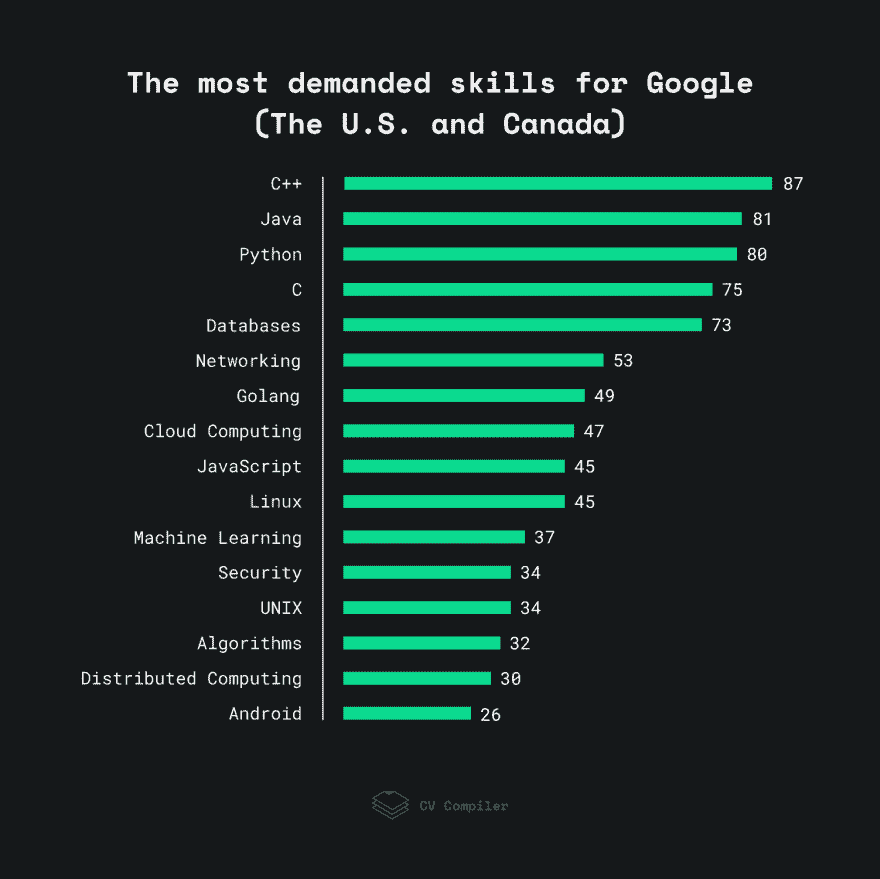
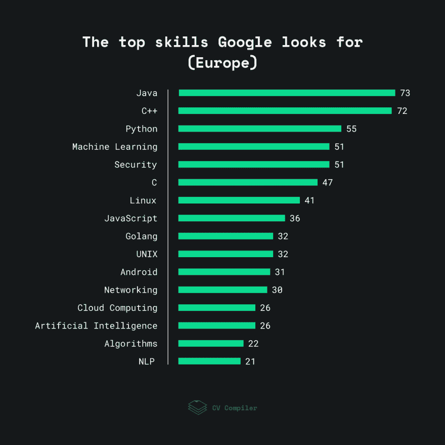
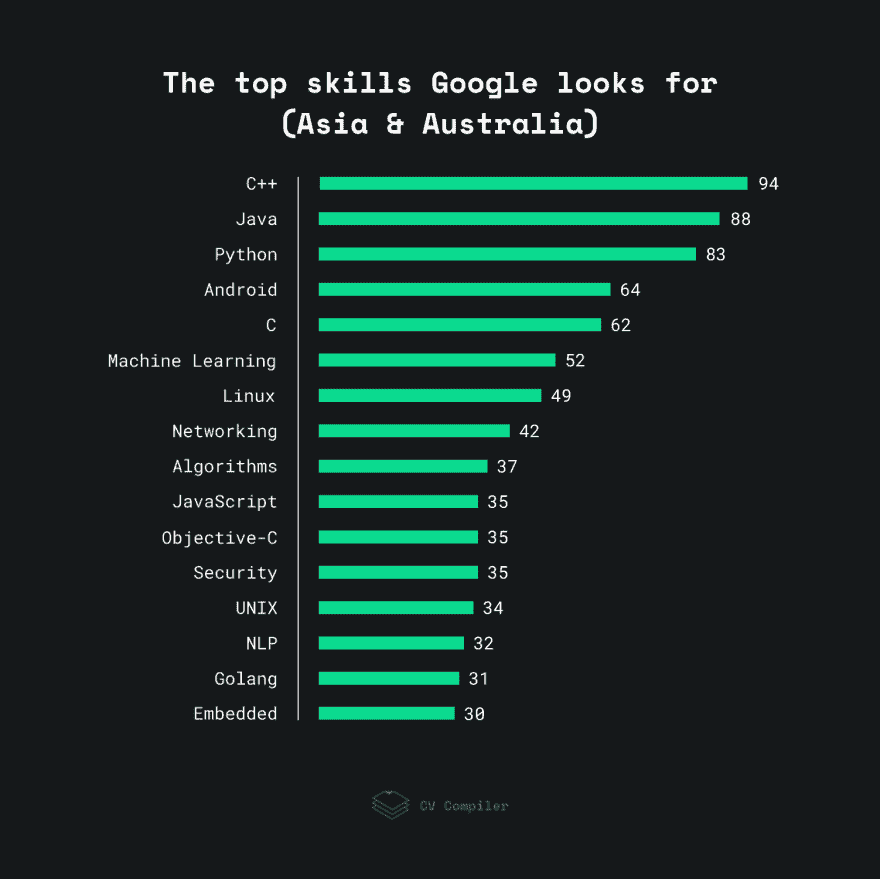

# 开发者们，在申请谷歌之前，请阅读这篇文章

> 原文：<https://dev.to/stetsenko_me/developers-read-this-before-applying-for-a-tech-job-at-google-38gn>

想在谷歌从事技术工作吗？这篇文章是给你的。

我的谷歌求职指南不是从普通的技巧开始，而是从新的数据开始。以下是我们对 300 多个谷歌职位空缺的分析结果。为了进行这项研究，我们建立了自己的内部分析工具来检查大量数据集。具有讽刺意味的是，它是基于 TensorFlow 的 seq2seq 模型，也是由 Google 构建的:)

从所有这些工作描述中，我们提取了最需要的技能。之后，我们按照 3 个地点过滤结果:**亚洲+澳洲**、**欧洲**和**美国+加拿大**。所以，选择你现在，(或者未来)，目的地，走下去。

## 北美

对于北美的，顶级技能列表如下:

除了这个列表，在北美最受欢迎的语言是 **C#** (21)和 **Objective-C** (23)。至于区别，在美国和加拿大，大约 10%的职位空缺要求了解 **Swift** (14)或 **Perl** (11)，而 22%的职位(24 个)是为那些了解 **SQL** 的人准备的。如果你选择处理数据，强烈推荐你了解 Hadoop 和 MapReduce。

## 欧洲

以下是欧洲的技能列表:

**C#** (20 次提及)和 **Objective-C** (16 次提及)也是欧洲流行的编程语言。除了语言，一个未来的谷歌人应该知道**分布式计算**原理(15)**数据结构**(14)**OOP**(6)等等。当然，对于谷歌来说，这些知识绝对应该超越大学课本。当然，你也不能忽视谷歌自己的项目，比如**云平台** (10)或者 **Kubernetes** (7)。

## 亚太

这些是亚洲**&澳洲**最需要的技能:

除了这些，云计算专家也很受欢迎。大约 30%的职位空缺都是给他们的。至于编程语言， **C#** 几乎和 **Go** 一样受欢迎(21 次提及)。关于 **Shell 脚本** (10 次提及)**标记语言** (16 次用于 HTML，14 次用于 XML)**自动化测试** (8 次提及)**数据库** (9 次提及)的知识也可以在不同的工作中派上用场。顺便说一下，像**大数据** (9)和**深度学习** (7)这样的技能似乎在亚洲和澳大利亚也越来越受欢迎。

重要提示: *我们并不认为拥有这些技能就能保证你在谷歌找到工作，(或者说不具备这些技能就意味着你职业生涯的终结。)这只是市场分析:了解需求总是有用的。*

## 为什么谷歌

研究表明，每年大约有 200 万人申请谷歌。原因如下。根据[的 Glassdoor 评论](https://www.glassdoor.com/Reviews/Google-Reviews-E9079.htm)，谷歌向其员工提供以下福利:

*   **有竞争力的薪酬。**在谷歌，任何经验水平的软件工程师的平均工资约为 124，000 美元/年，高级软件开发人员的平均工资为 165，000 美元/年(截至 [Glassdoor](https://www.glassdoor.com/Salary/Google-Salaries-E9079.htm) )。
*   **精心选择的环境。每 130 名申请者中，只有 1 人成为“谷歌人”**
*   **职业成长。如果你最终因为任何原因离开谷歌，想象一下招聘人员在你的“工作经历”中看到“谷歌”时的眼神，而不是你简历中的“技术堆栈”部分！**
*   **伟大的工程。**除了与搜索引擎和云技术相关的项目，谷歌人还致力于类似[无人驾驶汽车](https://waymo.com/)和[医疗设备](https://en.wikipedia.org/wiki/Google_Contact_Lens)的项目。
*   **公司文化。**免费的一日三餐，定期的健康检查，22/18 周的产假/陪产假，令人惊叹的健身房，无限量的咖啡和小吃——这是每个谷歌员工每天都会得到的。

谷歌在五大洲有 70 多个办事处，看起来是一个理想的工作场所。现在，让我们来看看如何申请。

## 应用

科技职位申请人的所有必要信息都在[谷歌招聘页面](https://careers.google.com/)上。首先，你需要[在特定的搜索栏输入你的技能](https://careers.google.com/jobs/)并浏览相关的工作机会。这样做之后，谷歌职业专家建议你集中精力润色你的简历。

前谷歌人力运营高级副总裁拉兹洛·博克[说](https://www.businessinsider.com/laszlo-bock-gives-key-to-perfect-resume-2016-10?international=true&r=US&IR=T)，**主动动词**是一份成功的技术简历的关键。尤其是“经历”部分和要点，是任何简历中最重要的部分。这是拉兹洛关于如何“烹饪”它们的黄金收据:

> **通过做[Z]来完成[X]和测量[Y]。**

看看这些例子:

*   **实施** Solr 集群(主从架构)进行近实时搜索，使**的搜索时间减少了 20%**。
*   **开发并维护**一套自动化分析系统，每天能够处理**1500 万次统计运算**。
*   **通过将运行在 IBM stack 上的 monolith 拆分为运行在 Kubernetes 上的集装箱化精益 Spring Boot，重建了**富有弹性和韧性的**环境。**

有了这些要点，你在谷歌获得技术工作的机会就会大大增加。

除此之外，请记住以下规则:

*   只包括那些与工作描述相关的技术技能。
*   如果你有领导经验，别忘了提及。
*   如果你的工作经验有限，包括你相关的学校项目或课程。
*   保持你的简历简短；如果招聘人员需要更多详细信息，他们会联系您询问更多问题。
*   不要写长的求职信。它们不会帮助你展示自己是一个创新的技术人员。

**重要提示:** *所有的申请都是真人审核，而不是解析器。写简历的时候要记住这一点。不要过多使用关键词或模板——坚持简单明了的简历格式。(.多克还是。pdf 很完美。)*

如果你没有时间或经验自己制作一份合适的简历，可以考虑求助于像 [CV 编译器](https://cvcompiler.com/)这样的工具。这个特殊的工具可以分析你的简历，并给出如何改进的即时建议。顺便说一下，它还检查你的简历是否适合世界顶级公司，尤其是谷歌。

另一个重要的规则:**不要忘记人际关系网**！想想你所有的熟人。如果你和谷歌有联系，把你的简历发给他们，让他们推荐你。谷歌为其员工提供了一个特殊的推荐系统，所以对于你认识的谷歌人来说，这个过程将会是快速而简单的。然而，光靠人际关系网并不能让你在谷歌获得一份技术工作——它只会加快审核你简历的过程。

## 面试和做决定

你终于成功了！招聘人员最终答应了，面试也安排好了。花点时间庆祝一下，然后重新开始准备。谷歌以其漫长的招聘流程而闻名，从最初接触到提供职位平均需要 6-8 周。在此期间，你将不得不通过两个阶段:电话**面试**和**现场面试**。

在**电话面试**中，你将与面试你的人分享一份谷歌文档(通常是经理或团队成员)。)面试将持续 30-60 分钟，在此期间你必须回答问题，(主要是关于**算法**和**数据结构**)，并用一些代码支持你的答案。由于时间有限，你的代码不必完美，但一定要可行并经过修改。完成一项任务后，你将被要求用算法的方式解释你的解决方案。

通过电话面试后，你将被邀请到办公室参加一系列的**现场面试**。谷歌喜欢行为面试，所以忘掉典型的“你为什么决定离开你的前一份工作？”问题。此外，不要想那些脑筋急转弯:[谷歌在过去就已经把它们抛在脑后了](https://www.nytimes.com/2013/06/20/business/in-head-hunting-big-data-may-not-be-such-a-big-deal.html)。相反，期望角色扮演特定的情况，并准备好解释你的行动。例如，想想你对以下问题的回答:

*   描述您的流程...(建立电子邮件列表、建立数据库等。)
*   告诉我一次你...(和同事闹僵，冒险失败等。)
*   你引以为豪的成就是什么，为什么？
*   你所知道的最复杂的行业相关的事情是什么？

当然，你会被要求重新编码。问题将主要涵盖算法、数据结构、递归、排序、离散数学和 T2 图。此外，您不会被允许在 IDE 中工作，而是可以自由地选择一种语言。

**重要提示:** *面试时，面试官不仅会评估你的行业相关知识，还会评估你的一般认知能力。所以，准备好解释自己的思维方式，从自己的经历中讲真实的故事。此外，不要害怕提问。你应该尽可能多地了解你未来的角色、团队、公司文化等等。*

完成所有面试后，一个特别委员会将审查你的候选资格。如果一切顺利，你将在谷歌获得一份期待已久的技术工作。

## 有用的资源

如果你需要一些额外的灵感或提示，请参考以下文章:

*   Alex Golec 解构的谷歌面试问题。在这一系列 Medium 文章中，这位前谷歌软件工程师分享了一些技术问题的例子以及对这些问题的精彩回答。
*   [我从两次面试和收到谷歌的邀请中学到了什么](https://medium.com/google-design/what-i-learned-from-interviewing-and-receiving-offers-from-google-two-times-e1d1a7b715bc)Tiffany Eaton。这个故事证明，一个普通的学生可以很容易地成为谷歌员工，这要归功于他们的努力。
*   YK·杉的《如何在谷歌和其他顶尖科技公司找到一份软件工程师的工作》——一本关于新手如何获得所需技能的完整指南。
*   即使你不会编程，也能在谷歌找到工作的 5 种方法。
*   6 名前谷歌员工分享他们是如何找到这份工作的。

你还有其他在谷歌找工作的建议吗？欢迎在下面的评论区分享它们。

感谢阅读！本帖最初发表于[此处](https://cvcompiler.com/blog/developers-read-this-before-applying-for-a-tech-job-at-google/)。

> 即使你没有申请谷歌，一份好的简历也是你成功就业的关键。在这里获得你的完美简历:[https://cvcompiler.com/](https://cvcompiler.com/)。