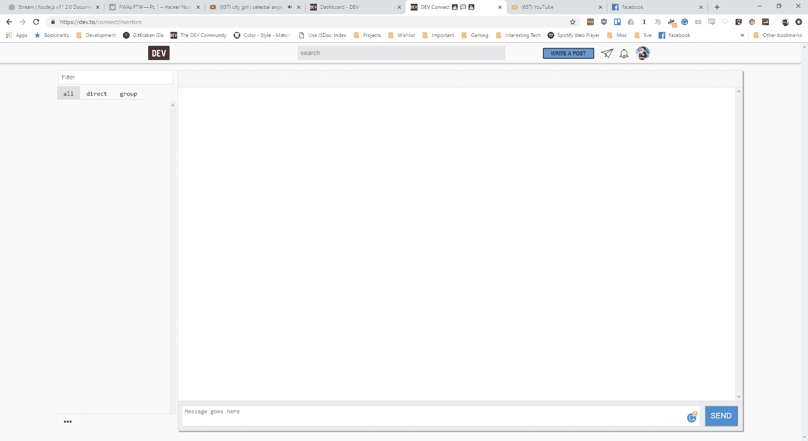

# 开发人员对上周的回购进行总结

> 原文：<https://dev.to/devteam/devto-repo-recap-from-the-past-week-4mlm>

又见面了！👋为了减少一些困惑——主要是为我自己——我将把这个版本提前几天截去，这样我们就可以为未来的版本覆盖整个周日到周六。这一期将涵盖 11 月 28 日至 12 月 1 日。下周将涵盖 12 月 2 日至 12 月 8 日。

# 特性

*   我们最近更新了我们的[行为准则。](https://dev.to/code-of-conduct)感谢 [@jess](https://dev.to/jess) 的公关！

    *   [链接到 PR](https://github.com/thepracticaldev/dev.to/pull/1224)
*   我们最近还增加了一个新功能，允许你微调你的饲料多一点。更多细节请见本的帖子:

    *   [Link to PR](https://github.com/thepracticaldev/dev.to/pull/1229)[](/devteam) [## Modify the log: adjust the weight of the tags you are concerned about

        ### Ben Halpern of the development team read

        # meta # in 182 minutes on November 30th. changelog](/devteam/changelog-adjust-the-weights-of-tags-you-follow-571k)

# Bug 修复/其他贡献

*   [@rxx](https://dev.to/rxx) 对我们的 header 标签做了一个小小的改进，用一个数组`join`方法替换了一个长字符串。感谢 [@rxx](https://dev.to/rxx) ！

    *   [链接到 PR](https://github.com/thepracticaldev/dev.to/pull/795)
*   @francisco 在我们的 onboarding 组件中重构了一些 Preact 和 JS 代码。谢谢你，弗朗西斯科！

    *   [链接到 PR](https://github.com/thepracticaldev/dev.to/pull/1083)
*   [@mhchen](https://dev.to/mhchen) 做了一个拉请求，修复了 V1 编辑器中的一个问题:你现在应该可以用箭头键在编辑器中正确地移动文本光标了。

    *   [链接到 PR](https://github.com/thepracticaldev/dev.to/pull/1203)
*   [@ycmjason](https://dev.to/ycmjason) 修复了在标题的锚链接中包含标点符号的边缘情况。谢谢杰森。

*   [链接到 PR](https://github.com/thepracticaldev/dev.to/pull/1219)

*   [@link2twenty](https://dev.to/link2twenty) 修复了一个 CSS 问题，即导航条的左边缘与导航条的其他部分高度不同。谢谢安德鲁。

    *   [链接到 PR](https://github.com/thepracticaldev/dev.to/pull/1227)
*   [@tterb](https://dev.to/tterb) 将设置提醒的横幅从鲜红色改为白色，这样应该更容易阅读。谢谢布雷特。

    *   [链接到 PR](https://github.com/thepracticaldev/dev.to/pull/994)

# 新问题/讨论

*   [@alcha](https://dev.to/alcha) 报告了一个他无法清除的挂起连接通知的问题。如果你也有这个问题，请在本期中告诉我们。谢谢你，戴文！

    # [ 不免接通知徽章 #1210](https://github.com/thepracticaldev/dev.to/issues/1210) 

    [](https://github.com/4lch4) **[4lch4](https://github.com/4lch4)** posted on [<time datetime="2018-11-28T03:28:02Z">Nov 28, 2018</time>](https://github.com/thepracticaldev/dev.to/issues/1210)

    **描述 bug** 无论我去网站的什么地方或者做什么，在**连接**功能中都有一个通知徽章，好像我有未读的消息:

    [](https://camo.githubusercontent.com/791163a65cfa86f765eede7bc749ee84a7da2a67/68747470733a2f2f74686570726163746963616c6465762e73332e616d617a6f6e6177732e636f6d2f692f74307a367235747a7a71633169397a7577766c372e706e67)

    我不确定这些步骤会不会重现它，但是在我对错误[的调查之后，在@benhalpern](https://dev.to/ben/comment/6npm) 的帮助下:

    1.  加入一个小组，比如导师小组。
    2.  当出现如上所示的通知徽章时，离开群组。

    **预期行为**我希望我转到连接页面，并有一条消息，如果没有，那么不应该有通知徽章。

    **截图**上面贴的是我实际看到的截图，但这里是我点击按钮进入连接页面后看到的截图: [](https://camo.githubusercontent.com/af19c9a568e288bdd87ebc52c752777023a36f89/68747470733a2f2f692e696d6775722e636f6d2f3764654a3675562e706e67)

    **桌面(请填写以下信息):**

    *   操作系统:微软 Windows 10 专业版内部版本号 17134
    *   浏览器:铬
    *   版本:70.0.3538.102(官方版本) (64 位)(群组:稳定)

    **额外背景** Ben 最初建议去`/chat_channels?state=unopened`寻找罪魁祸首，看来是导师小组的渠道导致了这个问题:

    ```
    [
      {
        "id": 31201,
        "slug": "mentors",
        "channel_name": "Mentors",
        "channel_type": "invite_only",
        "last_opened_at": "2018-10-13T03:27:22.619Z",
        "last_message_at": "2018-11-18T15:16:00.595Z",
        "adjusted_slug": "mentors",
        "membership_id": 79646,
        "description": "Chat amonst mentors"
      }
    ] 
    ```

    此外，我不记得在我第一次报告这个问题时发生过这种情况，但是当我单击带有通知的按钮时(去连接，我不知道如何表达)，它会将我导向空的`dev.to/connect/mentors`。你可以在我上面附上的第二张截图中看到结果。

    ```
    </div>
    <div class="gh-btn-container"><a class="gh-btn" href="https://github.com/thepracticaldev/dev.to/issues/1210">View on GitHub</a></div> 
    ```

    Enter fullscreen mode Exit fullscreen mode

*   [@link2twenty](https://dev.to/link2twenty) 开了一个问题，我们在主页上有一些丢失的`alt`标签。谢谢安德鲁。

    # [  A11y:登陆页面图片的 alt 属性 #1212](https://github.com/thepracticaldev/dev.to/issues/1212) 

    [](https://github.com/Link2Twenty) **[Link2Twenty](https://github.com/Link2Twenty)** posted on [<time datetime="2018-11-28T12:16:36Z">Nov 28, 2018</time>](https://github.com/thepracticaldev/dev.to/issues/1212)

    **描述错误**在登录页面上，有 3 张图片没有关联的`alt`标签，这导致了较低的可访问性得分。

    **nav-profile-image:**[https://github . com/thepractical dev/dev . to/blob/65110550 D8 c 2231 f 73 ff 99 AE 305 a 46 b 7 b 0 BC B4 f 9/app/views/layouts/_ top _ bar . html . erb # L25](https://github.com/thepracticaldev/dev.to/blob/65110550d8c2231f73ff99ae305a46b7b0bcb4f9/app/views/layouts/_top_bar.html.erb#L25)`alt="profile image"`

    **sidebar-profile-pic:**[https://github . com/thepractical dev/dev . to/blob/f 744 f 43493 ef 4 f 90 f 5421665d 0d 0d 393 db 03 da 052d/app/assets/JavaScript s/initializers/initializebase userdata . js # L36](https://github.com/thepracticaldev/dev.to/blob/f744f43493ef4f90f5421665d0d393db03da052d/app/assets/javascripts/initializers/initializeBaseUserData.js#L36)`alt="profile image"`**边注:**我不确定直接编辑内部 HTML 是这里最好的方法。

    **我的阅读清单:**[https://github . com/thepractical dev/dev . to/blob/65110550 d8c 2231 f 73 ff 99 AE 305 a 46 b 7 b 0 BC B4 f 9/app/views/articles/_ sidebar _ nav . html . erb # L20](https://github.com/thepracticaldev/dev.to/blob/65110550d8c2231f73ff99ae305a46b7b0bcb4f9/app/views/articles/_sidebar_nav.html.erb#L20)`alt="Bookmarks"`

    **预期行为** Alt 标签对于屏幕阅读器和断开的图像链接很重要

    **附加内容**这将阻止 chrome 审计标记该问题，但在某些时候，我们需要扫描整个网站，以找到其他有问题的图像。

    我认为这将是一个很好的第一期，像这样的小变化对可用性是如此重要。

    [View on GitHub](https://github.com/thepracticaldev/dev.to/issues/1212)

*   我们收到了一些通过 GitHub 登录失败的报告。请在下面的问题中让我们知道您的情况:

    # [  GitHub 登录有时认证失败 #1223](https://github.com/thepracticaldev/dev.to/issues/1223) 

    [](https://github.com/Zhao-Andy) **[Zhao-Andy](https://github.com/Zhao-Andy)** posted on [<time datetime="2018-11-29T19:46:35Z">Nov 29, 2018</time>](https://github.com/thepracticaldev/dev.to/issues/1223)

    曾经有过几次用户试图通过 GitHub 登录，却遇到了“无效凭证”的错误。大多数情况下，这是因为出错了，重试通常会奏效。到目前为止，我们已经收到了两个报告，有人试图登录，他们反复点击“无效凭证”的错误。

    对于更顽固的情况，我尝试删除他们的 GitHub 身份并让他们再次认证。这有时有效，但当它不起作用时，我怀疑有其他东西变得无效了。

    [@dance2die](https://dev.to/dance2die) 专门体验过 Chrome 的这个问题。在 Firefox 和 Safari 上用 GitHub 登录可以。

    [View on GitHub](https://github.com/thepracticaldev/dev.to/issues/1223)

*   @aspittel 开启了允许人们在个人资料上发布特定帖子的讨论。谢谢你，阿里！

    # [ 特色请求:特色简介帖子 #1225](https://github.com/thepracticaldev/dev.to/issues/1225) 

    [](https://github.com/aspittel) **[aspittel](https://github.com/aspittel)** posted on [<time datetime="2018-11-30T00:08:07Z">Nov 30, 2018</time>](https://github.com/thepracticaldev/dev.to/issues/1225)

    **您的功能请求是否与某个问题相关？请描述一下。**我希望能够在我的个人资料页面上展示不同的帖子。我有很多来自社区的基于讨论或重复出现的帖子，但我希望人们看到我最好的写作作品，而不是那些帖子。我认为这对于那些试图在 dev.to 生态系统之外分享他们的文章的人来说特别有帮助(例如，发推文查看我的博客或者类似的事情)。此外，这将有助于求职者把他们最好的内容放在第一位。

    **描述你想要的解决方案**我认为有很多解决方案:

    *   类似于 GitHub 概要文件上的“固定库”(也许这些也可以使用`cover_image`)——我认为这是最好的解决方案
    *   可链接的个人资料“按反应排序”视图
    *   一个类似于固定推文的“固定帖子”
    *   用户能够决定如何在他们的个人资料页面帖子排序
    *   关于帖子的布尔值，表示帖子是否应出现在个人资料中

    [View on GitHub](https://github.com/thepracticaldev/dev.to/issues/1225)

*   [@k20shores](https://dev.to/k20shores) 开启了不同方式提高评论线程化的讨论。他们建议更多的视觉提示或者能够折叠评论线程。谢谢凯尔。

    # [ 改善评论线程 #1211](https://github.com/thepracticaldev/dev.to/issues/1211) 

    [](https://github.com/K20shores) **[K20shores](https://github.com/K20shores)** posted on [<time datetime="2018-11-28T04:37:28Z">Nov 28, 2018</time>](https://github.com/thepracticaldev/dev.to/issues/1211)

    读完前面几条评论后，我不知道评论的词根从哪里开始。是否可以添加一个指示器，以便我在阅读新的根评论时可以很容易地分辨出来？如果没有，是否可以内置一个折叠功能，隐藏对根评论的所有回复？

    [View on GitHub](https://github.com/thepracticaldev/dev.to/issues/1211)

*   [@somedood](https://dev.to/somedood) 请求显示代码块的行号。谢谢， [@somedood](https://dev.to/somedood) ！本期更多评论:

    # [ 特性请求:增加代码块中包含行号的选项 #1236](https://github.com/thepracticaldev/dev.to/issues/1236) 

    [](https://github.com/Some-Dood) **[Some-Dood](https://github.com/Some-Dood)** posted on [<time datetime="2018-12-01T07:03:41Z">Dec 01, 2018</time>](https://github.com/thepracticaldev/dev.to/issues/1236)

    目前，我很享受在我的文章或评论中突出语法的代码块带来的好处。它使代码从文本的其余部分中脱颖而出。但是，有时可能需要引用代码块中的行号，以便更清楚地解释特定行。

    在这种情况下，我打开这个问题，要求一个选项来添加代码块中的行号。我相信哲基尔有可能做到这一点？知道[霍夫斯塔德定律](https://en.wikipedia.org/wiki/Hofstadter%27s_law)的存在，我希望它不会太难实现。

    也许行号可以通过前台全局启用？

    ```
    ---
    title: Line numbers in code blocks are cool!
    tags: meta
    linenos: true
    ---
    ```

    Enter fullscreen mode Exit fullscreen mode

    或者可以在每个代码块内联启用它？

    ```
    ---
    title: Individual Code Block Activation
    tags: meta
    ---

    #  Example of Unactivated Code Block
    ```javascript console.log('I have no line numbers... 😟');
    ```

    #  Example of Inline Activation
    ```javascript linenos
    console.log('I have inline line numbers! Yay! 🎉');
    ```
    ```

    Enter fullscreen mode Exit fullscreen mode

    或许它甚至可以默认为全局启用？

    无论如何，这差不多是整个功能要求。期待这一天的到来！感谢阅读！

    [View on GitHub](https://github.com/thepracticaldev/dev.to/issues/1236)

*   @rpalo 开启了讨论，作为一个作者，你会被告知你帖子中的每一条评论。谢谢瑞安。更多详情如下:

    # [ 通知作者如果有人回复了他们帖子的任何评论 #1238](https://github.com/thepracticaldev/dev.to/issues/1238) 

    [](https://github.com/rpalo) **[rpalo](https://github.com/rpalo)** posted on [<time datetime="2018-12-01T17:04:39Z">Dec 01, 2018</time>](https://github.com/thepracticaldev/dev.to/issues/1238)

    **您的功能请求是否与某个问题相关？请描述一下。**对问题的清晰简明的描述。《出埃及记》当我遇到以下情况时，我总是很沮丧...]

    目前，如果有人对我的帖子发表评论(回复别人)，我不会收到通知，所以我最终要么不得不查看/刷新，要么错过了很多我不知道正在发生的对话。

    **描述你想要的解决方案**简明扼要地描述你想要发生的事情。

    如果我的文章有人评论，我能得到通知就好了。

    **描述你考虑过的替代方案**对你考虑过的任何替代方案或功能的简明扼要的描述。

    即使只是一个捆绑通知，上面写着“今天你的文章有 10 条新评论！”那太好了。

    **附加上下文**在此添加关于功能请求的任何其他上下文或截图。

    [View on GitHub](https://github.com/thepracticaldev/dev.to/issues/1238)

本期就到这里。请随意分享您对任何问题的想法！