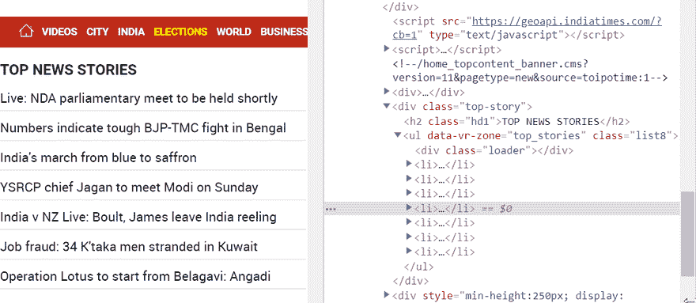
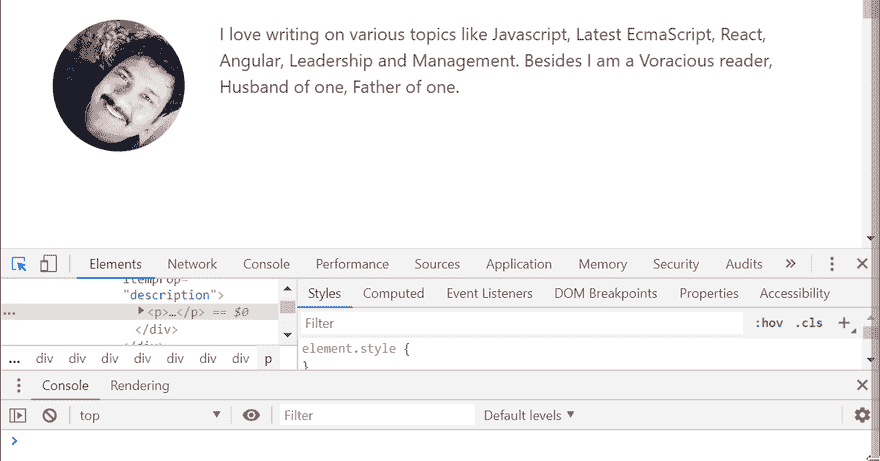
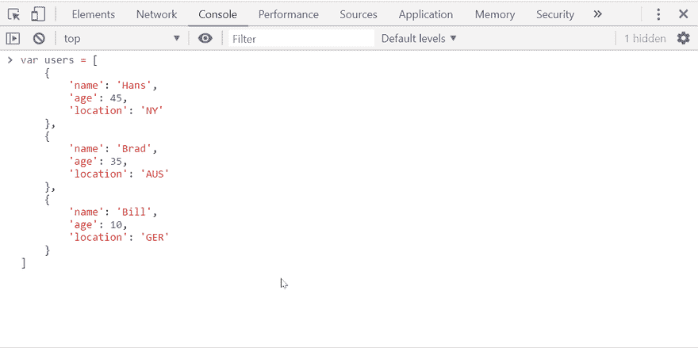
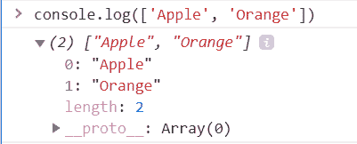
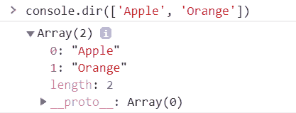
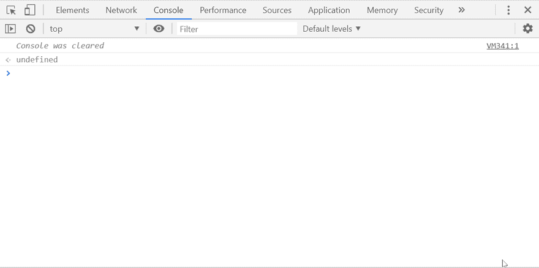
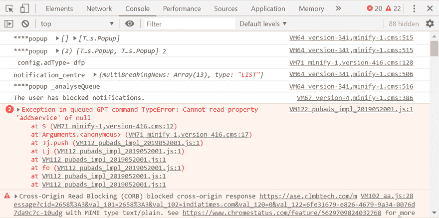
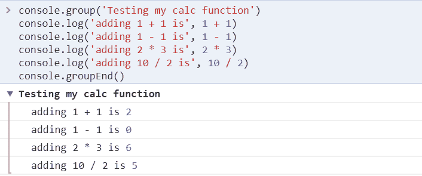
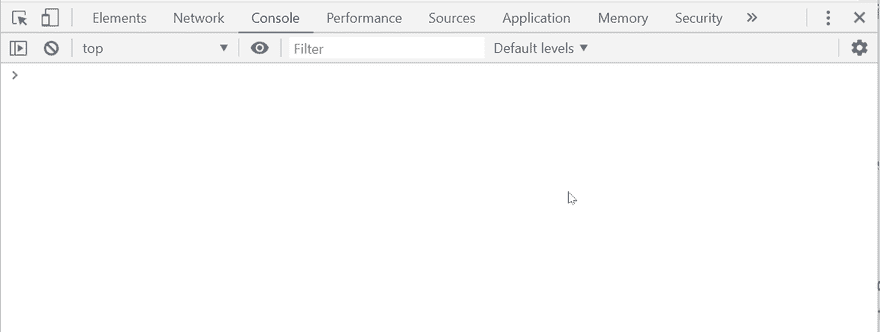

# dev tools——我最喜欢的技巧和窍门

> 原文：<https://dev.to/atapas/devtools-my-favorite-tips-and-tricks-32c7>

我最初并不热衷于发表这篇文章，因为我认为，我会重复你可能已经知道的事情。毕竟，这一切都是为了高效地使用浏览器的开发工具*。但后来我意识到，我们每个人肯定都有自己最喜欢的一套值得夸耀的技巧和诀窍。就这样文章发生了！*

 *法定警告:

> 对我来说，网络浏览器的开发工具和`Chrome Browser's Dev tool`是同义词。

请注意，我不会提及像`console.log('Hi')`、如何`debug Source files`或如何`inspect the DOM`这样的事情。你们大多数人肯定每天都在做这件事。我下面提到的都是最少使用的，但是可以让你成为一个非常高效的 Web 开发人员。让我们开始吧。

# 元素面板

以下技巧与 Chrome 的调试器工具
[](https://res.cloudinary.com/practicaldev/image/fetch/s--u1E2jhTJ--/c_limit%2Cf_auto%2Cfl_progressive%2Cq_auto%2Cw_880/https://cdn.hashnode.com/res/hashnode/image/upload/v1558785243928/F5GDoMcpM.png) 的`Elements`标签有关

### 重新排列元素的位置

你可以拖放元素来上下移动位置。这在编辑/调试 HTML 结构时非常有用。

[](https://res.cloudinary.com/practicaldev/image/fetch/s--y7mtRzFg--/c_limit%2Cf_auto%2Cfl_progressive%2Cq_66%2Cw_880/https://cdn.hashnode.com/res/hashnode/image/upload/v1558785720996/R6QfJpQmc.gif)

### 引用元素面板中的一个节点

您是否需要在`Elements`面板中选择一个特定的节点，并从`Console`面板中引用它？如果您想在该节点上做进一步的处理(或调试),您可能需要。

用`$0`来表示。

注意:如果您在项目中使用 jQuery，那么您可以使用`$($0)`来访问 jQuery APIs 并将其应用到这个元素上。

### 用单个 DOM 节点做 lots，像截屏一样？

你可以在不使用调试器工具的情况下截取一个 DOM 节点的屏幕截图，太棒了！通过选择一个节点按下`ctrl-shift-p`(我想，是 Mac 里的`cmd-shift-p`)。你会有很多选择。其中一条就是截屏，真的！

[](https://res.cloudinary.com/practicaldev/image/fetch/s--cWziCS4q--/c_limit%2Cf_auto%2Cfl_progressive%2Cq_66%2Cw_880/https://cdn.hashnode.com/res/hashnode/image/upload/v1558787189051/QjG7BMGwt.gif)

*   不要忘了通过按下 DOM 节点的`ctrl-shift-p`来探索其他可用的选项。

# 控制台面板

这是所有可用面板中我最喜欢的一个。
[T3】](https://res.cloudinary.com/practicaldev/image/fetch/s--B6I8Bq8B--/c_limit%2Cf_auto%2Cfl_progressive%2Cq_auto%2Cw_880/https://cdn.hashnode.com/res/hashnode/image/upload/v1558787443044/sqp8oDaQ3.png)

### 走多条线

有时在控制台面板中输入多行是很烦人的。只要按下`shift-enter`组合键就可以做到。持续按下`shift-enter`继续执行每一行。一旦完成，按下`enter`键。

[](https://res.cloudinary.com/practicaldev/image/fetch/s--xSyQVCcW--/c_limit%2Cf_auto%2Cfl_progressive%2Cq_66%2Cw_880/https://cdn.hashnode.com/res/hashnode/image/upload/v1558787867686/wydL7uAwc.gif)

### 控制台日志格式化

如果我们超越简单的`console.log('Hi')`，很少有更有用的版本来实现更好的格式化:

*   %s 将变量格式化为字符串
*   %d 将变量格式化为整数
*   %f 将变量格式化为浮点数
*   %o 可用于打印 DOM 元素
*   %O 用于打印对象表示
*   %c 用于传递 CSS 来格式化字符串

让我们看看下面的例子:

```
console.log(
  '%c I have %d %s',
  'color: green; background:black; font-size: 20pt',
  3,
  'Bikes!'
) 
```

Enter fullscreen mode Exit fullscreen mode

在控制台面板中运行上述代码。你会看到一个输出为，
[](https://res.cloudinary.com/practicaldev/image/fetch/s--ztpFxjJz--/c_limit%2Cf_auto%2Cfl_progressive%2Cq_auto%2Cw_880/https://cdn.hashnode.com/res/hashnode/image/upload/v1558788500987/2ObgBTSdr.png)

### 存储为全局变量

通常我们会得到一大块 JSON 对象作为响应。我们可能会选择其中的一部分进行研究。有一种方法可以将 JSON 对象的任何部分保存为可以在控制台面板中访问的`Global Temporary Variable`。如何看待它:

[](https://res.cloudinary.com/practicaldev/image/fetch/s--7bdoTsYg--/c_limit%2Cf_auto%2Cfl_progressive%2Cq_66%2Cw_880/https://cdn.hashnode.com/res/hashnode/image/upload/v1558789422004/kW4xg1E2b.gif)

### 控制台面板中的高级登录

##### 控制台.目录

```
console.log(['Apple', 'Orange]); 
```

Enter fullscreen mode Exit fullscreen mode

输出是，
[](https://res.cloudinary.com/practicaldev/image/fetch/s--lX7qSH4l--/c_limit%2Cf_auto%2Cfl_progressive%2Cq_auto%2Cw_880/https://cdn.hashnode.com/res/hashnode/image/upload/v1558789868258/XF7IHGD6F.png)

现在试试，

```
console.dir(['Apple', 'Orange']) 
```

Enter fullscreen mode Exit fullscreen mode

输出几乎和上面一样，但是它明确地将类型表示为一个`Array`。

[](https://res.cloudinary.com/practicaldev/image/fetch/s--c6J1ryAa--/c_limit%2Cf_auto%2Cfl_progressive%2Cq_auto%2Cw_880/https://cdn.hashnode.com/res/hashnode/image/upload/v1558790035228/d6VYz-DYm.png)

##### 控制台.表

这将在控制台中打印表格表示。当你处理一个复杂的对象时，它是非常强大的。只需将其打印成表格，以便轻松查看和检查。观看它的实际应用:

[](https://res.cloudinary.com/practicaldev/image/fetch/s--hapwF-S9--/c_limit%2Cf_auto%2Cfl_progressive%2Cq_66%2Cw_880/https://cdn.hashnode.com/res/hashnode/image/upload/v1558790387161/tlc-3mREB.gif)

### 保存者控制台日志

导航到其他页面时，控制台中的日志会被清除，这不是很烦人吗？您只需选中一个复选框即可保留这些内容:

[](https://res.cloudinary.com/practicaldev/image/fetch/s--soOOdVGC--/c_limit%2Cf_auto%2Cfl_progressive%2Cq_66%2Cw_880/https://cdn.hashnode.com/res/hashnode/image/upload/v1558790858421/eHSuD081H.gif)

### 分组控制台日志

有时，保持日志松散会导致调试延迟。考虑这样一种情况，您希望将一个函数的所有日志分组在一起，并且不希望它与其他日志消息混合在一起。是的，你能很容易地做它。

```
console.group('Testing my calc function');
console.log('adding 1 + 1 is', 1 + 1);
console.log('adding 1 - 1 is', 1 - 1);
console.log('adding 2 * 3 is', 2 * 3);
console.log('adding 10 / 2 is', 10 / 2);
console.groupEnd(); 
```

Enter fullscreen mode Exit fullscreen mode

输出是一组组合在一起的日志:
[](https://res.cloudinary.com/practicaldev/image/fetch/s--dHjxMQMj--/c_limit%2Cf_auto%2Cfl_progressive%2Cq_auto%2Cw_880/https://cdn.hashnode.com/res/hashnode/image/upload/v1558791233772/sD3lasvq1.png)

你可以随心所欲地嵌套。强烈建议使用控制台日志分组。

### 该是控制台的时间了

你经常会发现需要测量一个函数执行需要多长时间？执行一段代码需要多长时间？`console.time()`和`console.timeEnd()`是非常有用的实用程序。这里有一个例子，我正在计算获得十亿个对象的姓所花费的时间(我刚刚模仿了十亿个！)

```
function testTime() {
  var users= [
    {
      firstname: "Tapas",
      lastname: "Adhikary",
      hobby: "Blogging"
    },
    {
      firstname: "David",
      lastname: "Williams",
      hobby: "Chess"
    },
    {
      firstname: "Brad",
      lastname: "Crets",
      hobby: "Swimming"
    },
    {
      firstname: "James",
      lastname: "Bond",
      hobby: "Spying"
    },
    {
      firstname: "Steve",
      lastname: "S",
      hobby: "Talking"
    }
  ];

  var getName = function (user) {
    return user.lastname;
  }

  // Start the time which will be bound to the string 'loopTime' 
  console.time("loopTime");

  for (let counter = 0; counter < 1000 * 1000 * 1000; counter++) {
    getName(users[counter & 4]);
  }

  // End the time tick for 'loopTime
  console.timeEnd("loopTime");
} 
```

Enter fullscreen mode Exit fullscreen mode

一旦您从控制台面板或在节点环境中运行以上代码，您将得到类似于，
的输出

```
loopTime: 2234.032958984375ms 
```

Enter fullscreen mode Exit fullscreen mode

这是计算十亿用户姓氏所用的总时间，以毫秒为单位。太好了！

### $_ 指前一次执行输出

当你在控制台面板时，你可以用`$_`来参考之前的执行输出。您可以将这个输出作为输入提供给下一个执行逻辑。

[](https://res.cloudinary.com/practicaldev/image/fetch/s--HpUyytlv--/c_limit%2Cf_auto%2Cfl_progressive%2Cq_66%2Cw_880/https://cdn.hashnode.com/res/hashnode/image/upload/v1558838783422/ttsIPElm_.gif)

这只是我爱上的一个小布景。还有很多其他的面板要覆盖。你可以从谷歌的网站开发者工具中找到完整的列表。在你最喜欢的浏览器中，它肯定值得一个书签。

我很想在你最喜欢的片场听到你的声音。俗话说，'*分享是关爱*，请在下面发表评论分享一些吧。

[](https://res.cloudinary.com/practicaldev/image/fetch/s--qayLfJ1T--/c_limit%2Cf_auto%2Cfl_progressive%2Cq_66%2Cw_880/https://cdn.hashnode.com/res/hashnode/image/upload/v1558839182027/-OzjLPV_E.gif) 
*图片提供:GIPHY.com*

希望你喜欢这篇文章。请点击下面的按钮阅读我未来的文章。探索愉快！

这最初发布在我的 [HashNode 博客](https://atapas.hashnode.dev/)上。*