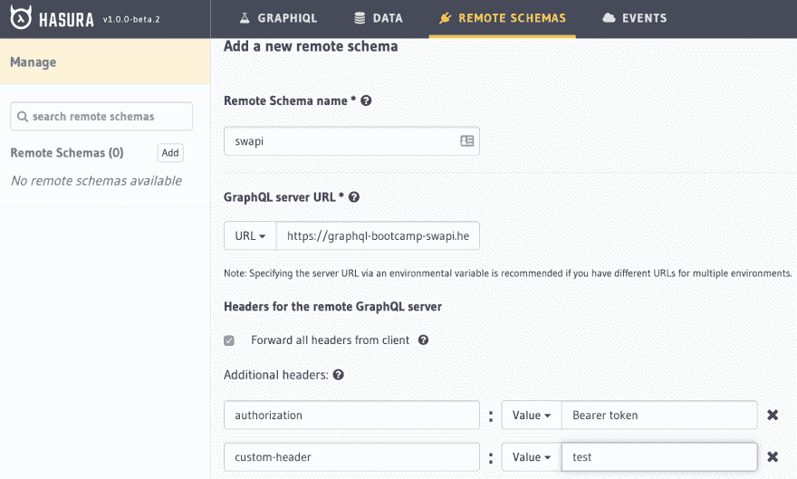
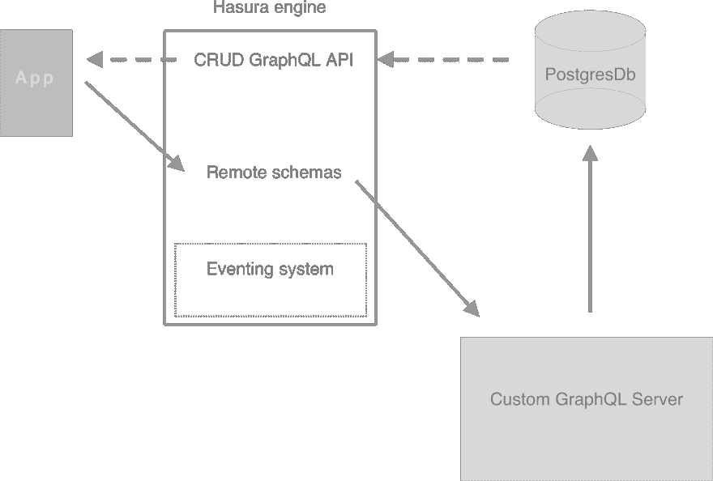
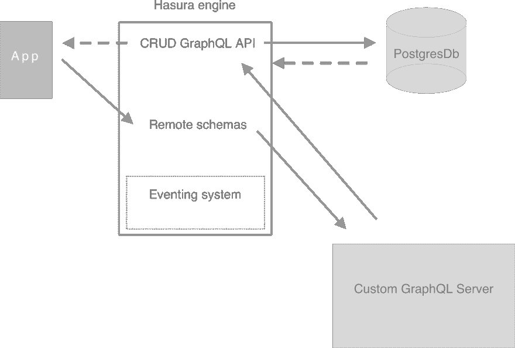
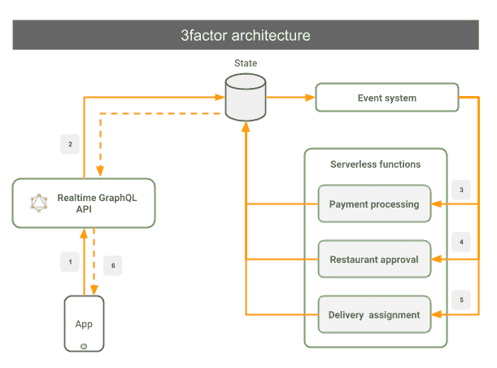
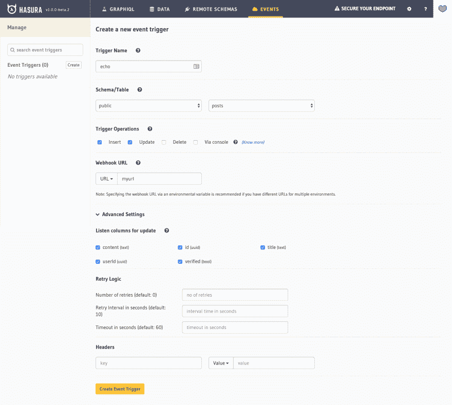

# 向 Hasura 添加业务逻辑的不同方式

> 原文：<https://dev.to/vladimirnovick/different-ways-of-adding-your-business-logic-to-hasura-16d>

最近，我在 React Europe 向 80 名优秀的 React 开发人员讲授了 GraphQL 研讨会。

液体错误:内部

除了掌握全局之外，他们还问了我一些非常好的问题，其中一个是“你如何将你的业务逻辑添加到 Hasura 中？”。这个问题问了我很长时间，所以我决定解释如何做的不同方法。

在 GraphQL workshop 中，我们已经使用 Hasura 来创建我们的后端，事实上，您可以在这里阅读更多关于 Hasura [的信息，并在](https://medium.com/open-graphql/effortless-real-time-graphql-api-with-serverless-business-logic-running-in-any-cloud-8585e4ed6fa3) [learn.hasura.io](//learn.hasura.io) 上跟随 30 分钟的实践课程来免费设置您的 GraphQL 端点以及正确的认证和授权。简而言之，可以支持 10k 并发订阅的生产就绪后端，这是一个相当可观的数字。

所以回到我们的问题——“如何将你的商业逻辑加入到 Hasura 中？”。Hasura 不仅生成 GraphQL API，还提供了很好的工具来添加 GraphQL 服务器、编写定制的 reducers 或使用事件系统触发无服务器函数。

现在，让我们将业务逻辑分为两类:

# 第一，更传统的(同步)方法

您有多种方法来以同步方式添加您的定制逻辑，但是高级架构看起来像这样。

[](https://res.cloudinary.com/practicaldev/image/fetch/s--Gfw3FVna--/c_limit%2Cf_auto%2Cfl_progressive%2Cq_auto%2Cw_880/https://thepracticaldev.s3.amazonaws.com/i/5wokhci2owo611aals3x.png)

基本上，这意味着您编写 GraphQL 服务器或自定义解析器，而 Hasura 负责模式拼接。

### 1。创建成熟的 GraphQL 服务器。

我们可以使用任何 GraphQL 服务器，因为任何 graphql 端点都公开类型信息，并且 Hasura 可以轻松地将两个模式缝合在一起。因此，要添加您的 GraphQL 服务器，您需要转到 Remote Schemas 选项卡并添加一个新的远程模式，如下所示:

[](https://res.cloudinary.com/practicaldev/image/fetch/s--j4EwfjDm--/c_limit%2Cf_auto%2Cfl_progressive%2Cq_auto%2Cw_880/https://thepracticaldev.s3.amazonaws.com/i/cwrk6a72brkt95yfuffi.png)

在这个例子中，我添加了星球大战 API 作为远程模式。您还可以看到，我可以将任何头传递给我的自定义 graphql 服务器，因此，如果您拥有 graphql 服务器端点的自定义授权，就可以轻松地传递适当的令牌或头。

那么你应该在服务器上做什么呢？这里你也有几个选择。假设您想要直接控制数据库。因此，您的应用程序正在对 Hasura graphql 端点执行变异。Hasura 将它转发到您的定制 GraphQL 服务器，在您的服务器上，您在执行逻辑后将数据写入数据库。酷的部分是因为 Hasura 支持开箱即用的订阅和实时查询；对数据库进行的任何更改都将传播到订阅此更改的任何客户端。

架构会是这样的:
[](https://res.cloudinary.com/practicaldev/image/fetch/s--NKvefrNE--/c_limit%2Cf_auto%2Cfl_progressive%2Cq_auto%2Cw_880/https://thepracticaldev.s3.amazonaws.com/i/keq6kjnvv6wk1xobe29z.png)

如果您不想直接访问，您可以重用 Hasura 为您生成 GraphQL CRUD 的事实，而不是打开到数据库的连接，您可以简单地从 Hasura 端点执行 GraphQL 变异。将建筑变成这样:

[](https://res.cloudinary.com/practicaldev/image/fetch/s--3cIWYN_B--/c_limit%2Cf_auto%2Cfl_progressive%2Cq_auto%2Cw_880/https://thepracticaldev.s3.amazonaws.com/i/qo8ebp59hb2zo0mtqwcd.png)

这是什么意思？这意味着，即使您已经使用 GraphQL server 完成了所有工作，您仍然可以使用 Hasura 为您提供一个具有权限和访问控制管理的授权层。您不需要实现订阅或实时查询，因为引擎已经实现了它们。

### 2。编写自定义冲突解决程序

那么，更细粒度的业务逻辑呢？如果你想写专用的解析器。这个想法与定制的 GraphQL 服务器非常相似，但是它没有一个大的模式，这个模式将被公开并缝合到 Hasura 中，您将只有一个解析器来满足您的特定需求。

例如，看看这个解析器，它摘自[哈苏拉学习教程](https://learn.hasura.io/graphql/hasura) :

```
const { ApolloServer } = require('apollo-server');
const gql = require('graphql-tag');
const jwt = require('jsonwebtoken');
const fetch = require('node-fetch');
const typeDefs = gql`
  type auth0_profile {
      email: String
      picture: String
    }
    type Query {
      auth0: auth0_profile
    }
`;
function getProfileInfo(user_id){
    const headers = {'Authorization': 'Bearer '+process.env.AUTH0_MANAGEMENT_API_TOKEN};
    console.log(headers);
    return fetch('https://' + process.env.AUTH0_DOMAIN + '/api/v2/users/'+user_id,{ headers: headers})
        .then(response => response.json())
}
const resolvers = {
    Query: {
        auth0: (parent, args, context) => {
          // read the authorization header sent from the client
          const authHeaders = context.headers.authorization;
          const token = authHeaders.replace('Bearer ', '');
          // decode the token to find the user_id
          try {
            const decoded = jwt.decode(token);
            const user_id = decoded.sub;
            // make a rest api call to auth0
            return getProfileInfo(user_id).then( function(resp) {
              console.log(resp);
              if (!resp) {
                return null;
              }
              return {email: resp.email, picture: resp.picture};
            });
          } catch(e) {
            console.log(e);
            return null;
          }
        }
    },
};
const context = ({req}) => {
  return {headers: req.headers};
};
const schema = new ApolloServer({ typeDefs, resolvers, context});
schema.listen({ port: process.env.PORT}).then(({ url }) => {
    console.log(`schema ready at ${url}`);
}); 
```

Enter fullscreen mode Exit fullscreen mode

如你所见，它非常小，但它所做的是导出正确的 GraphQL 模式，该模式甚至不是从 Postgres 数据库，而是从 Auth0 获取数据。这意味着您的自定义解析器基本上可以在任何地方托管，只要它们公开了 GraphQL schema，它们就可以做任何您想做的事情，包括连接到微服务 API、第三方或只是发送电子邮件。在那里写什么由你决定。

# 第二种方法- 3factor.app 架构(异步)

第二种添加业务逻辑的方式呢？方法不同，在 [3factor.app](//3factor.app) 架构提案中有描述。3factor.app 架构的思想是将异步无服务器、可靠事件和实时 GraphQL(订阅和实时查询)作为现代软件架构的 3 个基本要素。

事实上，在 React Europe，我做了一个叫做“Redux 风格后端”的演讲

> 弗拉迪米尔·诺维克[@ ReactEurope](https://dev.to/reacteurope)[@弗拉迪米尔诺维克](https://dev.to/vladimirnovick)我在 [@ReactEurope](https://twitter.com/ReactEurope) 演讲的幻灯片在这里有:[slides.com/vladimirnovick…](https://t.co/mYAngf7A2E)[twitter.com/vladimirnovick…](https://t.co/zTs8WGlwUg)2019 年 5 月 24 日下午 12:04在这里看直播流:https://t.co/Z7zdLAuxwL[](https://twitter.com/intent/tweet?in_reply_to=1131893636399026176)[](https://twitter.com/intent/retweet?tweet_id=1131893636399026176)[](https://twitter.com/intent/like?tweet_id=1131893636399026176)

主要概念是将冗余心智模型引入软件架构。看起来是这样的:

[](https://res.cloudinary.com/practicaldev/image/fetch/s--8n8wpfVF--/c_limit%2Cf_auto%2Cfl_progressive%2Cq_auto%2Cw_880/https://thepracticaldev.s3.amazonaws.com/i/bjienslgy3y3lqu64ktb.png)

这背后的想法是，数据库是你的状态，事件系统的目的是触发事件(行动)，这将调用无服务器功能(reducers)执行自定义逻辑。反过来，无服务器函数将调用 Hasura GraphQL 端点上的突变，将状态更改为新的状态。最终，因为有了实时的 GraphQL，一切都将通过订阅和实时查询传播到客户端。

### 1。无服务器功能

要将无服务器功能添加为事件触发器，您需要转到“事件触发器”选项卡并在那里添加它。您将有许多可以包含的选项，比如只在特定的列更新时触发事件等等

[](https://res.cloudinary.com/practicaldev/image/fetch/s--zmpX2xW---/c_limit%2Cf_auto%2Cfl_progressive%2Cq_auto%2Cw_880/https://thepracticaldev.s3.amazonaws.com/i/4glu2zg4fi6tngkezu5e.png)

如果你有兴趣查看一个实例，我前段时间在我们的 Hasura [Twitch stream](https://twitch.tv/hasurahq) 上用 Netlify 做了一个无服务器功能的直播，所以你可以在这里查看:

[https://www.youtube.com/embed/Sz9M5vTAAUk](https://www.youtube.com/embed/Sz9M5vTAAUk)

### 2。使用事件系统触发 webhooks

附加到事件触发器的无服务器函数不是您可以对事件做的唯一事情。基本上任何网址都可以附加到事件中，你在里面做什么取决于你自己。让我们来看一个来自[Hasura 学习教程]的例子，创建一个发送电子邮件的事件触发器:

```
const nodemailer = require('nodemailer');
const transporter = nodemailer.createTransport('smtp://'+process.env.SMTP_LOGIN+':'+process.env.SMTP_PASSWORD+'@' + process.env.SMTP_HOST);
const fs = require('fs');
const path = require('path');
const express = require('express');
const bodyParser = require('body-parser');
const app = express();
app.set('port', (process.env.PORT || 3000));
app.use('/', express.static(path.join(__dirname, 'public')));
app.use(bodyParser.json());
app.use(bodyParser.urlencoded({extended: true}));
app.use(function(req, res, next) {
    res.setHeader('Access-Control-Allow-Origin', '*');
    res.setHeader('Cache-Control', 'no-cache');
    next();
});
app.post('/send-email', function(req, res) {

  const name = req.body.event.data.new.name;
  // setup e-mail data
  const mailOptions = {
      from: process.env.SENDER_ADDRESS, // sender address
      to: process.env.RECEIVER_ADDRESS, // list of receivers
      subject: 'A new user has registered', // Subject line
      text: 'Hi, This is to notify that a new user has registered under the name of ' + name, // plaintext body
      html: '<p>'+'Hi, This is to notify that a new user has registered under the name of ' + name + '</p>' // html body
  };
  // send mail with defined transport object
  transporter.sendMail(mailOptions, function(error, info){
      if(error){
          return console.log(error);
      }
      console.log('Message sent: ' + info.response);
      res.json({'success': true});
  });

});
app.listen(app.get('port'), function() {
  console.log('Server started on: ' + app.get('port'));
}); 
```

Enter fullscreen mode Exit fullscreen mode

如您所见，这是一个简单的 express 服务器，它根据接收到的事件负载发送邮件。

# 总结

正如你所看到的，有很多选项可以将你的业务逻辑添加到 Hasura 中，但是如果你有疑问，不确定如何将 Hasura 与你现有的架构集成，请通过 [Discord](https://discord.gg/hasura) 联系我们，我们会想出如何提供帮助。