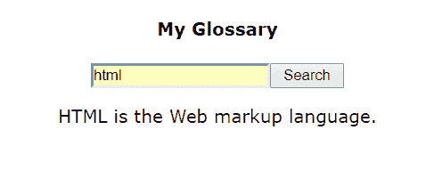
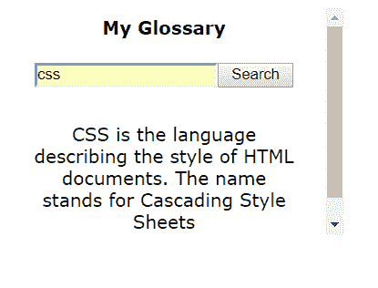

# 发现影子王国

> 原文：<https://dev.to/bnevilleoneill/discovering-the-shadow-dom-48ec>

[](https://res.cloudinary.com/practicaldev/image/fetch/s--c8U1LbbD--/c_limit%2Cf_auto%2Cfl_progressive%2Cq_auto%2Cw_880/https://cdn-images-1.medium.com/max/958/1%2Act_7DotEJPOAOavhtBtqpA.jpeg)

我们都很清楚[文档对象模型](https://developer.mozilla.org/en-US/docs/Web/API/Document_Object_Model/Introduction) (DOM)。多亏了它，我们可以通过 JavaScript 以一种有效的方式操纵 HTML 页面的结构和内容。

当然，DOM 并非没有缺陷。例如，其中之一是缺乏封装，即保护文档结构的一部分免受全局处理的可能性，如 CSS 规则应用和 JavaScript 操作。

在本文中，我们将分析这个问题的一个例子，传统上如何解决这个问题，以及我们如何通过使用 [Shadow DOM](https://www.w3.org/TR/shadow-dom/) 来解决它，这是一个已经存在了一段时间的标准特性，但并不为前端开发人员所熟知。

[](https://logrocket.com/signup/)

### 使用 DOM

考虑下面的 JavaScript 代码:

```
const myGlossary = {};
​
myGlossary.renderSearchBox = function (idContainer) {
 const box = document.createElement("div");
 const form = document.createElement("form");
 const label = document.createElement("label");
 const textbox = document.createElement("input");
 const button = document.createElement("input");
 const definition = document.createElement("div");
​
 label.htmlFor = "txtTerm";
 label.innerHTML = "<h4>My Glossary</h4>";
 form.appendChild(label);
​
 textbox.type = "text";
 textbox.id = "txtTerm";
 form.appendChild(textbox);
​
 button.type = "submit";
 button.value = " Search ";
 form.appendChild(button);
 form.appendChild(document.createElement("br"));
​
 box.style.textAlign = "center";
 box.style.fontFamily = "Verdana";
 box.appendChild(form);
​
 definition.style.padding = "15px";
 box.appendChild(definition);
​
 document.getElementById(idContainer).appendChild(box);
​
 form.onsubmit = () => {
   const term = textbox.value.trim().toLocaleLowerCase();
   const definitions = {"html": "HTML is the Web markup language.", "css": "CSS is the language describing the style of HTML documents."};
​
   if (term) {
     definition.innerHTML = definitions[term] || `'${term}' not found.`;
  }
   return false;
};
} 
```

这里，我们用一个方法定义一个对象， *renderSearchBox()* 。该方法将 HTML 元素的标识符作为其参数，并将构建搜索文本框所需的元素附加到该元素中，如下所示:

[](https://res.cloudinary.com/practicaldev/image/fetch/s--CsCspQf3--/c_limit%2Cf_auto%2Cfl_progressive%2Cq_auto%2Cw_880/https://cdn-images-1.medium.com/max/457/0%2Az51BvlckXakaHUP8)

该搜索文本框旨在允许用户从在线服务中查找术语定义。为了简单起见，我们在代码中嵌入了术语定义。

当用户在文本框中插入一个词并点击搜索按钮时，就会执行 *form.onsubmit()* 事件监听器。这个函数仅仅显示与插入的术语相关的定义，如果有的话，否则它显示一个适当的消息。

下图显示了用户将 *HTML* 术语提交到搜索文本框时将会看到的内容:

[](https://res.cloudinary.com/practicaldev/image/fetch/s--jNtOPIdA--/c_limit%2Cf_auto%2Cfl_progressive%2Cq_auto%2Cw_880/https://cdn-images-1.medium.com/max/496/0%2Att3ZTMmUffZH8YFO)

您可以在 HTML 页面中使用 myGlossary 对象:

```
<!doctype html>
<html lang="en">
<head>
<meta charset="utf-8">
 Discovering the Shadow DOM
</head>
<body>
 <div id="divBox"></div>
 <script type="text/javascript" src="myGlossaryBox.js"></script>
 <script type="text/javascript">
 myGlossary.renderSearchBox("divBox");
 </script>
</body>
</html> 
```

如您所见，我们从 *myGlossary.js* 文件导入了脚本，并通过传递 *divBox* 字符串作为页面中唯一的 *div* 元素的标识符，调用了 *renderSearchBox()* 方法。

你可以在 [CodePen](https://codepen.io/andychiare/pen/gQpgRN) 上试试这个代码。

### DOM 的问题

由上面显示的脚本创建的搜索框按预期工作。它也足够独立，可以在其他项目中重用。

但是，如果您在带有标记的页面中使用搜索框，会发生什么呢？

```
<!doctype html>
<html lang="en">
<head>
<meta charset="utf-8">
 Discovering the Shadow DOM
 <style>
   h4 {
     text-align: center;
     color: red;
  }
 </style>
</head>
<body>
   <div>
       <h4>Welcome to my great page!</h4>
   </div>
   <!-- other markup -->
 <div id="divBox"></div>
   <!-- other markup -->
 <script type="text/javascript" src="myGlossaryBox.js"></script>
 <script type="text/javascript">
 myGlossary.renderSearchBox("divBox");
 </script>
</body>
</html> 
```

在这个页面中，您会注意到一个 CSS 规则重新定义了 *h4* 元素的颜色。当然，页面设计者打算定制欢迎消息。但是，此规则也会影响导入的搜索框的标题:

[](https://res.cloudinary.com/practicaldev/image/fetch/s--fumlVxuj--/c_limit%2Cf_auto%2Cfl_progressive%2Cq_auto%2Cw_880/https://cdn-images-1.medium.com/max/427/0%2AjBl7ZOGbjRWG1FEY)

由于 DOM 是一个全局实体，上面显示的 CSS 规则影响页面中的任何 *h4* 元素，甚至是从外部脚本动态添加的元素。你无法保护在构建搜索框时定义的特定的 *h4* 元素。如果你仅仅依赖于 DOM，你不能封装它。

但是这个问题不仅仅与 CSS 规则应用程序有关。想象一下，如果在页面的某个地方有以下 JavaScript 语句会发生什么:

```
document.getElementById("txtTerm").style.visibility = "hidden"; 
```

您的搜索文本框神奇地消失了:

[](https://res.cloudinary.com/practicaldev/image/fetch/s--v2vGzEvu--/c_limit%2Cf_auto%2Cfl_progressive%2Cq_auto%2Cw_880/https://cdn-images-1.medium.com/max/397/0%2AURUIaci4BwoQPIHK)

在 [CodePen](https://codepen.io/andychiare/pen/YRXNEB) 上试试这段代码。

您不能阻止在页面的其他地方使用 *txtTerm* id。而且，您无法控制任何外部代码会对您为搜索框创建的 DOM 元素做什么，不管是有意还是无意。

再说一次，DOM 是一个全局实体:你添加到它里面的任何元素都是可以公开访问的，这意味着可能会发生冲突。

### 使用 iframes

解决这个问题的最常见的解决方案是将表示组件的 DOM 部分嵌入到一个单独的 DOM 中，即嵌入到一个单独的 HTML 页面中。然后，通过 iframe 将该页面附加到主页上。这是谷歌使用的方法，允许开发者嵌入其地图和来自 YouTube 和 Twitter 的视频。

让我们来看看如何实现这个想法。像这样重新排列前面的代码:

```
const myGlossary = {};
​
myGlossary.renderSearchBox = function (idContainer) {
 const iframe = document.createElement("iframe");
 const box = document.createElement("div");
 const form = document.createElement("form");
 const label = document.createElement("label");
 const textbox = document.createElement("input");
 const button = document.createElement("input");
 const definition = document.createElement("div");
​
 label.htmlFor = "txtTerm";
 label.innerHTML = "<h4>My Glossary</h4>";
 form.appendChild(label);
​
 textbox.type = "text";
 textbox.id = "txtTerm";
 form.appendChild(textbox);
​
 button.type = "submit";
 button.value = " Search ";
 form.appendChild(button);
 form.appendChild(document.createElement("br"));
​
 box.style.textAlign = "center";
 box.style.fontFamily = "Verdana";
 box.appendChild(form);
​
 definition.style.padding = "15px";
 box.appendChild(definition);
​
 iframe.style.border = 0;
 iframe.style.height = "200px";
 document.getElementById(idContainer).appendChild(iframe);
​
 iframe.contentDocument.body.appendChild(box);
​
 form.onsubmit = () => {
   const term = textbox.value.trim().toLocaleLowerCase();
   const definitions = {"html": "HTML is the Web markup language.", "css": "CSS is the language describing the style of HTML documents."};
​
   if (term) {
     definition.innerHTML = definitions[term] || `'${term}' not found.`;
  }
   return false;
};
} 
```

与前一版本相比，第一个区别是创建了一个 iframe 元素:

```
const iframe = document.createElement("iframe"); 
```

第二个区别是将表示搜索框的 DOM 部分附加到外部元素的方式。使用这种方法，您不需要直接将 box 元素附加到外部元素上。将 iframe 元素附加到外部元素，然后将 box 元素附加到与 iframe 相关联的文档主体。代码应该是这样的:

```
iframe.style.border = 0;
 iframe.style.height = "200px";
 document.getElementById(idContainer).appendChild(iframe);
​
 iframe.contentDocument.body.appendChild(box); 
```

使用这种方法，您将不再遇到以前版本的搜索框所遇到的冲突。

你可以在 [CodePen](https://codepen.io/andychiare/pen/pQJRae) 上试试这个。

### iframe 的问题

在基于 iframe 的方法中，您应该已经注意到了一些关于 iframe 风格的赋值。下面让我们回忆一下这两个作业:

```
 iframe.style.border = 0;
 iframe.style.height = "200px"; 
```

这些赋值定义了边框的粗细和 iframe 本身的高度。它们是提供搜索框与主页集成的假象的基础。

但是尽管第一条指令很好地完成了它的任务，第二条指令可能还不够。事实上，您可能会发现 iframe 的大小不适合文档的大小，因此您可能会看到类似下面的效果:

[](https://res.cloudinary.com/practicaldev/image/fetch/s--lD-N_6D0--/c_limit%2Cf_auto%2Cfl_progressive%2Cq_auto%2Cw_880/https://cdn-images-1.medium.com/max/415/0%2A0E4mbRkKhgSWDRIK)

这是一个丑陋的效果，你应该避免它。

Iframes 不是很敏感。此外，iframes 被设计为在当前页面中嵌入另一个完整的文档。当我们想要将数据从父文档传递到子文档时，例如，为了配置子文档中的一些元素，这会导致更加复杂。

### 进入暗影 DOM

在 HTML 页面的 DOM 中管理 DOM 部分封装的一个更好的解决方案是使用 *Shadow DOM* 。这是[一组标准 API](https://dom.spec.whatwg.org/#shadow-trees)，通过允许你为 HTML 元素创建一种私有 DOM 来实现 DOM 级别的封装。

让我们看看如何使用*影子 DOM* 来避免全局 DOM 和 iframes 的问题。重写实现搜索框的 JavaScript 代码，如下所示:

```
const myGlossary = {};
​
myGlossary.renderSearchBox = function (idContainer) {
 const box = document.createElement("div");
 const form = document.createElement("form");
 const label = document.createElement("label");
 const textbox = document.createElement("input");
 const button = document.createElement("input");
 const definition = document.createElement("div");
​
 label.htmlFor = "txtTerm";
 label.innerHTML = "<h4>My Glossary</h4>";
 form.appendChild(label);
​
 textbox.type = "text";
 textbox.id = "txtTerm";
 form.appendChild(textbox);
​
 button.type = "submit";
 button.value = " Search ";
 form.appendChild(button);
 form.appendChild(document.createElement("br"));
​
 box.style.textAlign = "center";
 box.style.fontFamily = "Verdana";
 box.appendChild(form);
​
 definition.style.padding = "15px";
 box.appendChild(definition);
​
 const container = document.getElementById(idContainer)
 container.attachShadow({mode: "open"});
​
 container.shadowRoot.appendChild(box);
​
 form.onsubmit = () => {
   const term = textbox.value.trim().toLocaleLowerCase();
   const definitions = {"html": "HTML is the Web markup language.", "css": "CSS is the language describing the style of HTML documents."};
​
   if (term) {
     definition.innerHTML = definitions[term] || `'${term}' not found.`;
  }
   return false;
};
} 
```

在这种情况下，与脚本原始版本的唯一区别在于以下语句:

```
const container = document.getElementById(idContainer);
container.attachShadow({mode: "open"});
​
container.shadowRoot.appendChild(box); 
```

我们没有直接将 box 元素附加到外部元素，而是首先通过 attachShadow()为外部元素创建一个 *Shadow DOM* 。这个方法[适用于几乎任何 HTML 元素](https://developer.mozilla.org/en-US/docs/Web/API/Element/attachShadow)，它为元素的*影子 DOM* 生成根节点。

然后可以通过 shadowRoot 属性访问这个根节点。在上面的例子中，我们将代表搜索框的 box 元素附加到外部元素的 shadowRoot 上。当搜索框包含在任意 HTML 页面中时，这两条简单的指令可以保护我们免受冲突和不良影响。你可以在 [CodePen](https://codepen.io/andychiare/pen/mQJRLN) 上试试这个代码。

您可能会注意到，我们将一个文字对象作为参数传递给了 attachShadow()方法。这个对象允许我们指定*阴影 DOM* 的创建模式。在我们的例子中，我们将值*打开*设置为*阴影 DOM* 模式。这意味着*影子 DOM* 将对标准的全局 DOM 操作(如 CSS 规则应用程序、节点选择等)隐藏。

然而， *Shadow DOM* 对外界是公开的，所以它的元素可以通过 JavaScript 访问。换句话说，你可以从任何一个类似于
的页面访问搜索框的*影子 DOM*

```
const divBox = document.getElementById("divBox");
divBox.shadowRoot.querySelector("h4").innerText = "Changed from outside" 
```

此代码替换与搜索文本框关联的标签文本。

如果你不希望这种情况发生，你可以选择设置*关闭*值:

```
container.attachShadow({mode: "closed"}); 
```

在这种情况下，*阴影 DOM* 将完全不可访问。

### 结论

Iframes 在完成它们天生的工作时仍然有用:在当前页面中嵌入一个独立的外部页面。然而，我们现在已经看到了 *Shadow DOM* 如何取代基于 iframes 的典型封装方法，这有很多好处。

* * *

### Plug: [LogRocket](https://logrocket.com/signup/) ，一款适用于网络应用的 DVR

[](https://logrocket.com/signup/)

<figcaption>[https://logrocket.com/signup/](https://logrocket.com/signup/)</figcaption>

LogRocket 是一个前端日志工具，可以让你回放问题，就像它们发生在你自己的浏览器中一样。LogRocket 不需要猜测错误发生的原因，也不需要向用户询问截图和日志转储，而是让您重放会话以快速了解哪里出错了。它可以与任何应用程序完美配合，不管是什么框架，并且有插件可以记录来自 Redux、Vuex 和@ngrx/store 的额外上下文。

除了记录 Redux 操作和状态，LogRocket 还记录控制台日志、JavaScript 错误、堆栈跟踪、带有头+正文的网络请求/响应、浏览器元数据和自定义日志。它还使用 DOM 来记录页面上的 HTML 和 CSS，甚至为最复杂的单页面应用程序重新创建像素级完美视频。

免费试用。

* * *

发现影子王国的帖子最先出现在 T2 的博客上。