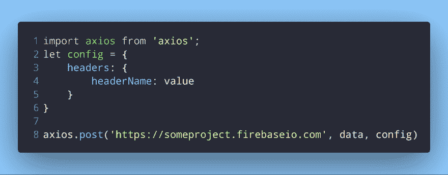
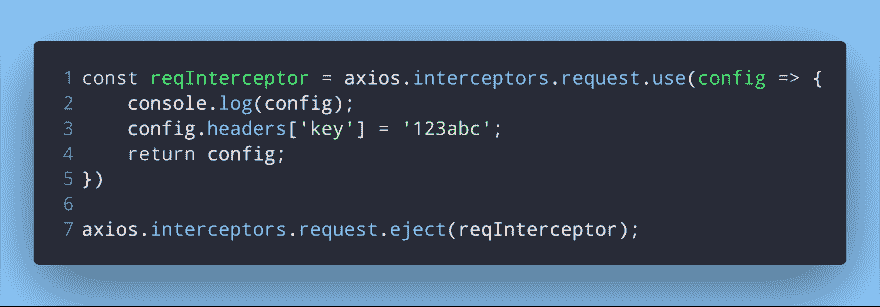
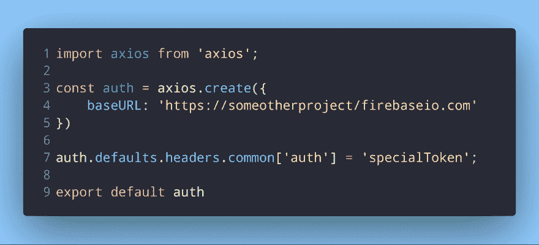

# 你知道如何使用这些有用的 Axios 功能吗？

> 原文：<https://dev.to/napoleon039/do-you-know-how-to-use-these-useful-axios-features-4h9m>

## 简介

最近在练习一些 Vuejs 的时候，我做了一个经典的注册/登录 SPA。我已经对 Axios 有所了解，并了解了一些新功能，因为我需要在这个 SPA 中使用它们。然而，当我为它查找一些文章时，我发现其中一些功能没有得到正确的解释。我写这篇文章是为了解释其中的一些特性。

我不会解释 Axios 是如何工作的，也不会深入研究这些功能。我只是介绍他们，因为当我环顾四周时，我发现很少或几乎没有关于他们的信息。

## 为请求添加标题

如果你在一个项目中工作，需要用到它，这可能是你所知道的。但对于像我这样的大多数 Axios 新手来说，这并不是很为人所知。有两种流行的方法向请求添加头。一种方法是通过配置选项添加它:

这里，我们向一个示例 API 端点发送一个 post 请求。我们传递一些数据和第三个参数，它是一个配置对象。该配置对象包含一个`headers`对象。在这里，我们可以指定头并给它们赋值。我们可以将这个配置对象传递给我们想要的请求。这是控制哪些请求获得这些头的好方法。

现在，如果我们想为所有请求添加一个公共头或一组公共头，该怎么办呢？我们可以在主 JavaScript 文件中的 axios 实例上设置全局头。

我们可以为所有类型的请求添加*通用的*报头，或者我们可以为某些类型的请求设置报头:

这里有两个写在应用程序入口点的头。如果你在 Vue 工作，这可能是`main.js`。也可能是`index.js`，这取决于你如何命名你的文件。我已经在主 axios 实例本身上定义了这些*全局*头，所以它们将被添加到所有适当的请求中。

第一个是公共报头。这意味着它将被添加到所有请求中，无论它们是什么类型的请求。标题的名字是`Authentication`，它的值被分配给它(你可以随意命名标题，并给它一个合适的值)。

第二个报头以类似的方式定义，但是它只针对*得到*请求**的**。因此报头`Accepts`将仅被添加到 *get* 请求中。这样，您就向 axios 请求添加了标题。

## 拦截器

拦截器是对离开应用程序的每个请求和到达应用程序的每个响应执行的函数。我们使用`use()`方法在 axios 实例上完成这项工作。对于请求拦截器，它接收请求配置作为参数。对于响应拦截器，参数将是返回的响应。

这是一个请求拦截器。它将*拦截*所有传出的请求，并对它们执行该功能。因为我们接收 config 对象作为参数，所以我们可以将它记录到控制台，在发送之前给它添加头，或者做一些有条件的事情。但是，我们**必须返回**配置对象，否则，请求将被阻塞。

我们也可以创建一个响应拦截器:

这个拦截器将在应用程序收到每个响应时执行。这里，我们返回响应对象，因为不这样做将会阻塞响应。

如果不需要拦截器，我们也可以用条件语句删除它。然而，为此，我们需要拦截器的 id。这类似于我们如何获取和移除一个`setInterval()`的 id。让我们以删除请求拦截器为例:

我们用`eject()`方法通过传递拦截器的 id 来移除拦截器。当然，我马上就做了，所以拦截器甚至不会被执行。但是您可以将它放在条件语句中，或者基于其他事件将其删除。移除响应拦截器应该类似于- `axios.interceptors.response.eject(resInterceptor)`。

## 创建自定义 Axios 实例

对于您的大多数项目，您可能只会使用我们到目前为止一直在使用的全局 axios 实例。我们使用`import axios from 'axios';`导入它。尽管除了 *axios* 之外，我们可以给它起任何名字，但它仍然是全局实例。创建大项目时，你可能会遇到某个问题。一些请求需要特定的配置和/或报头，而另一些请求需要不同的配置集。

虽然您可以创建不同的配置对象，并将它们与请求一起传递，但是大型项目带有复杂的文件夹结构和模块化的文件/组件。全局配置是一个选项(就像我们对主 Axios 实例上的头所做的那样)，但是如何对不同的请求应用不同的配置呢？

答案是创建 Axios 的自定义实例。

该实例的工作方式与全局 Axios 实例完全相同。您还可以应用全局配置并向该自定义实例添加头。它们将与全局实例上的那些(在`main.js`文件中的那个)分开。然后，可以将该自定义实例导入到需要它的文件中。因此，我们可以将这个定制实例用于需要不同于应用于全局实例的配置的请求。

自定义实例可以在条目文件`main.js`(或`index.js`，取决于您对它的命名)中创建，但是建议我们将它放在一个单独的文件中。
T3T5】

我们通过使用`create()`方法创建自定义实例。它需要一个对象来定义我们所有的配置。我们也可以在`create()`方法之外定义它们，就像我们已经定义的 *auth* 头一样。使用这个定制实例的请求将有这个 *auth* 头。即使主 Axios 实例上的全局头应该应用于所有请求，它们也不会应用于这些请求，因为它们使用自定义实例。另一方面，使用主 Axios 实例的请求没有这个头。

最后，我们还需要将其导出，以便在其他文件中使用。

## 包装完毕

当我查找关于这三个特性的文章时，我发现关于它们的信息很少或者根本没有。虽然我对这些特性只做了很少的解释，但是在示例的帮助下，您可以开始使用它们。

当然，并不是所有的功能都有很少或没有指南。可能还有更多。然而，我无法查找它们，因为我不认识它们。如果你知道其他需要大量指南的特性，一定要介绍它们，并尽你所能解释它们的用法。

查看官方 Axios 文档以了解更多此类特性。

编辑:对于任何不熟悉 Axios 的开发者来说，想知道使用`config`名称作为变量背后的原因，它不是一个关键字，而是一个简单的对象名称。如果你愿意，可以使用除了`config`之外的任何东西，但是我觉得使用`config`会更容易知道那个对象包含什么。