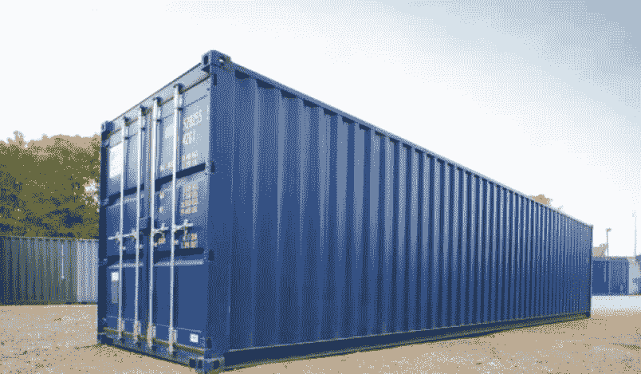
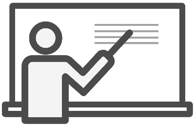

# 码头基础知识

> 原文：<https://dev.to/matthewbrophy/docker-basics-46k7>

作为一名初露头角的软件开发人员，我总是密切关注，尝试并掌握我想学习的新技术或工具。Docker 就是其中的一个工具。

## Docker 是什么？

在某种程度上，Docker 就像一个完全打包的虚拟机。它是一个在任何机器上设计、部署和运行应用程序的工具，具有它需要的所有部分，比如库和依赖项。Docker 通过使用“容器”来完成这一任务，这使得开发人员可以放心，应用程序将在任何其他 Linux 机器上运行，而不管该机器上可能存在的任何定制是否与用于编写和测试原始代码的机器不同。

## 容器

那么，到底什么是容器呢？容器是运行命令的一种方式，它与系统上的其他一切都是隔离的。当命令应该只访问它应该有权访问的资源时，容器将提供该功能，而不允许它访问机器上的任何其他内容。在容器内部运行的进程不知道容器外部正在进行的任何其他进程。容器让它如此:

*   只要 Docker 安装在一台机器上，该应用程序就会运行
*   单一服务器上的容器化应用程序不会相互冲突
*   如果你更新一个应用程序，你不必担心它会破坏其他包含的应用程序
*   Docker 应用不会因为与 Docker 无关的包的操作系统更新而中断

### 为什么是集装箱？

当 Docker 最初被定位时，它被比作全球航运业中使用的集装箱。海运集装箱有一个标准的尺寸，任何计划运输集装箱的公司都知道当他们来取集装箱时会发生什么。如果合适的话，你计划用什么样的卡车或船来运输并不重要。Docker 容器以同样的方式工作。在 Docker 容器中运行应用程序的机器不应该真的担心应用程序内部是什么，容器中的应用程序不关心它运行在哪种机器上。

<figure> 

<figcaption>如果适合，就坐！</figcaption>

</figure>

## Docker 图像

 
在 Docker 语言中，一个图像指的是一个蓝图，全新的容器可以从这个蓝图开始。图像不会改变，但是您可以从一个图像启动一个容器，在其中执行操作，并根据容器的最新状态保存另一个图像。当你启动一个容器时，就像在关机后启动一台机器。您不用启动计算机或启动新的虚拟机，而是从头开始创建一个看起来与您选择的映像一模一样的新容器。

## 码头文件

Dockerfiles 可以被认为是图像和容器的“自述文件”。它是一组精确的指令，指导程序如何创建一个新的图像并为容器设置默认值。它应该在任何时间点为运行该应用程序的任何人创建相同的映像。Dockerfile 是一个基本指令，说明如何设置运行应用程序所需的环境，除了它是以**可执行代码**的形式。【T2

## 卷

卷就像保存数据的独立“容器”。默认情况下，容器不会留下任何东西——一旦容器被移除或“关闭”,对容器所做的任何更改都会丢失。这就是成交量的来源。卷用于保存和共享数据，但是容器在使用它们时不需要知道任何关于主机的信息。如果一个容器正在使用一个卷，并且该容器已关闭，您可以启动另一个容器，并将其指向另一个容器正在使用的卷。

原来如此。这些是 Docker 最基本的基本组件。我希望这篇简短的文章有助于理解 Docker 系统的基础知识，以及它如何能让你在未来的工作中受益。