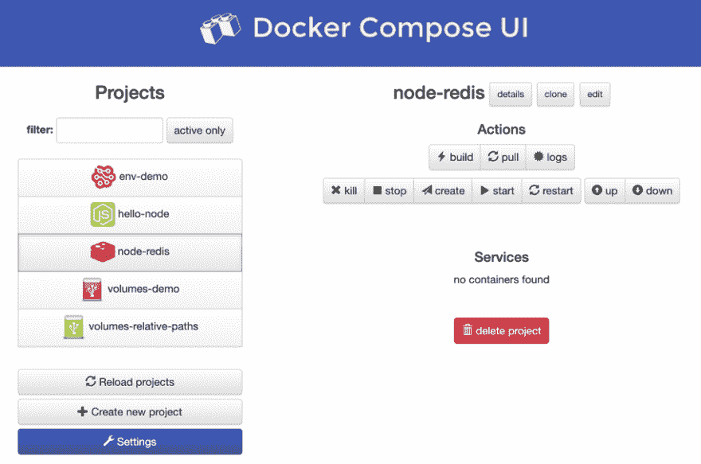

# Docker 编写用户界面——几乎是一件事

> 原文：<https://dev.to/aheil/docker-compose-ui-almost-a-thing-g0b>

我目前通过 Ansible 管理我服务器上所有的 Docker 容器。然而，无论是为了设置新的容器、测试新的映像还是在紧急情况下进行调试，我都使用 ssh 连接到我的服务器，并对 shell 进行了大量修改。

#### 有前途的基于 Web 的 Docker 排版管理？

我开发了 Docker Compose UI，它提供了一个很好的基于 web 的用户界面来使用 Docker Compose。

> Docker 编写 UI 是 Docker 编写的 web 界面。
> 
> 这个项目的目标是在 Docker Compose 之上提供一个最小的 HTTP API，同时保持与 Docker Compose CLI 的完全互操作性。
> 
> 该应用程序可以部署为一个容器，没有依赖关系，也没有数据库安装。

它本身就是 Docker 映像，这又使它非常容易部署。要在本地测试它，只需检查 GitHub 库并运行 docker-compose up。

让演示项目运行起来非常容易。但是…

#### 有一条军规

*   当我将 Docker Compose UI 部署到我的一台服务器上时，即使我更改了整体配置，它仍然显示了演示项目
*   为此，项目的文档并不是最好的
*   在浏览了整个文件之后，我没有发现任何给我提示演示项目可能来自哪里的东西
*   对我来说(我可能是错的)，它看起来像演示信息是建立在 Docker 图像中的
*   GitHub 项目最后一次更新是在大约 12 个月前

#### 结论

Docker Compose UI 将是一个非常有用的项目。然而，这个项目在我看来非常废弃。虽然有 12 个贡献者，但最后一个拉请求自 2017 年以来一直开放。自述文件最后一次更新是在 2018 年。我可能会更仔细地研究这个项目，或者在某一点上放弃它。在那之前，它必须呆在板凳上。

链接:[https://github . com/Francesco/docker-compose-ui](https://github.com/francescou/docker-compose-ui)