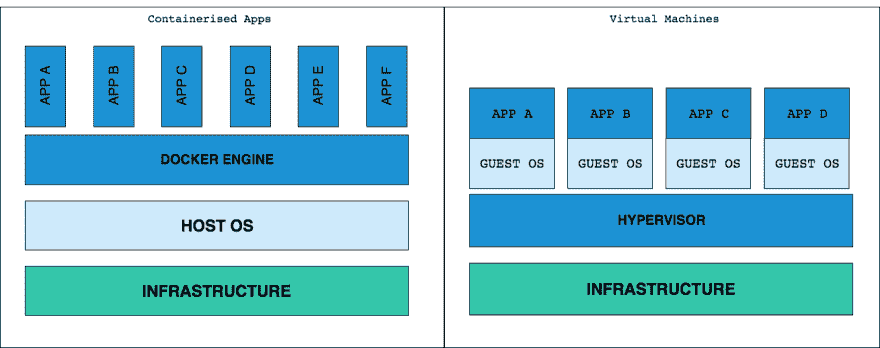
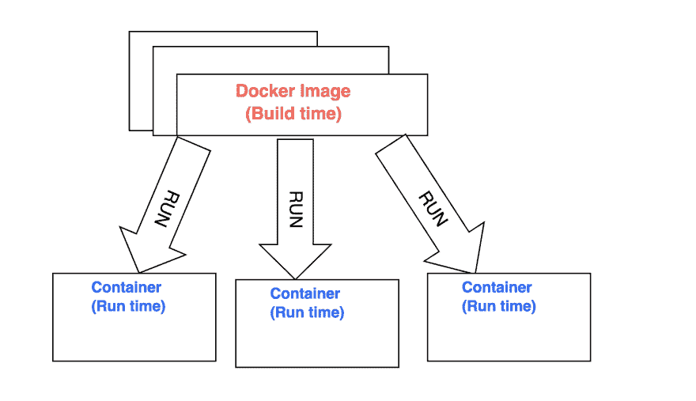

# 面向前端开发人员的 Docker

> 原文：<https://dev.to/akanksha_9560/docker-for-frontend-developers-1dk5>

> 这是一个简短的 docker 指南，对前端开发者很有用。

## 为什么要用 docker？

很久以前，当业务需要其他应用程序时，开发团队会去购买服务器，而不知道新应用程序的性能要求。这将涉及大量的猜测工作和浪费的资本和资源，可用于其他应用程序。

进入虚拟机或 VM，它允许我们在相同的服务器上运行多个应用程序。但是有一个缺点。每个虚拟机都需要整个操作系统才能运行。每个操作系统都需要 CPU、RAM 等来运行，它需要修补和许可，这反过来增加了成本和弹性。

Google 很久以前就开始使用容器模型来解决 VM 模型的缺点。基本上，容器模型意味着同一主机上的多个容器使用同一主机，从而释放 CPU 和 RAM，这些资源可以用于其他地方。

> 但是它如何帮助我们开发者呢？

它确保所有开发人员和所有服务器的工作环境是相同的，即生产、试运行和测试

任何人都可以在几秒钟内设置项目，不需要弄乱配置，安装库，设置依赖等。

> 简单来说，docker 是一个平台，它使我们能够用容器开发、部署和运行应用程序。

让我们退一步，容器系统在物理上是什么样子，它与 VM 有什么不同。

<figure>

[](https://res.cloudinary.com/practicaldev/image/fetch/s--PuFE5JCM--/c_limit%2Cf_auto%2Cfl_progressive%2Cq_auto%2Cw_880/https://thepracticaldev.s3.amazonaws.com/i/h78f2cogxmuo787ys5xy.png)

<figcaption>1.1 Difference between VM and docker.</figcaption>

</figure>

如您所见，主机及其资源在容器中共享，但不在虚拟机中共享。

好了，我们开始潜水吧。

## 如何使用 docker？

为此，我们需要熟悉一些术语。

<figure>

[](https://res.cloudinary.com/practicaldev/image/fetch/s--CnXBO9bH--/c_limit%2Cf_auto%2Cfl_progressive%2Cq_auto%2Cw_880/https://thepracticaldev.s3.amazonaws.com/i/cs6q2qn2m0zvc9s3geg9.png)

<figcaption>1.2 Visualisation of docker images and docker container</figcaption>

</figure>

**Docker 镜像**:它是一个可执行文件，包含了精简的操作系统以及运行应用程序所需的所有库和配置。它有多个层堆叠在彼此之上，并被表示为单个对象。一个 docker 图像是使用 *docker 文件*创建的，我们稍后会讲到。

**Docker 容器:**是 Docker 镜像的运行实例。可能有许多容器从同一个 docker 映像运行。

## Containerise 简单节点. js App

我们将尝试容器化每个 node.js 简单应用程序，并创建一个图像:

### 你的 Node.js App

让我们从创建文件夹`my-node-app`、
开始

```
mkdir my-node-app  
cd my-node-app 
```

让我们在`index.js`中创建一个简单的节点服务器，并在那里添加以下代码:

```
//Load express module with `require` directive

var express = require('express')

var app = express()

//Define request response in root URL (/)  
app.get('/', function (req, res) {  
 res.send('Hello World!')  
})

//Launch listening server on port 8081  
app.listen(8081, function () {  
  console.log('app listening on port 8081!')  
}) 
```

并将该文件保存在您的`my-node-app`文件夹中。

现在我们创建一个`package.json`文件，并在其中添加以下代码:

```
 {

    "name": "helloworld",  
    "version": "1.0.0",  
    "description": "Dockerized node.js app",  
    "main": "index.js",  
    "author": "",  
    "license": "ISC",  
    "dependencies": {  
      "express": "^4.16.4"  
    }

 } 
```

此时，您不需要在您的主机中安装 express 或 npm，因为记住 dockerfile 处理设置所有的依赖项、库和配置。

### DockerFile

让我们创建 dockerfile 并将其保存在我们的`my-node-app folder`中。这个文件没有扩展名，被命名为`Dockerfile`。让我们继续将下面的代码添加到 docker 文件中。

```
 # Dockerfile  
    FROM node:8  
    WORKDIR /app  
    COPY package.json /app  
    RUN npm install  
    COPY . /app  
    EXPOSE 8081  
    CMD node index.js 
```

现在我们正在做的是:

`FROM node:8 ` —从 docker hub 拉 node.js docker 图片，可以在这里找到[https://hub.docker.com/_/node/](https://medium.com/r/?url=https%3A%2F%2Fhub.docker.com%2F_%2Fnode%2F)

`WORKDIR /app`-为我们的代码在映像中设置工作目录，它被所有后续命令使用，如`COPY`、`RUN`和`CMD`

`COPY package.json /app`-这将我们的 package.json 从主机`my-node-app`文件夹复制到我们在`/app`文件夹中的映像。

`RUN npm install` —我们在映像中运行这个命令，为我们的应用程序安装依赖项(node_modules)。

`COPY . /app ` —我们告诉 docker 从 my-node-app 文件夹中复制我们的文件，并将其粘贴到 docker 映像中的`/app`。

`EXPOSE 8081` —我们使用这个命令显示容器上的一个端口。为什么是这个港口？因为在我们的服务器 index.js 中监听的是 8081。默认情况下，从这个映像创建的容器将忽略对它的所有请求。

### 构建 Docker 图像

表演时间。打开终端，进入你的文件夹`my-node-app`并输入以下命令:

```
 # Build a image docker build -t <image-name> <relative-path-to-your-dockerfile>

    docker build -t hello-world . 
```

这个命令在我们的主机上创建一个`hello-world`映像。

`-t`用来给我们的图像命名，这里是 **hello-world** 。

`.`是 docker 文件的相对路径，因为我们在文件夹`my-node-app`中，所以我们用点来表示 docker 文件的路径。

您将在命令行上看到类似这样的输出:

```
 Sending build context to Docker daemon  4.096kB  
    Step 1/7 : FROM node:8  
     ---> 4f01e5319662  
    Step 2/7 : WORKDIR /app  
     ---> Using cache  
     ---> 5c173b2c7b76  
    Step 3/7 : COPY package.json /app  
     ---> Using cache  
     ---> ceb27a57f18e  
    Step 4/7 : RUN npm install  
     ---> Using cache  
     ---> c1baaf16812a  
    Step 5/7 : COPY . /app  
     ---> 4a770927e8e8  
    Step 6/7 : EXPOSE 8081  
     ---> Running in 2b3f11daff5e  
    Removing intermediate container 2b3f11daff5e  
     ---> 81a7ce14340a  
    Step 7/7 : CMD node index.js  
     ---> Running in 3791dd7f5149  
    Removing intermediate container 3791dd7f5149  
     ---> c80301fa07b2  
    Successfully built c80301fa07b2  
    Successfully tagged hello-world:latest 
```

如您所见，它运行了我们的 docker 文件中的步骤，并输出了一个 docker 图像。当你第一次尝试时，需要几分钟的时间，但是从下一次开始，它会开始使用缓存，构建速度会更快，输出会像上面显示的那样。现在，在你的终端中尝试以下命令，看看你的图像是否存在:

```
 # Get a list of images on your host 
    docker images 
```

它应该在你的主机中有一个图像列表。类似这样的事情

```
 REPOSITORY    TAG      IMAGE ID      CREATED         SIZE  
    hello-world   latest   c80301fa07b2  22 minutes ago  896MB 
```

### 运行 Docker 容器

有了我们创建的图像，我们可以从这个图像旋转出一个容器。

```
 # Default command for this is docker container run <image-name>  
    docker container run -p 4000:8081  hello-world 
```

该命令用于创建和运行 docker 容器。

`-p 4000:8081` —这是发布标志，它将主机端口 4000 映射到我们通过 dockerfile 中的 expose 命令打开的容器端口 8081。现在，所有发送到主机端口 4000 的请求都将被容器端口 8081 侦听。

这是我们之前运行 docker-build 命令时给映像起的名字。

您将收到如下输出:

```
 app listening on port 8081! 
```

如果您想进入您的容器并安装一个 bash 终端，您可以运行

```
 # Enter the container
    docker exec -ti <container id> /bin/bash 
```

为了检查容器是否正在运行，打开另一个终端并键入

```
 docker ps 
```

您应该会看到您的运行容器是这样的

```
 CONTAINER ID    IMAGE        COMMAND                  CREATED    
    `<container id>`  hello-world  "/bin/sh -c 'node in…"   11 seconds ago

    STATUS              PORTS                    NAMES  
    Up 11 seconds       0.0.0.0:4000->8081/tcp   some-random-name 
```

这意味着我们从 hello-world 映像创建的 id 为`<container id>`的容器已经启动并运行，正在监听端口 8081。

现在我们的小 Node.js 应用程序已经完全容器化了。您可以在浏览器上运行 [http://localhost:4000/](http://localhost:4000/) ，您应该会看到类似这样的内容:

<figure>

[](https://res.cloudinary.com/practicaldev/image/fetch/s--Qe3LWhTs--/c_limit%2Cf_auto%2Cfl_progressive%2Cq_auto%2Cw_880/https://cdn-images-1.medium.com/max/1600/1%2AEvzalzRBmOZatvRui6j9yQ.png)

<figcaption>1.3 Containerised Node.js App</figcaption>

</figure>

瞧，你已经完成了你的第一个应用程序。